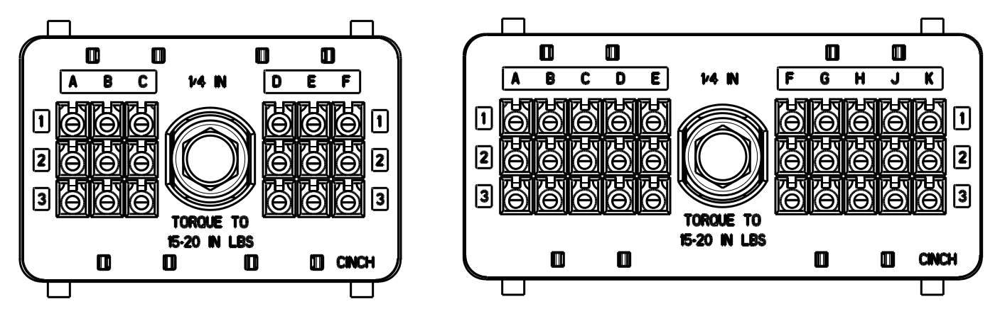
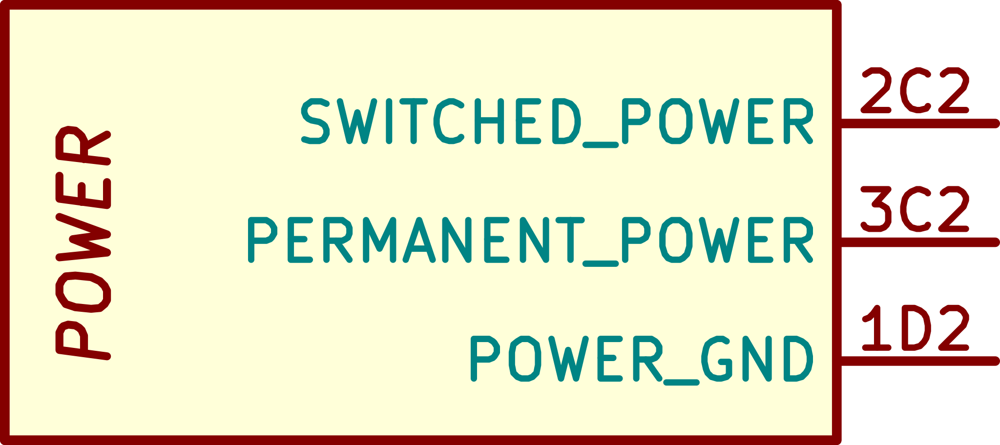
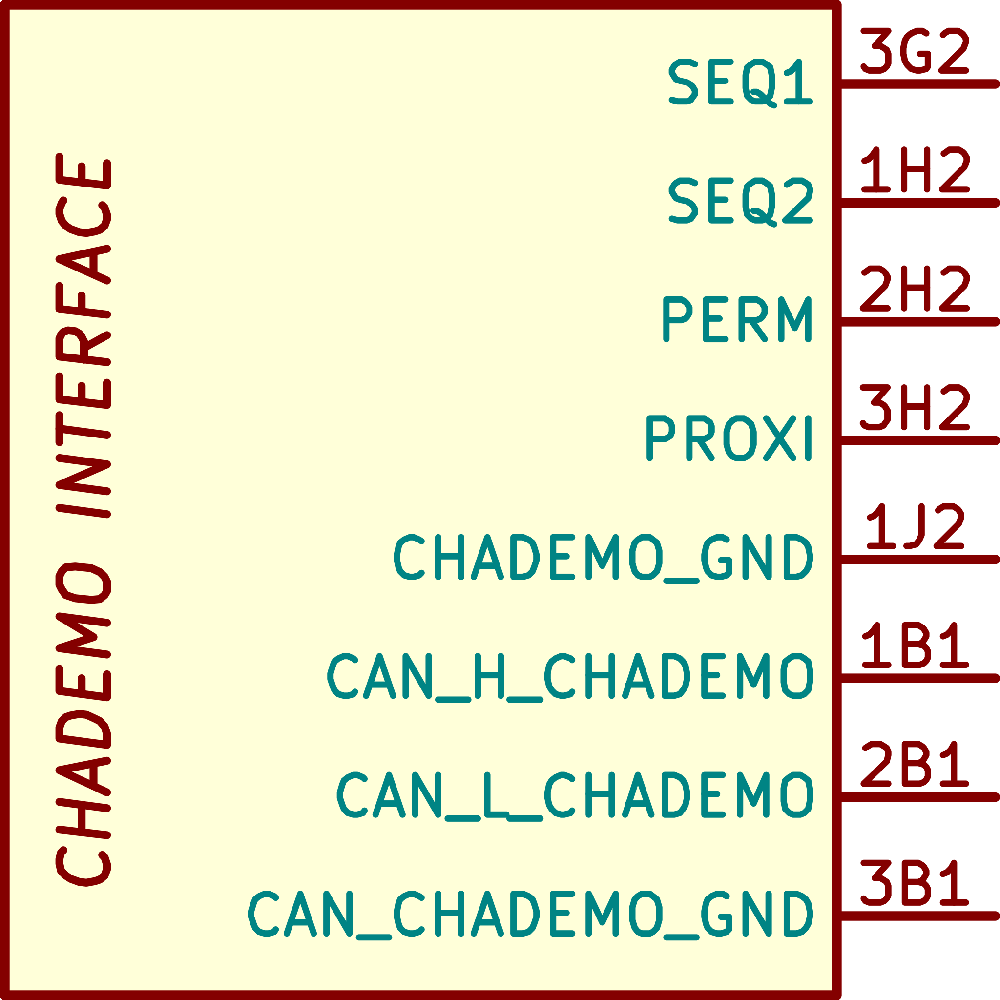
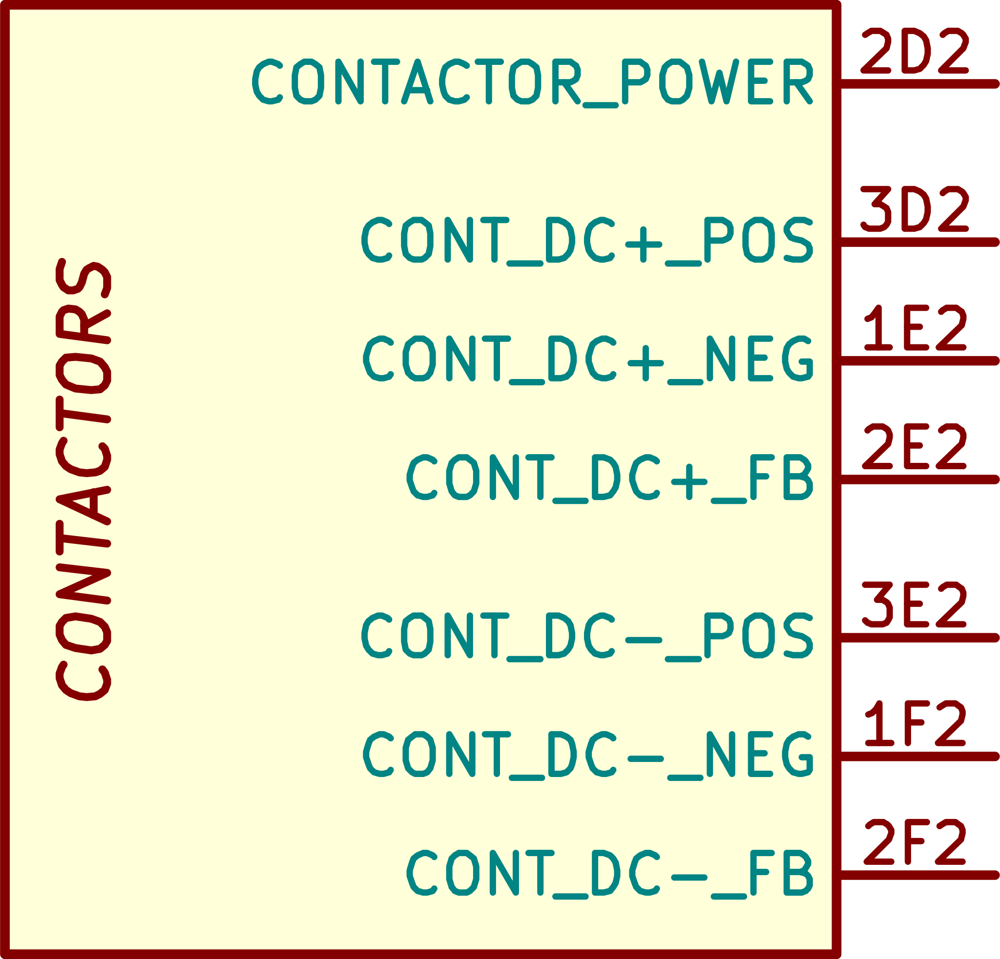
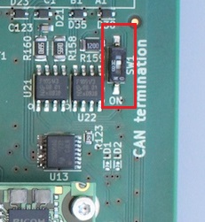
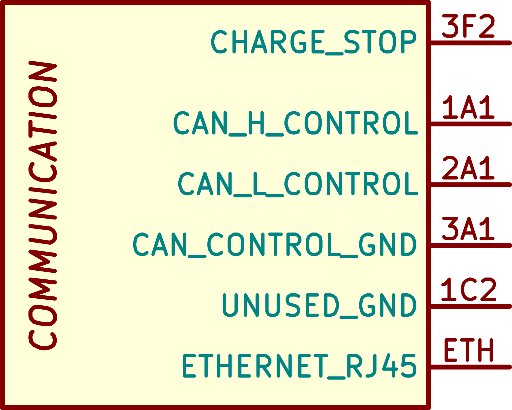
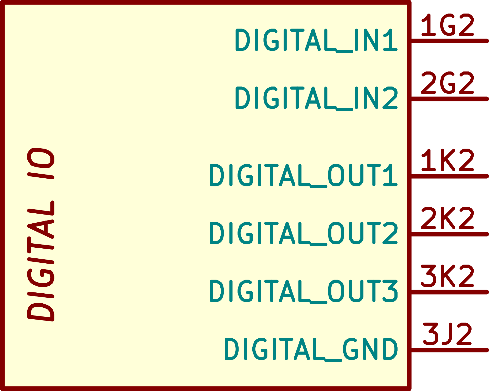
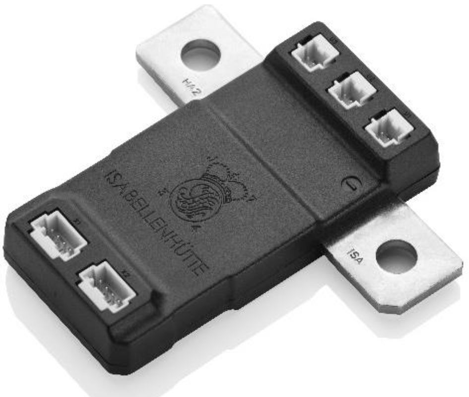

> [!UPDATE] {docsify-updated}
# Interfaces

The ADM-CS-EVCC is an electric vehicle subsystem. It cannot function on its own, but when integrated
in a vehicle, it will provide AC and DC charging abstraction through a simple CAN bus interface.
Thanks to charge inlet monitoring and control, as well as DC contactor control, very little is
required from the vehicle to get the system up and running.

<figcaption style="text-align: center">Figure 2: CINCH ModICE connectors</figcaption>

## Pinout Table
The reference of the pin is composed of 3 characters:

- The first character is the row number on the connector
- The second character is a letter indicating the column 
- The third character indicates the connector: "1" is the small connector (on the left in figure 2 above) and 2 indicates the big one (the one on the right)

| Name |  |  |
|------|----|--------|
| [SWITCHED_POWER](#Power_input) | 
 - | 
 2C2 |
| [PERMANENT_POWER](#Power_input) | 
 - | 
 3C2 |
| [POWER_GND](#Power_input) | 
 - | 
 1D2 |
| [CP](#CCS_and_AC_interfaces) | 
 - | 
 1A2 |
| [pp](#CCS_and_AC_interfaces) | 
 - | 
 2A2 |
| [CCS_GND](#CCS_and_AC_interfaces) | 
 - | 
 3A2 |
| [CCS_LOCK_POWER](#CCS_and_AC_interfaces) | 
 - | 
 3B2 |
| [CCS_LOCK+](#CCS_and_AC_interfaces) | 
 - | 
 1B2 |
| [CCS_LOCK-](#CCS_and_AC_interfaces) | 
 - | 
 2B2 |
| [CCS_LOCK_FB](#CCS_and_AC_interfaces) | 
 - | 
 2J2 |
| [PTC0](#Temperature_monitoring) | 
  2D1 | 
 - |
| [PTC1](#Temperature_monitoring) | 
  1E1 | 
 - |
| [PTC2](#Temperature_monitoring) | 
  3E1 | 
 - |
| [PTC_GND](#Temperature_monitoring) | 
  3D1 | 
 - |
| [PTC_GND](#Temperature_monitoring) | 
  2E1 | 
 - |
| [SEQ1](#CHAdeMO_interface–NOT_USED) | 
 - | 
 3G2 |
| [SEQ2](#CHAdeMO_interface–NOT_USED) | 
 - | 
 1H2 |
| [PERM](#CHAdeMO_interface–NOT_USED) | 
 - | 
 2H2 |
| [PROXI](#CHAdeMO_interface–NOT_USED) | 
 - | 
 3H2 |
| [CHADEMO_GND](#CHAdeMO_interface–NOT_USED) | 
 - | 
 1J2 |
| [CAN_H_CHADEMO](#CHAdeMO_interface–NOT_USED) | 
  1B1 | 
 - |
| [CAN_L_CHADEMO](#CHAdeMO_interface–NOT_USED) | 
  2B1 | 
 - |
| [CAN_CHADEMO_GND](#CHAdeMO_interface–NOT_USED) | 
  3B1 | 
 - |
| [CONTACTOR_POWER](#DC_fast_charge_contactors_control) | 
 - | 
 2D2 |
| [CONT_DC+_POS](#DC_fast_charge_contactors_control) | 
 - | 
 3D2 |
| [CONT_DC+_NEG](#DC_fast_charge_contactors_control) | 
 - | 
 1E2 |
| [CONT_DC+_FB](#DC_fast_charge_contactors_control) | 
 - | 
 2E2 |
| [CONT_DC-_POS](#DC_fast_charge_contactors_control) | 
 - | 
 3E2 |
| [CONT_DC-_NEG](#DC_fast_charge_contactors_control) | 
 - | 
 1F2 |
| [CONT_DC-_FB](#DC_fast_charge_contactors_control) | 
 - | 
 2F2 |
| [CHARGE_STOP](#Vehicle_CAN_bus) | 
 - | 
 3F2 |
| [CAN_H_CONTROL](#Vehicle_CAN_bus) | 
  1A1 | 
 - |
| [CAN_L_CONTROL](#Vehicle_CAN_bus) | 
  2A1 | 
 - |
| [CAN_CONTROL_GND](#Vehicle_CAN_bus) | 
  3A1 | 
 - |
| [UNUSED_GND](#Vehicle_CAN_bus) | 
 - | 
 1C2 |
| [ETHERNET_RJ45](#Vehicle_CAN_bus) | 
  ETH | 
 ETH |
| [DIGITAL_IN1](#Digital_inputs_and_outputs) | 
 - | 
 1G2 |
| [DIGITAL_IN2](#Digital_inputs_and_outputs) | 
 - | 
 2G2 |
| [DIGITAL_OUT1](#Digital_inputs_and_outputs) | 
 - | 
 1K2 |
| [DIGITAL_OUT2](#Digital_inputs_and_outputs) | 
 - | 
 2K2 |
| [DIGITAL_OUT3](#Digital_inputs_and_outputs) | 
 - | 
 3K2 |
| [DIGITAL_GND](#Digital_inputs_and_outputs) | 
 - | 
 3J2 |
## Power input

The controller expects 12V or 24V power. It is designed to handle the typical environment of
automotive 12/24V systems. For user convenience, it is possible to use for example 12V
contactors/inlets in a 24V system, as the contactor drivers are powered from a separate input.

Consult the specifications sheet for current requirements.

<figcaption style="text-align: center">Figure 3: Power section - connector reference next to the pin</figcaption>

## CCS and AC interfaces

The CCS and AC interfaces consist of CP and PP lines, inlet lock and temperature sensor inputs.
All of these signals are fully controlled by the communication stack – the user does not have to
interact with them in any way. They simply need to be wired properly to the inlet cable.

> [!TIP]
> There are many different CCS and AC inlets and cables. Suitable cables are manufactured by typical
> suppliers such as Phoenix Contact, and are available in a wide price-range. However, beware of
> potential wiring differences. Consult your choice of cable with ADVANTICS.

<figcaption style="text-align: center">Figure 4: CCS interface for AC and DC charging</figcaption>

## Inlet locking

The CCS inlet contains a motorized locking mechanism, designed to prevent removal of the cable during
the charging cycle (when hazardous voltages can be present), and to prevent cable theft. The inlet
lock motor is a simple DC motor, driving a locking pin. For proper operation, 12V (or 24V) is being
applied in different polarities to the DC motor to push pin into the inlet, or to extract it.

> [!TIP|label:Loss of power]
> In the case of power loss or charger/vehicle failure, all inlet locking
> mechanisms come with a manual release lever. This lever is accessible from the inside of the
> vehicle – typically accessed by removing carpet on the side in the trunk. Do not use the manual
> release during operation – only in case of emergencies.

## Temperature monitoring

The CCS inlet comes with integrated PT1000 temperature sensors. They should be directly connected to
the EVCC. During high current charging, it is possible to encounter dangerous temperatures
(especially if the inlet or cable is damaged). The EVCC will shut down the charging cycle in case
limits are exceeded.

<figcaption style="text-align: center">Figure 5: Temperature sensor inputs</figcaption>

## CHAdeMO interface – NOT USED

The ADM-CS-EVCC hardware comes with CHAdeMO inlet as well. But the software does not support this
interface. Since most newly produced vehicles and charging stations only come with CCS support, it
is very likely that the CHAdeMO interface will never be implemented, so it is kept in the manual
only for pinout reference.

<figcaption style="text-align: center">Figure 6: The unused CHAdeMO interface</figcaption>

## DC fast charge contactors control

The charge controller has two independent outputs for controlling the positive and negative fast
charge DC contactors. Also there is an extra digital input for each one of them, for potential
welding detection (provided that the contactors have auxiliary contacts built-in).

The purpose of these contactors is to ‘expose’ the vehicle battery to the charger during fast
charging. Fast charging effectively bypasses the onboard charger in the vehicle, and instead allows
the charging station direct access to the battery. In order for this operation to be safe, a few
conditions must be met. In simple terms, the charger and car will first negotiate required voltage
and current, perform internal tests (like insulation test), followed by a precharge request. During
precharge, the EV requests the charger to supply a voltage matching the battery voltage. The vehicle
will continuously monitor the inlet voltage, and when the charger reaches the requested voltage, the
charge controller will close the DC fast charge contactors.

The last feature of the DC contactor control is external power input. This input needs to be wired
to a power supply (typically a battery) capable of sourcing enough current for the contactors to
operate. In most applications, the CONTACTOR_POWER pin will simply be wired to the same supply as
the main power input. The only reason for it to be wired in a different way is to allow mixed 12V
and 24V operation (24V trucks using 12V contactors, for example).

> [!TIP|label:CCS sequence tip]
> The CharIN CCS guide mentioned at the beginning of this document describes clearly the mating
> process and sequencing. It is highly recommended to read this guide.

<figcaption style="text-align: center">Figure 7: DC fast charge contactors pinout</figcaption>

## Vehicle CAN bus

The charge controller has one dedicated CAN bus for the integration with the vehicle. The customer
is expected to provide the controller with the necessary information over CAN bus, for the charging
to work properly. The EVCC will report useful/necessary information about the charge process itself.

The CAN bus runs at a speed of 500 kbaud by default. There is no 120 Ohm termination on this bus by
default, but it can be easily enabled by switching the DIP switch on the PCB into ON position. This
will connect a 120 Ohm termination resistor between CAN high and low. There should only be 2
terminations on the CAN bus – ideally on both end-points of the CAN chain.

<figcaption style="text-align: center">Figure 8: Location of the CAN bus termination enable switch</figcaption>

> [!TIP|label:CAN bus tip]
> If you don’t see all the CAN messages you were expecting on the bus, the periodicity is wrong, or
> no messages are shown at all, the CAN bus termination could be missing. CAN bus should have two
> terminations, but on the bench will also typically work with just one, or three.

<figcaption style="text-align: center">Figure 9: CAN bus, Charge STOP and Ethernet</figcaption>

## Charge stop

The charge stop input allows users to terminate the charging in a clean way – by using a (user
operated) push button for example. It behaves as if the charger side was requesting a normal stop.

It is also possible to terminate the charge over the CAN bus.

## Digital inputs and outputs

There are two digital inputs and three digital outputs on the charge controller. The outputs are push-pull capable, supplied from the input power of
the controller (so are either 12V or 24V). The inputs are 24V tolerant, but are also compatible with
12V or 5V logic levels, and have a weak 10 kOhm pulldown.

The digital inputs and outputs are fully user-configurable and controllable (provided the user
writes an application for their control).

<figcaption style="text-align: center">Figure 10: Digital IO</figcaption>

## LED outputs

LED outputs are powered from CCS lock power (so they share the same voltage level). A high side
drivers are used, with a current limit of 100mA per channel. LEDs are fully user configurable and
controllable, and can be used for to power other loads (as long as limits are not exceeded).

## Ethernet

During R&D, Ethernet can be used to deploy FW and communicate with the unit. The RJ45 connector is
located on the opposite side from the main connector, and is inaccessible once the box is closed.
Consult the SW Development Manual for how to work with the system over an SSH connection.

# Requirement for inlet monitoring

To be compliant with the CCS standards, the vehicle must contain voltage sensors for monitoring of
the inlet DC pins, a current sensor for measuring the charge current, and a battery voltage monitoring.

> [!WARNING]
> It is not sufficient to just measure the HV battery voltage. The user MUST monitor the inlet
> voltage, as there are DC contactors separating the battery from the inlet when not charging (so
> the battery voltage does not equal inlet voltage!).

For simplicity of wiring, the user can install a combined voltage and current sensor, such as the
Isabellenhutte IVT-S. The sensor should simultaneously monitor the battery voltage, the inlet
voltage as well as charging current. Depending on the target charging current, For example
**IVT-S-300-U3-I-CAN2-12/24** model (300A, 3 voltage sensors, no CAN termination, isolated) can be
used. ADVANTICS supplies the IVT-S-1k-U3-I-CAN2-12/24 model, as the same unit can be used for higher
current applications (like main battery current sensor), and the loss of resolution with higher
current full-scale is not critical in this application.

<figcaption style="text-align: center">Figure 11: Isabellenhutte IVT-S current sensor</figcaption>
