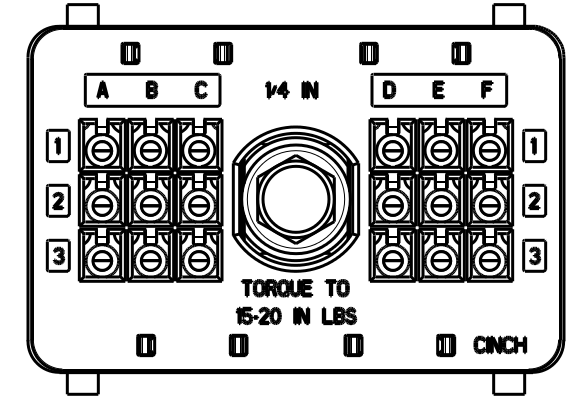

> [!UPDATE] {docsify-updated}
# Introduction

## Characteristics

The ADM-CS-EVCC is an EV charge controller for onboard vehicle charging. The main features include:
- Linux system, running on iMX7 ARM platform
- CCS (Combined Charging System) – DIN SPEC 70121 and ISO 15118-2/-20, and NACS
- AC charging interface (IEC 61851-1, J1772)
- Bidirectional Power Transfer (BPT) Capable
- Plug and Charge (PnC) coming soon
- Automatic deep sleep and wake-up for energy saving
- No code integration with supported BMS
- Compatible with different BMS
- CCS inlet monitoring
- Ethernet (RJ45)
- Drivers for DC fast charging contactors
- CAN bus (for integration into the vehicle)
- Port inlet motor driver
- SD card slot
- Automotive Housing

## Who is this product for?

Manufacturers of electric vehicles (personal, agricultural, buses, trucks), vehicle integrators,
research laboratories, DIY EV enthusiasts looking to integrate CCS charging in their projects,
new EV applications like rescue vehicles, and charge emulation for development purposes.

## Electrical and Mechanical specifications
|       |                                            |                         |
|-----------------------------|-------------------------------------------------|----------------------------------------------------|
| **Charging Standards**      | **AC**                                           | SAE J1772, IEC 61851-1/-23                        |
|                             | **CCS (Combo 1,2)**                              | DIN SPEC 70121, ISO 15118-2/-20, NACS SAE J3400, SAE J1772, IEC 61851-1/-23|
| **Power input**             | **Input voltage**                                | 12 V or 24 V                                      |
|                             | **Input Voltage Range**                          | 11 V to 32 V                                      |
|                             | **Nominal power consumption without peripherals**| 2 W                                               |
| **Interfaces (user side)**  | **CAN bus**                                      | 2x ISO-11898 CAN bus, configurable bitrate (500kbps default)|
|                             | **Digital Outputs**                              | 3 outputs, 24V, push-pull, max. 100 mA (sink or source)|
|                             | **Digital Inputs**                               | 2 inputs, 24V and 12V compatible, Max voltage 30V |
|                             | **LEDs**                                         | 3 LED outputs, 12V, overcurrent protected         |
|                             | **Ethernet**                                     | 100Mbps RJ45.                                     |
|                             | **SD memory card**                               | 16 GB card standard                               |
|                             | **SIM slot**                                     | Micro SIM, user supplied                          |
| **Output Contactor Control**| **Contactors Outputs**                           | 2 Independent outputs                             |
|                             | **Max Current**                                  | Drive up to 5A                                    |
|                             | **Contactors Feedback Inputs**                   | 2 Contactor Feedback inputs                       |
| **CCS interface**           | **Communication wires**                          | CP (Control Pilot), PP (Proximity Pilot)          |
|                             | **Temperature measurements**                     | 3 PT1000 inputs                                   |
|                             | **Inlet locking**                                | Inlet lock motor control                          |
|                             | **PLC (Powerline Communication)**                | MStar/MediaTek GreenPHY                           |
| **Automotive Housing specifications**| **Operating Temperature**               | -40°C to +125°C                                   |
|                             | **Sealing**                                      | IP69K                                             |
|                             | **Shock**                                        | 50 g’s – 20 pulses                                |
|                             | **Dimensions**                                   | 11.43 x 11.68 cm                                  |
|                             | **RoHS Compliant**                               | Yes                                               |

## Pinout Table
The reference of the pin is composed of 3 characters:

- The first character is the row number on the connector
- The second character is a letter indicating the column 
- The third character indicates the connector: "1" is the small connector (on the left in figure 2 above) and 2 indicates the big one (the one on the right)

| Name |  |  |
|------|----|--------|
| [SWITCHED_POWER](#Power_input) | 
 - | 
 2C2 |
| [PERMANENT_POWER](#Power_input) | 
 - | 
 3C2 |
| [POWER_GND](#Power_input) | 
 - | 
 1D2 |
| [CP](#CCS_and_AC_interfaces) | 
 - | 
 1A2 |
| [pp](#CCS_and_AC_interfaces) | 
 - | 
 2A2 |
| [CCS_GND](#CCS_and_AC_interfaces) | 
 - | 
 3A2 |
| [CCS_LOCK_POWER](#CCS_and_AC_interfaces) | 
 - | 
 3B2 |
| [CCS_LOCK+](#CCS_and_AC_interfaces) | 
 - | 
 1B2 |
| [CCS_LOCK-](#CCS_and_AC_interfaces) | 
 - | 
 2B2 |
| [CCS_LOCK_FB](#CCS_and_AC_interfaces) | 
 - | 
 2J2 |
| [PTC0](#Temperature_monitoring) | 
  2D1 | 
 - |
| [PTC1](#Temperature_monitoring) | 
  1E1 | 
 - |
| [PTC2](#Temperature_monitoring) | 
  3E1 | 
 - |
| [PTC_GND](#Temperature_monitoring) | 
  3D1 | 
 - |
| [PTC_GND](#Temperature_monitoring) | 
  2E1 | 
 - |
| [SEQ1](#CHAdeMO_interface–NOT_USED) | 
 - | 
 3G2 |
| [SEQ2](#CHAdeMO_interface–NOT_USED) | 
 - | 
 1H2 |
| [PERM](#CHAdeMO_interface–NOT_USED) | 
 - | 
 2H2 |
| [PROXI](#CHAdeMO_interface–NOT_USED) | 
 - | 
 3H2 |
| [CHADEMO_GND](#CHAdeMO_interface–NOT_USED) | 
 - | 
 1J2 |
| [CAN_H_CHADEMO](#CHAdeMO_interface–NOT_USED) | 
  1B1 | 
 - |
| [CAN_L_CHADEMO](#CHAdeMO_interface–NOT_USED) | 
  2B1 | 
 - |
| [CAN_CHADEMO_GND](#CHAdeMO_interface–NOT_USED) | 
  3B1 | 
 - |
| [CONTACTOR_POWER](#DC_fast_charge_contactors_control) | 
 - | 
 2D2 |
| [CONT_DC+_POS](#DC_fast_charge_contactors_control) | 
 - | 
 3D2 |
| [CONT_DC+_NEG](#DC_fast_charge_contactors_control) | 
 - | 
 1E2 |
| [CONT_DC+_FB](#DC_fast_charge_contactors_control) | 
 - | 
 2E2 |
| [CONT_DC-_POS](#DC_fast_charge_contactors_control) | 
 - | 
 3E2 |
| [CONT_DC-_NEG](#DC_fast_charge_contactors_control) | 
 - | 
 1F2 |
| [CONT_DC-_FB](#DC_fast_charge_contactors_control) | 
 - | 
 2F2 |
| [CHARGE_STOP](#Vehicle_CAN_bus) | 
 - | 
 3F2 |
| [CAN_H_CONTROL](#Vehicle_CAN_bus) | 
  1A1 | 
 - |
| [CAN_L_CONTROL](#Vehicle_CAN_bus) | 
  2A1 | 
 - |
| [CAN_CONTROL_GND](#Vehicle_CAN_bus) | 
  3A1 | 
 - |
| [UNUSED_GND](#Vehicle_CAN_bus) | 
 - | 
 1C2 |
| [ETHERNET_RJ45](#Vehicle_CAN_bus) | 
  ETH | 
 ETH |
| [DIGITAL_IN1](#Digital_inputs_and_outputs) | 
 - | 
 1G2 |
| [DIGITAL_IN2](#Digital_inputs_and_outputs) | 
 - | 
 2G2 |
| [DIGITAL_OUT1](#Digital_inputs_and_outputs) | 
 - | 
 1K2 |
| [DIGITAL_OUT2](#Digital_inputs_and_outputs) | 
 - | 
 2K2 |
| [DIGITAL_OUT3](#Digital_inputs_and_outputs) | 
 - | 
 3K2 |
| [DIGITAL_GND](#Digital_inputs_and_outputs) | 
 - | 
 3J2 |
| [LED1](charge-controllers/ADM-CS-EVCC/interfaces?id=led-outputs) | 
 1C1 | 
 - |
| [LED2](charge-controllers/ADM-CS-EVCC/interfaces?id=led-outputs) | 
 2C1 | 
 - |
| [LED3](charge-controllers/ADM-CS-EVCC/interfaces?id=led-outputs) | 
 3C1 | 
 - |

## Software development guide

Please see the Software [Development Guide document](charge-controllers/sys3_user/README.md) for details.

## Typical use case

- [EV charge control](https://advantics.fr/applications/emobility/ev-charger-controller/)
- [No code integration](https://advantics.fr/applications/emobility/evcc-no-code-integration/)
- [EV  simulation, development and testing](https://advantics.fr/applications/emobility/eol-tester-ev-fast-charger/)
- [Bidirectional charging](https://advantics.fr/applications/emobility/bidirectional-charging/)

<figcaption style="text-align: center">Figure 1: Functionality overview</figcaption>

## Mechanical housing

The automotive housing is based on the CINCH ModICE platform. In particular the SE variant. The front-facing connectors mate with CINCH P/N:581 01 18 023 (18-way) and 581 01 30 029 (30-way). The terminals for different wire gauge are 425 00 00 872 and 425 00 00 873. Consult the [ModICE brochure](https://www.belfuse.com/product/part-details?partn=5810130043) for the details.
