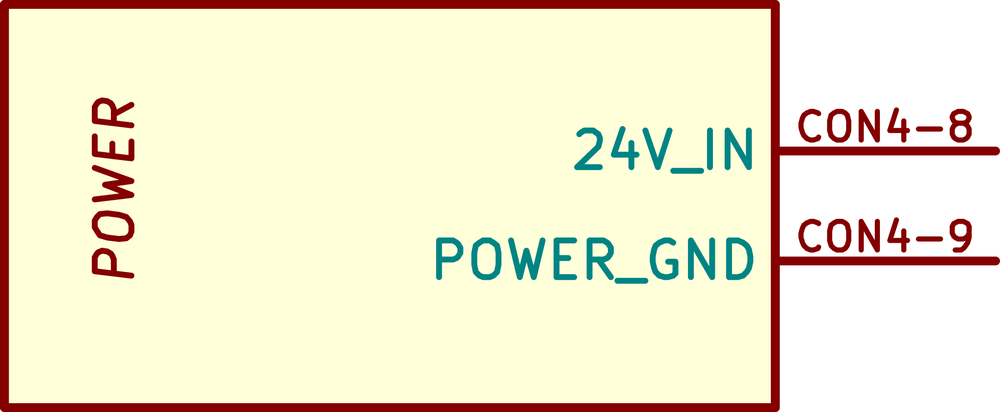
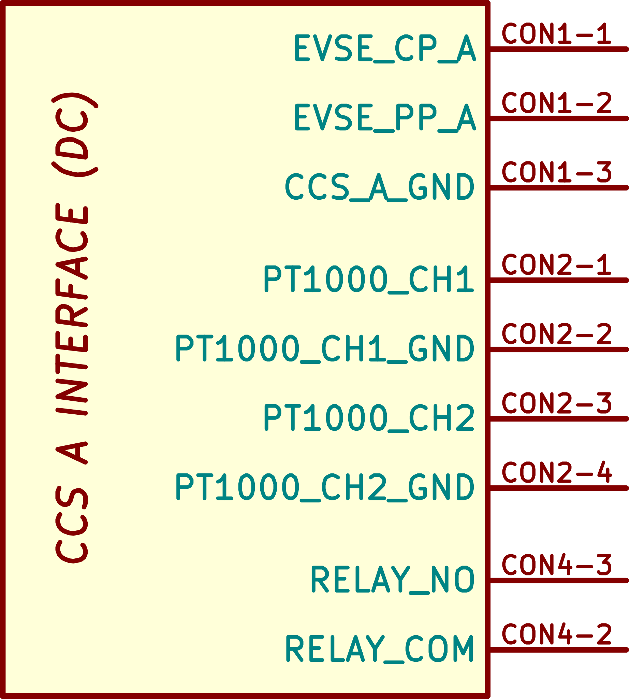
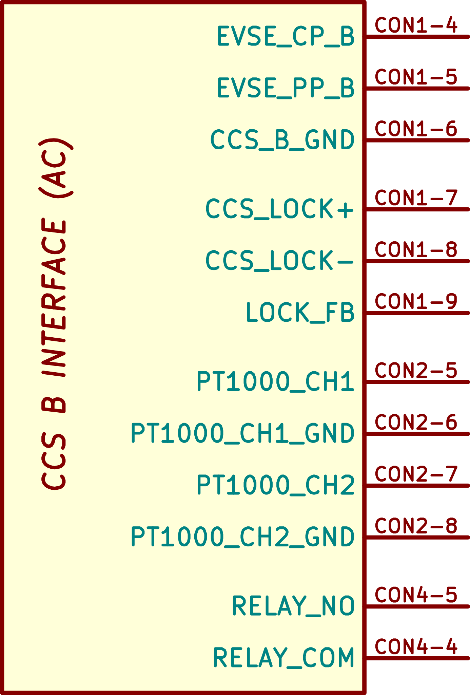
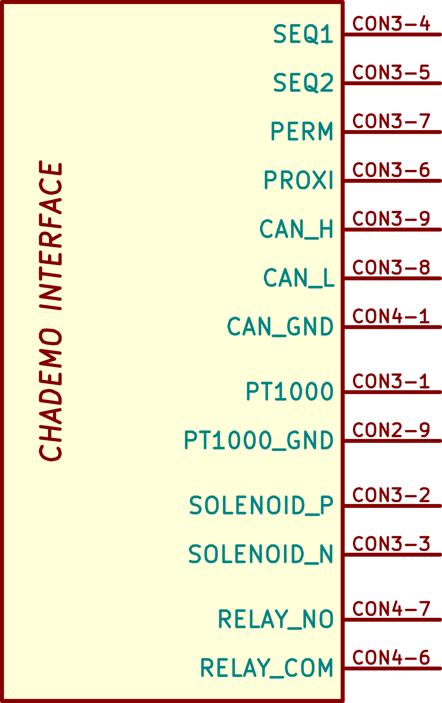
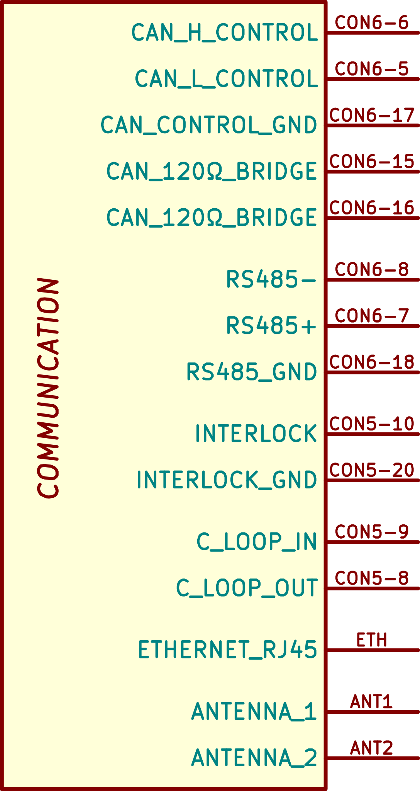
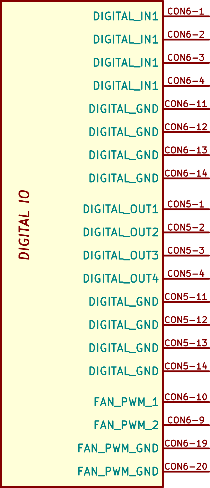

> [!UPDATE] {docsify-updated}
# Interfaces

The ADM-CS-SECC should be considered as a development platform – experience with Raspberry Pi and similar eco-systems will be very relevant when working with the Charge Controller. Some of the interfaces are directly used by the CCS and CHAdeMO communication stacks, while others are left to customers to utilize.

## Power input

The controller expects 24V power. Consult specification sheet for supply requirements.

<figcaption style="text-align: center">Figure 2: Power section - connector reference next to the pin</figcaption>

## CCS and AC interfaces

The CCS and AC interface consists of CP, PP lines, inlet lock and temperature sensor inputs. All of these signals are fully controlled by the communication stack – the user does not have to interact with them in any way. They simply need to be wired properly to the inlet cable.

> [!TIP]
> There are many different CCS and AC inlets and cables. Suitable cables are manufactured by typical suppliers such as Phoenix Contact, and are available in a wide price-range. However, beware of potential wiring differences. Consult your choice of cable with ADVANTICS.

<figcaption style="text-align: center">Figure 3: CCS A interface - DC charging</figcaption>

<figcaption style="text-align: center">Figure 4: CCS B interface - AC charging only</figcaption>

## Inlet locking of AC interface

The only real difference between wiring DC CCS and AC charging is in the use of the inlet locking mechanism. The AC locking mechanism consists of a small DC motor, driving a pin in and out of the inlet. This motor prevents removal of the AC cable while charging is in progress. DC CCS always comes with cable built-in the station.
The locking mechanism is only needed when the AC inlet is installed on the station – it does not apply for stations with built-in AC cable directly (as the cable is then not removable, so no lock is needed).

## CHAdeMO interface

Just like the CCS interface, CHAdeMO is under full control of the communication stacks. The interface consists of SEQ1, SEQ2, Solenoid Positive and Negative lines, PROX, PERM lines, and a dedicated CAN bus.

> [!ATTENTION]
> CHAdeMO cables have even higher variance in wiring than CCS. Datasheets often miss critical information about solenoid control for example. There are two types of CHAdeMO solenoids – bistable ones, requiring having the solenoid wired between SOLENOID_P and SOLENOID_N outputs, and then monostable ones – requiring connection between SOLENOID_P and GROUND.

<figcaption style="text-align: center">Figure 5:CHAdeMO interface pinout</figcaption>

## Output contactor control

The charge controller has three independent relays, with normally open and common contacts available. Each relay is hard-wired to one interface respectively – AC, CCS and CHAdeMO. These relays provide an additional layer of HW safety – they can only be energized when certain conditions are fulfilled (for example CP state, or PERMIT signals). What the conditions are, depends on the standard.

These relays cannot be repurposed for other application – their sole purpose is to control output DC (or AC) contactors. In case this functionality is not required, they do not have to be used.

The customer can also use the output of these relays, and add an additional protection layer by wiring it through relays controlled by for example the power modules or other controllers (to potentially prevent the controller from successfully closing the output contactors). But such measures are not necessary, only optional. It’s much better to use the provided interlock line (see below).

## User system CAN bus

The charge controller has one dedicated CAN bus for connection to the customer’s systems. For example power modules, voltage and current sensors with CAN bus interface, HMI systems and similar eqiupment. This CAN bus is the main way of communication between ADVANTICS CCS and CHAdeMO stacks, and the power modules.

> [!TIP|label:CAN bus tip]
> Not all power modules use a CAN bus, some of them might require Ethernet, Modbus or RS-485. Customers can write their own applications running on the charge controller, converting the CAN bus communication into another interface – effectively creating a communications bridge. Typical use would be to listen to ADVANTICS CAN messages, and then convert and send them over RS-485, and vise-versa.

The CAN bus runs at speed of 500kbaud by default. There is no 120 Ohm termination on this bus, but it can be easily enabled by installing a wire jumper between pins CAN_TERM_BRIDGE1 and CAN_TERM_BRIDGE2. A built-in 120 Ohm resistor will then be automatically placed between CAN High and Low.

<figcaption style="text-align: center">Figure 6: Communication pinout - CAN, RS485, Interlock, Current Loop, Ethernet, Antenna</figcaption>

## Digital inputs and outputs

There are four digital inputs and four digital outputs on the charge controller. The inputs are 24V tolerant, but are also compatible with
12V or 5V logic levels, and have a weak 10 kOhm pulldown. The outputs are 24V level logic, with push-pull stage. Inputs are 24V tolerant, but can be used also with 12V logic.
The digital inputs and outputs are fully user-configurable and controllable.

<figcaption style="text-align: center">Figure 7: Digital input/output pinout and fans</figcaption>

## LED outputs

LED outputs have 12V output drive, high side driver, with 100mA current limit per channel. They are fully user configurable and controllable, and can also be used to drive other loads besides driving LEDs (as long as limits are not exceeded).

## Fan outputs

The two fan outputs are meant to be used with four pin fans – with dedicated PWM speed control. The interface expects open collector fan PWM input. The voltage or power of the fan does not play a role (both 12V and 24V fans can be used), as they are externally powered, and only controlled by the controller.
Currently, these outputs are user configurable and controllable. We are in process of adding automatic fan control as a SW configuration option.

## RS-485

The RS-485 serial interface comes with built-in 120 Ohm termination. The interface is fully user configurable and controllable, including speed and master/slave configuration. A typical application could be a point-to-point connection to a card-reader inside the charger cabinet.

## Interlock

The interlock line is an open-collector output, with a 4.7 kOhm pull-up to 24V. This signal is bidirectional, allowing sampling as well as assertion from within the controller. It can be used by power modules to signalize failure, or by a door sensor to cause shutdown in case of open door. User systems can assert the interlock by grounding the interlock line.

> [!WARNING]
> The interlock line is hard-wired to the system, and will override the controller’s capability to close the output contactors. When used, it will guarantee the opening of output contactors in case of signaled fault (the protection works irrespective of  software)

## Current loop

The current loop input and output forms a chain of 20mA, that can be monitored and interrupted (door switches, relays). The primary use of this line is E-STOP button on the outside of the charger and cabinet door interlocks. Unlike the interlock line, the E-STOP is not hardwired to the output contactor control like the interlock is, and therefore is the preferred way for cleanly stopping the charging (instead of abruptly interrupting it in case of the interlock line).

## 4G network connectivity

The ADM-CS-SECC can be fit with a standard mPCIe SIMCOM 4G module (7600E series). The Mini-PCI Express slot on the charge controller only implements the USB interface (which provides sufficient functionality for most types of wireless mPCIe cards). Consult ADVANTICS before using alternative brands or models of cards, as compatibility cannot be guaranteed.

The charge controller does not require any connectivity for normal operation. Therefore the configuration of the network is left completely to the user. The typical use case would be connection over OCPP to the cloud, or internet distribution (forwarding a 4G connection to the Ethernet interface on the charge controller).
