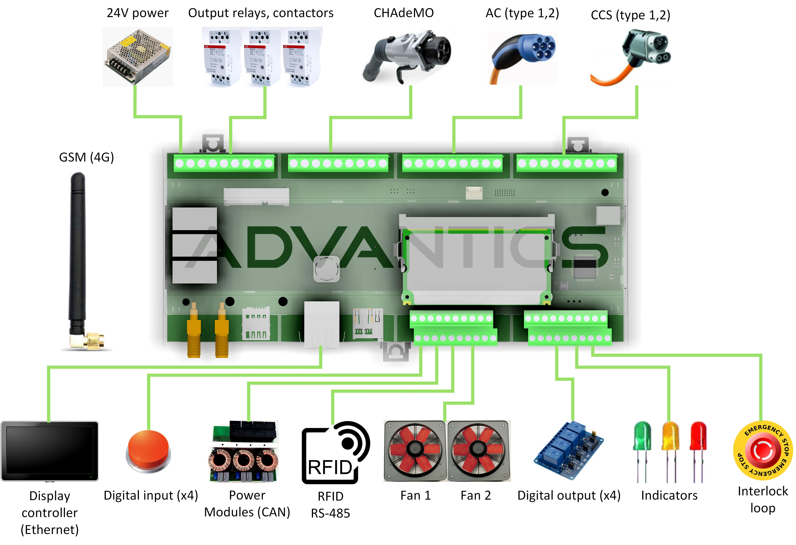

> [!UPDATE] {docsify-updated}
# Introduction

## Characteristics

The ADM-CS-SECC is a charge controller for electric vehicle charging stations. The main features include:
- Linux system, running on iMX7 ARM platform
- CCS (Combined Charging System) – DIN SPEC 70121 and ISO 15118-2/-20,  NACS and CHAdeMO (V2G).
- AC charging interface (IEC 61851-1, J1772)
- Bidirectional Power Transfer (BPT) Capable.
- Plug and Charge (PnC) capable.
- OCPP 1.6 Compatibility (OCPP 2.0.1 coming soon).
- Over-the-air (OTA) Updates capability ensures staying ahead of the market.
- CAN bus 2.0B, RS485, Ethernet (RJ45) interfaces, and control for DC and AC contactors.
- Extension slot with 4G modem, GPS, Wi-Fi (optional)
- 4G connectivity modules available for all zones
- Easy integration using a generic CAN bus interface.
- Ready-to-use interfaces compatible with a broad range of off-the-shelf power modules available in the market.
- Users can deploy their own code (C/C++, Python)
- SD card

## Who is this product for?

Manufacturers of stationary and portable charging stations, integrators, research laboratories, new EV applications like rescue vehicles, charging emulation during vehicle development.

## Electrical and Mechanical specifications
|       |                                            |                         |
|-----------------------------|-------------------------------------------------|----------------------------------------------------|
| **Charging Standards**      | **AC**                                           | SAE J1772, IEC 61851-1/-23                        |
|                             | **CCS**                                          | DIN SPEC 70121, ISO 15118-2/-20, NACS SAE J3400, SAE J1772, IEC 61851-1/-23|
|                             | **CHAdeMO**                                      | 1.x, with V2G extention                           |
| **Power input**             | **Input voltage min / max**                      | 20 V / 28 V                                       |
|                             | **Recommended nominal**                          | 24 V                                              |
|                             | **Typical / Peak consumption**                   | 5 W / 20W                                         |
| **Temperature**             | **Temprature range**                             | -20° to 85° C                                     |
| **Interfaces (user side)**  | **CAN bus**                                      | CAN 2.0B, extended addresses                      |
|                             | **Interlock**                                    | 20mA current loop, 24V                            |
|                             | **Ventilator PWM**                               | 2 independent PWM channels                        |
|                             | **Digital Outputs**                              | 4 outputs, 24V, push-pull, max. 100 mA (sink or source)|
|                             | **Digital Inputs**                               | 4 inputs, 24V and 12V compatible, Max voltage 30V |
|                             | **LEDs**                                         | 3 LED outputs, 12V, overcurrent protected         |
|                             | **RS-485**                                       | Modbus-RTU stack available                        |
|                             | **Ethernet**                                     | 100Mbps RJ45. Modbus TCP available                |
|                             | **SD memory card**                               | 16 GB card standard                               |
|                             | **4G network connectivity**                      | Mini PCIE slot, populated with 4G modem           |
|                             | **4G regions (per user request)**                | EMEA/Korea/Thailand, NA, Australia, Japan         |
|                             | **SIM slot**                                     | Micro SIM, user supplied                          |
| **AC interface**            | **Communication wires**                          | CP (Control Pilot), PP (Proximity Pilot)          |
|                             | **Temperature measurements**                     | 2 PT1000 inputs                                   |
|                             | **Locking mechanism**                            | Standard AC inlet locking interface               |
|                             | **Output contactor driver**                      | 1 relay for driving output contactors 5A / 30V max|
|                             | **Protection**                                   | HW interlocked relay (CP state monitor)           |
| **CCS interface**           | **Communication wires**                          | CP (Control Pilot), PP (Proximity Pilot)          |
|                             | **Temperature measurements**                     | 2 PT1000 inputs                                   |
|                             | **PLC (Powerline Communication)**                | MStar/MediaTek GreenPHY                           |
|                             | **Output contactor driver**                      | 1 relay for driving output contactors 5A / 30V max|
|                             | **Protection**                                   | HW interlocked relay (CP state monitor)           |
| **CHAdeMO interface**       | **Communication wires**                          | SEQ1, SEQ2, PROX, PERM, CANH, CANL                |
|                             | **Temperature measurements**                     | 1 PT1000 input                                    |
|                             | **Locking mechanism**                            | Solenoid driver                                   |
|                             | **Output contactor driver**                      | 1 relay for driving output contactors 5A / 30V max|
|                             | **Protection**                                   | HW interlocked relay (PERM state monitor)         |
| **Mechanical**              | **Module dimensions**                            | 212 x 90 x 58 mm                                  |
|                             | **Connections**                                  | Screw wire terminals                              |
|                             | **Weight**                                       | 350 g                                             |

## Software development guide

Please see the Software [Development Guide document](charge-controllers/sys3_user/README.md) for ADM-CS-SECC for details.

## Typical use case

- [EV DC and AC charging stations](https://advantics.fr/applications/ev-charging/charge-station-controller/)
- [High power EV charging](https://advantics.fr/applications/ev-charging/high-power-ev-charging/)
- [V2G Wallboxes](https://advantics.fr/applications/ev-charging/v2g-wallboxes/)
- [Bi-directional charging](https://advantics.fr/applications/ev-charging/bidirectional-charging/)
- [Battery assisted charging](https://advantics.fr/applications/ev-charging/battery-assisted-charging/)
- [Megawatt charging system](https://advantics.fr/applications/ev-charging/mw-charging-system/)
- [Rescue Vehicules](https://advantics.fr/applications/ev-charging/rescue-vehicles/)

Each EV charging station design is different – requiring a different set of interfaces or equipment. To gain some understanding about the minimum requirements, you can study the following documents:
- Standard IEC 61851-1, Electric vehicle conductive charging system – Part 1: General requirements
- Standard IEC 61851-21-2, Electric vehicle requirements for conductive connection to an AC/DC supply
- CharIN association – [CCS implementation guide](https://www.charinev.org/ccs-at-a-glance/ccs-implementation-guideline/)

<figcaption style="text-align: center">Figure 1: Functionality overview</figcaption>
