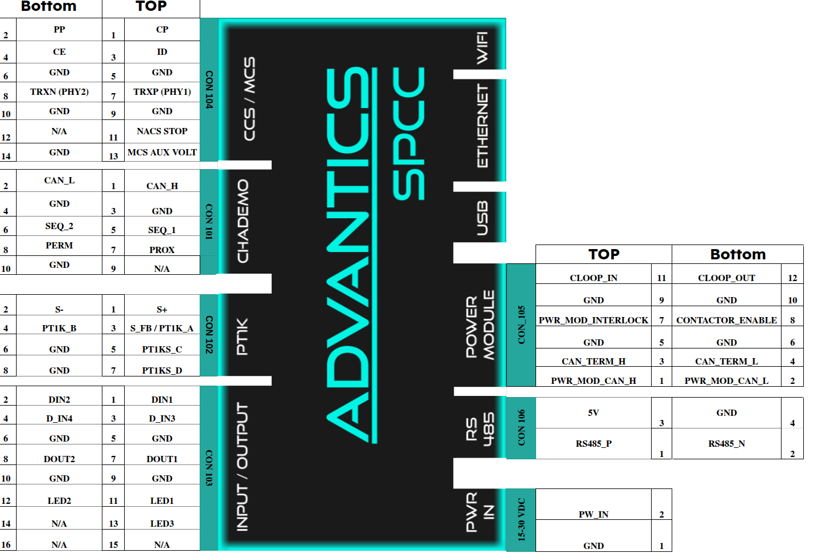

> [!UPDATE] {docsify-updated}
# Introduction

## Characteristics

The ADM-CS-SPCC is a charge controller for electric vehicle charging stations. The main features include:

- **MCS (Megawatt Charging System)**: Yes, 10baseT1S
- **CCS**: DIN SPEC 70121, ISO 15118-2/-20, NACS SAE J3400, SAE J1772, IEC 61851-1/-23
- **CHAdeMO**: 1.x, with V2G extension
- **AC**: SAE J1772, IEC 61851-1/-23
- **OCPP**: 1.6J (2.0.1 coming soon)
- **Plug 'n' Charge**: Yes
- **Input Voltage Min / Max**: 15 V / 30 V
- **Recommended Nominal Voltage**: 24 V
- **Typical / Peak Consumption**: 5 W / 20 W
- **Temperature Range**: -40° to 85° C
- **CAN Bus**: CAN 2.0B, extended addresses
- **Interlock**: 20mA current loop, 24V
- **Display Serial Interface**: IPI DSI + I²C for TP
- **HDMI**: Via External Conversion From MIPI DSI
- **Digital Outputs**: 2 outputs, 24V, push-pull, max. 1 A (sink or source), Hi-Z capability
- **Digital Inputs**: 4 inputs, 24V and 12V compatible, Max voltage 30V
- **LEDs**: 3 LED outputs, 12V, overcurrent protected
- **RS-485 + 5V**: Modbus-RTU stack available, 5 V max. 2 A max
- **Ethernet**: 100Mbps RJ45, Modbus TCP available
- **Wireless**: Dual-Band 2.4/5 GHz 1x1 Wi-Fi 4 (802.11n), Bluetooth 5.2
- **USB-C**: USB 3.1 Gen 1
- **Temperature Measurements**: 4 PT1000 inputs ( 2 of them are HW protected to prevent overheating)
- **Output Contactor Driver**: Contactor enable signal provided, open collector, max 200 mA, max 30V
- **PLC (Powerline Communication)**: Vertexcom
- **Mounting Options**: DIN rail, LCD back, Heavy duty enclosure

## Who is this product for?

Manufacturers of MCS charge stations, stationary and portable charging stations, Wallboxes, integrators, research laboratories, new EV applications like rescue vehicles, charging emulation during vehicle development.

## Electrical and Mechanical specifications

|       |                                            |                         |
|-----------------------------|-------------------------------------------------|----------------------------------------------------|
| **Charging Standards**      | **MCS**                                          | ISO 15118-20, IEC 61851-23-3                      |
|                             | **CCS**                                          | DIN SPEC 70121, ISO 15118-2/-20, NACS SAE J3400, SAE J1772, IEC 61851-1/-23|
|                             | **CHAdeMO**                                      | 1.x, with V2G extention                           |
|                             | **AC**                                           | SAE J1772, IEC 61851-1/-23                        |
| **Power input**             | **Input voltage min / max**                      | 15 V / 30 V                                       |
|                             | **Recommended nominal**                          | 24 V                                              |
|                             | **Typical / Peak consumption**                   | 5 W / 20W                                         |
| **Temperature**             | **Temprature range**                             | -40° to 85° C                                     |
| **Interfaces (user side)**  | **CAN bus**                                      | CAN 2.0B, extended addresses                      |
|                             | **Digital Outputs**                              | 2 outputs, 24V, push-pull, max. 100 mA (sink or source)|
|                             | **Digital Inputs**                               | 4 inputs, 24V and 12V compatible, Max voltage 30V |
|                             | **LEDs**                                         | 3 LED outputs, 12V, overcurrent protected         |
|                             | **RS-485**                                       | Modbus-RTU stack available                        |
|                             | **Ethernet**                                     | 100Mbps RJ45. Modbus TCP available                |
| **MCS interface**           | **Communication wires**                          | CE (Charge Enable), ID (Insertion Detection)      |
|                             | **10BaseT1S**                                    | TRXP (PHY1) and TRXN (PHY1)                       |
|                             | **Protection**                                   | HW interlocked relay (CE state monitor)           |
|                             | **Output contactor driver**                      | Contactor enable signal to control output contactors |
| **AC interface**            | **Communication wires**                          | CP (Control Pilot), PP (Proximity Pilot)          |
|                             | **Locking mechanism**                            | Standard AC inlet locking interface               |
|                             | **Output contactor driver**                      | Contactor enable signal to control output contactors |
|                             | **Protection**                                   | HW interlocked relay (CP state monitor)           |
| **CCS interface**           | **Communication wires**                          | CP (Control Pilot), PP (Proximity Pilot)          |
|                             | **PLC (Powerline Communication)**                | MStar/MediaTek GreenPHY                           |
|                             | **Output contactor driver**                      | 1 relay for driving output contactors 5A / 30V max|
|                             | **Protection**                                   | HW interlocked relay (CP state monitor)           |
| **CHAdeMO interface**       | **Communication wires**                          | SEQ1, SEQ2, PROX, PERM, CANH, CANL                |
|                             | **Locking mechanism**                            | Solenoid driver                                   |
|                             | **Output contactor driver**                      | Contactor enable signal to control output contactors |
|                             | **Protection**                                   | HW interlocked relay (PERM state monitor)         |
| **Temperature Monitoring**  | **Temperature measurements**                     | 4 PT1000 inputs (2 of them HW protected)                            |
| **Mechanical**              | **Module dimensions**                            | 212 x 90 x 58 mm                                  |
|                             | **Connections**                                  | Screw wire terminals                              |
|                             | **Weight**                                       | 350 g                                             |

## Accessing the controller

Please see the [Accessing and interacting with the controller](charge-controllers/advantics_os/connecting.md) section for details.

## Pinout

<figcaption style="text-align: center">Pinout</figcaption>

## SPCC Connectors

| Connector | Reference Number          |
|-----------|---------------------------|
| CON 104   | Phoenix Contact 1786882   |
| CON 101   | Phoenix Contact 1786866   |
| CON 102   | Phoenix Contact 1786853   |
| CON 103   | Phoenix Contact 1786895   |
| CON 105   | Phoenix Contact 1786879   |
| CON 106   | Phoenix Contact 1786837   |
| CON 107   | Phoenix Contact 1757475   |

## Typical use case

- [Megawatt charging system](https://advantics.fr/applications/ev-charging/mw-charging-system/)
- [EV DC and AC charging stations](https://advantics.fr/applications/ev-charging/charge-station-controller/)
- [High power EV charging](https://advantics.fr/applications/ev-charging/high-power-ev-charging/)
- [V2G Wallboxes](https://advantics.fr/applications/ev-charging/v2g-wallboxes/)
- [Bi-directional charging](https://advantics.fr/applications/ev-charging/bidirectional-charging/)

Each EV charging station design is different – requiring a different set of interfaces or equipment. To gain some understanding about the minimum requirements, you can study the following documents:
- Standard IEC 61851-1, Electric vehicle conductive charging system – Part 1: General requirements
- Standard IEC 61851-21-2, Electric vehicle requirements for conductive connection to an AC/DC supply
- CharIN association – [CCS implementation guide](https://www.charinev.org/ccs-at-a-glance/ccs-implementation-guideline/)
