> [!UPDATE] {docsify-updated}

This guide shows how to establish a remote shell on the ADM-CS-SPCC via SSH using a 10base-T1S connection.
The 10base-T1S interface used is EVB-LAN8670-USB from Microchip.

## SSH From Windows 11

Download the drivers [ from the official webpage ](https://www.microchip.com/en-us/development-tool/ev08l38a)

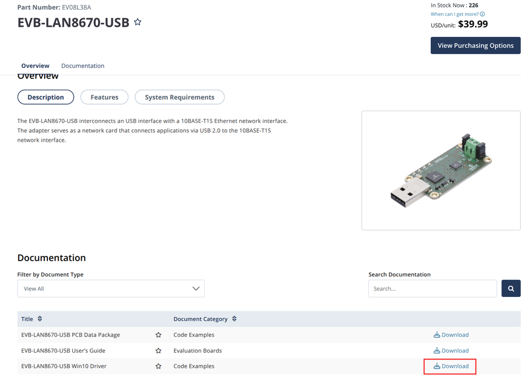

Extract the downloaded zip file by right clicking the downloaded file and choosing Extract all.

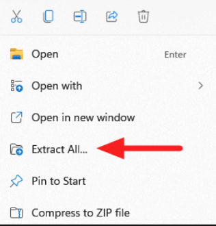

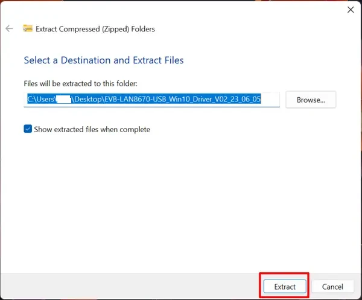

Execute the installer.

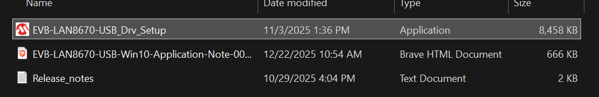

Follow the instructions of the installer.

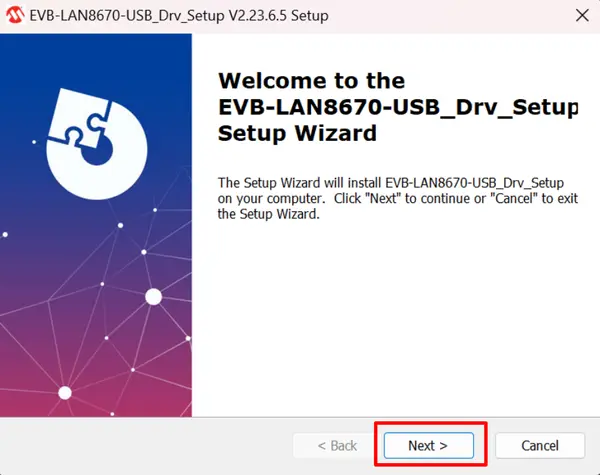

Recommendation: Use the default path for the installation.

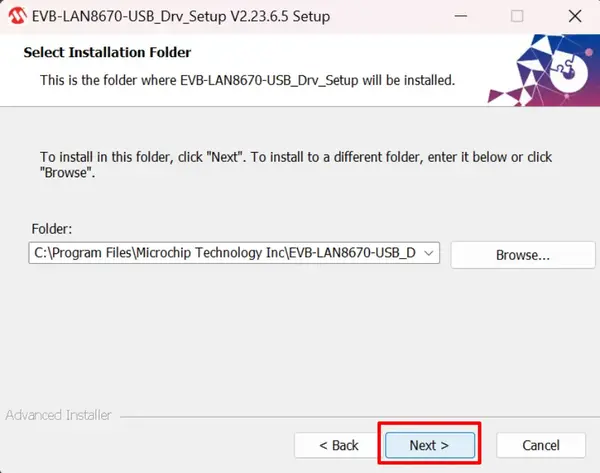

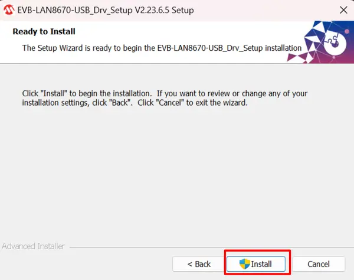

Go to Network Connections and check that there is a new interface type 10base-T1S.

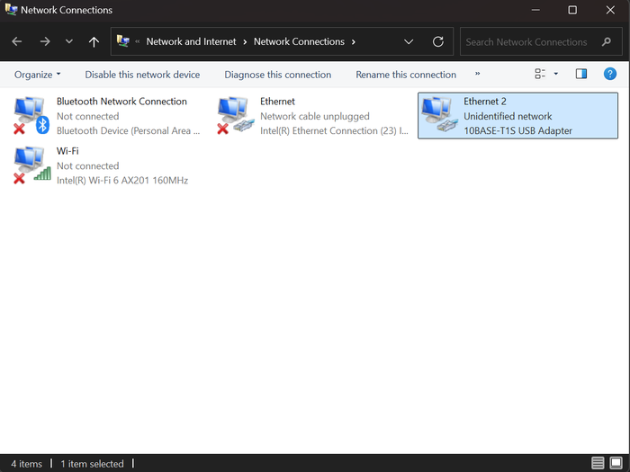

Open a new command prompt and ping your controller using its mDNS hostname. You can find it [here](charge-controllers/advantics_os/connecting.md). It should work without further action.

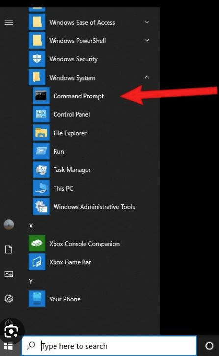

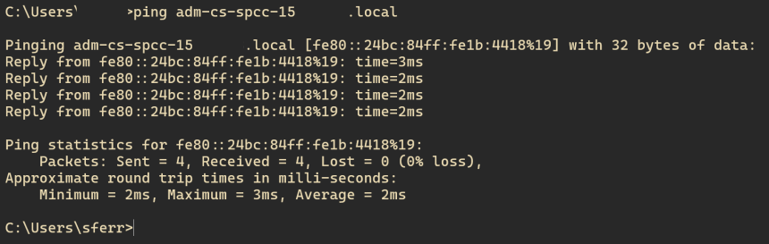

If the ping was successful, you should be able to ssh in the controller. The default password can be found [here](charge-controllers/advantics_os/ssh.md).

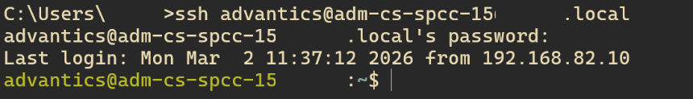

## SSH From Linux

There is no need to install any driver on Linux. Just connect the controller to your computer using the 10base-T1S usb interface and ping the controller using its mDNS hostname. You can find it [here](charge-controllers/advantics_os/connecting.md). It should work without further action.
