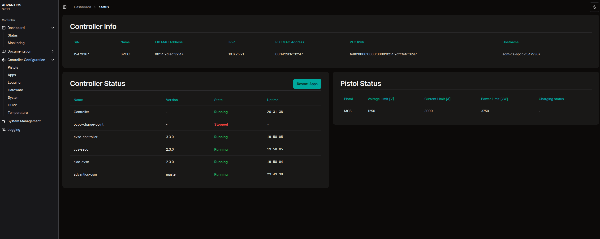

> [!UPDATE] {docsify-updated}

# Accessing and interacting with the controller

## About the Web Interface

The default way to access controllers running the new Advantics OS is through their web interface. Once the controller is powered on and connected to the same network as your computer, you can open a web browser on your computer and navigate to the hostname that is printed in the box . Don't forget to add the `http://`!. ie: `http://adm-cs-spcc-12345678.local`.

> [!NOTE]
> The hostname is composed by the controller type and its serial number in the format: `adm-cs-<controller-type>-<serial-number>.local`.

Then in your browser you should see something like this:



You can find documentation on how to use the UI under [CSM Web UI](charge-controllers/advantics_os/csm-web-ui.md).

To make sure both your computer and the controller are connected to the same network see below.

## Accessing the controller in a local Network with a DHCP Server

By default, the controller is factory-configured with DHCP enabled, allowing it to automatically obtain an IP address when connected to a network with a DHCP server (e.g., a standard home router). To access the controller without knowing its assigned IP, Multicast DNS (mDNS) can be used to resolve the hostname `adm-cs-<controller-type>-<serial-number>.local`. This feature is supported by most modern operating systems, including Windows 11, Ubuntu, and macOS.

### **Requirements:**

- A **DHCP server** (such as a home router) to assign IP addresses dynamically.
- A switch to connect the other end of the ethernet cable that goes to the controller (part of your home router).
- An **Ethernet cable** to connect the controller to the network.
- A **computer (laptop or desktop)** on the same local area network.

### Network Setup:

By using this network setup, you don't have to modify any network configuration on your computer and the controller will be able to access your local network.

```
 +-------------+      +----------------+      +--------------------+
 |   Computer  | ---- |     Switch     | ---- |   controller       |
 | (mDNS Ready)| Eth  |                | Eth  |                    |
 +-------------+      +----------------+      +--------------------+
                                |
                                |
                                |
                      +----------------+
                      |   DHCP Server  |
                      |                |
                      +----------------+
```

### How to:

In most cases we expect the following to work without any problems.

1. **Connect the controller** to your switch via an Ethernet cable.
2. **Turn on the controller**.
3. **Ensure your laptop** is also connected to the same network (via Ethernet or Wi-Fi).
4. **Open a web browser** on your computer and test the connection using:
   ```sh
   http://adm-cs-<controller-type>-<serial-number>.local/
   ```

## Accessing the controller by directly connecting to your computer via ethernet cable

The controller is configured to default to a Link Local IP when a DHCP server is not found. It will retry 2 times with a timeout of 20 seconds, so after connecting, wait at least 40 seconds. After that time it will auto-assign itself an IP in the range of `169.254.0.0/16`. On Windows, your computer will do it automatically as well. On Linux, you have to set the connection type as `Link-Local`.

### **Network Setup:**

```
 +--------------+      +----------------+
 |   Computer   | ---- |   Controller   |
 | (Link Local) | Eth  |  (Link Local)  |
 +--------------+      +----------------+
```

### **Requirements:**

- An **Ethernet cable** to connect the controller to the network.
- A **computer (laptop or desktop)**.

### How to:

1. Plug one end of an Ethernet cable to your computer and the other end to the controller.
2. Wait for at least 40 seconds.
   - If you are on Linux and your distro uses [NetworkManager](https://networkmanager.dev/), you can run:
   ```
   nmcli connection add type ethernet ifname <interface-name> con-name "Link-Local" ipv4.method link-local
   ```
   `interface-name` is the name of the network interface that the ethernet cable is connected to, ie: `enp0s25`. You can find it by running `ip a` in a shell.
   - If you are on Windows, go to step 3.
3. Open your browser and navigate to: `http://adm-cs-<controller-type>-<serial-number>.local/`

Note that in this configuration the controller would not be able to connect to the internet.

## Troubleshooting

### Verify the URL

Make sure you wrote the right url.

1. Check the serial number and the device model.
2. Make sure you use plain `http`.

Examples of how an URL should look like:

```sh
http://adm-cs-spcc-12345678.local/
http://adm-cs-mevc-87654321.local/
```

### Prioritize using an ethernet cable rather than Wi-Fi on your computer

If `adm-cs-<controller-type>-<serial-number>.local` is not resolving in your browser, most likely you are not in the same network. If your computer is connected via Wi-Fi, connect via ethernet cable to the same switch/router that the controller is connected to.

### Corporate networks

If you are inside a managed network at your company facilities, chances are that you don't have direct access to the router/switch. If your computer is connected via ethernet cable to a wall socket, you will need to find another wall socket for the controller. After doing so you can try again to navigate to `http://adm-cs-<controller-type>-<serial-number>.local/` in your browser. If that still does not work, it is because there are many safety reasons to forbid adding arbitrary devices to the corporate network, and therefore the intervention of your company's IT is mandatory. In this case, your best bet is to contact them.

Nevertheless, you can connect your controller directly to your computer via Ethernet cable, see [connecting directly using ethernet cable](charge-controllers/advantics_os/connecting.md?id=connect-directly-the-controller-to-your-computer-via-ethernet-cable).

If all of the above does not work, contact your IT department and they will guide you to get the controller connected in the same network as your computer in order to access it from the browser.
