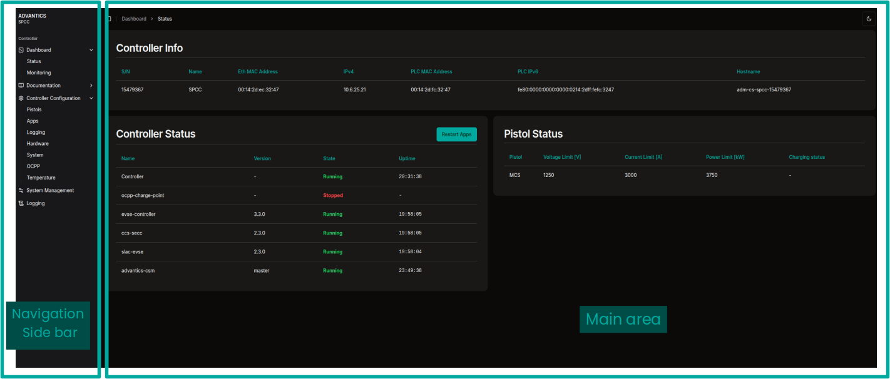
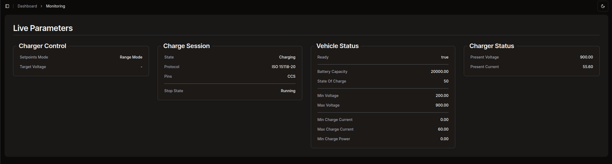
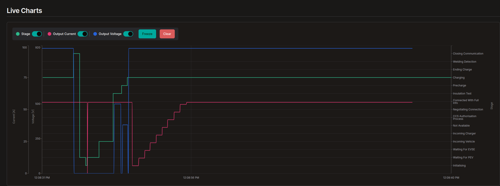
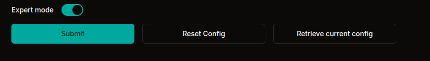
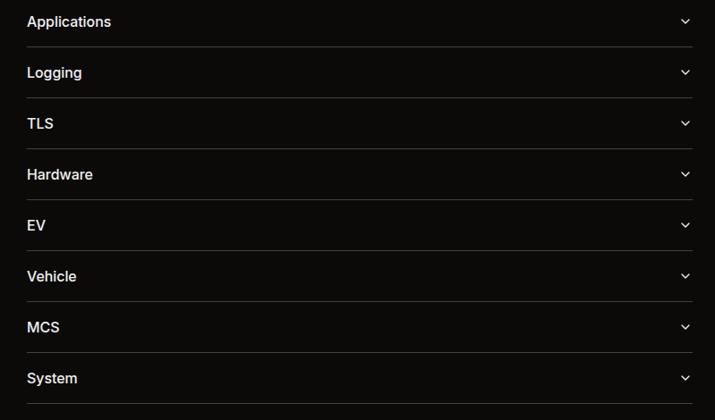
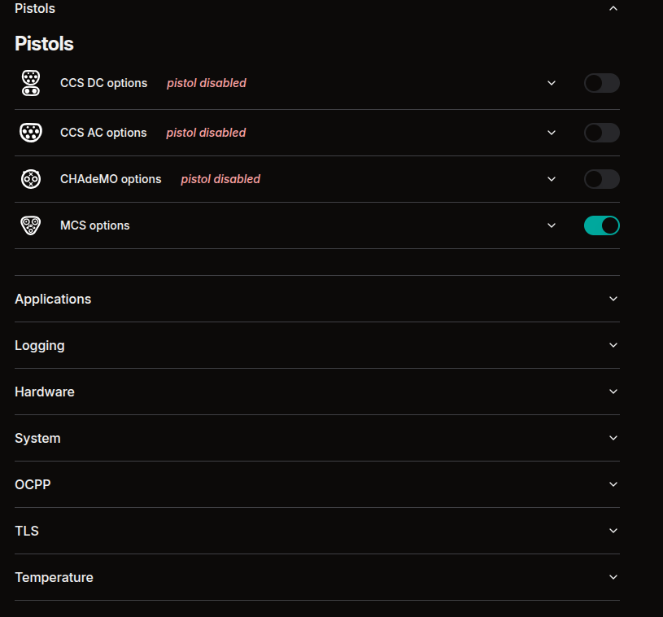
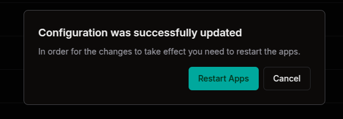
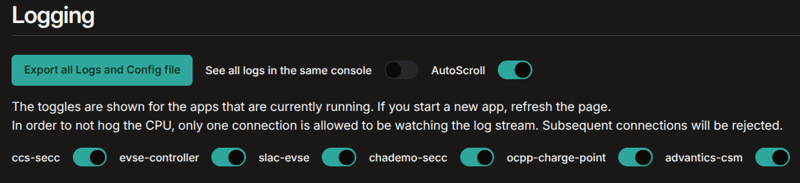

> [!UPDATE] {docsify-updated}

# ADVANTICS CSM Web UI

<!-- 

    🚨 IMPORTANT: This interface is currently supported only for ADM-CS-SPCC and ADM-CS-MEVC 🚨

 -->

Advantics CSM, short for Advantics Controller System Manager, handles all system-level operations. It provides a web interface for monitoring and configuring the system, aiming to minimize the need for manual config file edits and command-line interactions. Users can access logs, manage applications, and perform system updates directly through the interface.

## Connecting to the CSM Web UI

The CSM Web UI is available at the IP address/hostname of the controller on port 80. Check [how to connect to the controller](charge-controllers/advantics_os/connecting.md).

> [!ATTENTION]
> The CSM Web UI is designed for development purposes and should be disabled in production when deploying the controller. Even in development, access should be restricted to a secure private network, as there is no authentication mechanism.

## Introduction

The UI is divided into two main sections:

- A collapsible sidebar on the left with links to navigate to different parts of the UI. Common to all pages.
- Main content area where the actual content is displayed

## Status page `/dashboard`

The main content shows:

- Controller Info: Serial number, name of the controller, ethernet mac address, ethernet ipv4 addres, PLC mac address, PLC ipv6 address, and the hostname.
- Controller Status: Shows the state of the applications as well as the uptime.
- Pistol Status: Shows the **enabled** pistols and their voltage, current and power limits that are currently set, as well as the point in the charging sequence that the pistol that is currently charging is in.

<figcaption style="text-align: center">CSM Web UI landing page</figcaption>

## Monitoring page `/dashboard/monitoring`

There are two widgets in the monitoring page.

### Live Parameters

This widget shows live parameters of the controller and the ongoing charge session.

<figcaption style="text-align: center">CSM Monitoring Live Parameters</figcaption>

### Live Charts

"Live Charts" plot shows the stage of the charge and output voltage and current. At the top of the  
plot the user can select which data to display and freeze the plot. Once the plot is frozen, the user can download the data in CSV format.

<figcaption style="text-align: center">CSM System update in Dasboard/management</figcaption>

### Meters

Right under the plot, the "Meters" widgets shows the current output voltage, output current and output power.

## Controller configuration page `/dashboard/configuration`

In this page the user can edit the configuration of the controller. It is equivalent to editing the `config.cfg` file.

The configuration header allows to:

- Switch to expert mode: Showing extended configuration options.
- Reset Configuration: Reset the configuration to the factory default values.
- Retrieve Configuration: Overwrites changes that you might have made in the UI with the current configuration that is loaded in the controller.

### The options shown vary with the type of the controller.

Please check:

- [SPCC](charge-controllers/ADM-CS-SPCC/README.md) for the SPCC
- [SECC](charge-controllers/ADM-CS-SECC/README.md) for the SECC
- [EVCC](charge-controllers/ADM-CS-EVCC/README.md) for the EVCC
- [MEVC](charge-controllers/ADM-CS-MEVC/README.md) for the MEVC

The two images below depict the differences between a supply equipment controller and a vehicle controller.

<figcaption style="text-align: center">Configuration sections of our MEVC - MCS vehicle controller</figcaption>

<figcaption style="text-align: center">Configuration sections of our SPCC - MCS supply equipment controller</figcaption>

> [!ATTENTION]
> After successfully modifying the config, the applications should be restarted in order for changes to be taken into account. The CSM Web UI will notify and propose to do so after submitting.

## Logging page `/dashboard/logs`

Real-time logs of the docker applications. The user can filter which applications to display, enable/disable auto-scroll and showing all logs in the same widget.

Refresh the page if the logs are not loading properly.

> [!INFO]
> The log stream is exclusive to the most recent user. If a new user connects to the Web UI and initiates a log stream, the previous stream will be closed to optimize system resources.

Export the logs will generate a zip file with the logs of the controller and a copy of the config file.

<figcaption style="text-align: center">CSM Logging page of a vehicle controller</figcaption>
