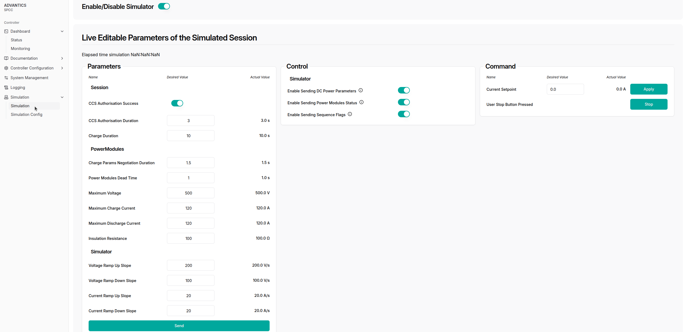

# Charger communication simulation

    🚨 IMPORTANT: This feature is not included in the normal software stack and has to be purchased apart. Please contact <a href="mailto:sales@advantics.fr">sales</a> for more information🚨

---

The primary objective of this software is to emulate a power stack on the charger side, allowing users to observe and interact with the system without requiring actual power electronics.

# UI

Simulation is primarily managed and controlled by the [CSM Web UI](charge-controllers/advantics_os/csm-web-ui.md). [Connect to your controller](charge-controllers/advantics_os/connecting) dashboard and head to `/dashboard/simulation`.

The interface allows real-time enabling the simulator and editing and control of parameters during a simulated session. It is divided into three main sections: **Parameters**, **Control**, and **Command**.

## Enabling the simulator

This switch enables or disables the simulation feature.

## Live Editable parameters

### **Parameters (Left Section)**

This section contains a **form** for configuring session-related and power module parameters. The user can:

- Edit the **desired values** for each parameter (e.g., voltages, currents, durations).
- View the **actual values** currently active in the system.
- Submit changes by pressing the **“Send”** button at the bottom. No change takes effect until this button is clicked.

Parameters are grouped as follows:

- **Session**: Includes CCS authorisation success toggle and time durations.
- **PowerModules**: Defines technical settings such as voltages, currents, resistance, and dead time.
- **Simulator**: Handles ramp-up/down slopes for voltage and current.

---

### **Control (Middle Section)**

This section provides toggle switches to **enable or disable sending of specific message types**:

- **Enable Sending DC Power Parameters**
- **Enable Sending Power Modules Status**
- **Enable Sending Sequence Flags**

Toggling these switches takes immediate effect and determines whether these data types are being transmitted.

---

### **Command (Right Section)**

This section allows the user to issue manual commands. Each command has its **own action button**:

- **Current Setpoint**: User enters a value and clicks **“Apply”** to send it.
- **User Stop Button Pressed**: Clicking **“Stop”** simulates a stop button press.

---

# HOW TO

## Simulating a bidirectional MCS charge session (ISO151180-20) with simulated charger and vehicle, using ADM-CS-SPCC, ADM-CS-MEVC and simulator software stack

1. Enable the [charge station simulator](charge-controllers/charger-simulation#enabling-the-simulator).
2. Enable the [vehicle simulator](charge-controllers/vehicle-simulation#enabling-the-simulator).
3. Make sure ADVANTICS vehicle controller configuration option [No BMS mode](charge-controllers/evcc_configuration/no_bms) is **disabled** (set to false).
4. Set the [relevant configuration entries in the vehicle controller](charge-controllers/evcc_bidirectional?id=relevant-config-entries) and [charge station controller](charge-controllers/secc_generic/secc_bidirectional?id=relevant-config-entries) for ISO151180-20.
5. Enable sending [`DC_Power_Parameters`](charge-controllers/charger-simulation?id=enable_dc_power_parameters-bool), [`Power_Modules_Status`](charge-controllers/charger-simulation?id=enable_power_module_status-bool) and [`Sequence_Flags`](charge-controllers/charger-simulation?id=enable_sequence_flags-bool) in the [ charge controller simulator UI ](charge-controllers/charger-simulation#UI)
6. Enable sending [`EV_Information`](charge-controllers/vehicle-simulation?id=enable_ev_information-bool), [`DC_Status_1`](charge-controllers/vehicle-simulation?id=enable_dc_status_1-bool),[`DC_Status_2`](charge-controllers/vehicle-simulation?id=enable_dc_status_2-bool), [`EV_Energy_Request`](charge-controllers/vehicle-simulation?id=enable_ev_energy_request-bool), [`EV_V2X_Energy_Request`](charge-controllers/vehicle-simulation?id=enable_ev_v2x_energy_request-bool) and [`EV_Extra_BPT_Info`](charge-controllers/vehicle-simulation?id=enable_ev_extra_bpt_info-bool) in the [vehicle simulator UI](charge-controllers/vehicle-simulation#UI).
7. Connect the plug.
8. Head to `dashboard/monitoring` and follow the charge session.

> [!NOTE]
> Please wait at least 30 seconds between sessions

<!-- ## Simulating a CCS DC charge session without simulated vehicle. -->

<!-- 1. Disable the [vehicle simulator](charge-controllers/vehicle-simulation). -->
<!-- 2. Enable ADVANTICS vehicle controller configuration [ No BMS mode ](charge-controllers/evcc_configuration/no_bms). -->

# Simulated Charger Configuration Options

This section describes the configuration options available for the simulated charger. The configuration can be modified in ithe `simulation_config.cfg` or using the web interface at `/dashboard/simulation/config`

## `pistol_index` (int)

- **Description:** Index used by the simulated charger. Ensure it matches the index configured for your target pistol.
- **Default:** `1`
- **Range:** `1 - 16`
- **Note:** CCS DC defaults to index `1`.

## `ccs_authorisation_duration` (float)

- **Description:** Duration (in seconds) the simulated charger waits before proceeding with CCS authorization.
- **Default:** `3`

## `ccs_authorisation_success` (bool)

- **Description:** Whether the simulated charger should grant CCS authorization. This should be enabled to reach the charging state.
- **Default:** `True`

## `charge_params_negotiation_duration` (float)

- **Description:** Duration (in seconds) taken to negotiate charge parameters.
- **Default:** `1.5`

## `power_modules_wake_up_duration` (float)

- **Description:** Time (in seconds) for power modules to wake up.
- **Default:** `1`

## `power_modules_dead_time` (float)

- **Description:** Dead time (in seconds) before power modules start operating.
- **Default:** `1`

## `voltage_ramp_up_slope` (float)

- **Description:** Voltage ramp-up rate in volts per second.
- **Default:** `200`

## `voltage_ramp_down_slope` (float)

- **Description:** Voltage ramp-down rate in volts per second.
- **Default:** `100`

## `current_ramp_up_slope` (float)

- **Description:** Current ramp-up rate in amps per second, once actual charging starts. Determines how quickly the current increases from 0 to the target value.
- **Default:** `20`

## `current_ramp_down_slope` (float)

- **Description:** Current ramp-down rate in amps per second, when charging ends. Determines how quickly the current decreases from the target value to 0.
- **Default:** `20`

## `charge_duration` (float)

- **Description:** Charge session will be stopped automatically after this duration (in seconds).
- **Default:** `10`

## `maximum_voltage` (float)

- **Description:** Maximum voltage accepted by this simulated charger (in volts).
- **Default:** `500`

## `maximum_charge_current` (float)

- **Description:** Maximum output charge current deliverable by the simulated charger (in amps).
- **Default:** `120`

## `maximum_discharge_current` (float)

- **Description:** Maximum output discharge current that the simulated charger can sink (in amps).
- **Default:** `120`

## `insulation_resistance` (float)

- **Description:** Insulation resistance (in ohms) reported after insulation test.
- **Default:** `100`

## `enable_dc_power_parameters` (bool)

- **Description:** Whether the `DC_Power_Parameters` message sent by the simulator should be enabled.
- **Default:** `True`
- Message description: [`dc_power_parameters`](charge-controllers/secc_generic/can_v3?id=dc_power_parameters)

## `enable_power_module_status` (bool)

- **Description:** Whether the `Power_Modules_Status` message sent by the simulator should be enabled.
- **Default:** `True`
- Message description: [`power_modules_status`](charge-controllers/secc_generic/can_v3?id=power_modules_status)

## `enable_sequence_control` (bool)

- **Description:** Whether the `Sequence_Control` message sent by the simulator should be enabled.
- **Default:** `True`
- Message description: [`sequence_control`](charge-controllers/secc_generic/can_v3?id=sequence_control)
