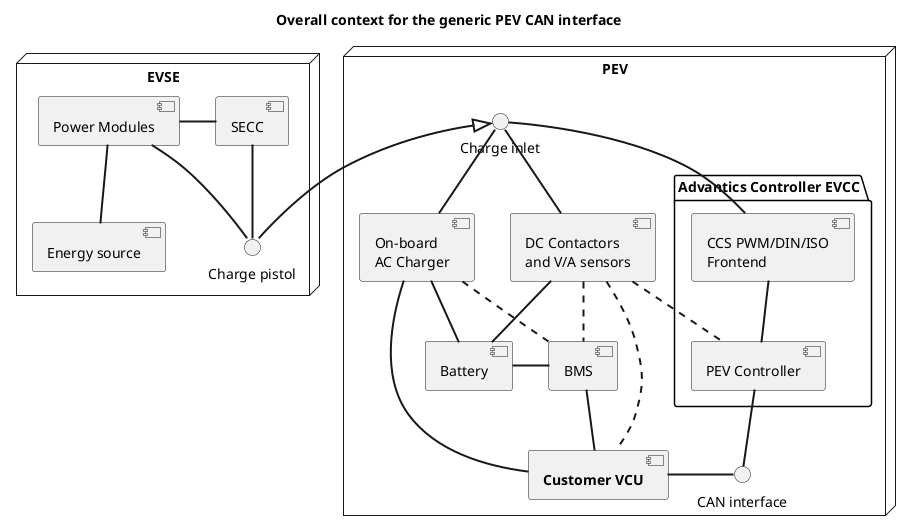
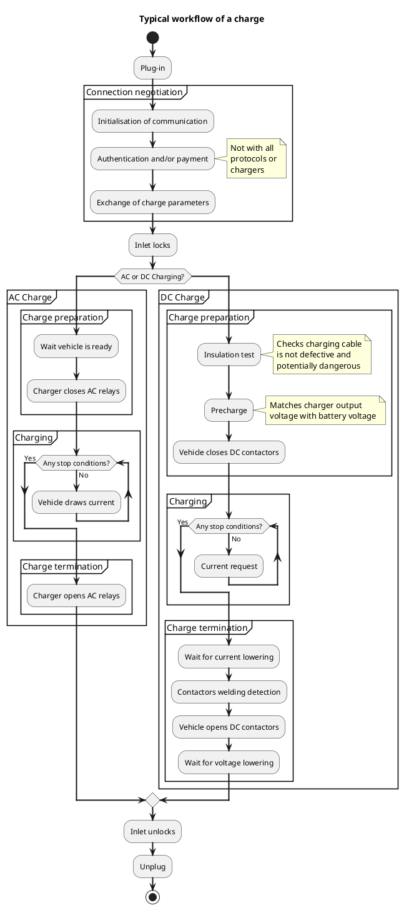

> [!UPDATE] {docsify-updated}
# Overview

## General operation

One way to look at the Advantics controllers is to consider them as mere translators between the
communication protocol a charger uses and a protocol BMS of a vehicle uses.
It abstracts away the various types of charge communication standards (eg. AC charging, CCS DIN, CCS
ISO, etc.) as well as their versions.

But it has to also abstract away the complexity of correctly sequencing BMS, contactors and possibly
other devices. Hence, the generic PEV CAN interface is a middle ground between two abstraction
layers.

The process of charging a battery is fundamentally driven by what the battery can take at
any given moment. In electric vehicle charging it translates to the BMS requesting voltage and
current setpoints to power electronics capable of delivering power levels in the order of ten's
to hundreds of kilo Watts.

Communication protocols like CCS are here to forward these requests between two independent
entities, a vehicle and a charger, addressing all the challenging aspects it can have
(interoperability, reliability, etc.). They carry other side tasks such as sharing the voltage,
current and power limits of both sides, charge scheduling, authorisation by external payment,
Plug'n'Charge, etc.

> [!ATTENTION]
> It should always be considered that in this process, the vehicle is a master giving its
> requests to the charger. Actually, CCS took this even further by considering the vehicle is always
> the one initiating every step of the process, much beyond what the main charging loop requires.

As the role of sequencing is on vehicle side, the generic PEV CAN interface ease the process by only
needing some information from VCU and BMS and some controls on DC contactors. It can be made even
simpler as our EVCC controller can also directly control contactors and read information from some
CAN voltage and current sensors.

> [!NOTE]
> In simple AC charging (is. using only PWM control), things are much more simplified, as it is
> the onboard AC charger doing most of the work.

Some steps in the process are long-lasting. Communication protocols adopted different ways for
making these steps cyclic. They generally take the form of loops where the vehicle requests
setpoints, and requests are forwarded to power modules. Then readouts from power modules are
forwarded to the vehicle, and the vehicle decide to continue the loop or not.

> [!NOTE]
> Unlike with other typical CAN communications, cyclicity of requests here is not meant to run
> as control loops. The vehicle should have its own, safe, control loop for what the battery can take
> (usually in the BMS directly). The charger should have its own, safe, control loops for the various
> power modes. Cyclicity of these requests is mostly for slowly moving the setpoints, and for
> relatively long time outs in case of problem (unexpected disconnection, failure of some modules,
> power trip on the grid, noise, etc.).

Advantics controllers is hiding all details of the charge process that are not relevant to vehicle
control unit (eg. scheduling, authentication, etc.). It will also try its best to capture every
possible failure in the communication with the charger in order to properly shut off any active
power function running at that time.

## Workflow of a charge

