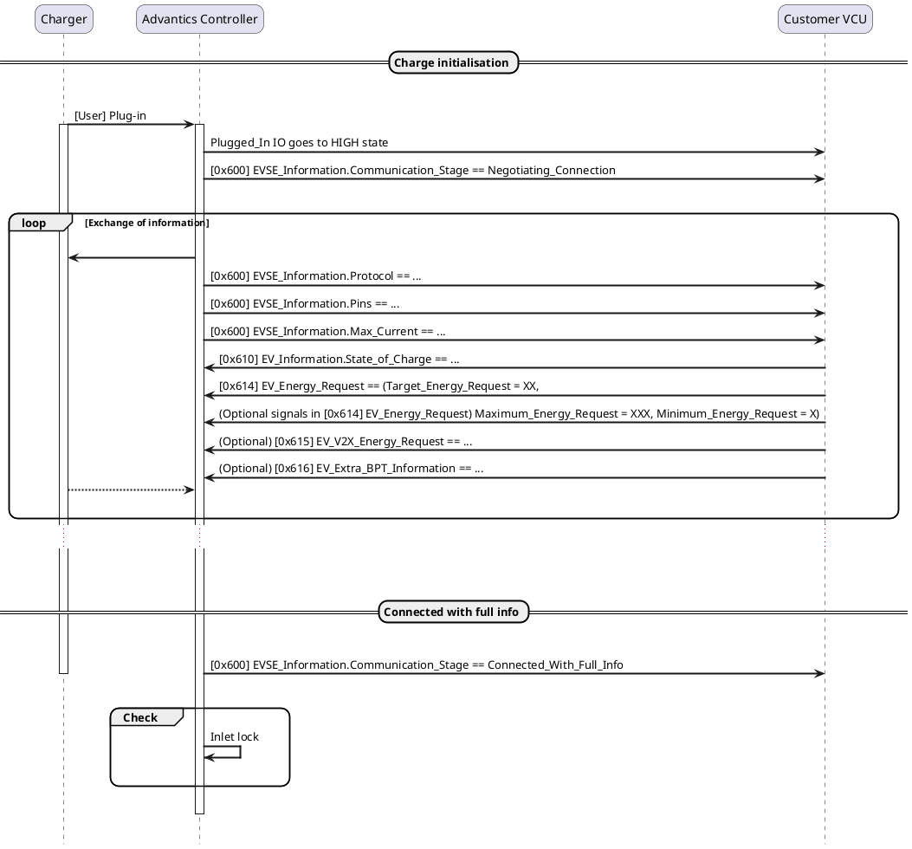
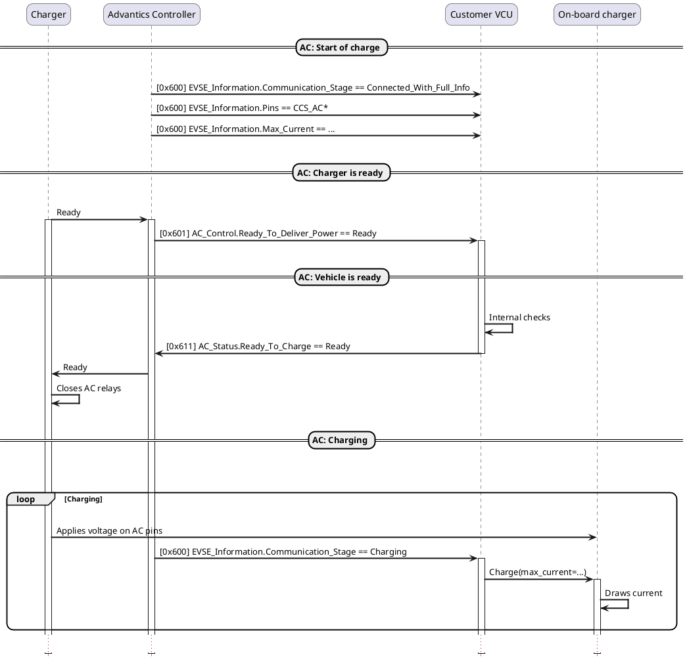
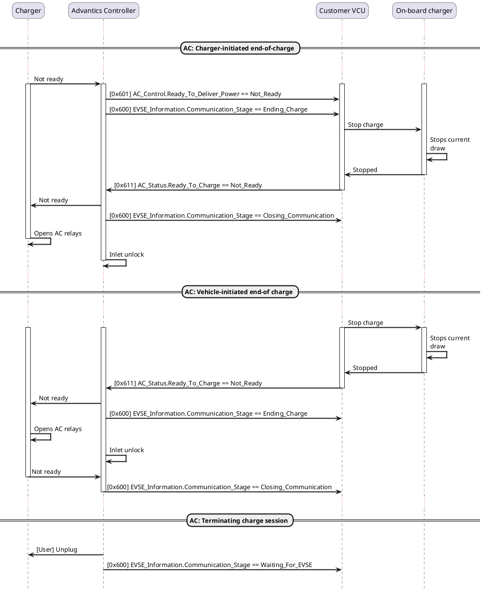
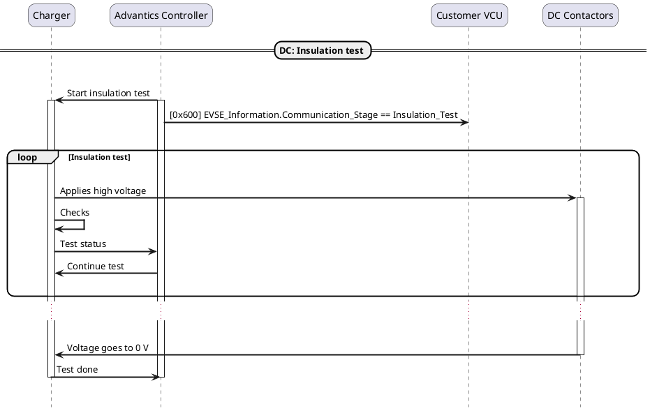
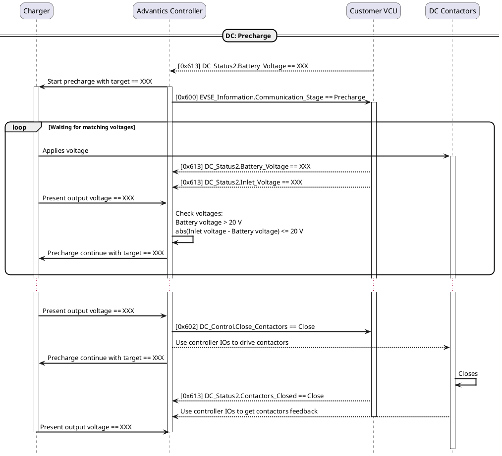
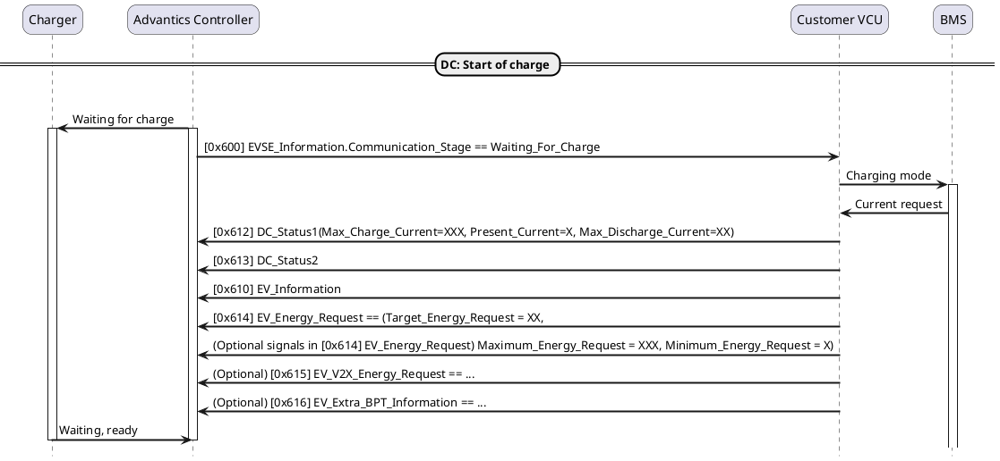
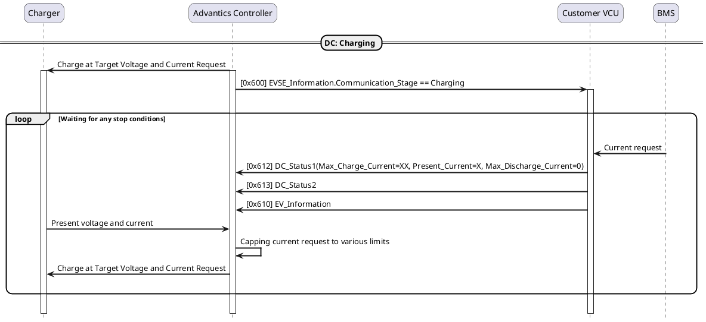
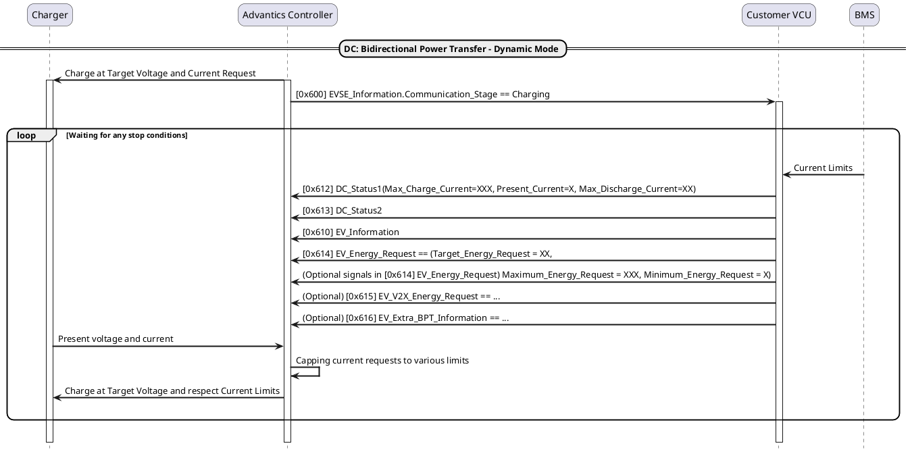
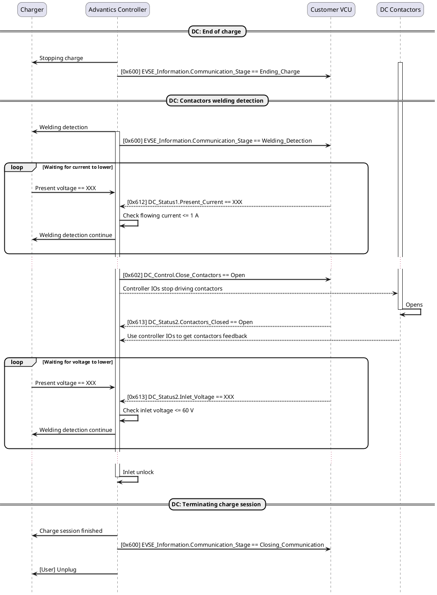

> [!UPDATE] {docsify-updated}
# Sequences of actions (PEV Generic Interface v2)

<!-- Before describing the CAN communication, let's take a detailed look at the sequences of actions,
and what each actor in the charge process does.

See [Appendix A](charge-controllers/evcc_generic/power_transfer_sequence_diagram.md) for the full sequence diagram. Extracts of it will be given here. -->

## Controller starts-up

When powering up Advantics controller, the operating system starts-up, then a few application
processes start. The main controller process is the first one to start, and will immediately start
emitting its messages every 100 ms (1s for the controller inputs feedback message).

At the beginning it reports a state of _Initialising_ in signal [EVSE_Information.Communication_Stage](charge-controllers/evcc_generic/can_v2.md#EVSE_Information-Communication_Stage) until all internal processes started-up and are talking to
each other.

Afterwards, [EVSE_Information.Communication_Stage](charge-controllers/evcc_generic/can_v2.md#EVSE_Information-Communication_Stage) reports a state of *Waiting_For_EVSE*.

```plantuml
hide footbox
skinparam ParticipantPadding 20
skinparam sequenceArrowThickness 2
skinparam roundcorner 20

participant "Charger" as EVSE
participant "Advantics Controller" as EVCC
participant "Customer VCU" as VCU

== Initialisation ==
|||

-> EVCC: [User] Power on
note over EVCC
  System boot-up
  ~15 seconds
end note

EVCC -> VCU: [0x600] EVSE_Information.Communication_Stage == Initialising

|||
== Wait for charger ==
|||

EVCC -> VCU: [0x600] EVSE_Information.Communication_Stage == Waiting_For_EVSE

|||
```

## Charge initialisation

Once a pistol is plugged in, a so-called charge session is initialised. It allows for exchange of
ATTENTION parameters between vehicle and charger, such as voltage, current and power limits.
In CCS it can take a few tens of seconds, especially if payment authorisation is carried on.

> [!NOTE]
> Upon detection of a plug-in, the controller IO configured as *Plugged_In* will be set to
> _HIGH_ state. For instance, on ADM-CS-EVCC controller, *DIG_OUT1* IO is configured by default
> for this particular function. Refer to `/srv/config.cfg` file for more details.

[EVSE_Information.Communication_Stage](charge-controllers/evcc_generic/can_v2.md#EVSE_Information-Communication_Stage) reports a state of *Negotiating_Connection* at first.
During this exchange of parameters, [EVSE_Information](charge-controllers/evcc_generic/can_v2.md#EVSE_Information) message will also update its other signals
with information it got from the charger. Within that time, the only piece of information customer
VCU needs to provide is the present battery state of charge. It should do so by sending
[EV_Information](charge-controllers/evcc_generic/can_v2.md#EV_Information) message early on.  
In addition to the EV_Information message, the customer VCU can provide the following optional messages:
[EV_V2X_Energy_Request](charge-controllers/evcc_generic/can_v2.md#EV_V2X_Energy_Request), [EV_Extra_BPT_Information](charge-controllers/evcc_generic/can_v2.md#EV_Extra_BPT_Information), [EV_Energy_Request](charge-controllers/evcc_generic/can_v2.md#EV_Energy_Request). If [EV_Energy_Request](charge-controllers/evcc_generic/can_v2.md#EV_Energy_Request) is 
not emitted, the Advantics PEV controller will use the values from the /srv/config.cfg file. These three messages can be emitted at 
any time to update the values.

Once done with the negotiation, [EVSE_Information.Communication_Stage](charge-controllers/evcc_generic/can_v2.md#EVSE_Information-Communication_Stage) reports
*Connected_With_Full_Info*. Advantics controller will also activate the inlet lock, such that
charge pistol cannot be pulled-out from that moment.

> [!ATTENTION]
> Advantics controller will NOT proceed with the rest of the sequence until inlet lock
> reports a locked state. As there are different styles of lock feedback, it is IMPORTANT to properly
> configure the controller for the right type of lock used in the inlet port.



## Determining between AC charging and DC charging

Advantics controller supports both types of charge, and the generic CAN interface reflects that.
In order to differentiate between an AC charge and a DC charge, two ways are provided. One could be
regarded as _informational_, the other one as _imperative_.

> [!ATTENTION]
> You will see that the generic interface does not mix up _Control_ and _Status_ messages
> between AC and DC charging. Each type of charge use its own set of dedicated messages. Other
> messages common to both types of charge are labeled _Information_ and do not truly participate in
> the sequence of actions required to make one of these charge type works.

> [!NOTE]
> While the generic interface provides a [CCS_Extra_Information](charge-controllers/evcc_generic/can_v2.md#CCS_Extra_Information) message, it should NOT be
> regarded as a way to implement charge sequences on your side. The Advantics controller is already
> doing that for you, including all kinds of protocol and safety checks! These are literally meant as
> _Extra_ information.

The informational way is by looking at [EVSE_Information.Pins](charge-controllers/evcc_generic/can_v2.md#EVSE_Information-Pins) signal. It will contain which pins
of the inlet will be energised as soon as that information is definitely known. As combo inlet ports
use separate pins for AC and DC, this can be seen as a discriminant factor.

The imperative way is to listen to [AC_Control](charge-controllers/evcc_generic/can_v2.md#AC_Control) and [DC_Control](charge-controllers/evcc_generic/can_v2.md#DC_Control) messages. Their signals will
be used only at the right moment.

## AC Charging

In case of AC charging, when *Connected_With_Full_Info* state is reached,
[EVSE_Information.Pins](charge-controllers/evcc_generic/can_v2.md#EVSE_Information-Pins) will contain one of the value valid for AC charging (ie. the corresponding
label starts with "*CCS_AC*"). [EVSE_Information.Max_Current](charge-controllers/evcc_generic/can_v2.md#EVSE_Information-Max_Current) will also contain valid information
that has been either detected from the cable rating (PP resistance), charger CP PWM duty cycle, or
negotiated during CCS High Level Communication.

### Getting to charge

As soon as the charger send us it is ready to do AC charging, [AC_Control.Ready_To_Deliver_Power](charge-controllers/evcc_generic/can_v2.md#AC_Control-Ready_To_Deliver_Power)
is set to _Ready_.

> [!NOTE]
> This flag being set to _Ready_ does NOT mean voltage is present on AC pins yet! It just
> means EVSE is in position of delivering power. Before EVSE close its relays, it is waiting on
> vehicle to signal it also wants power.

When the vehicle on-board charger is ready to take power in, set [AC_Status.Ready_To_Charge](charge-controllers/evcc_generic/can_v2.md#AC_Status-Ready_To_Charge) to
_Ready_. Charger will close its AC relays. Only then can on-board charger proceed to draw current.
Advantics controller will then emit a state of _Charging_ in
[EVSE_Information.Communication_Stage](charge-controllers/evcc_generic/can_v2.md#EVSE_Information-Communication_Stage).

> [!TIP]
> You can have [AC_Status.Ready_To_Charge](charge-controllers/evcc_generic/can_v2.md#AC_Status-Ready_To_Charge) always set to _Ready_, even before a charge
> session starts. Like so, Advantics controller will go to _Charging_ state, and power will be
> available as soon as possible. In all cases, Advantics controller will NOT signal vehicle readiness
> (ie. CP State C) to charger before the inlet lock confirmed its locked state. Therefore, it is safe
> and fine for customer VCU to be eager to signal it is _Ready_ for AC charging (even from
> *Waiting_For_EVSE* state, and even if the charge session ends up being a DC charge).

During charging, you only have to regularly update [EV_Information.State_of_Charge](charge-controllers/evcc_generic/can_v2.md#EV_Information-State_of_Charge).

> [!ATTENTION]
> During charging you should not exceed current limit provided in
> [EVSE_Information.Max_Current](charge-controllers/evcc_generic/can_v2.md#EVSE_Information-Max_Current). Be aware that charger can also change its maximum current during
> charging!

### Charger-initiated end of charge

When EVSE wants to stop charging, it is signaled by [AC_Control.Ready_To_Deliver_Power](charge-controllers/evcc_generic/can_v2.md#AC_Control-Ready_To_Deliver_Power) set to
*Not_Ready*. [EVSE_Information.Communication_Stage](charge-controllers/evcc_generic/can_v2.md#EVSE_Information-Communication_Stage) will also go to *Ending_Charge* state.
On-board charger should stop drawing current within 3 seconds. Only then you should set
[AC_Status.Ready_To_Charge](charge-controllers/evcc_generic/can_v2.md#AC_Status-Ready_To_Charge) to *Not_Ready*. [EVSE_Information.Communication_Stage](charge-controllers/evcc_generic/can_v2.md#EVSE_Information-Communication_Stage) will then
go to state *Closing_Communication*, and Advantics controller waits 100ms for charger to open
its AC relays before unlocking the pistol from the inlet port.

### Vehicle-initiated end of charge

When EV wants to stop charging, on-board charger should stop drawing current. Only then you should
set [AC_Status.Ready_To_Charge](charge-controllers/evcc_generic/can_v2.md#AC_Status-Ready_To_Charge) to *Not_Ready* (unless this is an emergency stop, in which case
you are allowed to set it to *Not_Ready* irrespective of when the on-board charger stops its
current draw).

[EVSE_Information.Communication_Stage](charge-controllers/evcc_generic/can_v2.md#EVSE_Information-Communication_Stage) will then go to state *Ending_Charge*. When
charger confirmed it is no longer ready to deliver power, [EVSE_Information.Communication_Stage](charge-controllers/evcc_generic/can_v2.md#EVSE_Information-Communication_Stage)
will go to state *Closing_Communication*, and Advantics controller waits 100ms for charger to
open its AC relays before unlocking the pistol from the inlet port.

### Charge termination and restart

As soon as pistol is plugged out, IO configured as *Plugged_In* is set to *LOW* state, all
signals of all messages are re-initialised, and [EVSE_Information.Communication_Stage](charge-controllers/evcc_generic/can_v2.md#EVSE_Information-Communication_Stage) goes back
to *Waiting_For_EVSE*.

If pistol is still plugged in, charger can also decide to restart a charge. In which case,
[EVSE_Information.Communication_Stage](charge-controllers/evcc_generic/can_v2.md#EVSE_Information-Communication_Stage) goes to *Connected_With_Full_Info* state directly, inlet
is locked again, and the process can repeat.





## DC Charging

In case of DC charging, when *Connected_With_Full_Info* state is reached,
[EVSE_Information.Pins](charge-controllers/evcc_generic/can_v2.md#EVSE_Information-Pins) will contain one of the value valid for DC charging (ie. the corresponding
label starts with "*CCS_DC*"). [EVSE_Information.Max_Current](charge-controllers/evcc_generic/can_v2.md#EVSE_Information-Max_Current) will also contain valid information
that has been negotiated during CCS High Level Communication.

> [!NOTE]
> CP duty cycle and PP resistance do NOT play a part in determining maximum current during a DC
> charge.

### Insulation test

Insulation test is a step meant to verify the charging cable is not damaged in a way it could be a
safety hazard for the user. It consists in charger applying a test voltage (normally, the
maximum and riskier voltage that charger would be applying across a whole charge, typically
500 V). It then measures the output current and deduce the insulation resistance.

By electrical safety standards, the insulation resistance should be of at least 100 Ohms/V. For a
500 V test voltage that means an insulation resistance >= 50 kOhms.

Inlet lock should be activated by now. Therefore, Advantics controller gives its permit to charger to
apply power. [EVSE_Information.Communication_Stage](charge-controllers/evcc_generic/can_v2.md#EVSE_Information-Communication_Stage) goes to *Insulation_Test* state. Vehicle
only has to wait as this step is fully happening on charger side.

> [!ATTENTION]
> Charger will apply high voltage on inlet DC pins during that step. This voltage should
> not go beyond DC contactors.

When charger is done and reports no insulation error or malfunction, the charging process can
continue to next step.



### Precharge

When vehicle closes its DC contactors, battery voltage is applied up to charger power electronics
output which should be at a potential close to 0 V right after insulation test. This can create
arcing in vehicle contactors if some current is allowed to flow, and severely deteriorate them.

To handle this situation, CCS adopted the precharge process, which consists in having charger
matches battery voltage prior to vehicle closing its DC contactors.

When [EVSE_Information.Communication_Stage](charge-controllers/evcc_generic/can_v2.md#EVSE_Information-Communication_Stage) goes to *Precharge* state, Advantics controller will
frequently probe charger with precharge requests, setting as target voltage the voltage provided
in [DC_Status2.Battery_Voltage](charge-controllers/evcc_generic/can_v2.md#DC_Status2-Battery_Voltage).

Advantics controller then waits that [DC_Status2.Inlet_Voltage](charge-controllers/evcc_generic/can_v2.md#DC_Status2-Inlet_Voltage) matches
[DC_Status2.Battery_Voltage](charge-controllers/evcc_generic/can_v2.md#DC_Status2-Battery_Voltage) to +/- 20 V. Once reached, [DC_Control.Close_Contactors](charge-controllers/evcc_generic/can_v2.md#DC_Control-Close_Contactors) is emitted
with value *Close*. It then waits that [DC_Status2.Contactors_Closed](charge-controllers/evcc_generic/can_v2.md#DC_Status2-Contactors_Closed) is set to *Close* as
well before continuing to the next step.

> [!TIP]
> Advantics controller can also support certain CAN sensors measuring battery voltage, inlet
> voltage and flowing current. This can be configured in `/srv/config.cfg`. If you use one of those,
> then you will not need to provide valid values for [DC_Status2.Battery_Voltage](charge-controllers/evcc_generic/can_v2.md#DC_Status2-Battery_Voltage) and
> [DC_Status2.Inlet_Voltage](charge-controllers/evcc_generic/can_v2.md#DC_Status2-Inlet_Voltage).

> [!TIP]
> Advantics controller can also support driving contactors directly with its own H-Bridge
> outputs and feedback input. This can be configured in `/srv/config.cfg`. If you use the controller
> IOs to drive contactors, you do not need to provide feedback on [DC_Status2.Contactors_Closed](charge-controllers/evcc_generic/can_v2.md#DC_Status2-Contactors_Closed).
> For your information, [DC_Control.Close_Contactors](charge-controllers/evcc_generic/can_v2.md#DC_Control-Close_Contactors) will still be emitted when it closes the
> contactors by itself though.



### Waiting for Charge

Advantics controller makes a small transition through *Waiting_For_Charge* state in
[EVSE_Information.Communication_Stage](charge-controllers/evcc_generic/can_v2.md#EVSE_Information-Communication_Stage). This is matching CCS initial PowerDelivery
request/response. You don't have too much to do here. Just keep refreshing [DC_Status1](charge-controllers/evcc_generic/can_v2.md#DC_Status1),
[DC_Status2](charge-controllers/evcc_generic/can_v2.md#DC_Status2) and [EV_Information](charge-controllers/evcc_generic/can_v2.md#EV_Information).




### Unidirectional Power Transfer (normal charging)

At this stage the actual charging loop starts. The process is very simple: you send current requests to
Advantics controller using the signal [Max_Charge_Current](charge-controllers/evcc_generic/can_v2.md#DC_Status1-Max_Charge_Current), which forward them to charger, which forward them to power modules. Power
modules deliver power into the battery. From voltage, current and temperature readouts we check
everything is fine. Rinse and repeat.

You should send regularly [DC_Status1](charge-controllers/evcc_generic/can_v2.md#DC_Status1), [DC_Status2](charge-controllers/evcc_generic/can_v2.md#DC_Status2) and [EV_Information](charge-controllers/evcc_generic/can_v2.md#EV_Information) (it is actually a
good idea to always send them, and not wait for some controller states explicitly needing them).

Target voltage sent to charger is the one defined as `target_voltage` entry in the config file. This
value is not meant to change as charging a battery is a Continuous Current process. Ie. power
modules from charger only control their output current. Voltage is "controlled" by the battery
chemistry itself. And BMS role is to regulate the amount of current requested to charger in function
of the present battery voltage. Note that target voltage is limited by charger negotiated maximum
voltage.

Advantics controller will overwrite BMS current request with various static and dynamic limits. In
any case, current request that is send to charger can never be above BMS current request.

Current request limits, in order applied:
* `max_current` entry in config file [static]
* Charger negotiated maximum current [dynamic]
* `max_power` entry in config file, divided by present battery voltage [dynamic]
* Charger negotiated maximum power, divided by present battery voltage [dynamic]
* Temperature sensors configured current derating curve (as a proportional modifier) [dynamic]
* Ramp-up rate limit (see `current_ramp` entry in config file, default to 20 A/s) [dynamic]

Advantics controller will stop charging in following conditions:
* DC contactors feedback (through CAN or controller IO) says they are open
* If `max_charge_voltage` entry is defined in config file and present battery voltage is greater
or equal to this value
* If `max_soc` entry is defined in config file, and [EV_Information.State_of_Charge](charge-controllers/evcc_generic/can_v2.md#EV_Information-State_of_Charge) is greater or
equal to this value
* Advantics controller IO for charge stop is activated
* [DC_Status2.Normal_End_of_Charge](charge-controllers/evcc_generic/can_v2.md#DC_Status2-Normal_End_of_Charge) is set to *Stop_Requested*
* A temperature sensor reached a configured stop threshold value
* Inlet voltage has more than 20 V deviation from battery voltage
* Amount of current flowing is deviating too far from requested setpoint (configurable in config
file)

> [!TIP]
> As during precharge, if you use a supported CAN sensor to measure battery and inlet voltage,
and controller IO to drive contactors, you do not need to send [DC_Status2](charge-controllers/evcc_generic/can_v2.md#DC_Status2).

> [!NOTE]
> See also [No code mode](charge-controllers/evcc_no_code_mode.md) section for special mode requiring no message to be sent from you to
> reach a working charge.



### Bidirectional Power Transfer - Dynamic Mode

With the support of ISO 15118-20, bidirectional power transfer became possible through the dynamic modes defined by the protocol.
In Dynamic control mode, besides the static power transfer parameters, vehicle provides the Energy requests and the range for bidirectional cycling (V2X energy requests).

It is possible to specify the absolute energy requests including the range for bidirectional cycling (V2X energy requests) within the battery capacity limit. Based on these parameters and the state of charge of the battery we will then dynamically calculate relative energy requests and V2X cycling range limits and forward them to the charger.

In addition, the vehicle will be able to specify the time of departure which can be used in dynamic mode.

Optionally, all these parameters can be dynamically updated using the following CAN message:
[EV_V2X_Energy_Request](charge-controllers/evcc_generic/can_v2.md#EV_V2X_Energy_Request), [EV_Extra_BPT_Information](charge-controllers/evcc_generic/can_v2.md#EV_Extra_BPT_Information), [EV_Energy_Request](charge-controllers/evcc_generic/can_v2.md#EV_Energy_Request). If [EV_Energy_Request](charge-controllers/evcc_generic/can_v2.md#EV_Energy_Request)

Then the actual power transfer loop starts. The process is very simple: you send current requests to
Advantics controller using the signals [Max_Charge_Current](charge-controllers/evcc_generic/can_v2.md#DC_Status1-Max_Charge_Current) and [Max_Discharge_Current](charge-controllers/evcc_generic/can_v2.md#DC_Status1-Max_Discharge_Current), which forwards them to the charger.

The charger in the dynamic mode has the liberty to cycle between charging and discharging the vehicle's battery within the provided limits depending on the application, as long as the target energy request of the vehicle is reached by the departure time. The power transfer direction and the power setpoints are determined by a third-party system, such as a Central System Management System (CSMS) via OCPP or a local control system on the charger. This decision-making process considers factors like real-time electricity pricing and grid requirements.

The vehicle can limit the charger to only one direction of power transfer (charge only or discharge only) by defining the Max_Charge_Current and Max_Discharge_Current CAN signals accordingly.

You should send regularly [DC_Status1](charge-controllers/evcc_generic/can_v2.md#DC_Status1), [DC_Status2](charge-controllers/evcc_generic/can_v2.md#DC_Status2) and [EV_Information](charge-controllers/evcc_generic/can_v2.md#EV_Information) (it is actually a
good idea to always send them, and not wait for some controller states explicitly needing them).

Target voltage sent to charger is the one defined as `target_voltage` entry in the config file. This
value is not meant to change as charging a battery is a Continuous Current process. Ie. power
modules from charger only control their output current. Voltage is "controlled" by the battery
chemistry itself. And BMS role is to regulate the amount of current requested to charger in function
of the present battery voltage. Note that target voltage is limited by charger negotiated maximum
voltage.

The BMS current request can be used in this case as the [Max_Charge_Current](charge-controllers/evcc_generic/can_v2.md#DC_Status1-Max_Charge_Current) limits.

  - [is_bidirectional](charge-controllers/evcc_configuration/generalities.md#is_bidirectional): Set to `true`
  - [dynamic_current_limit](charge-controllers/evcc_configuration/generalities.md#dynamic_current_limit): Set to `true`
  - [energy_capacity](charge-controllers/evcc_configuration/generalities.md#energy_capacity): Becomes required
  - [max_discharge_current](charge-controllers/evcc_configuration/generalities.md#max_discharge_current)
  - [min_discharge_power](charge-controllers/evcc_configuration/generalities.md#min_discharge_power)
  - [max_discharge_power](charge-controllers/evcc_configuration/generalities.md#max_discharge_power)
  - [min_energy_request](charge-controllers/evcc_configuration/generalities.md#min_energy_request)
  - [max_energy_request](charge-controllers/evcc_configuration/generalities.md#max_energy_request)

When the config entry [dynamic_current_limit](charge-controllers/evcc_configuration/generalities.md#dynamic_current_limit) is false, the current limits will defined by:
* `max_current` entry in config file [static]
* `max_discharge_current` entry in config file [static]
* Charger negotiated maximum current [dynamic]
* `max_power` entry in config file, divided by present battery voltage [dynamic]
* `max_discharge_power` entry in config file, divided by present battery voltage [dynamic]
* Charger negotiated maximum power, divided by present battery voltage [dynamic]
* Temperature sensors configured current derating curve (as a proportional modifier) [dynamic]
* Ramp-up rate limit (see `current_ramp` entry in config file, default to 20 A/s) [dynamic]

When the config entry [dynamic_current_limit](charge-controllers/evcc_configuration/generalities.md#dynamic_current_limit) is true, the current limits capped by the charger's:
* negotiated maximum current [dynamic]
* `max_power` entry in config file, divided by present battery voltage [dynamic]
* `max_discharge_power` entry in config file, divided by present battery voltage [dynamic]
* negotiated maximum power, divided by present battery voltage [dynamic]

Advantics controller will stop charging in following conditions:
* DC contactors feedback (through CAN or controller IO) says they are open
* If `max_charge_voltage` entry is defined in config file and present battery voltage is greater
or equal to this value
* If `max_soc` entry is defined in config file, and [EV_Information.State_of_Charge](charge-controllers/evcc_generic/can_v2.md#EV_Information-State_of_Charge) is greater or
equal to this value
* Advantics controller IO for charge stop is activated
* [DC_Status2.Normal_End_of_Charge](charge-controllers/evcc_generic/can_v2.md#DC_Status2-Normal_End_of_Charge) is set to *Stop_Requested*
* [DC_Status2.Emergency_Stop](charge-controllers/evcc_generic/can_v2.md#DC_Status2-Emergency_Stop) is set to *Emergency_Stop_Requested*
* A temperature sensor reached a configured stop threshold value
* Inlet voltage has more than 20 V deviation from battery voltage
* Amount of current flowing is deviating too far from requested setpoint (configurable in config
file)

> [!TIP]
> As during precharge, if you use a supported CAN sensor to measure battery and inlet voltage,
and controller IO to drive contactors, you do not need to send [DC_Status2](charge-controllers/evcc_generic/can_v2.md#DC_Status2).

> [!NOTE]
> See also [No code mode](charge-controllers/evcc_no_code_mode.md) section for special mode requiring no message to be sent from you to
> reach a working charge.



### End of charge and terminating charge session

This sequence comes at the end of a charge, when the charge has not been aborted irregularly.
Advantics controller makes a small transition through *Ending_Charge* state in
[EVSE_Information.Communication_Stage](charge-controllers/evcc_generic/can_v2.md#EVSE_Information-Communication_Stage).

It then goes to *Welding_Detection* state, during which it waits for current to lower below 1 A
before opening contactors. It then waits for inlet voltage to lower below 60 V before unlocking the
pistol.

When the charge session is over, Advantics controller emits a *Closing_Communication* state until
pistol is unplugged. As soon as pistol is plugged out, IO configured as *Plugged_In* is set to
*LOW* state, all signals of all messages are re-initialised, and
[EVSE_Information.Communication_Stage](charge-controllers/evcc_generic/can_v2.md#EVSE_Information-Communication_Stage) goes back to *Waiting_For_EVSE*.


