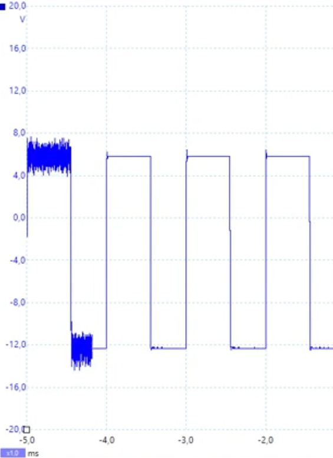
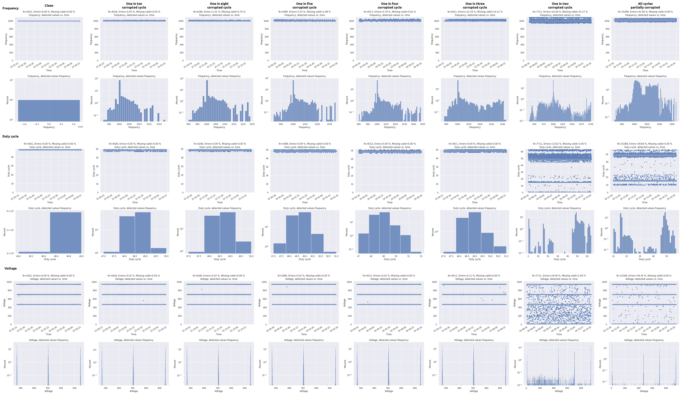
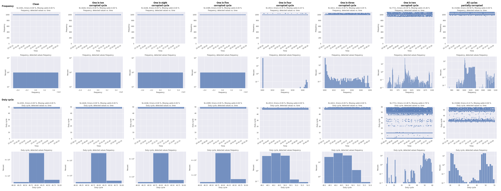
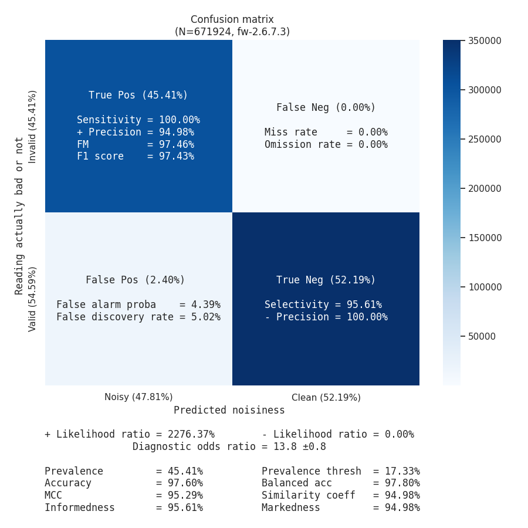

> [!UPDATE] {docsify-updated}
# EVCC CP noise filtering

## Fundamentals

Noise is no one and every one problem.

It is the problem of those actually emitting noise in the first place.

Then it is the problem of those “transporting” the noise around.

And finally it is the problem of those susceptible to noise.

The fundamental fixes for noise are, **in order**:

1. Not emit it.
1. If not possible, next approach is to filter it close to the source.
1. If not enough, its propagation should be limited.
1. And if still not enough, the ones disturbed by the noise should filter it.

## How we turned a weakness into a strength

In 2022 we received lots of support tickets with odd symptoms that seemed similar across various
customers and types of vehicle. Dealing with charge controllers for many years now, we thought we
knew what noise looked like in our logs. So we were quite taken aback by these new issues as they
looked nothing like we saw before. At first we could not reproduce them at all in our lab, despite
trying as hard as possible to thrash the CP line with noise (even wrapping it around transformers of
our own power modules could not produce the same effects). And it could not be correlated to a
recent change on our side neither. Even worst, sometimes they appeared like it was chargers
initiating emergency stops, which made it difficult to discern them from real emergency stops...

<div class="bigger-300">


</div>
<figcaption style="text-align: center">CP noise event captured by a customer, which clearly demonstrated it was not a charger E-Stop, and finally lead us on the noise track.</figcaption>

Turns out this type of noise was of much lower frequencies than usual. High frequency noise
disturbing the CP line mostly affects the high level communication with PLC. Typical symptoms are
abnormal delays in the communication pace, as well as TCP retransmissions. But lower frequency noise
ended up affecting the measurements of the CP 1kHz PWM itself. It disturbed the measurement and
detection algorithm, in such a way it appeared as 0% or 100% duty cycles when in fact the charger
oscillator was running correctly. Or in other cases we were simply no longer receiving measurement
updates when we should have.

Since we switched PLC chipset vendor for Vertexcom years ago, we actually make use of an extra
feature they provide. Which is, it is their chipset doing the synchronised PWM measurements. It actually
offloads our main CPU of these constant microseconds operations more suited to a microcontroller.

However, that also meant we had much less control on how those measurements are made. Nevertheless,
one advantage of working with Vertexcom is that they are very reactive and can iterate test firmwares
quickly. During the entire summer of 2022 we worked hard with them to improve the algorithms they
use, as well as to get more data than just bare measurements.

In parallel, we eventually found a way to reproduce the same symptoms by injecting "noise" with an
arbitrary waveform generator. We then setup a dedicated noise test bench to validate Vertexcom
firmwares, as well as collect *months* worth of measurements under diverse controlled conditions.

The outcomes of that summer are three folds:

- Base measurements produced by the PLC firmware are now much more stable under low frequency noise.
- As the PLC firmware is pushing these measurements "on change", their "change" algorithm also
improved a lot as we managed to squash many edge-cases happening only under noise.
- We asked to have extra raw data with each pushed measurement. With it we devised a noise quantifier,
filter, and a compensation mechanism.

So, not only Vertexcom now provides a more noise resilient solution. We also have more leeway in
deciding which measurements we deem reliable. And on top of that, as we can also quantify the noise,
it provides a certain feedback to our users, as well as to the people on our support line.

## Analysing noise, quantifying it, and making filtering decision

Here is a depiction of noise effects on CP PWM measurements, with an increasing noise factor:

<div class="bigger-1000">


</div>

From various studies, we can infer how noise tends to affect measurements. So the first step is to
introduce a compensation (or correction of you want) based on what can find across analyses in
various conditions:

<div class="bigger-1000">


</div>

Voltage is not shown here because we don't have yet an effective compensation strategy for it. And
anyway it seems less affected by noise (up to a certain point). But both frequency and duty cycle
measurements already get a small "cleanup".

Next step is to use the new raw data we get with each measurement to try to guess if we have any
noise. For this, we made a classifier algorithm, and by tuning its parameters we get both a
quantifier (or, let's say, a classifier whose raw scoring output is used for information) by using
the most "relaxed" set of parameters. And a filter (or, let's say, a classifier whose output is used
for decision) using an optimized set of parameters.

Here are the performances of the classifier with optimised parameters (ie. used for decision):

<div class="bigger-900">


</div>

The most important is that such filter never decides a measurement is clean when actually it is not,
even in the slightest. We want to be *informed* that there is currently some noise and as such the
measurements should be taken with more precaution. We see that its false negative rate is 0%. And
actually, even with the "relaxed" set of non-optimised parameters we also get a 0% false negative
rate. That makes it a good noise detector!

Next point is understanding that even in presence of noise, measurements might still be correct.
The goal of optimising the parameters was to find limits at which not only we detect noise, but
we can also say if the measured values can be trusted or not. And preferably with confidence, to
avoid occasionally filtering out valid measurements.

Because the data acquisition was made in a controlled environment, we are actually able to correlate
each measurement not just with whether or not it was under noisy conditions. But also what we actually
*expected* in those measurements. Here we see we obtained a false positive rate of 2.4%. It's not 0%,
but it is already pretty damn good. What will happen for those 2.4% that will get ignored is that
we will most likely receive another measurement update shortly after, with hopefully a slightly
different noise profile such that it gets either correctly rejected (true positive) or accepted
(true negative). And the reason it is the most likely thing to happen is because these 2.4% happen
predominantly in the most noisy conditions (1 in 3 corrupted cycles or worst). Which are either very
transient conditions in reality. Or, when they persist, they actually generate many more spurious
measurements update than in less noisy conditions.

If you wonder if there isn't a risk of over-fitting to the data, note that the optimised parameters
have been found using data captured with one of the early test firmware provided by Vertexcom.
Whereas here these performances are measured on an entirely different data set captured few months
later with the final released firmware.

Finally, here is how we present these information in the logs (a bit formatted for clarity). Here
we have a 5% CP duty cycle with a rather strong transient event (similar to vehicle DC contactors
closing for instance):

```
2022-11-10 17:32:45,561: INFO   : CP Thread           : PWM MEAS: PWM_Measurements(
    frequency=1035, duty_cycle=0.8, voltage=0.06,
    noise_scores=(all: 60.4%, frequency: 59.4%, duty_cycle: 62.5%, voltage: 59.4%),
    filter_scores=(all: 10.4%, frequency: 6.2%, duty_cycle: 15.6%, voltage: 9.4%),
    trace='PSwbCuAAxwBcLQAVF/9O+cUj/YfmTDlPqiMqbL2oOZCRkecy35wSdYaINcvGAg66i4D+gODiBXwdxcZc+WQcMNbjjmjOK6+mW5gxsXF/5Z7pXKzZ2eBL5LM6ZJkQLUV1+kOmXcAAAACI0wq5'
)
2022-11-10 17:32:45,567: WARNING: CP Thread           : NF2: Rejecting CP measurement because it is too noisy
2022-11-10 17:32:45,611: INFO   : CP Thread           : PWM MEAS: PWM_Measurements(
    frequency=1041, duty_cycle=1.2, voltage=6.84,
    noise_scores=(all: 89.6%, frequency: 100.0%, duty_cycle: 96.9%, voltage: 71.9%),
    filter_scores=(all: 20.8%, frequency: 6.2%, duty_cycle: 50.0%, voltage: 6.2%),
    trace='PSwbCuAAxwBiLQBjloIZ9FIHIBvSabIDIFHKQWP8atc/He640vr7MWu4AzqjS+DwdrxKQ5bkqYbNBexuFNSMrDrNdVO0Sk1EgB7JVZO06zrdMid6WOcnawG0tYMzX6yi9vZjLT7tmVdIiQM4AAAq5n7K'
)
2022-11-10 17:32:45,614: WARNING: CP Thread           : NF2: Rejecting CP measurement because it is too noisy
2022-11-10 17:32:45,665: INFO   : CP Thread           : PWM MEAS: PWM_Measurements(
    frequency=1054, duty_cycle=0.5, voltage=0.06,
    noise_scores=(all: 84.4%, frequency: 100.0%, duty_cycle: 96.9%, voltage: 56.2%),
    filter_scores=(all: 21.9%, frequency: 6.2%, duty_cycle: 50.0%, voltage: 9.4%),
    trace='PSwbCuAAxwBgLQAOl/80fFSLZDHHPawzLrmNxKDdVugHj2dcgHb1EdELzOvo1w0OykX7AxOZOY+ha5WQ7NVzlFLoCunHli+CLmXUo/hr0qKoQ5B3IQXcWzPqQV3AN+b9S38OKB6LJAyJ6gAAwOwqbA=='
)
2022-11-10 17:32:45,667: WARNING: CP Thread           : NF2: Rejecting CP measurement because it is too noisy
2022-11-10 17:32:45,714: INFO   : CP Thread           : PWM MEAS: PWM_Measurements(
    frequency=1040, duty_cycle=1.1, voltage=0.22,
    noise_scores=(all: 95.8%, frequency: 100.0%, duty_cycle: 96.9%, voltage: 90.6%),
    filter_scores=(all: 21.9%, frequency: 6.2%, duty_cycle: 50.0%, voltage: 9.4%),
    trace='PSwbCuAAxwBlLQBoloIfCn28K3stLPG3RAPUrGtgHJaDd4YwAVM+rsEG3y4YK7F+28p+hwcIDbSWd4YS+n9ibpuRPYmaw4aU8yy53BU68FD6zeUgCJWs0WKCbovuCU0hEh5j6im5YDcteb8qT5sLAACw7oe8'
)
2022-11-10 17:32:45,717: WARNING: CP Thread           : NF2: Rejecting CP measurement because it is too noisy
2022-11-10 17:32:45,767: INFO   : CP Thread           : PWM MEAS: PWM_Measurements(
    frequency=1042, duty_cycle=1.3, voltage=8.8,
    noise_scores=(all: 72.9%, frequency: 100.0%, duty_cycle: 96.9%, voltage: 21.9%),
    filter_scores=(all: 18.8%, frequency: 6.2%, duty_cycle: 50.0%, voltage: 0.0%),
    trace='PSwbCuAAxwBNLQBXFkS5/VVTufcVjT5JG5jDyY6kOsoYiwI6CrDyhsqi3BZ6CZyNPq708J7qV3NgBhDsUgYZL/+X0+fD91EZUol7wnvHrOoLghTO6GUsAACc5h8F'
)
2022-11-10 17:32:45,770: WARNING: CP Thread           : NF2: Rejecting CP measurement because it is too noisy
2022-11-10 17:32:45,817: INFO   : CP Thread           : PWM MEAS: PWM_Measurements(
    frequency=1000, duty_cycle=4.9, voltage=8.96,
    noise_scores=(all: 0.0%, frequency: 0.0%, duty_cycle: 0.0%, voltage: 0.0%),
    filter_scores=(all: 0.0%, frequency: 0.0%, duty_cycle: 0.0%, voltage: 0.0%),
    trace='PSwbCuAAxwAuLQBRF3oZ9FM3ZlHEVcfJfMwwIRkkz007A3i2F8NmDUFF085lY8AuNBPQE7IhmAAAAMqNtRY='
)
2022-11-10 17:32:45,820: INFO   : CP Thread           : Decoding 4.9 % to CP_Function.DigitalComm, CP_States.B
```

In about 250 ms, we receive 6 measurement updates. Note how some of them seems to detect low CP top
voltage. That was basically how we used to believe charger side was calling an emergency stop...
But now we can detect it, and correctly reject it!

The `PWM_Measurements` objects that are printed out gives few information. As formatted here, the
first line show the values measured by the PLC chipset firmware, with compensation. Second line show
a `noise_scores`, this is the result of our classifier used as a noise quantifier. Note that we only
use it to print it out in the logs. Third line gives the `filter_scores`, which is our classifier
result used as a decision maker. If the `all` score is more than 0, we reject the measurement.

Observe also the difference between `noise_scores` and `filter_scores`. That gap indicates how much
margin we can have sometimes. In these logs they were all so strong we rejected them. But in milder
cases of noise it shows we can still be resilient to noise without over-filtering. For instance,
here is a noisy measurement update at 50% duty cycle, with a persistent noise representative of a
noisy on-board charger:

```
2022-11-10 17:57:38,465: INFO   : CP Thread           : PWM MEAS: PWM_Measurements(
    frequency=1000, duty_cycle=49.8, voltage=5.96,
    noise_scores=(all: 39.6%, frequency: 37.5%, duty_cycle: 40.6%, voltage: 40.6%),
    filter_scores=(all: 0.0%, frequency: 0.0%, duty_cycle: 0.0%, voltage: 0.0%),
    trace='PSwbCuAAxwBbLQB+lSK2tsRgqpww19qBh/H4fUaEqKM67eBJGwVV+Ote/nJFtLbq8U2Svj4LdA5/djNvgc3VIQwXgo6S/tbTCKpN8Zs2BrJhiE/O2Y/14cF2Gn5UCNpSvRq0ADYAANMpWWk='
)
2022-11-10 17:57:38,466: INFO   : CP Thread           : Decoding 49.8 % to CP_Function.PWMComm (max 29.88 A), CP_States.C
```

Quite noisy, yet we are confident the measurement can be trusted.

Finally, you can see on the last line the `trace` value. If in a support ticket you send us logs that
contains such print outs of measurement updates, with the `trace` value we can fully reconstruct all
data the PLC chipset sent us for that measurement. This would allow us to have a closer look to the
actual noise profile that was observed. And in case the logs show our filter algorithm took the wrong
decision, it will allow us to maybe figure out how to improve it :-).

## In conclusion

This new PLC chipset firmware, plus the new noise detector, makes our vehicle charge controllers
way more resilient to noise that they used to be!

However, if you go back to the fundamentals at the beginning of this page, you will notice these are
sitting at the end of the list of actions you should carry out. Understand that what these filters
are actually doing is just working around the effects of noise leading to incorrect readings.

And they do so by applying statistical deductions. Or, said differently, it is pretty much guess
work to figure out which reading is real... And you should never rely on guesswork!

It is not because these new filters improve your noise situation that you should call it a day.
If the logs show any non-zero value in the `noise_scores`, ie. the noise quantifier, then **fix
your setup!**
