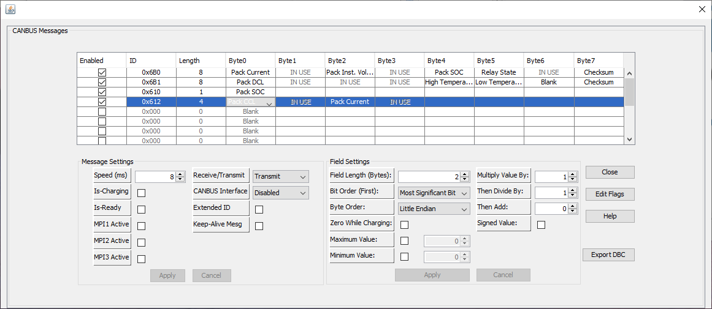

> [!UPDATE] {docsify-updated}
# ORION BMS Integration

# Introduction:

This is a guide for integrating Orion BMS with ADVANTICS EVCC for CCS DC charging.

# Interface:

Integrating the Orion BMS with ADVANTICS EVCC is possible using the CAN Bus PEV Generic Interface and Orion Programmable CANBUS Interface via the ORION BMS Software utility.

To make the communication possible, you only need to configure the BMS to send the messages needed by the PEV CAN Bus Generic interface using the CANBUS settings of the BMS.

2 messages need to be configured:

- EV_INFORMATION message: Please refer to the section "12. EV_INFORMATION" of the "Generic PEV CAN Interface Manual"
- DC_STATUS1: Please refer to the section "14. DC_STATUS1" of the "Generic PEV CAN Interface Manual"

To edit the CAN messages sent by the Orion BMS, follow these steps:

1. Launch OrionBMS 2 Utility:

1. Press "Edit CANBUS Messages", and configure the signals as shown in the following figure:
    
    
    
    

The messages that you should add are:

> [!Note] for the signals 'Maximum Pack CCL' and 'Pack Current' you should change the 'field length' to 2 bytes.

# Provide Signals not supported by the BMS:

Some signals are not supported by the BMS. The solution for that is to provide the missing signals as follows:

__*Use Isabellenhutte Sensor:*__

Please refer to [CAN sensor](charge-controllers/evcc_can_sensor.md) to know how the sensor should be wired.

- Inlet Voltage: According to the standard the Inlet Voltage should be measured from the vehicle side just before the contactors, it's used mainly during Precharge to close the contactors on the correct voltage. Please check [Generic PEV CAN interface](charge-controllers/evcc_can_generic.md) to configure the controller to use the Isabellenhutte Sensor.

The following signals should be provided by the sensor even though the BMS can provide them:

- Present Current: Measurement of current flowing in or out of the battery.
- Battery Voltage: Measurement of battery pack voltage.

__*End of Charge:*__

Use the 12V input (R-3F) on the ADM-CS-EVCC unit to indicate the end of charge.

__*Contactors with feedback:*__

It's better to use contactors with feedback. The ADM-CS-EVCC unit has DC contactors feedback inputs. Check [Generic PEV CAN interface](charge-controllers/evcc_can_generic.md) to configure the controller to use contactors with the feedback inputs.