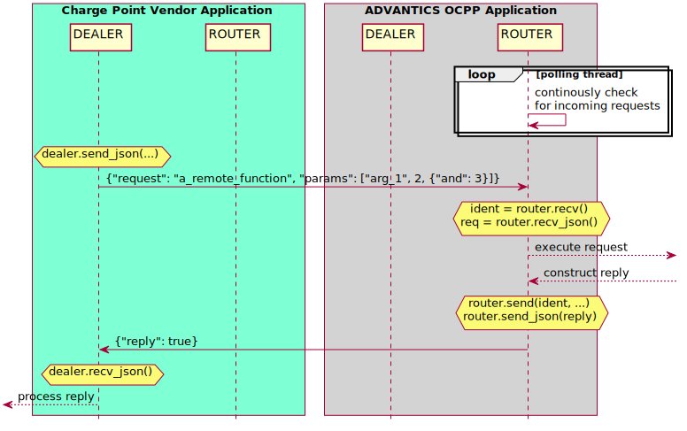
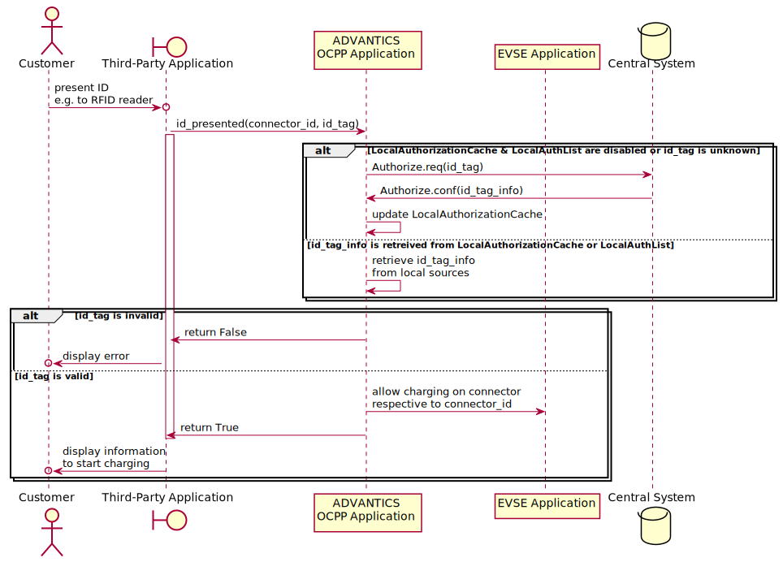

> [!UPDATE] {docsify-updated}

# OCPP Application

The ADVANTICS OCPP application implements OCPP-J 1.6 (OCPP 1.6 Edition 2
over Websockets using JSON).

The current state of the OCPP 1.6 feature profiles is

<div class="compact-table">

| Feature Profile           | Status            | since | Remarks                                       |
|---------------------------|-------------------|-------|-----------------------------------------------|
| Core                      | Fully Implemented | v1.2  |                                               |
| Local Auth List Management| Tested            | v1.3  | LocalAuthList management, persistent over reboots.|
| Reservation               | Tested            | v1.3  | Reservation management, authentication.       |
| Smart Charging            | Tested            | v1.3  | Charging Profile management, Smart Charging.  |


</div>

# Terminology & Definitions

In this document, the following terms are used


<div class="compact-table">

| Terms                      | Definition                                                                                                                                                                                                                                                                  |
|---------------------------|------------------------------------------------------------------------------------------------------------------------------------------------------------------------------------------------------------------------------------------------------------------------------|
| Additional Hardware        | Any active hardware components inside a Charge Point that the Charge Point Vendor is responsible for and is controlled by the Charge Point Vendor Application (e.g. RFID readers, displays, energy meters).                                                                           |
| Central System            | The central system that manages Charge Points and has the information for authorizing users for using its Charge Points [OCPP].                                                                                                                               |
| Charge Point              | The physical system where an electric vehicle can be charged. A Charge Point has one or more connectors [OCPP]. The Charge Point includes the ADVANTICS EVSE Controller and additional hardware. Where the OCPP specification refers to the Charge Point’s software functionality, it mostly refers to what is here refered to as the ADVANTICS OCPP Application. |
| Charge Point Vendor       | The company integrating the ADVANTICS EVSE Controller into a complete Charge Point. That is probably **you**.                                                                                                                                               |
| Charge Point Vendor Application | An application provided by the Charge Point Vendor that controls additional hardware inside the Charge Point and communicates with the OCPP Application.                                                                                           |
| Customer                  | A person interacting with the Charge Point to charge an EV.                                                                                                                                                                                               |
| OCPP Application          | The ADVANTICS OCPP implementation which handles all OCPP communication with the Central System. It communicates with the Charge Point Vendor Application over the ZeroMQ RPC Channel, to the Central System with OCPP-J 1.6 and to the rest of the ADVANTICS software stack over the internal message system.               |
| You                       | The person reading this document, assumed to be a Charge Point Vendor Employee wanting to interface with the ADVANTICS OCPP Application.                                                                                                                 |
| ZeroMQ RPC Channel        | A bi-directional json-encoded remote procedure call channel between the ADVANTICS OCPP Application and the Charge Point Vendor Application based on ZeroMQ ROUTER/DEALER sockets.                                                                        |

</div>

# OCPP Implementation Details

This section contains details about the behaviour of the OCPP
application.

## Core Profile

Is fully implemented, but not fully documented yet.

### Reset

On receiving a **hard Reset** request, the OCPP application will in turn
request a reboot from the controller with a delay of 3 seconds (to allow
messaging to finish). This has no further conditions.

When a **soft Reset** request is received, the OCPP application will
change the Availability of all connectors to unavailable. If a connector
is busy, the availability will be changed as soon as possible (e.g. once
the ongoing charging session is completed). This prevents any new
charging sessions from being started after receiving the Reset request.
It will also request all ongoing charge sessions to be stopped
gracefully. As soon as all charging sessions are complete (including a
respective StopTransaction action) and all connectors are idle, the
controller will be restarted.

Note that a charging session may only be completed once the pistol is
disconnected from the car and a soft reset during a charging session
will be pending until that happens.

## LocalAuthList Profile

Support for the local authorization list is available from
`version 1.3`.

### Default Configuration
The local authorization list is by **default disabled**. Its maximum
length defaults to 1000.

### Configuration Keys
You can enable the list and set its maximum length with the OCPP
configuration keys `LocalAuthListEnabled`, `LocalAuthListMaxLength` and
`SendLocalListMaxLength`. You can use OCPP ChangeConfiguration requests
from your central system to change the following options. Alternatively,
add them to the ADVANTICS [**configuration file**](secc_configuration.md#ocpp-configuration) under the
`ocpp:1.6_local_auth` section.

    [ocpp:1.6_local_auth]
    LocalAuthListEnabled=True
    LocalAuthListMaxLength=1000
    SendLocalListMaxLength=1000

### Persistence
The local authorization list is saved to persistent storage when the
OCPP application is stopped. It is loaded from persistent storage when
the application starts. The default location of the saved list is
`/var/advantics/ocpp/local_auth_list.json`.

### Behavior if disabled
If the local authorization list is disabled, `SendLocalList` requests
from the central system are rejected and it will reply to
`GetLocalListVersion` requests with a list version of `0`.

## Reservations
Support for reservations is available from `version 1.3`.

### Default Configuration
Reservations are always enabled.

### Configuration Keys
No additional configuration keys exist for reservations.
`ReserveConnectorZeroSupported` is always `False`.

### Persistence
Reservations are currently not persistent after reboots.

Reserving a connector prevents anyone not authorized to use the
reservation from charging on that connector. On a reserved connector,
the `id_presented` RPC request will return `True` if and only if the
presented ID is the same one used in the reservation or they are in the
same ID group (parent ID).

Please note that a reserved connector is not disabled. Depending on your
user interaction, your authorization setup and your use of the ADVANTICS
sequence flags, a charge can be started on a reserved connector — though
it will be canceled right away. In such cases, the connector will stay
reserved.

When a connector becomes reserved or stops being reserved, you will
receive a respective `status_notification_notice` RPC request as with
any other change in connector state.

## Smart Charging

Support for smart charging is available from `version 1.3`.

### Default Configuration
Smart Charging is always enabled, but has no effect if no charging
profiles are installed.

### Configuration Keys
The OCPP configuration keys `ChargeProfileMaxStackLevel` (default 100),
`ChargingScheduleMaxPeriods` (default 1000) and
`MaxChargingProfilesInstalled` (default 1000) configure the limits on
the installed charging profiles. They can be changed to fit your needs.
`ChargingScheduleAllowedChargingRateUnit` is always power and current
and `ConnectorSwitch3to1PhaseSupported` is always `False`.

\+ There are additional configuration keys custom to the ADVANTICS OCPP
application: `update_interval` (default 30) is the interval in seconds
when new limits are calculated and communicated to the car.
`allow_limiting_to_zero` (default `False`) configures whether installed
charging profiles may limit the current to zero (or only to the minimum
hardware values configured in the configuration file).

### Persistence
Charging profiles are persistent between reboots.

The charging profiles installed in the OCPP application limit the
current that should be used on a connector. This maximum current is then
periodically communicated to the car, which is ultimately responsible
for respecting the limit. Since the compatibility of dynamically
changing the charging current is varying between different cars, the
response to dynamically changing the current may vary as well.

Configured power limits are transformed into current limits according to
the present charging voltage as reported by the charger. For AC
charging, the present charging voltage is not known to the ADVANTICS
software and thus *power limits are currently ignored on AC connectors*.

### Set Charging Profile

When using the `SetChargingProfile` OCPP request, you may include
periods with a limit set to `-1`. Any such period will internally be
understood to have *no limit*.

### Get Composite Schedule

When using the `GetCompositeSchedule` OCPP request, the returned
charging profile indicates periods of time without active charging
profiles (and thus *no limit* enforced) as periods with limit set to
`-1`.

When used on `ConnectorId = 0` the OCPP application returns an educated
guess on the expected current or power consumption for the requested
period. This is calculated by examining the configured limits on each
connector, or the limit on the whole charge point in the future. It is
assumed that active transactions (and their charging profiles) will
still be active in the future. If no limit is configured for a certain
period, the maximum hardware limit for each connector is considered as
an upper bound for the expected consumption during that time.

# HIGH-LEVEL COMMUNICATION OVERVIEW

This section provides a high-level overview of the different components
inside and outside of a charge point and how they work together in the
context of OCPP. In the following diagram you can see the different
components on the horizontal axis. Their communications are displayed by
horizontal arrows and are grouped by the channel on which they happen.
While this uses a sequence diagram for visualization, the vertical axis
does not directly reflect time in this instance.

<div hidden>
@startuml /ocpp_images/hlc_overview
hide footbox
skinparam BoxPadding 10

box "Customer" #PaleGoldenRod
entity      EV as CAR
actor       Customer as CUST
end box
box "Charge Point Vendor" #AquaMarine
entity      "Additional Hardware\n(RFID, Meters, ...)" as EXT
participant "Charge Point Vendor\nApplication" as MGMT
endbox
box "ADVANTICS" #LightGray
participant "ADVANTICS\nOCPP Application" as OCPP
participant "ADVANTICS\nCharge Controller" as EVSE
endbox
box "Internet/Cloud" #MistyRose
database    "Central System" as CLOUD
endbox

group charge point vendor specific
MGMT <-> EXT:	control additional hardware
MGMT <-> CUST:	handle user interaction
end

group #PowderBlue ZeroMQ RPC channel
MGMT -> OCPP:	inform of external events\ne.g. id_presented(..)
OCPP -> MGMT:	request external data\ne.g. meter(..) values
MGMT -> OCPP:	provide external data
end

group OCPP-J 1.6
OCPP -> OCPP:	convert external data\nto OCPP message payloads
OCPP <-> CLOUD:	handle OCPP messaging
end

OCPP <-> EVSE:	internal communications

group EV charging standards
CAR <-> EVSE:	handle charging process
end

@enduml
</div>


<figcaption style="text-align: center">A high-level schematic of components involved when using OCPP</figcaption>

One can see four major groups of communications.

### Charge Point Vendor Specific Communication
Between the Charge Point Vendor Application and the additional hardware
inside the Charge Point, including hardware for user interactions and
thus including the customer.  
Since the additional hardware and the wanted user interaction is up to
the Charge Point Vendor (**you**), it is not part of this document. But
it assumes there is additional hardware able to read an OCPP `id_tag`
(e.g. RFID reader) for customer authentication and provide energy meter
readings for billing purposes.  
In the future, we will offer energy meters and other additional hardware
that are directly integrated into the OCPP Application. Inquire with us
if that is of interest to you.

### ZeroMQ RPC Channel Communication  
Between the Charge Point Vendor Application and the ADVANTICS OCPP
Application.  
This is the **most important communication point** when you are looking
to integrate with the ADVANTICS OCPP Application. The ZeroMQ RPC Channel
is a bi-directional json-encoded remote procedure call channel between
the based on ZeroMQ ROUTER/DEALER sockets. It is used to forward OCPP
relevant user interactions (e.g. presenting an `id_tag` to a RFID
reader) from the Charge Point Vendor Application to the OCPP
Application. In the other direction, the OCPP Application can ask about
data from the additional hardware (e.g. energy meter values needed at
the start and end of transactions).

OCPP-J 1.6 Communication  
Between the ADVANTICS OCPP Application and the Central System.  
This contains all OCPP messages and is defined by the OCPP
specification. Note that the OCPP Application is solely responsible for
the underlying websockets communication, deciding when to send each
message, generating the message payloads or answering requests initiated
by the central system.  
The Charge Point Vendor Application is only involved indirectly: If the
OCPP Application requires data from the additional hardware while
generating a message payload, it will request that value by invoking the
respective RPC over the ZeroMQ RPC Channel. Or if the Charge Point
Vendor Application invokes a RPC on the OCPP Application, it may result
in certain OCPP messages to be triggered (see examples in
[Interfacing with the ADVANTICS OCPP Application](#interfacing-with-the-advantics-ocpp-application)).

EV Charging Communication  
Between the EV and the ADVANTICS Charge Controller.  
The charging process itself is handled by the rest of the ADVANTICS
Charge Controller. The OCPP Application will modify the charging process
according to input received over the ZeroMQ RPC Channel from the Charge
Point Vendor Application (e.g. presenting an ID again stops the charge)
or from the Central System (e.g. receiving a `StopTransaction.req`
message stops the charge).  
Other than that, the details of the charging communication help in
understanding the Charge Point’s state reported to the central system,
but are not necessary knowledge for integrating the ADVANTICS OCPP
Application.

# Interfacing with the ADVANTICS OCPP Application

From the section "[High-Level Communication Overview](#high-level-communication-overview)" you could see that the
interface to the ADVANTICS OCPP Application is the ZeroMQ RPC Channel.
In this section, we provide documentation related to its implementation.
If you prefer to read some code, you can find simple examples in the
section "[GETTING STARTED QUICKLY](#getting-started-quickly)" and a
complete implementation usable for testing in [Reference Implementation](#reference-implementation)".

## The ZeroMQ RPC Channel

<div hidden>
@startuml /ocpp_images/zmq_rpc_channel
left to right direction
hide circle

interface "Charge Point Vendor Application" << (V,AquaMarine) >> #AquaMarine {
+ {field} DEALER (calls remote function)
-- callable --
+ {field} ROUTER (accepts calls and replies)
- change_availability_notice()
- meter()
- start_transaction_notice()
}

interface "ADVANTICS OCPP Application" << (A,LightGray) >> #LightGray {
+ {field} DEALER bound to :60501 (calls remote function)
-- callable --
+ {field} ROUTER bound to :60500 (accepts calls and replies)
- change_availability()
- id_presented()
}

"Charge Point Vendor Application::ROUTER" <--> "ADVANTICS OCPP Application::DEALER"
"Charge Point Vendor Application::DEALER" <--> "ADVANTICS OCPP Application::ROUTER"

@enduml

</div>


<figcaption style="text-align: center">ZeroMQ RPC Channel</figcaption>

The ZeroMQ RPC Channel is based on a DEALER/ROUTER socket pair (see [The
ZeroMQ Guide:
DEALER/ROUTER](https://zguide.zeromq.org/docs/chapter3/#Request-Reply-Combinations)
for details). Both sides of the RPC Channel have their own pair of
sockets. Their respective roles are

### DEALER Socket  
Sends out RPC requests, receives replies: It handles **calling**
functions.  
The DEALER socket is used on demand, when a remote function needs to be
called.  
The Charge Point Vendor Application should connect its DEALER socket to
the ROUTER socket of the OCPP Application (port 60500). Doing so also
connects the reverse direction.

### ROUTER Socket  
Receives RPC requests, sends out replies: It handles **receiving and
replying** to calls.  
The ROUTER socket must be continously monitored for incoming RPC
requests.  
The Charge Point Vendor Application should connect its ROUTER socket to
the DEALER socket of the OCPP Application (port 60501). Doing so also
connects the reverse direction.

The RPC Channel is identical in either direction, meaning the process of
the Charge Point Vendor Application calling a function on the OCPP
Application is identical to the OCPP Application calling a function on
the Charge Point Vendor Application. The only difference is that the
OCPP Application binds its ZeroMQ sockets, while the Charge Point Vendor
Application connects to them (roughly meaning the OCPP Application is
the "stationary server" and the connection is initialized by the Charge
Point Vendor Application). Once the connection is done, this difference
is irrelevant.

This document may refer to RPC calls also as requests.

## RPC Message Format

On top of the ZeroMQ layer, the RPC calls and replies use JSON-encoded
data. The respective formats are

### RPC Request/Call  
A JSON object containing the requested function name (as field
`request`) and the necessary arguments (as field `params`). It is sent
out by the ROUTER socket of the application requesting the RPC and
received on the DEALER socket of the remote application. Example:

    {"request": "a_remote_function", "params": ["arg_1", 2, {"and": 3}]}

### RPC Reply  
A JSON object containing the result of the RPC in the field `reply`. It
is sent out by the DEALER socket of the remote application (after it
received and executed a repsective RPC) and received on the ROUTER
socket of the application that requested the RPC.  
If an exception occured on the remote end, it instead contains the field
`exception` with the exception message and the fields
`exception_qualname` and `exception_module` with information about the
exception type.  

    {"reply": true}

    {"exception": "Function a_remote_function unknown", "exception_qualname": "Exception", "exception_module": "builtins"}

There can only ever be one RPC request ongoing. When a request is sent
out, one must wait for a reply before sending another one.

## Charge Point Vendor Application Calling a Function of the OCPP Application

The following diagram shows the sequence of actions of the previously
described RPC request. In this example, the Charge Point Vendor
Application requests a RPC on the OCPP Application.

The yellow brackets show the functions of a `pyzmq` socket that are used
to implement the necessary action. For more details, see the code
example in [GETTING STARTED QUICKLY](#getting-started-quickly).

Both applications must continously monitor their DEALER socket for
incoming RPC requests. Here this is only shown for the receiving OCPP
Application.

**A RPC request originating from the Charge Point Vendor Application and
being executed by the OCPP Application..**

<div hidden>
@startuml /ocpp_images/customer_rcp_request_example
hide footbox
skinparam BoxPadding 10
skinparam ParticipantPadding 35
skinparam noteTextAlignment center

box "Charge Point Vendor Application" #AquaMarine
participant "DEALER" as CPVA_ROUTER
participant "ROUTER" as CPVA_DEALER
endbox
box "ADVANTICS OCPP Application" #LightGray
participant "DEALER" as OCPP_ROUTER
participant "ROUTER" as OCPP_DEALER
endbox

loop	polling thread
OCPP_DEALER -> OCPP_DEALER: continously check\nfor incoming requests
end

hnote over CPVA_ROUTER: dealer.send_json(...)
CPVA_ROUTER -> OCPP_DEALER: {"request": "a_remote_function", "params": ["arg_1", 2, {"and": 3}]}

hnote over OCPP_DEALER: ident = router.recv()\nreq = router.recv_json()
OCPP_DEALER -->] : execute request
OCPP_DEALER <--] : construct reply
hnote over OCPP_DEALER: router.send(ident, ...)\nrouter.send_json(reply)
OCPP_DEALER -> CPVA_ROUTER: {"reply": true}

hnote over CPVA_ROUTER: dealer.recv_json()
[<-- CPVA_ROUTER : process reply

@enduml
</div>


<figcaption style="text-align: center">Charge Point Vendor Application Calling a Function of the OCPP Application</figcaption>

## OCPP Application Calling a Function of the Charge Point Vendor Application

The following diagram shows the opposite case, namely the OCPP
Application requesting a RPC on the Charge Point Vendor Application.
Again, both applications must continously monitor their DEALER socket
for incoming RPC requests, but it is only shown for the receiving side.

This example is equal to the previous one, since the RPC Channel is
symmetric.

**A RPC request originating from the OCPP Application and being executed
by the Charge Point Vendor Application..**

<div hidden>

@startuml /ocpp_images/advantics_rcp_request_example
hide footbox
skinparam BoxPadding 10
skinparam ParticipantPadding 35

box "Charge Point Vendor Application" #AquaMarine
participant "DEALER" as CPVA_ROUTER
participant "ROUTER" as CPVA_DEALER
endbox
box "ADVANTICS OCPP Application" #LightGray
participant "DEALER" as OCPP_ROUTER
participant "ROUTER" as OCPP_DEALER
endbox

loop	polling thread
CPVA_DEALER -> CPVA_DEALER: continously check\nfor incoming requests
end

hnote over OCPP_ROUTER: dealer.send_json(...)
OCPP_ROUTER -> CPVA_DEALER: {"request": "b_remote_function", "params": []}

hnote over CPVA_DEALER: ident = router.recv()\nreq = router.recv_json()
[<-- CPVA_DEALER : execute request
[--> CPVA_DEALER : construct reply
hnote over CPVA_DEALER: router.send(ident, ...)\nrouter.send_json(reply)
CPVA_DEALER -> OCPP_ROUTER: {"reply": false}

hnote over OCPP_ROUTER: dealer.recv_json(...)
OCPP_ROUTER -->] : process reply

@enduml
</div>


<figcaption style="text-align: center">OCPP Application Calling a Function of the Charge Point Vendor Application</figcaption>

# List of RPC Requests

The following is a list of all RPC requests the OCPP Application can
receive or send out.

**The current main source of documentation on the signature and details
of RPC requests are the doc strings in the
[REFERENCE IMPLEMENTATION](#reference-implementation)". Please refer to them for
additional details.**

## `allow_change_availability_request`

|                           |                                    |
|---------------------------|------------------------------------|
| request slug              | allow_change_availability_request  |
| parameters                | `connector_id, connector_info, requested_availability` |
| requested by              | OCPP Application                   |


The `allow_change_availability_request` RPC is requested by the OCPP
application on the charge point vendor application each time before the
OCPP Application replies to a `ChangeAvailability` request from the
central system.

Return `true` to allow the `ChangeAvailability` request. Return `false`
to deny it. In the latter case, the OCPP Application will reply with a
rejected status to the request and will not change the availability.

This is useful if the charge point vendor application needs to ensure
that the availability of a connector is not changed. This may be desired
in case of local maintenance work known to the charge point vendor
application, during which a connector may not be changed to `Operative`.

## `change_availability`

|                    |                            |
|--------------------|----------------------------|
| request slug       | change_availability         |
| parameters         | `connector_id, availability, persistent` |
| requested by       | Charge Point Vendor Application |


The `change_availability` RPC is requested by the charge point vendor
application on the OCPP application. It mimics a `ChangeAvailability`
request from the central system.

This RPC can be used by the charge point vendor application to change
the availability of a connector.

## `id_presented`

|                    |                            |
|--------------------|----------------------------|
| request slug       | id_presented               |
| parameters         | `connector_id, id_token`   |
| requested by       | Charge Point Vendor Application |


The `id_presented` RPC is requested by the charge point vendor
application on the OCPP application.

It should be used whenever an `id_token` was presented to the charge
point vendor application (e.g. via a RFID reader). The OCPP application
will potentially authorize the `id_token` with the central system and
allow charging for it on the pistol associated with `connector_id`.

For a process example, see
[CUSTOMER ARRIVES AT THE CHARGE POINT](#customer-arrives-at-the-charge-point).

## `meter`

|                          |                            |
|--------------------------|----------------------------|
| request slug             | meter                    |
| parameters               | `connector_id, measurands` |
| requested by             | OCPP Application           |


The `meter` RPC is requested by the OCPP application on the charge point
vendor application each time it requires the current metering data. This
happens at the start and end of a charging process and during one
according to the `MeterValueSampleInterval` and
`ClockAlignedDataInterval` configuration values.

**Please see the doc strings in the "[Reference Implementation](#reference-implementation)"
for a detailed explanation of the parameters and
[CUSTOMER STARTS CHARGING AFTER SUCCESSFUL AUTHENTICATION](#customer-starts-charging-after-successful-authentication)" for a process
explanation.**

## `remote_start_transaction_notice`

|                                |                                   |
|--------------------------------|-----------------------------------|
| Request Slug                   | Remote Start Transaction Notice    |
| Parameters                     | `accepted, id_tag, connector_id, connector_info, charging_profile` |
| Requested by                   | OCPP Application                  |

</table>

The `remote_start_transaction_notice` is requested by the OCPP
application on the charge point vendor application after it received a
`RemoteStartTransaction` from the central system and decided whether to
accept it.

Consider this only a notice that a `RemoteStartTransaction` has been
received, which can be useful to know if the charge point vendor
application needs to take action whenever a charge is authorized (and it
itself is not the source of the event like it is with the `id_presented`
RPC).

## `status_notification_notice`

|                          |                                |
|--------------------------|--------------------------------|
| request slug             | status_notification_notice     |
| parameters               | `connector_id, connector_info, error_code, status` |
| requested by             | OCPP Application               |


The `status_notification_notice` is requested by the OCPP application on
the charge point vendor application whenever the status of a connector
changes in a way that the change would also be reported to the central
system.

Consider this only a notice that the connector state has changed. That
can be useful to know if the charge point vendor application would like
to react to connector state changes quickly, e.g. by displaying
additional user information on a display.

This RPC contains more information than the always available state CAN
messages sent by the controller.

# GETTING STARTED QUICKLY
## Running the OCPP Application locally

**Note: This is no longer possible after v1.2, where the OCPP
application will wait indefinitely on other applications of the
ADVANTICS stack.**

For development purposes it might be interesting to run the OCPP
Application locally instead of on the ADVANTICS EVSE controller
hardware. To do so, you need Docker installed and set up (see [Docker
get-started](https://docs.docker.com/get-started/)), a way to run the
ARM based docker images on your hardware and some files to mimick the
original environment the OCPP Application runs in. For some things it is
useful to have a running central system (you can use the open-source
central system [SteVe](https://github.com/RWTH-i5-IDSG/steve) for
testing purposes).

Assuming a typical x86-based Ubuntu systems, you need to install
`qemu-arm-static`.

```cmd
    sudo apt-get update
    sudo apt-get install -y --no-install-recommends qemu-user-static
```
And generate two additional files. The first one is a file containing
version information of the controller hardware.

```cmd
echo "JwUZVgIPLJde4p1UAAAANAAAAAAAAAAAZ8rXxwUHBgBDdXJyZW50IHZlcnNpb24AAAAAAAAAAAAAAAAAAAAAAAAAACwAAAAAc2V0ZW52IGN1cnJlbnRfdmVyc2lvbiAyMDIwLTA2LTExLS0wMDEKZXhpdAo=" | base64 -d > current_version.img
```

The second is the configuration file `config.cfg`, which contains all
configuration option for the OCPP Application. For now, we just set OCPP
enabled. If you have a running central system, change the
`connection_url` setting accordingly. Otherwise, you can still test
functionality like the RPC while the OCPP Application is offline.

    tee config.cfg <<< "
    [ocpp]
    enabled=True
    connection_url=ws://localhost:8180/steve/websocket/CentralSystemService/cp-001
    "

With the environment set up, you can now start the OCPP Application.
```cmd
docker run --name ocpp -it --rm --net=host -v /usr/bin/qemu-arm-static:/usr/bin/qemu-arm-static -v $PWD/config.cfg:/app/config.cfg -v $PWD/current_version.img:/boot/current_version.img advantics/ocpp-charge-point
```

## SEND YOUR FIRST RPC REQUEST

The following commands will show you how to send a RPC request to the
OCPP Application. Since the RPC channel is using ZeroMQ, you need to
install the `pyzmq` package.

    # possibly set up a virtual environment
    pip3 install pyzmq

Then you can send the `id_presented` request to the OCPP Application,
e.g. by saving the following example code into a file named
`first_request.py`.

```python
    #
    # FILE: first_request.py
    #
    import zmq

    # Create a zeromq context and DEALER
    zmq_context = zmq.Context.instance()
    zmq_dealer = zmq_context.socket(zmq.DEALER)

    # If you do not run the OCPP Application locally, insert the correct IP.
    # The OCPP docker container exposes ports on its IP, because it uses network_mode=host.
    zmq_dealer.connect('tcp://localhost:60500')

    # Request the RPC 'id_presented'
    # The list of params (connector_id, id_tag) follows the function signature
    # Afterwards, you should see side effects of its execution in the OCPP Application log.
    print('[DEALER] Requesting RPC')
    zmq_dealer.send_json({'request': 'id_presented', 'params': (1, 'an_ocpp_id_tag')})

    # Read the reply, block until received
    # Find the reply signatures of different functions in their documentation
    reply = zmq_dealer.recv_json()
    print('[DEALER] Got reply: ', reply)
```

Execute the saved `first_request.py` to send your first request.

```cmd
    python3 first_request.py
    #  should see side effects in the OCPP Application log
    #  should output something similar to
    #  [DEALER] Got reply:  {'reply': False}
```

If the OCPP Application is unable to execute the requested RPC, it will
tell you.

```cmd
    # Call a non-existent function
    zmq_dealer.send_json({'request': 'non_existent', 'params': (None, )})
    # Read the reply
    reply = zmq_dealer.recv_json()
    print(reply)
    # => {'exception': 'Function non_existent unknown', ... }
```

## RECEIVE YOUR FIRST RPC REQUEST
To show you how a RPC request is received, we would need the OCPP
Application to request one. If you have the OCPP Application running
locally, this is not possible, since you will not be able to reach a
state (e.g. charging) where the OCPP Application requests a RPC. Thus we
will use the example code from above as the side requesting a RPC and
now write the other side receiving it. Save the example code from
[SEND YOUR FIRST RPC REQUEST](#send-your-first-rpc-request) into a file named
`first_request.py`, and stop the OCPP Application, if you have it
running locally.

    # save example code from above into first_request.py if not done already
    # stop OCPP Application docker if started
    docker stop ocpp

Then create a new file called `first_reply.py` and copy the following
code to implement the receiving side of the RPC request.

```python
    #
    # FILE: first_reply.py
    #
    import zmq

    # Create a zeromq context and ROUTER
    zmq_context = zmq.Context.instance()
    zmq_router = zmq_context.socket(zmq.ROUTER)

    # Bind this receiver example to the same port the OCPP Application would use
    zmq_router.bind('tcp://*:60500')

    # Define an id_presented function that will be called by the request
    id_presented = lambda *args: print('[ROUTER] id_presented called with params: ', args)

    # Listen for a single request
    # In a proper implementation, the DEALER should be monitored continuously
    # You always need to read an identity frame from a DEALER socket (see ZeroMQ Guide)
    # Then you read the json-based request
    identity = zmq_router.recv()
    request = zmq_router.recv_json()
    print('[ROUTER] Received request ', request)

    # Call the requested function by name
    # Do some basic exception handling
    try:
      function = locals()[request['request']]
      reply = {'reply': function(*request['params'])}
    except Exception as ex:
      reply = {'exception': str(ex)}

    # Send back the reply
    # Which requires prepending the identity frame for ROUTER sockets
    print('[ROUTER] Replying with ', reply)
    zmq_router.send(identity, zmq.SNDMORE)
    zmq_router.send_json(reply)
```

You can now start the receiving side by executing `first_reply.sh` and
then request a RPC by executing the requesting side `first_request.py`.
The following command does so with a short delay.

```cmd
    python3 first_reply.py & sleep 1; python3 first_request.py
    #  should output
    #  [DEALER] Requesting RPC
    #  [ROUTER] Received request  {'request': 'id_presented', 'params': [1, 'an_ocpp_id_tag']}
    #  [ROUTER] id_presented called with params:  (1, 'an_ocpp_id_tag')
    #  [ROUTER] Replying with  {'reply': None}
    #  [DEALER] Got reply:  {'reply': None}
```

# Process Examples

## CUSTOMER ARRIVES AT THE CHARGE POINT

<div hidden>

    @startuml /ocpp_images/process_example1
    actor       Customer as CUST
    boundary    "Third-Party Application" as MGMT
    participant "ADVANTICS\nOCPP Application" as OCPP
    participant "EVSE Application" as EVSE
    database    "Central System" as CLOUD

    CUST ->o MGMT:  present ID\ne.g. to RFID reader
    MGMT -> OCPP:   id_presented(connector_id, id_tag)
    activate MGMT

    alt     LocalAuthorizationCache & LocalAuthList are disabled or id_tag is unknown
    OCPP -> CLOUD:  Authorize.req(id_tag)
    CLOUD -> OCPP:  Authorize.conf(id_tag_info)
    OCPP -> OCPP:   update LocalAuthorizationCache
    else    id_tag_info is retreived from LocalAuthorizationCache or LocalAuthList
    OCPP -> OCPP:   retrieve id_tag_info\nfrom local sources
    end

    alt     id_tag is invalid
    OCPP -> MGMT:   return False
    MGMT ->o CUST:  display error
    else    id_tag is valid
    OCPP -> EVSE:   allow charging on connector\nrespective to connector_id
    OCPP -> MGMT:   return True
    deactivate MGMT
    MGMT ->o CUST:  display information\nto start charging
    end

    @enduml

</div>


<figcaption style="text-align: center">CUSTOMER ARRIVES AT THE CHARGE POINT</figcaption>

&nbsp;

## CUSTOMER STARTS CHARGING AFTER SUCCESSFUL AUTHENTICATION

&nbsp;

<div hidden>
    @startuml /ocpp_images/process_example2
    entity      EV as CAR
    actor       Customer as CUST
    boundary    "Third-Party Application" as MGMT
    participant "ADVANTICS\nOCPP Application" as OCPP
    participant "EVSE Application" as EVSE
    database    "Central System" as CLOUD

    ref over CAR, CLOUD: Customer presented an id_tag and was sucessfully authenticated

    CUST -> CAR:    plug-in

    == charge session initialization ==
    CAR <-> EVSE:   hand-shake according to charging standard
    OCPP <-> EVSE:  internal communication
    OCPP -> CLOUD:  StatusNotification.req(connector_id, 'Preparing')
    OCPP <- CLOUD:  StatusNotification.conf()

    alt     car and evse controller decide to start charging

    == charging starts ==
    CAR <-> EVSE:   communication according to charging standard
    OCPP <-> EVSE:  internal communication
    OCPP -> CLOUD:  StatusNotification.req(connector_id, 'Charging')
    OCPP <- CLOUD:  StatusNotification.conf()
    OCPP -> MGMT:   meter(connector_id, measurands)
    MGMT -> OCPP:   return value used as meter_start

    == OCPP transaction starts ==
    OCPP -> CLOUD:  StartTransaction.req(connector_id, id_tag, meter_start)
    CLOUD -> OCPP:  StartTransaction.conf()

    loop    according to MeterValueSampleInterval & ClockAlignedDataInterval
    OCPP -> MGMT:   meter(connector_id, measurands)
    MGMT -> OCPP:   return value
    OCPP -> CLOUD:  MeterValues.req(connector_id, value)
    CLOUD -> OCPP:  MeterValues.conf()
    end

    == user requests charge stop ==
    CUST ->o MGMT:  present ID\ne.g. to RFID reader
    MGMT -> OCPP:   id_presented(connector_id, id_tag)
    ref over OCPP, CLOUD: some details omitted
    OCPP -> EVSE:   request to stop charging
    OCPP -> MGMT:   return True

    == charging stops ==
    CAR <-> EVSE:   communication according to charging standard
    OCPP <-> EVSE:  internal communication
    OCPP -> MGMT:   meter(connector_id, measurands)
    MGMT -> OCPP:   return value used as meter_stop

    == OCPP transaction stops ==
    OCPP -> CLOUD:  StopTransaction.req(connector_id, id_tag, meter_stop)
    CLOUD -> OCPP:  StopTransaction.conf()
    OCPP -> CLOUD:  StatusNotification.req(connector_id, 'Finishing')
    OCPP <- CLOUD:  StatusNotification.conf()

    MGMT -> CUST:   display information to unplug car

    == charge session done ==

    CUST -> CAR:    unplug
    CUST -> CUST:   drives away
    OCPP -> CLOUD:  StatusNotification.req(connector_id, 'Available')
    OCPP <- CLOUD:  StatusNotification.conf()

    end

    @enduml
</div>


<figcaption style="text-align: center">CUSTOMER STARTS CHARGING AFTER SUCCESSFUL AUTHENTICATION</figcaption>

# REFERENCE IMPLEMENTATION

Below you will find a reference implementation of a stand-alone
application being able to call and reply to RPC requests from the OCPP
Application.

The `RPCProtocol` class handles the zeroMQ connections, receiving RPC
requests and calling RPC on the OCPP Application. It can be used as-is
in your application. The `ManagementRPC` class is written in a way that
allows easy testing with pre-defined message replies to certain incoming
RPC requests. It is recommended to only be used until you are familiar
with the interface. Then you should probably reimplement it for your
application.

```python
    # -*- coding: utf-8 -*-
    # Copyright Advantics 2020
    # Original author: Axel Voitier
    # Part of ETKA - Engineering ToolKit for Advantics

    # System imports
    import logging
    from collections import defaultdict
    from types import SimpleNamespace

    # Third-party imports
    import zmq  # pip install pyzmq

    # Local imports


    _logger = logging.getLogger(__name__)

    ROUTER_ENDPOINT = 'tcp://{}:60500'
    DEALER_ENDPOINT = 'tcp://{}:60501'


    class RPCProtocol:
        """Use a pair of ROUTER/DEALER to implement simple Remote Procedure Call.
           Here we implement both sides as both sides needs to call and receive calls.

           The protocol is defined as such:
           - A DEALER emits a call by talking to remote ROUTER and wait for the reply. A ROUTER listen
             for calls from DEALER and replies to it.

           - An endpoint address is expressed relative to whose sides bind. Advantics application being
             in a fixed location, this is always the one binding. Therefore, client DEALER connect to
             Advantics ROUTER address, and client ROUTER connects to Advantics DEALER address.

           - To invoke a remote call, a DEALER sends a JSON dictionary to the remote ROUTER containing
             the following fields:
             * request: The function name, in string.
             * params: either a list of arguments (corresponding to Python *args), or a dictionary of
                       keyword arguments (corresponding to Python **kwargs). Only JSON-encodable data
                       should be sent.

           - The ROUTER receive the call. One should remember that ZeroMQ ROUTER sockets always prepend
             the received message with a frame containing the identity of the peer socket. So, first
             read a plain binary frame, then read a JSON encoded frame containing the call data.

           - It is recommended that ROUTER checks the 'request' field correspond to an allowed function
             name. The ROUTER reconstitute the call parameters, and invoke the actual function.

           - In a good case, the return value of the function call is added to a new dictionary as
             field 'reply' (can only contain JSON-encodable data).

           - In a bad case (ie. in case of exception), the ROUTER catches it, and adds the exception
             details to a new dictionary with following fields:
             * exception: Required. The exception message, in string.
             * exception_qualname: Optional. The exception class name or fully qualified name, in string.
             * exception_module: Optional. The module name where the exception class is defined, in string.
             The optional fields can be used by the other side to reconstruct an exception class looking
             like the original one.

           - In any case, the ROUTER replies to the DEALER. First it sends the identity frame it received
             earlier (that's how ROUTER sockets work). Then it sends the reply or exception dictionary
             in the following frame, encoded as JSON.

           - The DEALER waits to receive the JSON dictionary. If the field 'exception' is present in it,
             it raises locally an exception (either a simple RuntimeError, or a reconstructed one).
             Otherwise, it returns the content of the 'reply' field to the original caller.
        """

        CALLABLE = tuple()  # To be customized by subclass

        def __init__(self, router_endpoint, dealer_endpoint, event_cls, zmq_context=None):
            if zmq_context is None:
                zmq_context = zmq.Context.instance()

            self.router = zmq_context.socket(zmq.ROUTER)
            self.router.connect(dealer_endpoint)

            self.dealer = zmq_context.socket(zmq.DEALER)
            self.dealer.connect(router_endpoint)

            self.is_running = False
            self.done_event = event_cls()

        def start(self):
            self.is_running = True
            poller = zmq.Poller()
            poller.register(self.router, flags=zmq.POLLIN)

            try:
                while self.is_running:
                    events = poller.poll(timeout=0.1)
                    for socket, event in events:
                        if (socket is self.router) and (event == zmq.POLLIN):
                            identity = self.router.recv()
                            data = self.router.recv_json()
                            self._process_call(identity, data)
            finally:
                poller.register(self.router, flags=0)
                self.router.close()
                self.dealer.close()
                self.done_event.set()

        def stop(self, join=True):
            self.is_running = False
            if join:
                self.done_event.wait()

        def call(self, func, *args, **kwargs):
            data = dict(request=str(func))

            if args:
                data['params'] = args
            elif kwargs:
                data['params'] = kwargs

            self.dealer.send_json(data)
            reply = self.dealer.recv_json()

            if 'exception' in reply:
                exception_cls = RuntimeError
                if 'exception_qualname' in reply:
                    name = reply['exception_qualname'].split('.')[-1]
                    attrs = dict(__qualname__=reply['exception_qualname'])
                    attrs['__module__'] = reply.get('exception_module', '__main__')
                    exception_cls = type(name, (exception_cls,), attrs)

                raise exception_cls(reply['exception'])
            else:
                return reply['reply']

        def _process_call(self, identity, data):
            try:
                reply = self._dispatch(data)
            except Exception as ex:
                _logger.exception('Exception happened during dispatch of RPC call on our side')
                reply = dict(
                    exception=str(ex),
                    exception_qualname=type(ex).__qualname__,
                    exception_module=type(ex).__module__,
                )

            self.router.send(identity, zmq.SNDMORE)
            self.router.send_json(reply)

        def _dispatch(self, request):
            if request['request'] not in self.CALLABLES:
                raise Exception(f'Function {request["request"]} unknown')
            else:
                func = getattr(self, request['request'])

            params = request.get('params', [])

            if isinstance(params, list):
                returned = func(*params)
            elif isinstance(params, dict):
                returned = func(**params)
            else:
                raise Exception('Wrong format for parameters')

            return {'reply': returned}


    class ManagementRPC(RPCProtocol):
        """The RPC interface for management (ie. OCPP) application"""

        CALLABLES = (
            'allow_change_availability_request',
            'meter',
            'remote_start_transaction_notice',
            'status_notification_notice',
        )

        def __init__(self, *args, event_cls=None, **kwargs):
            if event_cls is None:
                from threading import Event
                event_cls = Event
            kwargs['event_cls'] = event_cls
            super().__init__(*args, **kwargs)

            # The following attributes are just a simple way to implement pre-canned but dynamically
            # customizable replies. As well as storing somewhere what we received and setting
            # synchronization Events when we receive something.
            #
            # These were mainly meant to be used by an automated tester as well as provide you with a
            # simple example that can work directly.
            #
            # You can either use it as is, or having your own code manipulate these variables and wait
            # on the events (although that gets very limited quickly).

            # But for an actual implementation it is actually recommended to rewrite entirely the
            # methods using these variables.
            self.replies = SimpleNamespace(
                # meter replies are (optionally) connector_id specific
                meter=defaultdict(lambda: {
                    'Energy.Active.Import.Register': dict(
                        measurand='Energy.Active.Import.Register',
                        value=0,
                        unit='Wh',
                        location='Outlet',
                    ),
                }),
            )
            self.received = dict()
            self.received_events = defaultdict(event_cls)

        # Called by our side on the OCPP application

        def id_presented(self, connector_id, id_token):
            """Function to call when a user presents its identification method.

               connector_id: The OCPP connector_id for which id_token should be authenticated.
               id_token: A string of valid format for OCPP: max length of 20 (1.6) or 36 (2.0),
                         case insensitive.

               returns: Always returns True as the ID is accepted. If it is rejected for any reason,
                        see throws.
               throws: - NotOnlineError, if we are offline but we need central system to authenticate.
                       - NotAuthorizedError, with the OCPP AuthorizationStatus field as message.
                       - ExpiredError, with the expiry date (in ISO 8601 format) as message.
                       - RuntimeError, for any "predictable" issue that would have prevented it to
                           verify identity (bad/no server response, multiple events in parallel, etc.).
                       - An Exception subclass, for any unexpected issue.
            """
            return self.call('id_presented', connector_id, id_token)

        def change_availability(self, connector_id, availability, persistent=True):
            """Function to call when you want to change availability of a connector.

               This method directly mimics a ChangeAvailability.req from the central system,
               with two differences: 1) No allow_change_availability_request call is triggered
               for the change request. 2) You may set persistent=False if you do not want the
               change in availability to persist a reboot (as is default for changes requested
               by the central system). This is useful if you want to only temporarily disable
               a connector.

               connector_id: The OCPP connector_id for which the availability should be changed.
               availability: An OCPP AvailabilityType string ('Operative'/'Inoperative') to change to.
               persistent: Boolean indicating whether this change should be saved persistently.

               returns: An OCPP ChangeAvailabilityPayload as a dict.
               throws: - NotOnlineError, if we are offline
            """
            return self.call('change_availability', connector_id, availability, persistent)

        # Invoked by OCPP application on our side

        def allow_change_availability_request(self, connector_id, connector_info, requested_availability):
            """Invoked by the OCPP Application when a ChangeAvailability.Req from the central system is received.
               Return False if you want the OCPP Application to reject the request.

               A request may be rejected by the OCPP Application before this RPC gets requested, e.g. after
               sanity checking the request payload for a valid connector_id.
               If the ChangeAvailability.Req from the central system is for connector_id=0, this RPC is requested
               for each configured connector individually.

               connector_id: The OCPP connector_id which this request targets.

               connector_info: A dictionary containing additional or human-readable information about
                               the connector.

               requested_availability: The requested availability as an OCPP AvailabilityType string.

               returns: True or None to allow the request, False to make the OCPP Application reject it.
            """
            return True

        def meter(self, connector_id, measurands):
            """Invoked by the OCPP application when a metering is needed.

               The measurands that are reported to the central system are defined by config file entries
               MeterValuesAlignedData and MeterValuesSampledData.

               The OCPP application will also ask for Energy.Active.Import.Register at the beginning and
               end of a transaction to get the energy meter index values.

               Some of these measurands are actually retrieved from the Advantics applications directly.
               For DC connectors, these are: Current.Import, Current.Offered, Power.Active.Import,
               Power.Offered and SoC. For AC connectors, it is Current.Offered.

               The OCPP application will ask you for any measurands in the config entries that it does
               not know about internally.  However, if you want to overwrite the internal ones, you can
               include them in your returned list.

               In case you wanted to return multiple values for a measurand (eg. multiple phase values),
               you are allowed to repeat a measurand entry in your returned list.

               connector_id: The connector id associated with the measurement. The OCPP term 'connector'
                             is equal to the term 'pistol', which is used in the config file.
                             The connector_id equals the 'index' configured in the 'pistol' section.
               measurands: A list of measurand asked for. Their name follows OCCP Measurand enumeration
                           type as given in section 7.31 of OCPP 1.6.4.

               returns: A list of measurements. Items shall be dictionaries with fields closely
                        following SampleValue type as given in section 7.43 of OCPP 1.6.4. At least
                        'value' and 'measurand' are mandatory. 'context' will be overwritten if present.
                        [
                            {
                                'value': Required, decimal numeric value (will be converted into a
                                         string), or block of signed data,
                                'measurand': Required, as to follow OCPP Measurand enumeration type,
                                'format': Optional, default is 'Raw', can be 'Raw' or 'SignedData',
                                'location': Optional, default is 'Outlet', can be 'Body', 'Cable', 'EV',
                                            'Inlet' or 'Outlet',
                                'unit': Optional, default 'Wh' ,can be 'Wh', 'kWh', 'varh', 'kvarh',
                                        'W', 'kW', 'VA', 'kVA', 'var', 'kvar', 'A', 'V', 'Celsius',
                                        'Fahrenheit', 'K' or 'Percent',
                                'phase': Optional, can be 'L1', 'L2', 'L3', 'N', 'L1-N', 'L2-N', 'L3-N',
                                         'L1-L2', 'L2-L3', 'L3-L1',
                            },
                        ]
            """
            data = SimpleNamespace(connector_id=connector_id, measurands=measurands)

            # set common synchronization flags
            self.received['meter'] = data
            self.received_events['meter'].set()

            # set connector_id specific synchronization flags
            self.received[f'meter-{connector_id}'] = data
            self.received_events[f'meter-{connector_id}'].set()

            # reply
            return [self.replies.meter[connector_id][measurand] for measurand in measurands]

        def remote_start_transaction_notice(self, accepted, id_tag,
                                            connector_id=None, connector_info=None, charging_profile=None):
            """Invoked by the OCPP application when it receives a remote start transaction from the central system.

               This call is a notification that the OCPP application received a remote_start_transaction request from
               the central system. It is sent after the OCPP application authorizes the id_tag with the central system
               or its enabled local authorization methods (if AuthorizeRemoteTxRequests is set) and before the
               OCPP application sends the response back to the central system, stating if the remote_start_transaction
               request is accepted.

               accepted: A boolean indicating whether the OCPP application accepted the remote_start_transaction request.
                         This is true if AuthorizeRemoteTxRequests is False or the id_tag was successfully authorized
                         via the central system or local authorization methods.

               id_tag: The idTag as sent by the central system in the remote_start_transaction request.

               connector_id: The connectorId as sent by the central system in the remote_start_transaction request.
                             It will correspond to the 'index' of an enabled 'pistol' configured in the config file.
                             Can be None, if the central system did not explicitly send it.

               connector_info: A dictionary containing additional or human-readable information about the connector.
                               Is None if connector_id is None
                               Currently contains:
                                 'connector_name': Human-readable name of the connector.
                                                   Equal to the name of the pistol, which index is equal to connector_id.
                                                   The name of a pistol is the one used in the list of enabled pistols
                                                   in the config file (by default 'CCS DC', 'CCS AC', or 'CHAdeMO').

               charging_profile: The charging_profile as sent by the central system in the remote_start_transaction request.

               returns: None
            """
            received = SimpleNamespace(accepted=accepted, id_tag=id_tag,
                                       connector_id=connector_id, connector_info=connector_info,
                                       charging_profile=charging_profile)
            self.received['remote_start_transaction_notice'] = received
            self.received_events['remote_start_transaction_notice'].set()
            return None

        def status_notification_notice(self, connector_id, connector_info, error_code, status):
            """Invoked by the OCPP application after it sends a StatusNotification.Req to the central system.

               This RPC is an optional notice from the OCPP Application, informing you of the status/state
               changes as reported to the central system. The OCPP reported state is a subset of the states
               reported by the evse controller on the CAN interface. Depending on your configuration for
               ignore_sequence_flags_for_ocpp_availability, the ocpp state may differ from the evse
               controller state in the context of availability.

               You may choose not to implement this request, but it's better to just return None :)

               connector_id: The OCPP connector_id which status/state changed.

               connector_info: A dictionary containing additional or human-readable information about
                               the connector.

               error_code: An OCPP ChargePointErrorCode string, currently always "NoError".

               status: The new state, as an OCPP ChargePointStatus string.
                       If you are only interested in whether a connector is operative,
                       check for "status not in ('Unavailable', 'Faulted')"

               returns: None
            """
            received = SimpleNamespace(connector_id=connector_id, connector_info=connector_info,
                                       error_code=error_code, status=status)
            self.received['status_notification_notice'] = received
            self.received_events['status_notification_notice'].set()
            return None


    if __name__ == '__main__':
        import sys
        import time
        from functools import partial
        from threading import Thread

        if len(sys.argv) < 3:
            print(f'USAGE: {sys.argv[0]} OCPP_APP_IP_ADDRESS OCPP_CONNECTOR_ID [START_ID_DELAY STOP_ID_DELAY]]')
            print('Defaults:')
            print('    START_ID_DELAY: 5s')
            print('    STOP_ID_DELAY: 60s')
            sys.exit(-1)

        ip_address = sys.argv[1]
        ocpp_connector_id = int(sys.argv[2])
        start_id_delay = 5
        stop_id_delay = 60
        if len(sys.argv) >= 4:
            start_id_delay = float(sys.argv[3])
            if len(sys.argv) >= 5:
                stop_id_delay = float(sys.argv[4])

        management_rpc = ManagementRPC(
            ROUTER_ENDPOINT.format(ip_address),
            DEALER_ENDPOINT.format(ip_address),
        )

        def id_presented(delay, connector_id, id_token):
            """Delayed invocation of id_presented"""
            time.sleep(delay)
            print(f'Presenting {id_token=} on {connector_id=}')
            try:
                result = management_rpc.id_presented(connector_id, id_token)
            except Exception as ex:
                print(f'{type(ex).__name__}: {str(ex)}')
            else:
                print(f'Received result {result}')

        # Present id tag 'acceptedID' in 5 seconds to start transaction
        id_presented_start = Thread(target=partial(id_presented, start_id_delay, ocpp_connector_id, 'acceptedID'))
        id_presented_start.start()
        # Present id tag 'acceptedID2' (that central system knows as same group than 'acceptedID')
        # in 60 seconds to stop transaction
        id_presented_stop = Thread(target=partial(id_presented, stop_id_delay, ocpp_connector_id, 'acceptedID2'))
        id_presented_stop.start()

        main_loop = Thread(target=management_rpc.start())

        main_loop.start()
        try:
            id_presented_stop.join()
        except KeyboardInterrupt:
            print('Attempt exiting')
        finally:
            print('Closing')
            management_rpc.stop(join=True)
```