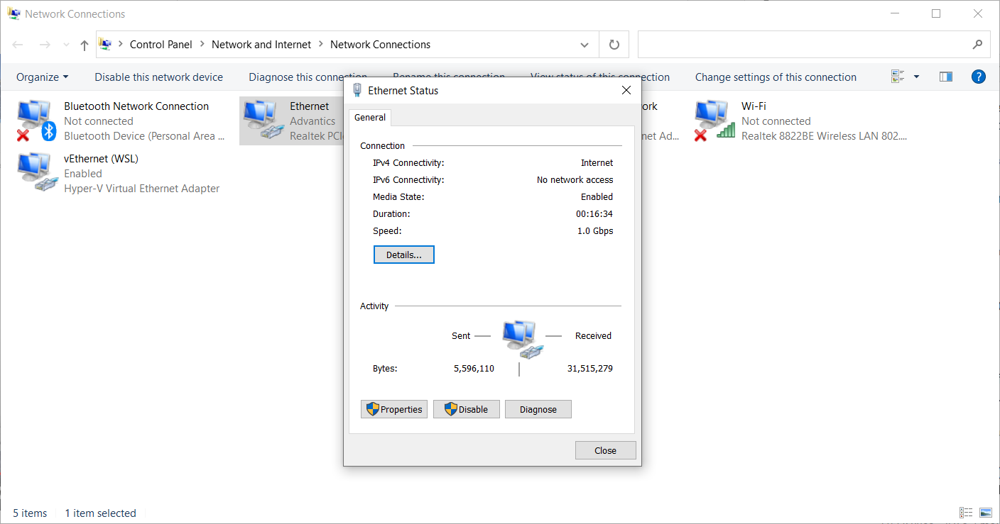
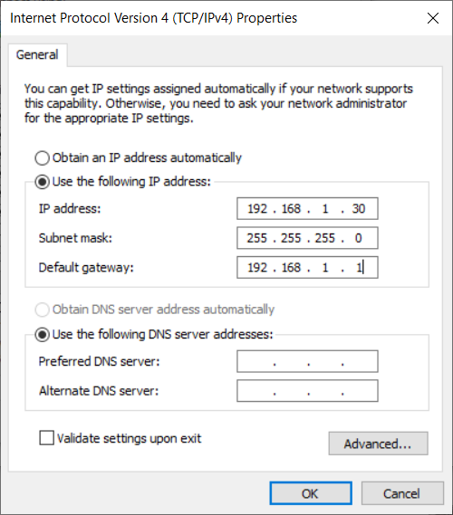
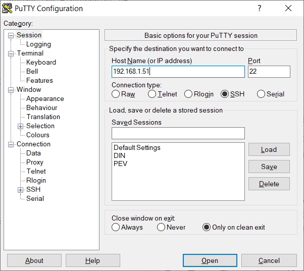

> [!UPDATE] {docsify-updated}
# Accessing the controller

The controller can be accessed in two physical ways: a UART port, and the ethernet RJ45 connector.

## SSH

An SSH server is running on the controller on the standard SSH port, 22. To access it is a matter of knowing the address of the controller.

In the present version, controllers are configured by default for a static IPv4 address:

<div class="small-table compact-table">

| Variant | Static IP | Submask | Gateway |
|---|---|---|---|
| **EVSE** | 192.168.1.51 | 255.255.255.0 | 192.168.1.1
| **PEV** | 192.168.1.49 | 255.255.255.0 | 192.168.1.1

</div>

> [!NOTE] This will change in the future with DHCP addressing by default

The following steps will help access the controller successfully:
<br/><br/>

1. Change the IP address of your system to a different IP address than the controllers. You can do that on Windows by opening "Ethernet Properties" then double-clicking "Internet Protocol Version 4 (TCP/IPv4)". Here you should choose an IP address, not in use by any device on the network.

    You can check that the IP address is not used by pinging it. It should be unreachable:
    ```bash
    $ ping <your IP address>
    ```
    

    The following example is for windows users:

    

    

    
<br/><br/>

2. Access the controller using ssh:

    - Open a terminal (on windows type cmd in the search bar) then use the following command with the IP address of the controller (in the following example it's the default address):

    ```bash
    $ ssh root@192.168.1.51
    ```

    - If you're connecting for the first time, you should accept adding the fingerprint of the controller to the known hosts list, by typing "yes" and pressing enter after this message is shown:

    

    > [!TIP]
    > The controller is also using the _Avahi/ZeroConf/Bonjour/mDNS_ protocol to advertise itself
    > on the network. In particular, the `_ssh._tcp_` service is broadcasted.
    >
    > So, in the simplest case you would just have to do:
    > ```bash
    > $ ssh root@advantics.local
    > ```

3. Access the controller using Putty:

    Download from here:  https://www.putty.org/

    To access the controller you simply need to introduce the IP address then click Open:

    

## Login

On controllers sold for development and prototyping, the login credentials are:

<div class="noheader-table small-table compact-table">

| * | *
|---|---
| **Login** | _root_
| **Password** | _dev-only_

</div>

For controllers meant for series production, the following hardening methods are available.

* Strong, randomized password initialized at first boot of the system after installation.
* Deactivated root account (ie. Ubuntu-like).
* SSH key provisioned on the system, and SSH password login restricted.

> [!ATTENTION]
> For series production, you will have to choose at least one of these methods. Advantics will
> refuse to provide series production orders with system having simple, always the same, default
password. Even if you don't plan to have the module connected to Internet.

## UART Console

The default console of the system is mapped to the UART port accessible through connector J4.

The UART console is available on All ADVANTICS charge controllers.

On the SECC:


On the EVCC:


On the Generic Controller:


<div class="noheader-table small-table compact-table">
<span>UART configuration</span>

| * | *
|---|---
| **Voltage** | 3.3V
| **Baudrate** | 115200 bauds/s
| **Parity** | None
| **Size** | 8 bits
| **Flow control** | None

</div>

> [!WARNING]
> This UART port works in **3.3 V only**. If you use another voltage you might damage the computer module!

You should use a so-called _"console cable"_ which will translate this 3.3 V UART to USB for
instance.

Once connected with suitable software (eg. __PuTTY__ on Windows, __screen__ on Linux) you will see all
system messages, in particular when the controller is booting up.

Jump to [Login](#Login) for the next step.

> [!TIP]
> A compatible console cable would be a TTL-232R-3V3 from FTDI. Wire it as such:
>
> <div class="small-table compact-table">
>
> | Cable pin | Cable color | Cable signal | J4 pin | J4 name on picture |
> | :---: | :---: | :---: | :---: | :---: |
> | 1 | Black | GND | 3 | GND |
> | 4 | Orange | TXD | 1 | IN |
> | 5 | Yellow | RXD | 2 | OUT |
>
> </div>
