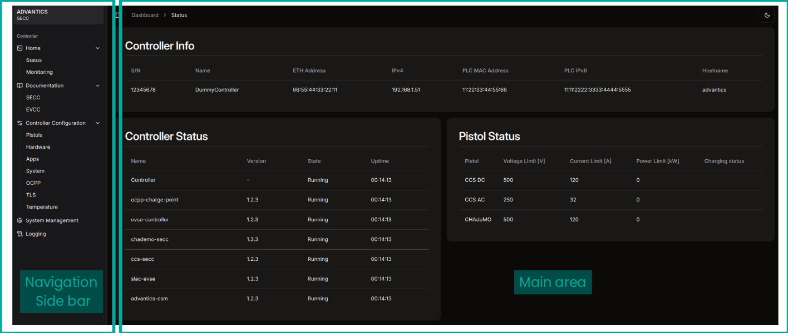
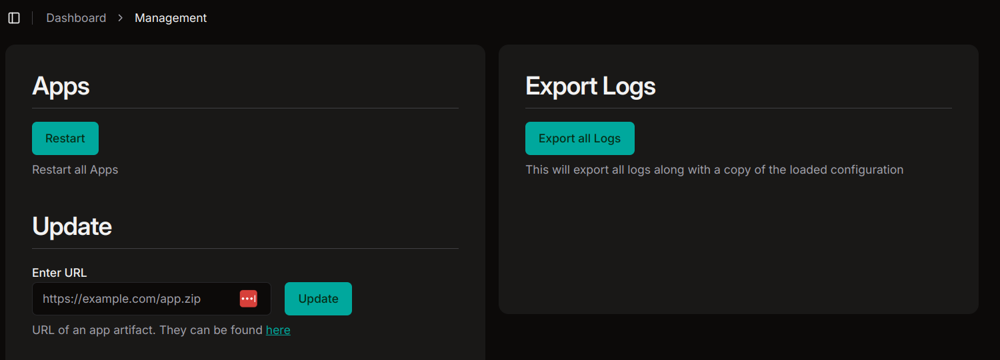

> [!UPDATE] {docsify-updated}

# ADVANTICS CSM Web UI

Advantics CSM stands for Advantics Controller System Manager and it is in charge of of system-level actions. It features a web interface where you can monitor and configure the system. The ultimate goal is to replace (for most of the users) the need for editing a config file and a command-line interface for accessing logs, managing apps and updating the system.

## Connecting to the CSM Web UI

The CSM Web UI is available at the IP address of the controller on port 80 and path `/dashboard`. You can access it by typing the controller's IP address in your web browser's address bar. ie. `http://192.168.0.51/dashboard` if you are using the controller's default IP address.

> [!IMPORTANT]
> The CSM Web UI should be only accessible from a safe private network.

## Introduction

The UI is divided into several sections:

- A collapsible sidebar on the left with links to navigate to different parts of the UI. Common to all pages.
- Main content area where the actual content is displayed

## Status page `/dashboard`

The main content shows:

- Controller Info: Serial number, name of the controller, ethernet mac address, ethernet ipv4 addres, PLC mac address, PLC ipv6 address, and the hostname.
- Controller Status: Shows the state of the applications as well as the uptime.
- Pistol Status: Shows the **enabled** pistols and their voltage, current and power limits that are currently set, as well as the point in the charging sequence that the pistol that is currently charging is in.

<figcaption style="text-align: center">CSM Web UI landing page</figcaption>

## Monitoring page `/dashboard/monitoring`

The main section displays a "Live Charts" plot where the stage of the charge and output voltage and current are shown. At the top of the  
plot the user can select which data to display and freeze the plot. Once the plot is frozen, the user can download the data in CSV format.

<figcaption style="text-align: center">CSM Web UI landing page</figcaption>

Right under the plot, the "Meters" widgets shows the current output voltage, output current and output power.

## System Management page `/dashboard/management`

This page is where the user can:

- Restart all apps. This will restart the docker containers, but not the hardware.
- Export the logs: Will generate a zip file with the logs of the controller and a copy of the config file.
- Update the controller software by providing a URL to a bundle file. The bundle file might include one or many applications to update.

<figcaption style="text-align: center">CSM Web UI landing page</figcaption>
<!--The URL with bundle files can be found in <!--TODO: add url-->

## Controller configuration page `/dashboard/configuration`

In this page the user can configure the controller, there are 7 main sections:

- Pistols: Enable or disable the pistols, set the voltage, current and power limits... [Docs](https://advantics.github.io/documentation/#/charge-controllers/secc_configuration?id=pistols)
- Temperature: Set how the system behaves with respect to the monitored temperature. [Docs](https://advantics.github.io/documentation/#/charge-controllers/secc_climate_control?id=climate-control)
- Applications: Set the verbosity of the logs. [Docs](https://advantics.github.io/documentation/#/charge-controllers/secc_configuration?id=applications)
- Hardware: Set what controls which digital inputs and outputs. [Docs](https://advantics.github.io/documentation/#/charge-controllers/secc_configuration?id=hardware)
- System: Config the ADVANTICS CSM app.
<!--TODO:--> CSM docs link
- Ocpp: Enable/disable OCPP, set the connection URL... [Docs](https://advantics.github.io/documentation/#/charge-controllers/secc_configuration?id=ocpp-configuration)

## Logging page `/dashboard/logs`

Real-time logs of the docker apps. The user can filter which applications to display and once again, export the logs along with a copy of the configuration file.

