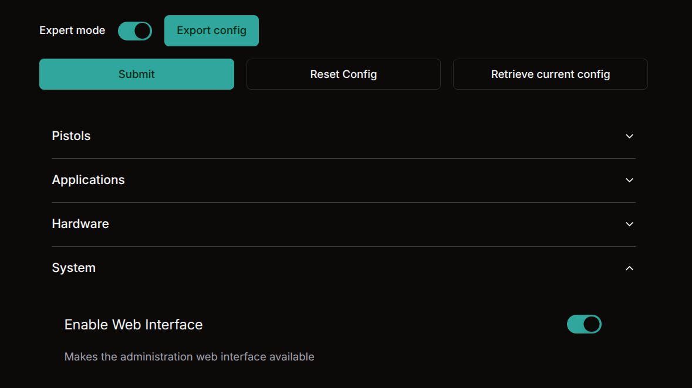

# Deployment Checklist for Charge Controllers

Before deploying a charge controller into production, please ensure the following steps are completed:

### 1. Change Default Password

For security reasons, **always change the default root password** before deployment. Using default credentials poses a serious risk. Prioritize using public key authentication for SSH access.

```bash
passwd
```

---

### 2. Enable Log Rotation

Unrestricted log growth can eventually consume all available disk space, leading to system instability or downtime. To prevent this, make sure **log rotation** for Docker. Recent controllers are already configured from factory.

- Ensure `/etc/docker/daemon.json` contains proper log rotation settings.

```json
{
  "log-driver": "json-file",
  "log-opts": {
    "max-size": "20m",
    "max-file": "10",
    "compress": "true"
  }
}
```

### 3. Disable CSM web interface

The CSM http interface is designed for development purposes and should be disabled in production.
You can disable in the web interface itself.



Or in the config file itself in the controller file system under the system section, set the `enable_web_interface` to false.

```
[system]

# enable_web_interface: bool
#       default: True
#       Makes the administration web interface available
enable_web_interface = True
```
