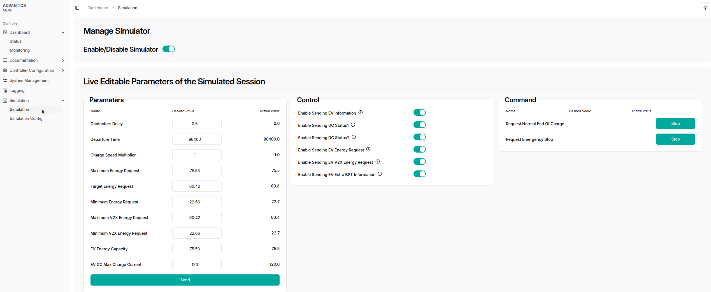

# PEV Simulation

    🚨 IMPORTANT: This feature is not included in the standard software stack and has to be purchased separately. Please contact <a href="mailto:sales@advantics.fr">sales</a> for more information🚨

The primary objective of this software is to simulate a battery and BMS on the EV charge controller, allowing users to observe and interact with the system without requiring an actual vehicle.

<!-- This feature is designed to simulate EV behavior in a controlled environment, making it possible to test various scenarios and vehicle responses during a charging session. -->

# UI

Simulation is primarily managed and controlled by the [CSM Web UI](charge-controllers/advantics_os/csm-web-ui.md). [Connect to your controller](charge-controllers/advantics_os/connecting) dashboard and head to `/dashboard/simulation`.

The interface allows enabling and disabling the simulator in real-time and editing parameters during a simulated charge session. It is divided into three main sections: **Parameters**, **Control**, and **Command**.

## Enabling the simulator

This switch enables or disables the simulation feature.

## Live Editable parameters

### **Parameters (Left Section)**

This section is a **form** where the user can adjust and observe various vehicle-related parameters. These include:

- **Contactors Delay**: The reaction time of the contactors for close/open commands.
- **Departure Time**: The departure time reported by the EV to the charger
- **Charge Speed Multiplier**: This parameter allows user to run the simulated charge session faster than real time. If this value set to 100, the simulated battery will charge 100 times faster. The elapsed time for the simulated session is indicated in the same page. When the charge speed multiplier is high, the charger can overshoot for discharge SoC because the time is faster for the battery and charger might not be able to reach that fast.
- **Energy Requests**: Maximum, Target, Minimum (including V2X-specific)
- **EV Energy Capacity**: The capacity of the simulated battery in kWh.
- **EV DC Max Charge Current**: Maximum allowed current for charging the battery.
- **EV DC Max Discharge Current**: Maximum allowed current for discharging the battery.

Each parameter has:

- A **"Desired Value"** field for user input.
- An **"Actual Value"** field that shows the currently applied value in the system.

Changes are only applied after the user clicks the **“Send”** button at the bottom of the section.

---

### **Control (Middle Section)**

This section provides toggle switches to **enable or disable sending of specific CAN messages** sent by the simulated BMS. These toggles can be used to test partial PEV Generic Interface v2 implementations by disabling the corresponding and giving control to the software under development. Each toggle controls sending of a specific message as listed below.

- **EV Information**: [EV_Information](https://advantics.github.io/documentation/#/charge-controllers/evcc_generic/can_v2?id=ev_information)
- **DC Status1**: [DC_Status1](https://advantics.github.io/documentation/#/charge-controllers/evcc_generic/can_v2?id=dc_status1)
- **DC Status2**: [DC_Status2](https://advantics.github.io/documentation/#/charge-controllers/evcc_generic/can_v2?id=dc_status2)
- **EV Energy Request** [EV_Energy_Request](https://advantics.github.io/documentation/#/charge-controllers/evcc_generic/can_v2?id=ev_energy_request)
- **EV V2X Energy Request** [EV_V2X_Energy_Request](https://advantics.github.io/documentation/#/charge-controllers/evcc_generic/can_v2?id=ev_v2x_energy_request)
- **EV Extra BPT Information** [EV_Extra_BPT_Information](https://advantics.github.io/documentation/#/charge-controllers/evcc_generic/can_v2?id=ev_extra_bpt_information)

These toggles apply immediately when switched and determine which data types the simulator sends to the system.

---

### **Command (Right Section)**

This section allows the user to trigger specific **vehicle-side events** using dedicated buttons:

- **Request Normal End Of Charge** – Simulates the vehicle requesting to end the charge normally.
- **Request Emergency Stop** – Simulates an emergency stop request from the vehicle.

Each action is performed by clicking the corresponding **“Stop”** button.

# HOW TO

## Simulating a bidirectional MCS charge session (ISO151180-20) with simulated charger and vehicle, using ADM-CS-SPCC, ADM-CS-MEVC and simulator software stack

1. Update the charge controller configuration for bidirectional power transfer. [Relevant Config Entries](https://advantics.github.io/documentation/#/charge-controllers/secc_generic/secc_bidirectional?id=relevant-config-entries)
2. Enable the [EVSE simulator](charge-controllers/charger-simulation#enabling-the-simulator) with sending all CAN messages enabled. The default simulation configuration can be used.
3. Enable the [PEV simulator](charge-controllers/vehicle-simulation#enabling-the-simulator) with sending all CAN messages enabled.
4. Make sure ADVANTICS vehicle controller configuration option [No BMS mode](charge-controllers/evcc_configuration/no_bms) is **disabled** (set to false).
5. Set the [relevant configuration entries in the vehicle controller](charge-controllers/evcc_bidirectional?id=relevant-config-entries) and [charge station controller](charge-controllers/secc_generic/secc_bidirectional?id=relevant-config-entries) for ISO151180-20.
6. Connect the plug.
7. Head to `dashboard/monitoring` and follow the charge session.

> [!NOTE]
> In case of charge session termination, please wait until the charge controllers go back to idle state before plugging in again.

> [!NOTE]
> In order to run a simulated charge session by using an ADVANTICS charge controller with simulator **on one side**, please make sure the controller on other side is configured to run a charge session without any real power delivered. 

# Hardware Wiring
If you prefer to wire a different hardware to one side of the simulator box, you can follow the connection table below:

### Power Connector

| Number | Label | Color |  
|--------|-------|-------|
| 1 | 24V | Red |
| 2 | GND | Black |

### CAN Bus Connector

| Number | Label | Color |  
|--------|-------|-------|
| 1 | CAN H | Brown |
| 2 | CAN L | Blue |
| 3 | CAN GND | Black |

### MCS Connector

| Number | Label | Color |  
|--------|-------|-------|
| 1 | CE | Orange |
| 2 | ID | White |
| 3 | PHY1 | Purple |
| 4 | PHY2 | Green |
| 5 | PE | Yellow/Green |

# Simulated EV Configuration Options

These configuration options control how the simulated EV interacts with the charger.

## `contactors_delay` (float)

- **Description:** Time (in seconds) that contactors take to respond to open or close commands.
- **Default:** `0.6`

## `maximum_energy_request` (float)

- **Description:** Maximum State of Charge (SoC) in percentage requested from the charger.
- **Default:** `100`
- **Range:** `0 - 100`

## `target_energy_request` (float)

- **Description:** Target SoC in percentage requested from the charger.
- **Default:** `80`
- **Range:** `0 - 100`

## `minimum_energy_request` (float)

- **Description:** Minimum SoC in percentage requested from the charger.
- **Default:** `30`
- **Range:** `0 - 100`

## `maximum_v2x_energy_request` (float)

- **Description:** Maximum SoC in percentage requested from the charger during a V2X session.
- **Default:** `80`
- **Range:** `0 - 100`

## `minimum_v2x_energy_request` (float)

- **Description:** Minimum SoC in percentage requested from the charger during a V2X session.
- **Default:** `30`
- **Range:** `0 - 100`

## `departure_time` (float)

- **Description:** Departure time of the EV sent to the charger, in seconds.
- **Default:** `86400` (24 hours)

## `charging_speed_multiplier` (float)

- **Description:** Multiplier for the simulated battery charging time, used to accelerate or slow down the simulation for observability. This parameter allows user to run the simulated charge session faster than real time. If this value set to 100, the simulated battery will charge 100 times faster. The elapsed time for the simulated session is indicated in the same page. When the charge speed multiplier is high, the charger can overshoot for discharge SoC because the time is faster for the battery and charger might not be able to reach that fast.
- **Default:** `1`

## `ev_battery_soc` (float)

- **Description:** Initial State of Charge (SoC) in percentage for the simulated battery. The SoC resets to this value between sessions.
- **Default:** `30`
- **Range:** `0 - 100`

## `ev_battery_capacity` (float)

- **Description:** Capacity of the simulated EV battery in kilowatt-hours (kWh).
- **Default:** `75.530`

## `ev_battery_min_voltage` (float)

- **Description:** Minimum voltage (in volts) of the simulated battery at 0% SoC.
- **Default:** `274`

## `ev_battery_max_voltage` (float)

- **Description:** Maximum voltage (in volts) of the simulated battery at 100% SoC.
- **Default:** `400`

## `ev_dc_max_charge_current` (float)

- **Description:** Maximum charging current (in amps) the EV can accept during DC charging sessions.
- **Default:** `120`

## `ev_dc_max_discharge_current` (float)

- **Description:** Maximum discharge current (in amps) the EV can accept during DC discharging sessions.
- **Default:** `120`

---

# Message Enable Flags

These options enable or disable specific EV-related messages sent by the simulator.

## `enable_ev_information` (bool)

- **Description:** Whether to enable the `EV_Information` message from the simulator.
- **Default:** `True`
- Message description: [`ev_information`](charge-controllers/evcc_generic/can_v2?id=ev_information)

## `enable_dc_status_1` (bool)

- **Description:** Whether to enable the `DC_Status1` message from the simulator.
- **Default:** `True`
- Message description: [`dc_status1`](charge-controllers/evcc_generic/can_v2?id=dc_status1)

## `enable_dc_status_2` (bool)

- **Description:** Whether to enable the `DC_Status2` message from the simulator.
- **Default:** `True`
- Message description: [`dc_status2`](charge-controllers/evcc_generic/can_v2?id=dc_status2)

## `enable_ev_energy_request` (bool)

- **Description:** Whether to enable the `EV_Energy_Request` message from the simulator.
- **Default:** `True`
- Message description: [`ev_v2x_energy_request`](charge-controllers/evcc_generic/can_v2?id=ev_energy_request)

## `enable_ev_v2x_energy_request` (bool)

- **Description:** Whether to enable the `EV_V2X_Energy_Request` message from the simulator.
- **Default:** `True`
- Message description: [`ev_v2x_energy_request`](charge-controllers/evcc_generic/can_v2?id=ev_v2x_energy_request)

## `enable_ev_extra_bpt_info` (bool)

- **Description:** Whether to enable the `EV_Extra_BPT_Information` message from the simulator.
- **Default:** `True`
- Message description: [`ev_extra_bpt_information`](charge-controllers/evcc_generic/can_v2?id=ev_extra_bpt_information)
