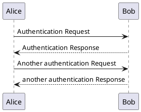
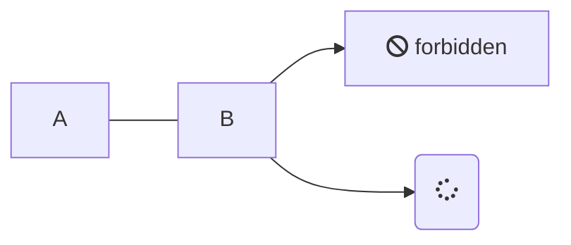

> [!UPDATE] {docsify-updated}

# Headline 1

> An awesome project?

# Language highlighting

```python
def test(a, b, c):
    return None
```

# PlantUML



# Mermaid



# Alerts

> [!NOTE]
> An alert of type 'note' using global style 'callout'.

> [!NOTE|style:flat]
> An alert of type 'note' using custom style 'flat'.

> [!TIP]
> An alert of type 'tip' using global style 'callout'.

> [!TIP|style:flat]
> An alert of type 'tip' using global style 'flat'.

> [!WARNING]
> An alert of type 'warning' using global style 'callout'.

> [!WARNING|style:flat]
> An alert of type 'warning' using global style 'flat'.

> [!ATTENTION]
> An alert of type 'attention' using global style 'callout'.

> [!ATTENTION|style:flat]
> An alert of type 'attention' using global style 'flat'.

> [!TIP|style:flat|label:My own heading|iconVisibility:hidden]
> An alert of type 'tip' using alert specific style 'flat' which overrides global style 'callout'.
> In addition, this alert uses an own heading and hides specific icon.

> [!COMMENT]
> An alert of custom type 'comment' using style 'callout' with default settings.
> (Should have been using an icon from FontAwesome).

# Side panels

<!-- panels:start -->
<!-- div:title-panel -->

  (...) - Awesome title

<!-- div:left-panel -->

  (...) - Awesome explanation

<!-- div:right-panel -->


  (...) - Awesome example

<!-- panels:end -->

# Glossary

We do complicated things to charge a battery with an EVCC , in cooperation with a BMS and a SECC .

# FontAwesome

:fas fa-home fa-fw:

# Wiki links

```markdown
[[README#Alerts| Alerts of this file]]
```

[[README#Alerts| Alerts of this file]]
