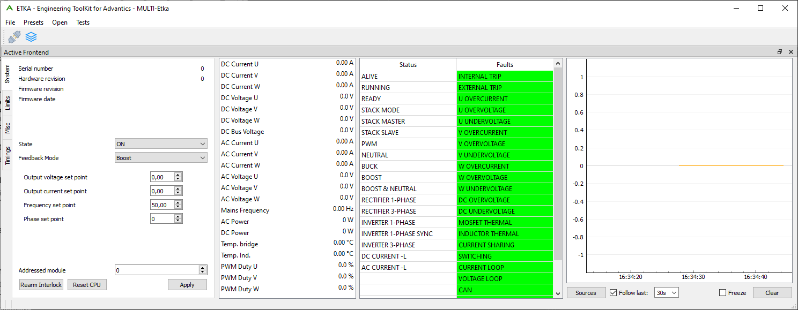

> [!UPDATE] {docsify-updated}
# Control

This chapter only deals with high-level control. Please consult the ADM-PC-BP25 Communication Manual for the CAN bus addresses and format. The CAN database is distributed in both KCD and DBC formats.

## ETKA

Engineering Toolkit for Advantics (ETKA), available for both Windows and Linux, consists of a series of applications and tools to work with ADVANTICS modules. ETKA is a GUI which together with a PeakCAN USB adapter allows customers to rapidly test and verify modules without writing any code.

<figcaption style="text-align: center">Figure 13: ETKA GUI application</figcaption>

## Start procedure

Every module comes with a bootloader which allows firmware update over CAN. The boot process starts once the module has been powered from a 24-V power supply and it takes approximately 5 seconds. After boot the module will start sending periodic status and measurement messages, and is ready to receive control commands.

### Step 1 – Clear interlock

Modules have two types of interlock signals: **internal** which is latched in a locked state until cleared, and **external** formed from combined internal interlock signals from all other modules on the bus. Internal signal is locked when the module goes outside of its operating range (e.g., over-current, over-voltage etc.). If any of the internal and external interlock signals is locked, the module will immediately stop and will not be able to operate.
When the module is power-cycled its internal signal is locked by default for safety reasons. This will also block all other modules on the bus as their external signal will be locked. Interlock state must be cleared for all modules that have their internal signal locked by sending the **Clear_Interlock** in **AFE_Fault_Control** message **exactly once**.
Some older modules cannot separate internal and external interlock signals. When any of these two is locked, they will report both of them locked. This **does not affect** the interlock clear logic.

### Step 2 – Configure setpoints

Each control mode comes with a list of setpoints required for proper operation. This is explained in more details in the **Control modes** section. Here we give a list of messages for setpoint control:
    - AFE_PWM_Duty_Control,
    - AFE_Current_Setpoint_Control,
    - AFE_Voltage_Setpoint_Control,
    - AFE_Frequency_Setpoint_Control,
    - AFE_Phase_Setpoint_Control,
    - AFE_Rectifier_Setpoint_Control.
Setpoints should be sent only when they need to be updated, i.e., they do not need to be sent periodically.

### Step 3 – Configure control mode

Configure control mode in **AFE_Mode_Control** message. Refer to the Control modes section for mode details on how each control mode works.
The module does not check if more than one control mode has been selected. It will start the first selected control mode from the following list:
    - PWM,
    - NEUTRAL,
    - DC_CURRENT (not supported),
    - BUCK,
    - BOOST,
    - BOOST_NEUTRAL,
    - AC_CURRENT_L (not supported),
    - RECTIFIER_1PH, 
    - RECTIFIER_1PH_BUCK,
    - RECTIFIER_3PH,
    - INVERTER_1PH,
    - INVERTER_1PH_BOOST,
    - INVERTER_1PH_SYNC,
    - INVERTER_3PH

### Step 4 – Start converter

Once setpoints and control mode have been configured, the converter can be started by setting **Converter_ON** in **AFE_Mode_Control**. The selected control mode must also be kept active in this message. Alternately, you can combine Step 3 and Step 4 in a single step by sending only one message with **Converter_ON** and selected control mode.
Once started, the converter will perform basic checks which depends on the selected control mode. For example, in the RECTIFIER_3PH control mode it will synchronize to the mains and check mains frequency to be 50 Hz or 60 Hz. Each voltage and current setpoint has associated rate limiter to provide smooth transitions, which is activated once the converter has been started.

### Step 5 – Stop converter

The converter is stopped by one of the following two events: (1) **Converter_ON** in **AFE_Mode_Control** is cleared, or (2) internal or external interlock signal is locked. In case of locked interlock signal, the fault must be cleared by setting **Clear_Interlock** in **AFE_Fault_Control** in order to able to continue operation.

## Periodic messages

The converter periodically sends status and measurement messages, with periodicity specified in the CAN database in milliseconds as **interval** parameter. Some of the messages are multiplexed, where **multiplex count** must also be used to decode the message.
All messages that start with an **underscore** are system-level messages and should be disregarded. Here is a list of system-level messages:
    - _AFE_Currents_Raw,
    - _AFE_Voltages_Raw,
    - _AFE_Calibration_Adc_Scale,
    - _AFE_Calibration_Adc_Fs,
    - _AFE_Calibration_Adc_Offset,
    - _AFE_Calibration_Adc_Gain.

### AFE_Identification [1000 ms]
Contains identification information for the device such as (1) device type, (2) stack position, (3) unique serial number, (4) hardware revision, and (5) hardware variant.

### AFE_FwInfo [1000 ms] – muxed
Module firmware revision and date-code information.

### Boot_FW_info_mux [1000 ms] – muxed
Bootloader firmware revision and date-code information.

### AFE_Debug [1000 ms]
Obsolete.
### AFE_Status [100 ms]
Indicates if converter is running and which control mode is currently active. Some of the bit fields are obsolete. Here is the list of **obsolete bit fields**:
    - Current_dc_loop_mode
    - Current_ac_loop_mode
    - Precharge_dc_buck_mode
    - Precharge_dc_boost_mode
    - Stack_mode
    - Master
    - Slave
    - Ready
### AFE_Faults [100 ms]
Indicates module fault source.
Some modules cannot separate internal and external interlock signals. When any of the two is locked, both of them are reported as being locked. This does not affect interlock clear logic.
### AFE_Currents [100 ms]
Phase current measurements for all three phases.
Measurements are heavily filtered at 1 Hz cut-off frequency to show only DC component.
### AFE_Voltages [100 ms]
Phase voltage measurements for all three phases. Also includes DC link voltage measurements.
Measurements are heavily filtered at 1 Hz cut-off frequency to show only DC component.
### AFE_Voltages_RMS [100 ms]
Phase voltage measurements for all three phases.
Shows only AC component as RMS measurement calculated in software from instantaneous measurements.
### AFE_Currents_RMS [100 ms]
Phase current measurements for all three phases.
Shows only AC component as RMS measurement calculated in software from instantaneous measurements.
### AFE_Mains [100 ms]
Estimated frequency and phase of the mains connected to phases as single-phase or three-phase.
### AFE_Temperatures [100 ms]
Bridge and inductors temperature.
### AFE_Setpoints_PWM_Duty [100 ms]
Duty cycle currently applied to three phases.
### AFE_Setpoints [100 ms]
Obsolete.

## Other control messages
Some of the control messages are system-level messages or obsolete. Here is a list of messages:

    - AFE_Stack_Control
    - _AFE_ADC_Calibration_Mode
    - _AFE_ADC_Calibration_Setpoint
    - _AFE_Calibration_Offset_Update
    - _AFE_Calibration_Scale_Update
    
### AFE_Voltage_Limits
Used to set custom voltage limits for three phases and DC link. This is software protection and is usually much slower than the hardware protection which is always active.
### AFE_Current_Limits
Used to set custom current limits for three phases. This is software protection and is usually much slower than the hardware protection which is always active.

## Control modes

AFE can operate in many different control modes, which includes both AC and DC applications. Some applications require a proper precharge to be done before connecting sources to the module. This is true whenever voltage source connected to three phases is of higher voltage than the DC link, which is in all applications that include boost and rectifier control modes. Otherwise, a permanent damage to the device might occur which will not be visible at first but it will definitely cause MOSFET failure.
Setpoints are configured as follows:

    - Duty cycle setpoint in **AFE_control** message
    - Voltage setpoint in  **AFE_Voltage_Setpoint_Control** message, and **Voltage setpoint (2)** in **AFE_Rectifier_Setpoint_Control** message
    - Current setpoint in **AFE_Current_Setpoint_Control** message, and **Current setpoint (2)** in **AFE_Rectifier_Setpoint_Control** message
    - Frequency setpoint in **AFE_Frequency_Setpoint_Control** message. It cannot be changed once the converter has been started
    - Phase setpoint in **AFE_Phase_Setpoint_Control** message. It cannot be changed once the converter has been started

### PWM
Directly sets duty cycles for each phase. This is for testing purposes only and should never be used by customers!
### Neutral
The three phases must be shorted and voltage source connected to the DC link. Input side is defined to be the DC link, and output side to be the three phases. It generates voltage in open-loop on the output that is 50% of the input voltage.
This control mode is usually used together with other modules operating in the Inverter 1-phase Sync. control mode. When frequency setpoint is configured it generates synchronization pulses for modules operating in the Inverter 1-phase Sync. control mode. The frequency setpoint cannot be changed once converter has been started.
### Buck
The three phases must be shorted and voltage source connected to the DC link. Input side is defined to be the DC link, and output side to be the three phases. Positive current direction is from the input to the output.
Voltage setpoint corresponds to the output voltage reference. Current setpoint corresponds to the total output current, where total means the three phases combined.
### Boost
The three phases must be shorted and voltage source connected to the three phases. Input side is defined to be the three phases, and output side to be the DC link. Positive current direction is from the input to the output.
This application requires precharge to be implemented!
Voltage setpoint corresponds to the output voltage reference. Current setpoint corresponds to the total input current, where total means the three phases combined.
### Boost & Neutral
The voltage source is connected to shorted L1-L2 phases. Input side is defined to be the two phases L1-L2, and output side to be the DC link. Positive current direction is from the input to the output.
This application requires precharge to be implemented!
Neutral is generated in open-loop on phase L3 as 50% of the DC link voltage. This control mode is usually used with another module operating in Inverter 3-phase control mode in order to generate a symmetrical three-phase voltage with neutral from low-voltage DC source.
Voltage setpoint corresponds to the output voltage reference. Current setpoint corresponds to the total input current, where total means the two phases combined.
### Rectifier 1-phase
AC voltage source is connected between phases L2 and L3, either line-to-neutral or line-to-line. Phase L1 is unused in this control mode. Input side is defined to be the two phases L2-L3, and output side to be the DC link. This control mode is still in experimental stage!
This application requires precharge to be implemented!
Voltage setpoint corresponds to the output voltage reference. Current setpoint corresponds to the total input RMS current limit and must be greater than zero, where total means single phase.
### Rectifier 1-phase & Buck
AC voltage source is connected between phases L2 and L3, either line-to-neutral or line-to-line. Battery is connected to the phase L1. Input side is defined to be the two phases L2-L3, and output side to be the DC link. This control mode is still in experimental stage!
This application requires precharge to be implemented!
Voltage setpoint corresponds to the output voltage reference. Current setpoint corresponds to the total input RMS current limit and must be greater than zero, where total means single phase.
Voltage setpoint (2) corresponds to the phase L1 voltage reference. Current setpoint (2) corresponds to the phase L1 current limit, where positive current direction is from the DC link to the phase L1.
### Rectifier 3-phase
Symmetrical three-phase AC voltage source is connected to the three phases. Input side is defined to be the three phases, and output side to be the DC link.
This application requires precharge to be implemented!
Voltage setpoint corresponds to the output voltage reference. Current setpoint corresponds to the total input RMS current limit and must be greater than zero, where total means the three phases combined.
### Inverter 1-phase
Voltage source is connected to the DC link. It generates sine-wave voltage in open-loop on phases L1 and L3 with 180° phase shift, and 50% of the DC link voltage on phase L2 (neutral).
Voltage setpoint corresponds to the phase RMS voltage reference. Current setpoint corresponds to the phase RMS current limit and must be greater than zero. Frequency setpoint corresponds to the sine-wave frequency.
### Inverter 1-phase & Boost
Voltage source is connected to the phase L1. It generates sine-wave voltage in open-loop on phases L2 and L3 with 180° phase shift.
This application requires precharge to be implemented!
Voltage setpoint corresponds to the output RMS voltage reference. Current setpoint corresponds to the phase RMS current limit and must be greater than zero. Frequency setpoint corresponds to the sine-wave frequency.
Voltage setpoint (2) corresponds to the DC link voltage reference. Current setpoint (2) corresponds to the phase L1 current limit, where positive current direction is from the phase L1 to the DC link.
### Inverter 1-phase Sync.
Voltage source is connected to the DC link. The three phases must be shorted. It generates a sine-wave voltage in open-loop on the three phases. Input side is defined to be the DC link, and output side to be the three phases.
Voltage setpoint corresponds to the output RMS voltage reference. Current setpoint corresponds to the total output RMS current limit and must be greater than zero, where total means all three phases combined. Frequency setpoint corresponds to the sine-wave frequency. Phase setpoint corresponds to the phase shift with respect to the synchronization signal.
This control mode is usually used with another module operating in the Neutral control mode which generates a synchronization signal for the specified sine-wave frequency.
### Inverter 3-phase
Voltage source is connected to the DC link. Input side is defined to be the DC link, and output side to be the three phases. It generates a three-phase sine-wave voltage in open-loop on output with 120° phase shift. It is usually used with another module operating in the Boost & Neutral control mode which provides neutral line.
Voltage setpoint corresponds to the output RMS voltage reference. Current setpoint corresponds to the output (per-phase) RMS current limit and must be greater than zero. Frequency setpoint corresponds to the sine-wave frequency.