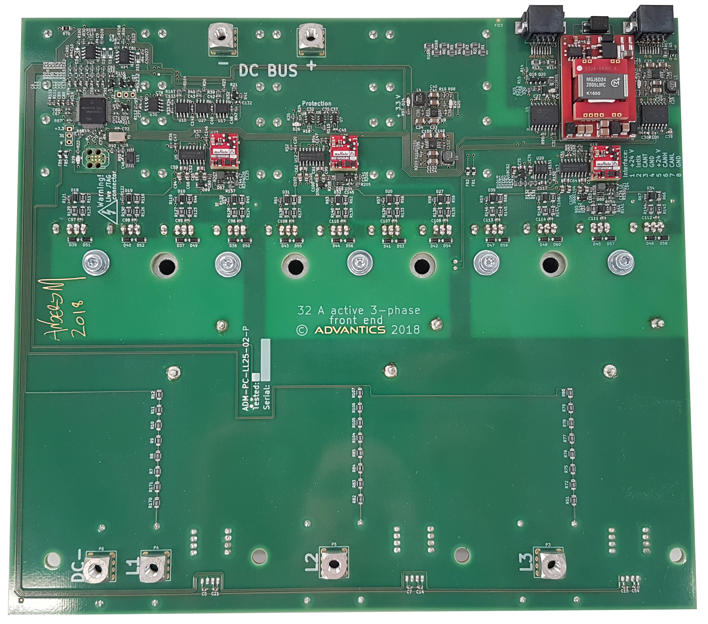

> [!UPDATE] {docsify-updated}
# Installation

[installation.md](../common/installation_unpacking.md ':include')

<figcaption style="text-align: center">ADM-PC-BP25 top view</figcaption>

## Cooling considerations

For a correct operation, sufficient cooling is needed. **Never run the module without a heatsink attached!** The thermal protection might not react fast enough, if the transistor bar is not cooled.
The power modules are designed to be installed on a flat metallic cooling surface. The module can output up to 750 W of heat through the aluminium bar and inductors. This heat needs to be evacuated through the user-supplied metallic plate. It is possible to use either forced aircooled heatsink or a watercooled plate. Consult the details of your implementation with ADVANTICS for cooling design verification. Pre-drilled heatsinks for module verification are also offered for rapid prototyping.

There are four cooling surfaces on this module – three inductors and one transistor bar. Inductors should be cooled with a good conducting silicone that cures/solidifies. The transistor bar should be cooled with a thermal paste. Consult with the [Recommended accessories](#recommended-accessories) subsection for the list of recommended materials. 

>[!TIP] For a short tests of the module, cooling the inductors may not be needed, but the module still needs to be mounted on a heatsink. In this case, please verify the temperature of inductors through the CAN message or with ETKA software. 

<figcaption style="text-align: center">Module attached to heatsink with silicone under inductors</figcaption>

## Drawings

The following figures show the main mechanical dimensions four mounting of the module.

<figcaption style="text-align: center">Bottom view</figcaption>

<figcaption style="text-align: center">Top view</figcaption>

## Mounting and assembly procedure

### Recommended accessories <!-- {docsify-ignore} -->
- ACC Silicone AS1803
- Thermal paste
- Screw ISO 14579 M5 x 55
- Screw BN 10649 M5 x 8
- Plastic stud (spacer) Thora AB-IA-M5-SW10, AR.N: 100 32 47
- Washer DIN 7980 5 mm
- Washer DIN 433 5.3 mm
- Tool: Screwdriver bits ¼”, Torx, Size X25

<figcaption style="text-align: center">Recommended accesories</figcaption>

### Process <!-- {docsify-ignore} -->
1. Clean the surface of the cooler (degrease).
2. Place plastic stud (spacer) Thora AB-IA-M5-SW10, AR.N: 100 32 47 into the holes of the cooler.
3. Place the ACC silicone on the top of magnetic components (approx. 5 mm thick).
4. Place thermal paste on the cooling bar on the module.

<figcaption style="text-align: center">Steps 1,2,3,4</figcaption>

5. Place the module on the cooler.

<figcaption style="text-align: center">Step 5</figcaption>

6. Place screws with washers into the holes.

<figcaption style="text-align: center">Step 6</figcaption>

7. Apply initial tightening torque on screws. Torque A: 0.5 Nm (Plastic studs), Torque B: 2.5 Nm (Aluminium base)

>[!WARNING] Torque B is necessary to be applied again after the first heat up cycle. Make sure the circuit is off, cooled down and free from any 
residual current, then repeat tightening OF ALL screws.)

<figcaption style="text-align: center">Example of final assembly of power wires and power terminal screws</figcaption>

[installation.md](../common/installation_cabling.md ':include')

## 3-port connection

In DC/DC modes, the ADM-PC-BP25 should be connected as a 3-port device. This means that only one of the two "DC-" terminals should be used, even though for readability both are used in schematics througout the user manual.

A proper connection would be as in the picture below:

<figcaption style="text-align: center">Example of 3-port connection</figcaption>

## Protection hardware

If desired, the user may install diodes for extra protection as in the picture below:

<figcaption style="text-align: center">Example of placement for protection diodes</figcaption>

ADVANTICS recommends the DD180N16S diode or an equivalent.
