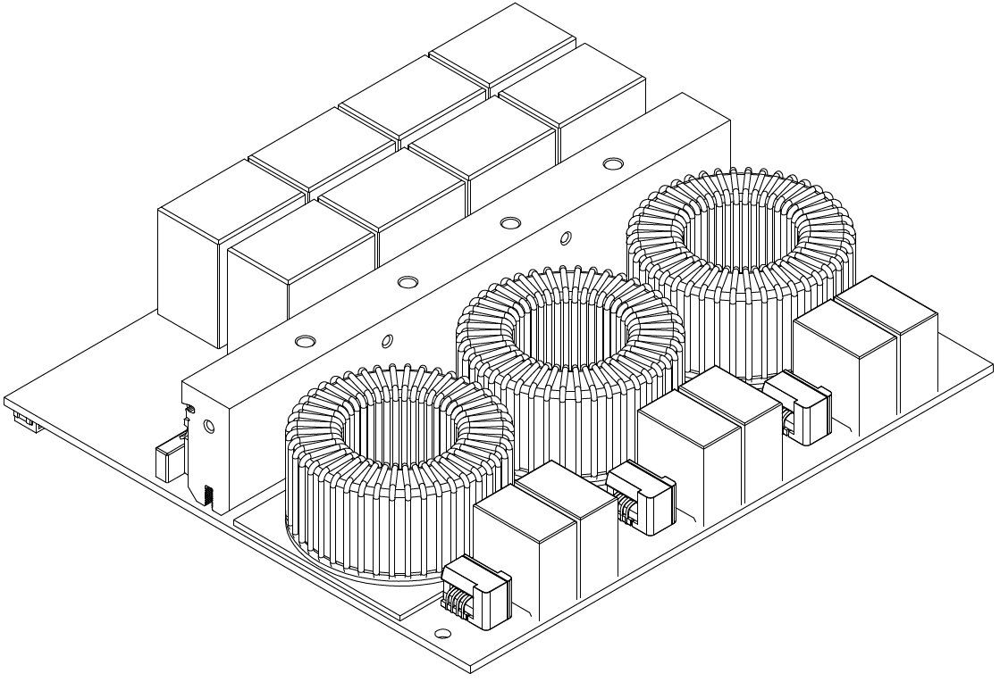

> [!UPDATE] {docsify-updated}
# Introduction

The ADM-PC-BP25 is a power converter with integrated controller and CAN bus interface. The main features are:

    - 3-phase Silicon Carbide bridge
    - Hard-switched, non-isolated topology
    - Fully bidirectional power flow
    - High frequency switching
    - Advanced DSP control
    - Flat mounting surface – compatible with extruded heatsinks and watercooling

## Who is this product for?

Manufacturers of power electronics equipment (EV chargers, test gear, battery powered systems), system integration companies, looking to build rescue vehicles for electric cars, high power DC and AC charging systems, grid storage, solar and other renewable sources and hydrogen fuel cell applications.

## Electrical and mechanical specifications

Please see the Specification Sheet for ADM-PC-BP25 for electrical and mechanical details.

<figcaption style="text-align: center">Figure 1: Drawing of the power module</figcaption>

## Communication protocol

Please see the software development guide for ADM-PC-BP25 for details.

