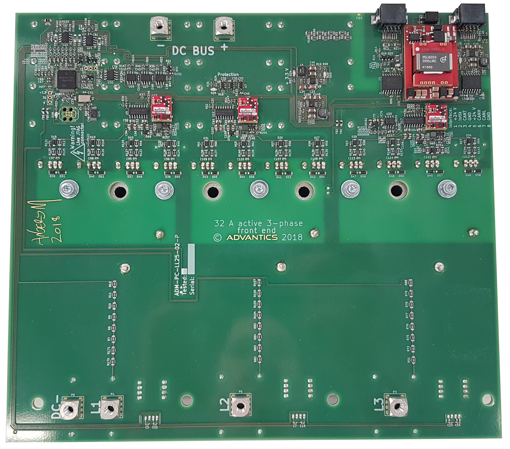
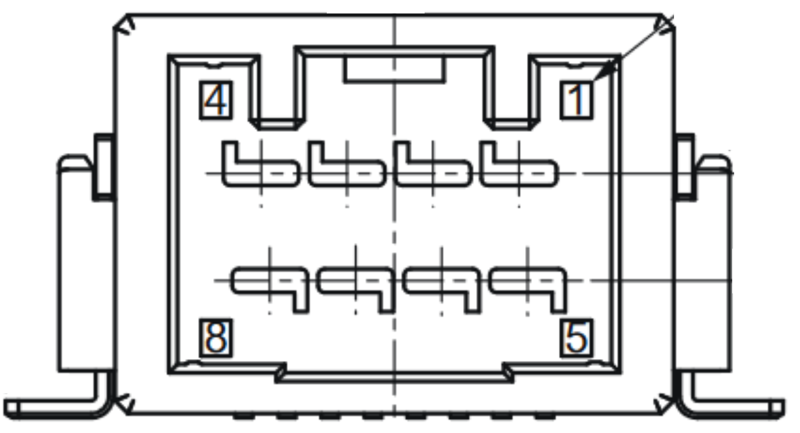
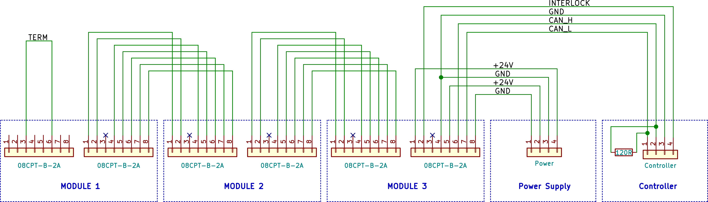
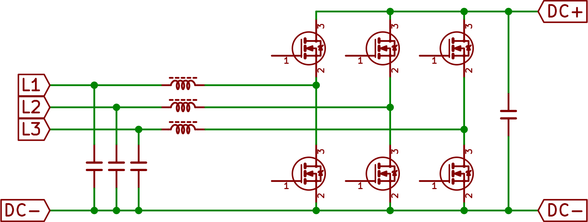
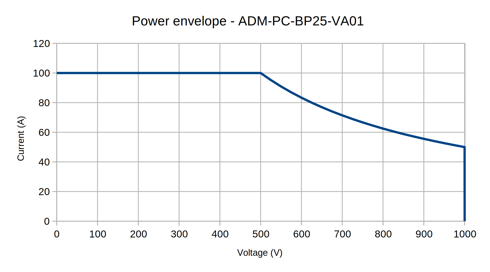
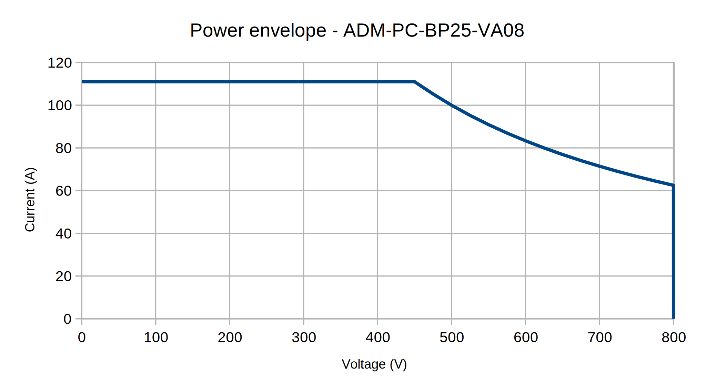

> [!UPDATE] {docsify-updated}
# Usage

## Typical use case

Typical use cases include:

    - 3-phase Power Factor Correction (PFC)
    - 3-phase grid-tied inverter (on-line)
    - 1-phase off-grid inverter
    - 3-phase off-grid inverter
    - DC/DC (bidirectional Buck)
    - DC/DC (bidirectional Boost)
    - Hybrid modes (individual phase control, generating inverter + boost..)
    - Fixed voltage ratio

For more use case examples, please see the ADM-PC-BP25 flyer, and discuss other possibilities with ADVANTICS.

## Form factor

All the ADVANTICS power modules from the MCP-25 series share a similar mechanical and electrical form factor. For example every module fits on a 300 mm wide heatsink, the height is chosen such that a space from the module base to the top of the module is always maximum 70 mm – allowing the customer to reuse the same cooling and housing concept for every MCP-25 series power converter.
Some of the common features are:
    - The narrowest X-Y dimension is less than 300 mm
    - The height of the module is less than 70 mm
    - The power inputs and outputs use M5 threaded screw terminals
    - The communication interface uses 8-pin JST CPT connector
    - Each power module have at least one (optimally two) communication interface connectors
    - All mounting screws holes for mounting to the heatsink are designed for 5 mm screws
    - 24V powered

<figcaption style="text-align: center">Figure 2: ADM-PC-BP25 top view</figcaption>

## Communication interface and power supply

All ADVANTICS modules have a common interface for control and readout. The interface consists of a CAN bus for control and status reporting, and an interlock line (INTLK) for safety. Additionally, the interface connectors also include power distribution for the control section of the modules. Each module is provided with two interface connectors that are completely identical in pinout, allowing chaining of the modules without using branched cables or a distribution hub.

<figcaption style="text-align: center">Figure 3: Example of a power module with two interface
connectors</figcaption>

### Connectors

The interface connector mounted on every power converter is an 8-pin CPT series connector, manufactured by JST: 
The connectors used for the interface are JST CPT series automotive connectors with a latch. The modules use the SM08B-CPTK male connector, and the mating female connector is model number 08CPT-B-2A. The pins used for the female connector are part number SCPT-A021GF-0.5, which can be crimped using the WC-CPT021 crimping tool. These terminals are made for use with 22 AWG (0.3 mm2) wire with an outer diameter of 1.4 mm. The wires for each connector should be bundled tightly together, to reduce the amount of electrical noise picked up from the environment. Unshielded communications cables should not be near the power wiring. CAN bus High and Low should be twisted (form a twisted pair).
JST CPT product page: https://www.jst-mfg.com/product/detail_e.php?series=477

<figcaption style="text-align: center">Figure 4: Pintout of the CPT-connector pins 1-8</figcaption>

<figcaption style="text-align: center">Figure 5: JST CPT crimping tool WC-CPT021</figcaption>

| JST CPT pin | Name | Description |
| ----------- | ----------- | -----------|
|1 | +24V power | Interface and control power |
|2 | Interlock | Open collector, 24V pullup |
|3 | Termination | See CAN bus termination|
|4 | Signal ground | Interface ground |
|5 | +24V power | Interface and control power |
|6 | CAN HIGH | Twisted pair between 6,7 |
|7 | CAN LOW | Twisted pair between 6,7 |
|8 | Signal ground | Interface ground |

### Chaining

The total end-to-end wire length of the network should not exceed 10 m with multiple power modules installed. The CAN standard specifies up to 100m  end-to-end cable length, but in an environment with high noise and multiple connection stubs, this figure is too high. In larger systems it can be beneficial (or even necessary) to split up the modules into several separate CAN networks. Consult with ADVANTICS, if you’re planning to deploy large network (more than 24 nodes).

<figcaption style="text-align: center">Figure 6: An example of a 1:1 chaining cable</figcaption>

<figcaption style="text-align: center">Figure 7: Chaining and termination diagram</figcaption>

### CAN bus

The communication with ADVANTICS power modules is realized over CAN bus 2.0B, with data rate of 500 kbit/s and extended addressing. Please see the ADM-PC-BP25 Communication Manual for the protocol description. 
Up to 32 modules of the same type can be chained, limited by the available addresses. The modules of different type do not collide with each other on the addresses.

### CAN bus termination

CAN bus termination is necessary for correct operation. To ensure stable communications and good noise margin, no more or less than two termination resistors should be present on the CAN bus, ideally at each end of the chain. If the CAN bus is branched, the termination resistors should be placed at the two points farthest away in the chain, and unterminated branches should be kept at minimum length.

The power module contains an on-board CAN termination resistor per each CPT connector, which can be activated by bridging pins 6 and 3 of the CPT connector with a simple wire (shown on the chaining diagram). The wire used to bridge pins 6 and 3 should be as short as possible to minimize noise pickup, less than 5 cm.

### Interlock line

The interlock pin on the interface connector is used to put the system in a safe state, independent of the CAN communications, for user safety and in case of faults. The interlock line is normally pulled high by pull-up resistors to +24 V on each individual modules, and any module can pull the line low to put the whole system in a safe state (that is, to trigger the system-wide interlock). Each module has 4k7 Ohm pull-up resistor. Interlock is latching from the module causing it – it will be unlatched by the CPU request (CAN bus request from the user system). Other modules in the system will not latch external interlocks, they will simply act upon them. Interlock is purely HW-based system, using logic gates and comparators. The CPU cannot overrule the interlock.

> [!TIP]
> All modules starts with tripped interlock after reset.
> The user must request interlock clear over the CAN bus. Otherwise the module cannot be started.

### Interface power supply

Control power for the modules is nominally +24 V DC. Upper and lower limits and maximum current draw are given in the Specification Sheet. Two pins each are used for +24 V and ground to minimize voltage drop across the wires in installations with a large number of modules and/or long wiring. When planning the communications chain, ensure that no single connector is carrying more than 3 A in total, given the worst-case current requirement of the individual modules. Note that in larger installations, the voltage drop across the wires can be significant, and this will affect the supply voltage of the individual modules.

Voltage drop across the communications ground wires will change the apparent logic levels at each module. Ensure that the voltage drop between any two modules does not exceed 1 volt. The nominal resistance of the recommended wire is 50 milliohms per meter. Two wires are used in parallel for ground, giving a total ground resistance of 25 milliohms per meter.

### Power terminals

The power modules use press-fit PCB terminals for connecting the power cables or bus bars. The thread is M5, and the maximum length of a screw can be 6 mm, measured from the top of the terminal. It is possible to use a longer screw, for example when a bus bar or lug terminal are made from a very thick metal. But always make sure the length of a screw protruding in the PCB terminal is less than 6 mm. Whether a wire or bus bar is used, it is absolutely essential that no constant force sideways is applied on the terminal. Design bus bars with stress reliefs and secure the cables to prevent excessive force or vibrations on the terminals.

> [!WARNING]
> If a longer screw is used, it will push against the PCB as it is screwed in, pulling the terminal out of the PCB. 
> If this happens, the converter will be destroyed, and warranty voided. Press-fit terminals cannot be re-fitted (or soldered) after they’ve been pulled! 

<figcaption style="text-align: center">Figure 8: The press-fit power terminal drawing</figcaption>

## Theory of operation

### Topology

The ADM-PC-BP25 is a 3-phase Silicon Carbide bridge, with individual phase chokes. Up to 1000 V DC bus operation is possible (depending on the product variant).

<figcaption style="text-align: center">Figure 9: ADM-PC-BP25 converter topology</figcaption>

The topology is inherently bidirectional. A DSP (Digital Signal Processor) is used to control the individual transistor pairs directly – allowing for very versatile control modes and strategies. To understand how can the converter be used as a DC/DC, imagine all three phases (L1, L2, L3) being connected in parallel using an external wiring. In case of a DC/DC, all phases will then produce (almost) constant duty cycle, resulting in a controlled boost/buck topology. Each phase is then offset by 120 degrees, for the lowest current and voltage ripple.

### Protection mechanisms

#### Overcurrent (L1,L2,L3) protection

The overcurrent protection has three levels. HW, FW and SW. The HW protection is set to +-85 Amps per phase. It is instantaneous, using window comparators and logic, and is fully independent of the digital signal processor firmware. The FW protection is set to +-80 Amps and is verified on low-pass filtered signal with BW of approximately 5 Hz. SW protection works on the same level as FW protection, but is user-adjustable over CAN bus.

#### Overvoltage protection

Similarly there is a three level overvoltage protection on the DC bus. The limit is set to 860 V (VA08 variant) and 1060 V (VA01 variant), is instantaneous, using comparators and logic, and is fully independent of the digital signal processor firmware. A voltage exceeding this level will cause a converter shutdown. Customer should be aware that the module has no means of protecting itself if excessive voltage is presented on its input. Excessive voltage will destroy the switching devices. The L1, L2, L3 voltages only provides SW protection for user’s convenience, as the phase voltages are always lower or equal to the DC bus voltage.

#### Passive high voltage discharge

The module has a slow internal bleeding circuit for capacitor discharge. The purpose of this bleeder is to remove any residual voltage on the terminals when the converter is not operating. This bleeder is not a safety feature meant to protect users from dangerous voltages. It can take more than 4 minutes for the internal bleeder to drop capacitor voltage to a safe level. If safety bleeding is required, it must be implemented externally (for example by using low ohmic power resistor and a DC contactor).

### Limits

When talking about similar topologies, there are four main limiting aspects – the voltage, current, power and temperature. Since the converter can be used in many different ways, the way how limits are considered also changes. To make understanding these limits easier, always think of limits per phase (even if they are connected in parallel).

#### Voltage limit

The voltage limit is the simplest to consider. The switching devices have blocking voltage defined (1000 V for VA08 variant, and 1200 V for VA01 variant). The maximum allowed voltage is then derated by 200V for each variant - that is to 800 V and 1000 V respectively. The module will not allow the user to exceed these limits. The absolute value of the voltage will have an impact on the maximum power available – as switching losses increase slightly with the bus voltage. But in general, having higher voltage on both sides of the converter results in higher power available, and higher efficiency.

> [!WARNING]
> The module is equiped with HW protections that will shut down the converter if the limits are exceeded. 
> But the module cannot protect itself against voltages applied on its terminals. Make sure that the applied voltage is within the operational limits

#### Current limit

Always consider current limit in the sense of phase currents. When the module is used as a DC/DC, the total current limit is 100 A for VA01 variant – resulting in maximum phase current of 33 A. When the module is used as a 3-phase power factor correction unit, the phase current is actually an AC current - expressed in Amps RMS. Therefore the phase limit will appear lower (30 A per phase for VA01 variant), as the module has to proccess much higher peak currents (42.5 A).

#### Power limit

The maximum power at given low side (phase) voltage and low side (phase) current is calculated as max phase current times phase voltage. For very high values of the phase voltage the total transistor dissipation becomes the limiting factor. The maximum power is set to 50 kW. The power envelope is actually much more complicated, as it depends on bus voltage to phase voltage ratio, output current and the duty cycle, as well as on current shape (AC vs DC). Consult the details with ADVANTICS, if you’re not sure your application fits within the power capabilities.

<figcaption style="text-align: center">Figure 10: Power envelope of the variant VA01</figcaption>

<figcaption style="text-align: center">Figure 11: Power envelope of the variant VA08</figcaption>

#### Thermal limit

There are two temperature sensors installed in the module. The inductor temperature sensor, and the bridge temperature sensor (also call as transistor bar sensor). Both sensors report the current temperature over the CAN bus (in degrees Celsius). The shutdown temperature of the transistor bar sensor is 80 °C. The shutdown temperature of the inductor temperature sensor is 130 °C.
Care must be taken to not operate the module near the temperature limits, as it will reduce the lifetime of the unit.

> [!WARNING]
> It is not always practical to implement derating on the module level. In applications where the module is just one of the power stages, derating has no meaning - if the power delivery dropped, the voltage would collapse and downstream power converters would simply attempt to extract power by drawing more current, further collapsing the voltage. Therefore on default the module does not derate – it will simply shut down when maximum temperature is exceeded. A high-level system must implement derating strategy, if such feature is needed by the application.

## Cooling considerations

For a correct operation, sufficient cooling is needed. **Never run the module without a heatsink attached!** The thermal protection might not react fast enough, if the transistor bar is not cooled.
The power modules are designed to be installed on a flat metallic cooling surface. The module can output up to 750 W of heat through the aluminium bar and inductors. This heat needs to be evacuated through the user-supplied metallic plate. It is possible to use either forced aircooled heatsink or a watercooled plate. Consult the details of your implementation with ADVANTICS for cooling design verification. Pre-drilled heatsinks for module verification are also offered for rapid prototyping.
There are four cooling surfaces on this module – three inductors and one transistor bar. Consult with the Assembly Manual for ADM-PC-BP25 for the list of required materials and the assembly procedure.

<figcaption style="text-align: center">Figure 12: Heat flow path</figcaption>