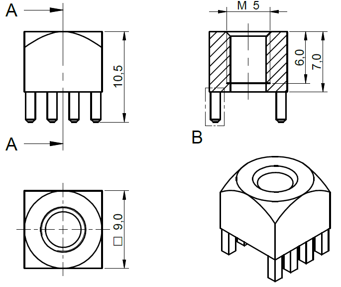

### Power terminals<!-- {docsify-ignore} -->
The power modules use press-fit PCB terminals for connecting the power cables or bus bars. The thread is M5, and the maximum length of a screw can be 6 mm, measured from the top of the terminal. It is possible to use a longer screw, for example when a bus bar or lug terminal are made from a very thick metal. But always make sure the length of a screw protruding in the PCB terminal is less than 6 mm. Whether a wire or bus bar is used, it is absolutely essential that no constant force sideways is applied on the terminal. Design bus bars with stress reliefs and secure the cables to prevent excessive force or vibrations on the terminals.

> [!TIP] **Recommended screws:** Screw ISO 14583-2011 M5 x 6 mm.
>
> **Recommended tightening:** 1 Nm, max. 2.2 Nm!

> [!WARNING]
> If a longer screw is used, it will push against the PCB as it is screwed in, pulling the terminal out of the PCB. 
> If this happens, the converter will be destroyed, will be a safety hazard, and warranty voided. Press-fit terminals cannot be re-fitted (or soldered) after they’ve been pulled! 

<figcaption style="text-align: center">Figure 8: The press-fit power terminal drawing</figcaption>

### Power wiring <!-- {docsify-ignore} -->
It is recommended to lead the wires by the shortest way out from PCB and avoid crossing and touching the PCB of the source module or any other module.

Advantics recommends RADOX® cables from the company HUBER+SUHNER. Guidelines on which cable can be used are possible to see in document “Current carrying capacity of RADOX® 125 single core and multi core cables”.

Assembly engineer needs to take into account the final number, position, cover of cables and ambient temperature to choose the correct cross-section. These rules are recommended for cables longer than 5 cm. Shorter cables can be be used with smaller cross section due to cooling effect of the M5 press-fit power terminals.

### Communication terminal and wiring<!-- {docsify-ignore} -->
All ADVANTICS modules have a common interface for control and readout. The interface consists of a CAN bus for control and status reporting, and an interlock line (INTLK) for safety. Additionally, the interface connectors also include power distribution for the control section of the modules. Each module is provided with two interface connectors that are completely identical in pinout, allowing chaining of the modules without using branched cables or a distribution hub.

The interface connector mounted on every power converter is an 8-pin CPT series automotive connector with a latch, manufactured by JST.

The modules use the SM08B-CPTK male connector, and the mating female connector is model number 08CPT-B-2A. The pins used for the female connector are part number SCPT-A021GF-0.5, which can be crimped using the WC-CPT021 crimping tool. These terminals are made for use with 22 AWG (0.3 mm2) wire with an outer diameter of 1.4 mm. The wires for each connector should be bundled tightly together, to reduce the amount of electrical noise picked up from the environment. Unshielded communications cables should not be near the power wiring. CAN bus High and Low should be twisted (form a twisted pair).
JST CPT product page: https://www.jst-mfg.com/product/detail_e.php?series=477

<figcaption style="text-align: center">Figure 4: Pintout of the CPT-connector pins 1-8</figcaption>

<figcaption style="text-align: center">Figure 5: JST CPT crimping tool WC-CPT021</figcaption>

| JST CPT pin | Name | Description |
| ----------- | ----------- | -----------|
|1 | +24V power | Interface and control power |
|2 | Interlock | Open collector, 24V pullup |
|3 | Termination | See CAN bus termination|
|4 | Signal ground | Interface ground |
|5 | +24V power | Interface and control power |
|6 | CAN HIGH | Twisted pair between 6,7 |
|7 | CAN LOW | Twisted pair between 6,7 |
|8 | Signal ground | Interface ground |

### Module Chaining <!-- {docsify-ignore} -->

The total end-to-end wire length of the network should not exceed 10 m with multiple power modules installed. The CAN standard specifies up to 100m  end-to-end cable length, but in an environment with high noise and multiple connection stubs, this figure is too high. In larger systems it can be beneficial (or even necessary) to split up the modules into several separate CAN networks. Consult with ADVANTICS, if you’re planning to deploy large network (more than 24 nodes).

<figcaption style="text-align: center">Figure 6: An example of a 1:1 chaining cable</figcaption>

<figcaption style="text-align: center">Figure 7: Chaining and termination diagram</figcaption>

### Functional accessories<!-- {docsify-ignore} -->

- Power supply 24V/3A DC
- CAN to USB converter and suitable software is available here:
(https://store.advantics.fr/adapters/37-can-cable-set-with-24v-power-supply.html)