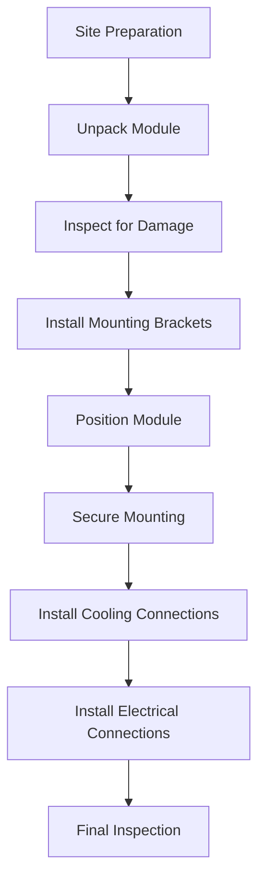
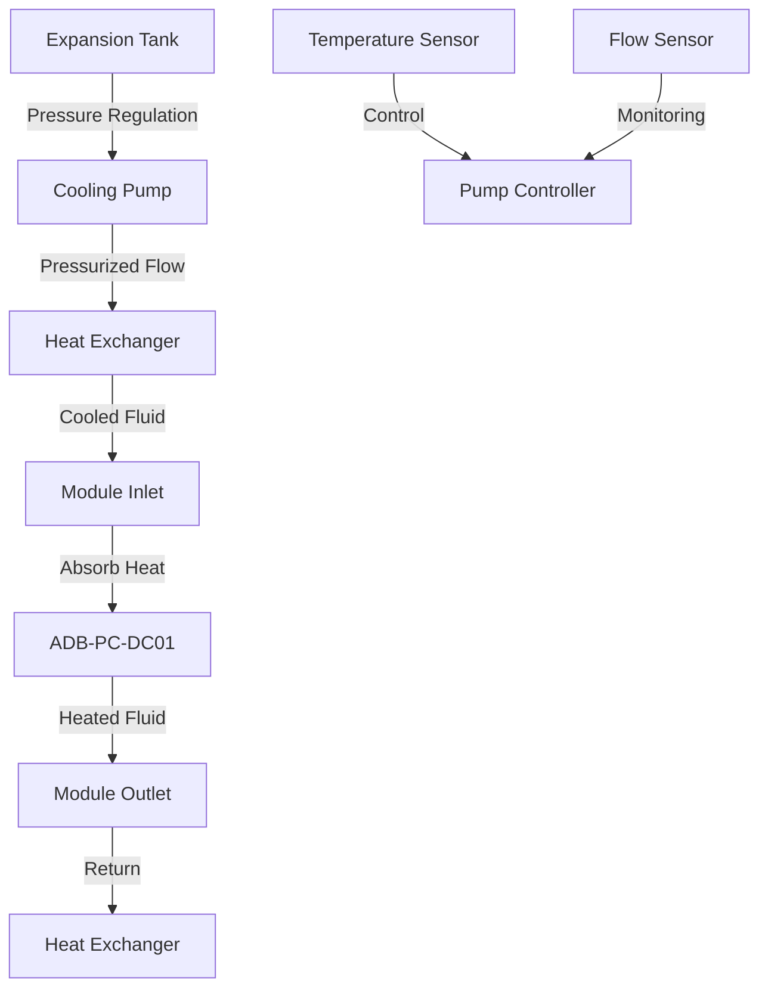
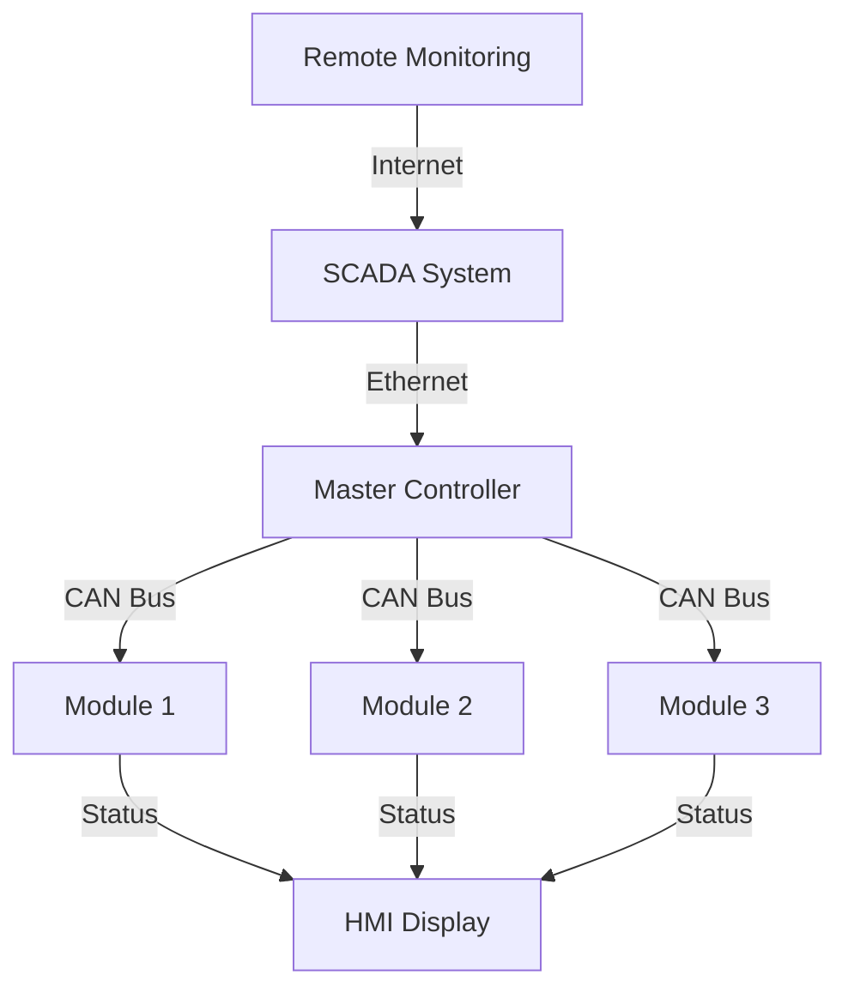

# Installation

## Site Requirements

### Environmental Conditions

Before installation, verify that the site meets the following environmental requirements:

| **Parameter** | **Requirement** | **Notes** |
|---------------|-----------------|-----------|
| **Operating Temperature** | -40°C to +70°C | Derating applies above 50°C |
| **Storage Temperature** | -50°C to +85°C | Non-operating condition |
| **Relative Humidity** | 5% to 95% | Non-condensing |
| **Altitude** | Up to 3000m | Derating above 2000m |
| **Vibration** | IEC 60068-2-6 | Designed for harsh environments |
| **Shock** | IEC 60068-2-27 | Industrial grade |

### Physical Space Requirements

!!! info "Clearance Requirements"
    - **Front Access**: Minimum 600mm for maintenance access
    - **Side Clearance**: Minimum 200mm for ventilation and service
    - **Top Clearance**: Minimum 300mm for cable routing
    - **Bottom Clearance**: Minimum 100mm for mounting and drainage

### Cooling System Requirements

The ADB-PC-DC01 requires liquid cooling with the following specifications:

| **Parameter** | **Requirement** | **Notes** |
|---------------|-----------------|-----------|
| **Coolant Type** | 50/50 Water Ethylene Glycol | Automotive grade |
| **Flow Rate** | Minimum 10 L/min | Per module |
| **Inlet Temperature** | +5°C to +45°C | Optimal: 25°C |
| **Pressure Drop** | <0.5 bar | Across module |
| **System Pressure** | 2-4 bar | Operating range |

## Mechanical Installation

### Mounting Options

The ADB-PC-DC01 supports multiple mounting configurations:

#### 19" Rack Mount (4U)
- **Height**: 4U (177mm)
- **Width**: Standard 19" (482.6mm)
- **Depth**: 440mm
- **Weight**: 30kg

#### Custom Bracket Mount
- **Mounting Points**: 4x M8 threaded inserts
- **Bracket Pattern**: 400mm x 400mm
- **Load Rating**: Suitable for 30kg module

### Mounting Procedure

#### Step-by-Step Mounting

1. **Site Preparation**
   - Ensure adequate space and clearances
   - Verify environmental conditions
   - Prepare mounting surface

2. **Module Inspection**
   - Inspect for shipping damage
   - Verify all accessories included
   - Check connector integrity

3. **Mounting Installation**
   - Install mounting brackets if required
   - Position module in final location
   - Secure with appropriate fasteners
   - Torque to specifications

4. **Cooling System Connection**
   - Connect inlet and outlet cooling lines
   - Ensure proper flow direction
   - Pressure test connections
   - Fill and bleed cooling system

### Cooling System Integration

!!! warning "Cooling System Safety"
    The cooling system operates under pressure. Ensure all connections are properly secured and pressure tested before operation.

#### Cooling System Components

#### Cooling System Installation

1. **Pump Installation**
   - Install circulation pump with adequate flow rate
   - Include pressure relief valve
   - Install filters to prevent clogging

2. **Heat Exchanger**
   - Size for maximum heat rejection (3kW at full load)
   - Consider ambient temperature conditions
   - Include bypass for maintenance

3. **Piping and Connections**
   - Use corrosion-resistant materials
   - Minimize pressure drop in system
   - Include isolation valves for service

## Electrical Installation

### DC Installation (Port A - Input)

#### DC Cable Requirements (Port A)

| **Parameter** | **Requirement** | **Notes** |
|---------------|-----------------|-----------|
| **Voltage Rating** | ≥1000V DC | Suitable for 950V operation |
| **Current Rating** | ≥120A | Bidirectional operation |
| **Insulation** | Double or reinforced | Safety requirement |
| **Temperature Rating** | ≥90°C | Operating range |

#### DC Installation Procedure (Port A)

!!! danger "High Voltage Safety"
    DC voltages up to 950V present serious electrical shock hazard. Only qualified personnel should perform DC connections.

1. **Safety Precautions**
   - Verify all power sources are disconnected
   - Use appropriate PPE for high voltage work
   - Implement lockout/tagout procedures

2. **DC Connection**
   - Verify polarity before connection
   - Connect positive and negative conductors
   - Ensure proper torque specifications
   - Install appropriate overcurrent protection

3. **System Integration**
   - Connect to DC bus or source
   - Verify proper isolation from other systems
   - Test insulation resistance

### DC Installation (Port B - Output)

#### DC Cable Requirements (Port B)

| **Parameter** | **Requirement** | **Notes** |
|---------------|-----------------|-----------|
| **Voltage Rating** | ≥1500V DC | Suitable for 1500V operation |
| **Current Rating** | ≥220A | Bidirectional operation |
| **Insulation** | Double or reinforced | Safety requirement |
| **Temperature Rating** | ≥90°C | Operating range |

#### DC Installation Procedure (Port B)

!!! danger "Extreme High Voltage Safety"
    DC voltages up to 1500V present extreme electrical shock hazard. Only qualified personnel with specialized training should perform DC connections.

1. **Safety Precautions**
   - Verify all power sources are disconnected
   - Use appropriate PPE for extreme high voltage work
   - Implement lockout/tagout procedures

2. **DC Connection**
   - Verify polarity before connection
   - Connect positive and negative conductors
   - Ensure proper torque specifications
   - Confirm integrated fusing is correctly installed

3. **System Integration**
   - Connect to DC bus or load
   - Verify proper isolation from other systems
   - Test insulation resistance

### Control and Communication Installation

#### Control Power Installation

| **Parameter** | **Requirement** | **Notes** |
|---------------|-----------------|-----------|
| **Voltage** | 24V DC ±15% | Control power supply |
| **Current** | ≥5A capacity | Peak startup current |
| **Isolation** | Isolated from HV | Safety requirement |
| **Protection** | Overcurrent protection | Fuse or breaker |

#### CAN Bus Installation

1. **Network Topology**
   - Use daisy-chain topology
   - Avoid star configurations
   - Maintain proper impedance

2. **Cable Requirements**
   - Use twisted pair cable
   - Characteristic impedance: 120Ω
   - Shield for noise immunity

3. **Termination**
   - Install 120Ω resistors at both ends
   - Verify proper termination
   - Avoid stub connections

## System Integration

### Parallel Installation

When installing multiple modules in parallel:

1. **Mechanical Layout**
   - Arrange modules for proper airflow
   - Ensure adequate service access
   - Plan cable routing for neat installation

2. **Electrical Connections**
   - Common DC bus connection (Port A)
   - Common DC bus connection (Port B)
   - Inter-module CAN connections

3. **Cooling System**
   - Parallel or series cooling configuration
   - Balanced flow distribution
   - Common temperature monitoring

### Control System Integration

## Commissioning

### Pre-Operation Checks

1. **Mechanical Verification**
   - Verify all mounting fasteners are secure
   - Check cooling system connections
   - Ensure proper clearances are maintained

2. **Electrical Verification**
   - Verify all connections are properly torqued
   - Check insulation resistance for both Port A and Port B
   - Verify polarity of all DC connections

3. **Control System Verification**
   - Verify CAN bus communication
   - Test control power supply
   - Verify interlock functionality

### Initial Startup

1. **Power-Up Sequence**
   - Apply control power first
   - Verify module initialization
   - Check for fault conditions

2. **System Testing**
   - Test basic operation at low power
   - Verify protection functions
   - Confirm communication integrity

3. **Performance Verification**
   - Test at various power levels and voltage ranges
   - Verify efficiency measurements
   - Confirm thermal performance

## Safety Considerations

### Electrical Safety

!!! danger "Electrical Hazards"
    This equipment contains dangerous voltages and currents. Installation must only be performed by qualified personnel following all applicable safety standards.

- Lockout/tagout procedures during installation
- Proper PPE for high voltage work
- Verification of de-energized state before work
- Grounding and bonding requirements

### Mechanical Safety

- Proper lifting techniques for 30kg module
- Secure mounting to prevent falling
- Protection from sharp edges
- Proper tool selection and use

### Environmental Safety

- Proper handling of coolant fluids
- Spill containment procedures
- Waste disposal requirements
- Environmental protection measures

## Documentation and Records

### Installation Records

Maintain records of:
- Installation date and personnel
- Serial numbers and configuration
- Test results and measurements
- As-built drawings and schematics

### Commissioning Reports

Document:
- Startup procedures performed
- Test results and performance data
- Any deviations or issues encountered
- Sign-off by qualified personnel
