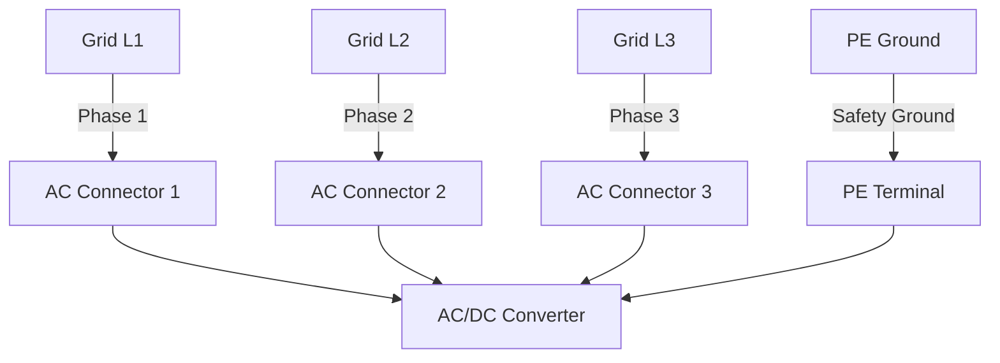
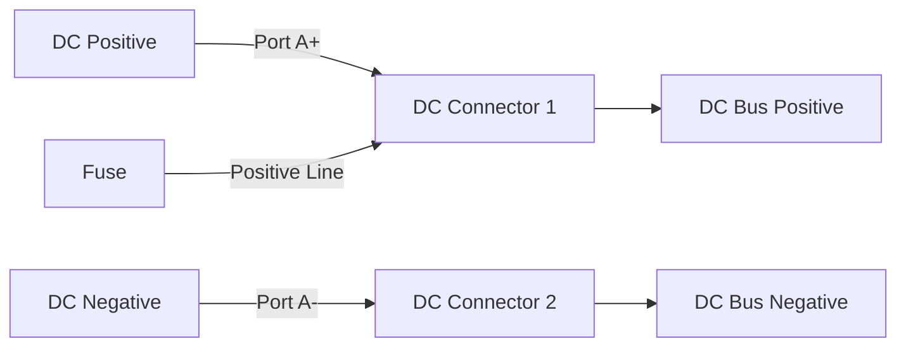
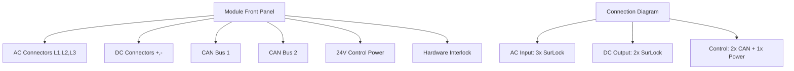
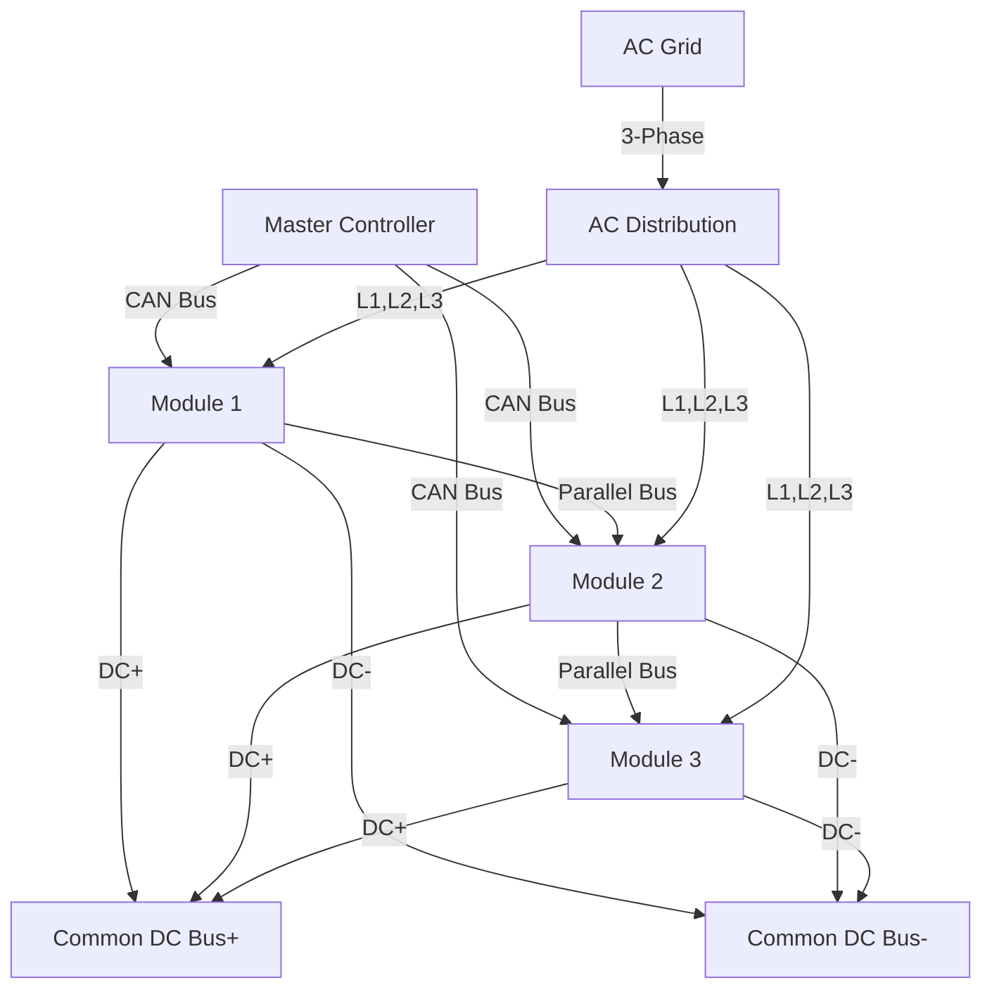

# Connectors and Interfaces

## AC Connectors

### AC Input Connectors

The ADB-PC-AC01 features high-current AC connectors designed for reliable operation in industrial environments:

| **Specification** | **Value** | **Notes** |
|-------------------|-----------|-----------|
| **Connector Type** | RADSOK Size 8mm | High-current contact technology |
| **Manufacturer** | Amphenol | Industry-leading reliability |
| **Series** | SurLock Plus (SLP-HIR-B) | Locking mechanism for safety |
| **Quantity** | 3 connectors | One per phase (L1, L2, L3) |
| **Current Rating** | 150 Arms per phase | Continuous operation |
| **Voltage Rating** | 1000 V | Suitable for 480V systems |

### AC Connector Features

!!! info "SurLock Plus Benefits"
    - **Positive Locking**: Prevents accidental disconnection
    - **High Current Capacity**: RADSOK technology for low contact resistance
    - **Environmental Sealing**: IP67 rating when mated
    - **Touch Safe**: Finger-safe design per UL standards
    - **Keying**: Polarized to prevent incorrect connection

### AC Wiring Configuration

**Connection Diagram:**

## DC Connectors

### DC Output Connectors

The DC side features bidirectional connectors for the high-voltage DC link:

| **Specification** | **Value** | **Notes** |
|-------------------|-----------|-----------|
| **Connector Type** | RADSOK Size 8mm | Same technology as AC side |
| **Manufacturer** | Amphenol | SurLock Plus series |
| **Series** | SLP-HIR-B | High-current locking design |
| **Quantity** | 2x Port A | Positive and negative connections |
| **Current Rating** | ±170 A | Bidirectional operation |
| **Voltage Rating** | 1000 V | Suitable for 950V DC operation |

### DC Connector Configuration

!!! warning "DC Polarity"
    Proper polarity must be observed when connecting DC cables. Reverse polarity connection will result in fault conditions and potential equipment damage.

### DC Bus Connection

**Connection Diagram:**

## Control and Communication Connectors

### CAN Bus Connectors

The module includes redundant CAN bus connections for robust communication:

| **Specification** | **Value** | **Notes** |
|-------------------|-----------|-----------|
| **Connector Type** | Automotive-grade | Locking connector |
| **Quantity** | 2x CAN connectors | Redundant connections |
| **Protocol** | CAN 2.0B | 29-bit identifier support |
| **Isolation** | Isolated interface | Safety isolation |

### Control Power Connector

| **Specification** | **Value** | **Notes** |
|-------------------|-----------|-----------|
| **Function** | 24V Control Power | Module control supply |
| **Connector Type** | Automotive-grade | Reliable connection |
| **Voltage Range** | 20-28 V DC | Nominal 24V |
| **Current Draw** | Up to 3A | Peak during startup |

### Connector Layout

**Connection Diagram:**

## Hardware Interlock Interface

### Safety Interlock System

The ADB-PC-AC01 incorporates a hardware interlock system for safety-critical applications:

- **Function**: Emergency shutdown and safety monitoring
- **Interface**: Dedicated safety-rated connector
- **Response Time**: <10ms for emergency shutdown
- **Compliance**: SIL2/PLd safety rating

### Interlock Applications

- Emergency stop circuits
- Door interlocks on enclosures
- Temperature monitoring interlocks
- Pressure monitoring for liquid cooling

## Parallel Operation Connections

### Paralleling Interface

When operating multiple modules in parallel, additional connections are required:

| **Connection Type** | **Purpose** | **Interface** |
|-------------------|-------------|---------------|
| **Current Sharing** | Load balancing | Internal CAN bus |
| **Synchronization** | Phase locking | Distributed control |
| **Fault Sharing** | System protection | Inter-module communication |
| **Status Sharing** | System monitoring | Redundant communication |

### Parallel Configuration Example

**Connection Diagram:**

## Connector Installation Guidelines

### AC Connector Installation

1. **Cable Preparation**
   - Use appropriate cable gauge for 150A continuous current
   - Strip insulation to manufacturer specifications
   - Use proper crimping tools for contact termination

2. **Connection Procedure**
   - Ensure power is disconnected before installation
   - Verify proper phase identification (L1, L2, L3)
   - Connect PE ground conductor first
   - Mate connectors until positive lock is engaged

3. **Torque Specifications**
   - Follow manufacturer torque recommendations
   - Use calibrated torque tools
   - Verify proper seating of contacts

### DC Connector Installation

1. **Polarity Verification**
   - Double-check polarity before connection
   - Use multimeter to verify voltage polarity
   - Connect positive and negative conductors correctly

2. **Cable Requirements**
   - Use cables rated for 1000V DC operation
   - Appropriate current rating for ±170A operation
   - Consider voltage drop in long cable runs

### Control Connector Installation

1. **CAN Bus Wiring**
   - Use twisted pair cables for CAN_H and CAN_L
   - Maintain proper impedance (120Ω characteristic)
   - Install termination resistors at bus ends

2. **Control Power Wiring**
   - Use adequate wire gauge for 3A current
   - Include overcurrent protection in 24V supply
   - Consider voltage drop in long cable runs

## Connector Maintenance

### Regular Inspection

- **Visual Inspection**: Check for corrosion, damage, or loose connections
- **Torque Verification**: Re-torque connections per maintenance schedule
- **Contact Resistance**: Measure contact resistance during maintenance
- **Insulation Testing**: Verify insulation integrity

### Replacement Guidelines

- **Contact Replacement**: Replace contacts showing signs of wear or damage
- **Seal Replacement**: Replace environmental seals during maintenance
- **Locking Mechanism**: Verify proper operation of locking features

## Connector Environmental Ratings

### Environmental Protection

| **Connector Type** | **IP Rating** | **Operating Temperature** | **Corrosion Resistance** |
|-------------------|---------------|-------------------------|------------------------|
| **AC Connectors** | IP67 (mated) | -40°C to +125°C | Salt spray resistant |
| **DC Connectors** | IP67 (mated) | -40°C to +125°C | Salt spray resistant |
| **Control Connectors** | IP65 (mated) | -40°C to +105°C | Industrial grade |

### Chemical Resistance

All connectors are designed to resist:
- Industrial chemicals and solvents
- UV radiation exposure
- Ozone and atmospheric contaminants
- Hydraulic fluids and lubricants