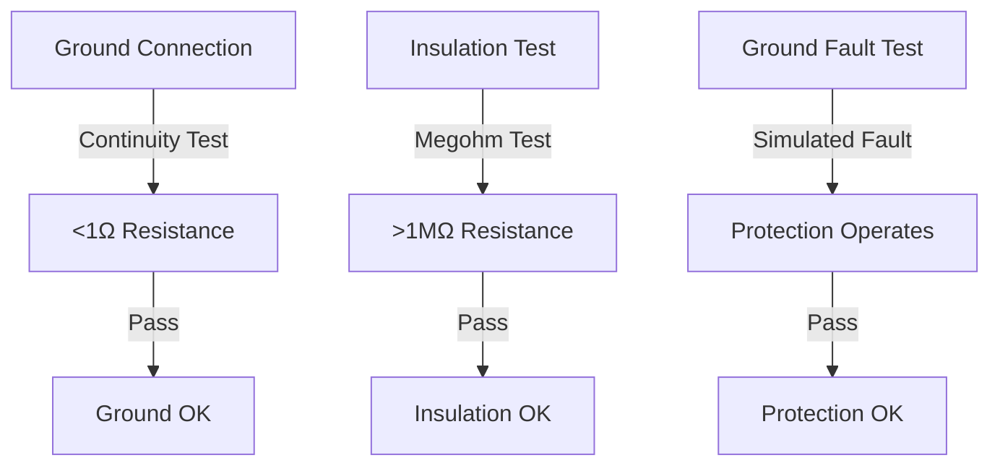
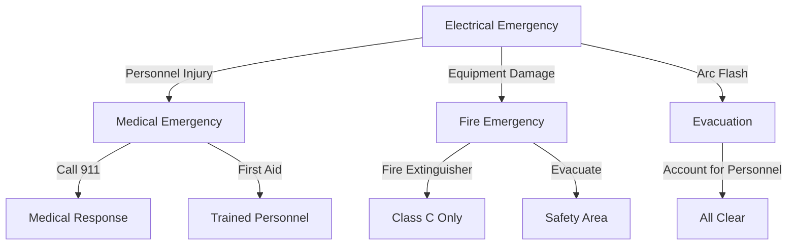

# Safety and Warnings

## General Safety Information

### Safety First

!!! danger "Critical Safety Notice"
    This equipment operates with dangerous voltages and currents. Improper installation, operation, or maintenance can result in serious injury or death. Only qualified personnel should install, operate, or service this equipment.

### Qualified Personnel

Installation, operation, and maintenance of the ADB-PC-AC01 must be performed by personnel who:

- Are trained and authorized to work on high voltage electrical equipment
- Understand the risks associated with power electronics
- Are familiar with applicable safety standards and regulations
- Have appropriate personal protective equipment (PPE)
- Understand lockout/tagout procedures

### Safety Standards

This equipment is designed to comply with:
- IEC 61851-1 (Electric vehicle conductive charging system)
- IEC 62477-1 (Safety requirements for power electronic converter systems)
- UL 2202 (Electric vehicle charging system equipment)
- NFPA 70 (National Electrical Code)
- Local electrical codes and regulations

## Electrical Safety

### High Voltage Hazards

!!! warning "High Voltage Danger"
    The ADB-PC-AC01 operates with voltages up to 950V DC and 480V AC. These voltages can cause severe electrical shock, burns, or death.

#### Voltage Levels Present

| **Circuit Type** | **Voltage Range** | **Hazard Level** |
|------------------|-------------------|------------------|
| **AC Input** | 208-480V AC | High Voltage |
| **DC Output** | 650-950V DC | Extra High Voltage |
| **Control Power** | 24V DC | Low Voltage |

#### Electrical Safety Requirements

1. **Lockout/Tagout (LOTO)**
   - Always use proper lockout/tagout procedures
   - Verify zero energy state before work
   - Use appropriate locks and tags
   - Follow company safety procedures

2. **Personal Protective Equipment (PPE)**
   - Arc flash rated clothing
   - Insulated gloves (Class 4 minimum)
   - Safety glasses with side shields
   - Hard hat with arc flash protection
   - Safety boots with electrical rating

3. **Tools and Equipment**
   - Use insulated tools rated for voltage level
   - Verify tool condition before use
   - Use proper test equipment
   - Maintain safe working distances

### Arc Flash Hazards

!!! danger "Arc Flash Risk"
    High fault currents can create arc flash hazards with temperatures exceeding 19,000°C. Proper arc flash analysis and PPE are required.

#### Arc Flash Prevention

- Never work on energized equipment
- Use proper switching procedures
- Maintain equipment in good condition
- Follow all safety procedures

### Grounding and Bonding

Proper grounding is essential for safety:

#### Grounding Requirements

- Equipment grounding conductor required
- System grounding per local codes
- Bonding of all metallic parts
- Ground fault protection

#### Grounding Verification

## Thermal Safety

### Hot Surfaces

!!! warning "Burn Hazard"
    Surfaces may become hot during operation. Allow adequate cooling time before handling.

#### Thermal Hazards

- Heat sink temperatures up to 125°C
- Power semiconductor temperatures
- Cooling system components
- Electrical connection points

### Cooling System Safety

The liquid cooling system operates under pressure and with hot fluids:

#### Cooling System Hazards

- Pressurized fluid up to 4 bar
- Hot coolant (up to 125°C)
- Chemical exposure (ethylene glycol)
- Slip hazards from leaks

#### Cooling System Safety Procedures

1. **Pressure Safety**
   - Depressurize before service
   - Use pressure relief valves
   - Check system pressure regularly
   - Never exceed maximum pressure

2. **Chemical Safety**
   - Use appropriate PPE for coolant
   - Avoid skin and eye contact
   - Provide adequate ventilation
   - Follow MSDS requirements

## Mechanical Safety

### Heavy Equipment

!!! warning "Lifting Hazard"
    The ADB-PC-AC01 weighs 30kg. Use proper lifting techniques and equipment.

#### Lifting Safety

- Use mechanical lifting equipment
- Follow proper lifting procedures
- Ensure adequate personnel
- Check equipment condition

### Sharp Edges

Sheet metal components may have sharp edges:
- Wear appropriate gloves
- Handle with care
- Deburr if necessary
- Use proper tools

## Environmental Safety

### Chemical Exposure

!!! warning "Chemical Hazard"
    Cooling system contains ethylene glycol. Avoid exposure and follow environmental regulations.

#### Chemical Safety

- Use appropriate PPE
- Provide adequate ventilation
- Store chemicals properly
- Follow disposal regulations

### Noise Exposure

While the ADB-PC-AC01 is liquid-cooled and quiet, associated equipment may produce noise:
- Monitor noise levels
- Use hearing protection if required
- Follow occupational noise limits

## Fire Safety

### Fire Prevention

!!! danger "Fire Hazard"
    Electrical faults can cause fires. Maintain equipment properly and have appropriate fire suppression.

#### Fire Prevention Measures

- Maintain proper clearances
- Keep equipment clean
- Check for overheating
- Use appropriate overcurrent protection

### Fire Response

In case of fire:
1. De-energize equipment if safely possible
2. Use appropriate fire extinguisher (Class C)
3. Evacuate area if necessary
4. Contact emergency services

## Emergency Procedures

### Electrical Emergency

### Emergency Response Steps

1. **Immediate Actions**
   - Ensure personal safety
   - De-energize if safely possible
   - Call for help if needed
   - Secure the area

2. **Medical Emergency**
   - Call emergency services
   - Provide first aid if trained
   - Do not move injured person
   - Stay with victim until help arrives

3. **Fire Emergency**
   - Activate fire alarm
   - Use fire extinguisher if trained
   - Evacuate if necessary
   - Account for all personnel

## Warning Labels and Signs

### Equipment Labels

The ADB-PC-AC01 includes permanent warning labels for:
- High voltage hazards
- Arc flash warnings
- Thermal hazards
- Chemical hazards

### Required Site Signage

Install appropriate warning signs:
- Electrical hazard warnings
- Arc flash labels
- Emergency contact information
- Operating procedures

## Safety During Maintenance

### Maintenance Safety Procedures

!!! warning "Maintenance Safety"
    Never perform maintenance on energized equipment. Always follow proper safety procedures.

#### Pre-Maintenance Safety

1. **Planning**
   - Review maintenance procedures
   - Identify hazards and risks
   - Prepare safety equipment
   - Coordinate with operations

2. **Preparation**
   - Implement lockout/tagout
   - Verify zero energy state
   - Install safety grounds
   - Post warning signs

3. **Execution**
   - Use appropriate PPE
   - Follow procedures exactly
   - Monitor for hazards
   - Work with qualified partner

### Post-Maintenance Safety

1. **Testing**
   - Verify proper reassembly
   - Test safety functions
   - Check for proper operation
   - Remove safety grounds

2. **Restoration**
   - Remove lockout/tagout
   - Verify all personnel clear
   - Restore power systematically
   - Monitor initial operation

## Training and Competency

### Required Training

All personnel working with this equipment must have:
- Electrical safety training
- Equipment-specific training
- Emergency response training
- Regular refresher training

### Competency Verification

- Document training completion
- Regular competency assessments
- Safety performance monitoring
- Continuous improvement programs

## Safety Documentation

### Required Documentation

Maintain current copies of:
- Safety data sheets (SDS)
- Emergency contact lists
- Safety procedures
- Training records
- Incident reports

### Safety Records

Keep records of:
- Safety inspections
- Incident investigations
- Training activities
- Safety meetings
- Corrective actions

## Regulatory Compliance

### Applicable Regulations

Comply with all applicable regulations:
- OSHA electrical safety standards
- Local electrical codes
- Environmental regulations
- Fire codes and standards

### Compliance Verification

- Regular safety audits
- Regulatory inspections
- Documentation reviews
- Corrective action tracking

---

**Remember: Safety is everyone's responsibility. When in doubt, stop work and seek guidance from qualified personnel.**