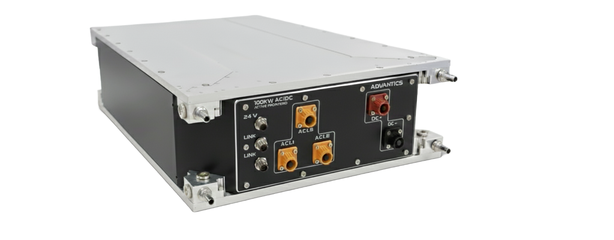

    <h1 style="color: #00A99D; font-size: 2.5rem; margin-bottom: 1rem;">ADB-PC-AC01</h1>
    <h2 style="color: #1a1a1a; font-size: 1.8rem; margin-bottom: 0.5rem;">100kW AC/DC Active Frontend (PFC)</h2>
    
Technical Documentation & User Manual

    

        
    

    

---

    
<strong>Document Version:</strong> 1.0

    
<strong>Release Date:</strong> October 2025

    
<strong>Document Classification:</strong> Public

---

<!-- Force a new PDF page -->

## Document Information

| **Property** | **Value** |
|--------------|-----------|
| **Product** | ADB-PC-AC01 |
| **Description** | 100kW AC/DC Active Frontend (PFC) |
| **Document Type** | Technical Manual |
| **Version** | 1.0 |
| **Last Updated** | October 2025 |
| **Classification** | Public |

---

## Trademarks and Copyright

© 2025 ADVANTICS SAS. All rights reserved.

Advantics and the Advantics logo are trademarks of Advantics SAS.

All other trademarks mentioned in this document are the property of their respective owners.

---

## Get in Touch

- Product page: https://advantics.fr/products/ADB-PC-AC01/  
- Discover our portfolio: https://advantics.fr/products/  
- Sales: sales@advantics.fr  
- Technical Support: [Support Desk](https://advantics.atlassian.net/servicedesk/customer/portal/1)

---

## Contact & Legal

**Advantics SAS**  
https://advantics.fr  
Email: sales@advantics.fr  
Phone: +33 7 87 14 09 19

---

  

    This document contains proprietary information of Advantics SAS. 
    No part of this document may be reproduced in any form without written permission.
  

---