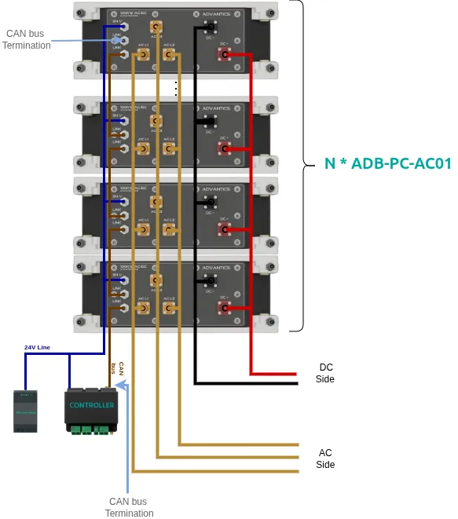

# Installation Guide for ADB-PC-AC01

## Connector Installation Guidelines

### AC Connector Installation (Port A)

1. **Polarity / Phase Verification**

   * Verify **Live (L)** and **Protective Earth (PE)** connections before mating.
   * Use a multimeter or phase tester to ensure the supply phase is correct.
   * Confirm that the **supply voltage and frequency** match the converter’s specifications.

2. **Cable Requirements**

   * Use cables rated for the **nominal AC voltage and current** as specified for Port A.
   * Select cable gauge suitable for continuous current and ambient temperature.
   * Consider voltage drop in long cable runs.
   * Strip insulation according to manufacturer’s recommendations.
   * Use properly crimped terminals or ferrules to ensure reliable connections.

3. **Connection Procedure**

   * Ensure the AC supply is **fully disconnected** before installation.
   * Connect **PE (Protective Earth)** first.
   * Connect **Live (L)** conductors.
   * Verify all terminations are tight and torque screws to the specified value.

### DC Connector Installation (Port B)

1. **Polarity Verification**

   * Double-check polarity before connection for both **positive (+)** and **negative (–)** terminals.
   * Use a multimeter to confirm voltage polarity from your DC load or distribution bus.
   * Connect positive and negative conductors correctly according to terminal markings.

2. **Cable Requirements**

   * Use cables rated for the **DC output voltage** and **maximum current** of Port B.
   * Ensure cables are rated for **continuous operation** and **adequate temperature class**.
   * Select cable gauge based on continuous current (consult datasheet for current limits).
   * Use proper crimping tools and approved lugs for secure contact terminations.

3. **Connection Procedure**

   * Ensure the DC side (load or bus) is **de-energized** before connection.
   * Connect **PE** first if a DC ground reference is required.
   * Connect **negative (–)** and then **positive (+)** busbars.
   * Ensure busbar or cable lugs are clean and aligned.
   * Torque all DC terminal bolts to the specified value.

### Control Connector Installation

1. **CAN Bus Wiring**

   * Use **twisted-pair cables** for CAN_H and CAN_L.
   * Maintain 120 Ω characteristic impedance along the bus.
   * Place **termination resistors** (120 Ω each) at both ends of the CAN line.

2. **Control Power Wiring**

   * Use adequate wire gauge for **3 A current** at **24 VDC**.
   * Include overcurrent protection in 24V supply.

## Install the Converter (Mechanical)

This section covers the physical installation, mounting, and handling of the **ADB-PC-AC01** unit.

**Prerequisites:**

* Use lifting equipment rated for the converter’s weight.
* Have the proper mounting hardware (e.g., M12 bolts, washers).
* Verify the installation site is clean, dry, and provides all required **ventilation and clearance**.

**Steps:**

1. **Inspect for Damage:** Visually inspect the unit for any shipping or handling damage before installation.
2. **Lift the Unit:** Attach lifting straps to the **designated lifting points** on the chassis.
3. **Position and Mount:** Lift and align the unit in its final position or rack.
4. **Secure the Unit:** Fasten the unit’s mounting flanges with the specified bolts and washers.
5. **Torque Bolts:** Use a torque wrench to tighten bolts to the specified mechanical values.

## Install the Converter (Electrical)

This section covers the electrical connection of all AC, DC, and control cables.

> ⚠️ **WARNING – RISK OF ELECTRIC SHOCK:**
> This procedure must only be performed by qualified personnel.
> Ensure all power sources (AC and DC) are **de-energized, disconnected, and locked out**.

**Prerequisites:**

* AC supply and DC load circuits are confirmed **OFF and locked out** (LOTO).
* Proper **PPE** (insulated gloves, safety glasses, etc.) is used.
* Multimeter and torque wrench are available and calibrated.
* All cables are prepared, terminated, and labeled.

**Steps:**

1. **Connect Protective Earth (PE):**

   * **Always connect PE first.**
   * Connect the main facility ground to the PE terminal on the converter chassis.
   * Verify the ground connection impedance is below **0.1 Ω**.

2. **Connect AC Input (Port A):**

   * Verify correct voltage, frequency, and phase.
   * Connect **L (Live)** and **PE** to the AC input terminal.
   * Ensure all terminals are properly tightened and torqued.

3. **Connect DC Output (Port B):**

   * Confirm polarity and ensure DC load is off.
   * Connect **+ (positive)** and **– (negative)** conductors to Port B.
   * Torque terminals to the specified values.
   * Replace any protective covers after connection.

4. **Connect Control Wiring:**

   * Wire the **CAN bus**, **interlock**, and **24 VDC control power** per the provided pinout.
   * Secure connectors to prevent loosening during vibration.

## Connect the Cooling System

This section describes the procedure for connecting the **liquid cooling loop** of the converter.

**Prerequisites:**

* Cooling circuit is flushed and filled with **approved coolant**.
* The pump is **OFF** before connecting.

**Steps:**

1. Inspect O-rings on the cooling ports for damage or contamination.
2. Connect the **Coolant In** hose to the inlet port.
3. Connect the **Coolant Out** hose to the outlet port.
4. Tighten all fittings securely (avoid overtightening).
5. Start the pump at **low flow rate**.
6. Purge all air from the circuit according to the chiller’s instructions.
7. Increase to nominal flow rate and check for **leaks**.

## Set Up a Parallel System

### Parallel Configuration Example

This procedure describes how to interconnect and configure multiple ADB-PC-AC01 units for parallel operation.

    

**Prerequisites:**

* All units are mechanically, electrically, and cooling-system installed.
* All units are powered off.

**Steps:**

1. **Connect the Parallel Bus:**
   Connect the dedicated **parallel communication cable** between all converters in the same group.
2. **Assign Unique IDs:**
   Set a unique **unit ID** for each converter using the **ETKA configuration tool**.
3. **Configure the Group ID:**
   Assign a **group ID** to define which units operate together.
4. **Power On:**
   Power on all converters using the standard “Power On” procedure.

