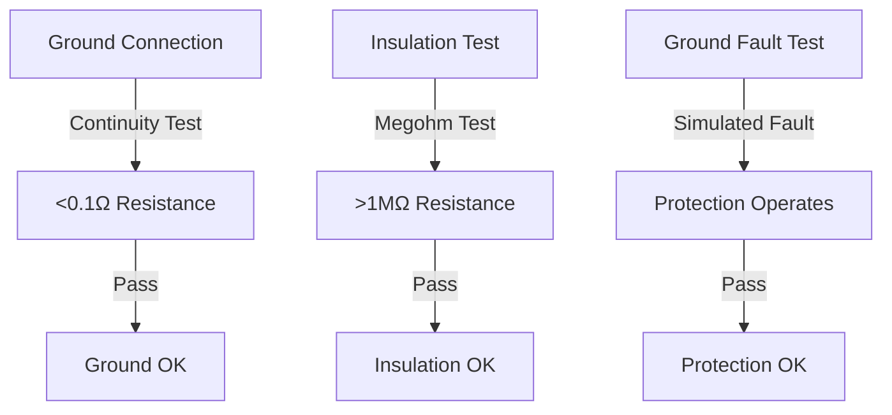

# Safety Considerations

!!! danger "Critical Safety Notice"
      This equipment operates with **dangerous AC and DC voltages** and **high currents**. Improper installation, operation, or maintenance can result in **serious injury or death**. Only qualified and authorized personnel may install, operate, or service this equipment.

## Qualified Personnel

Installation, operation, and maintenance of the **ADB-PC-AC01** must be performed by personnel who:

* Are trained and authorized to work on **high-voltage AC and DC electrical equipment**.
* Understand the risks associated with **power electronics** and **mixed AC/DC systems**.
* Are familiar with all relevant **safety standards and national electrical codes**.
* Wear **appropriate personal protective equipment (PPE)**.
* Are trained in **lockout/tagout (LOTO)** and **arc flash** procedures.

## Electrical Safety

### High Voltage Hazards

!!! warning "Extreme Voltage Danger"
      The ADB-PC-AC01 operates with **AC voltages up to 400 V (L–L)** and **DC voltages up to 950 V**.
      Contact with live conductors can result in **severe electrical shock, burns, or death**.

### Voltage Levels Present

| **Circuit Type**       | **Typical Voltage Range** |
|  |  |
| **AC Input (Port A)**  | 380–415 V AC (L–L)        |
| **DC Output (Port B)** | 650–950 V DC              |
| **Control Power**      | 24 V DC                   |

### Electrical Safety Requirements

1. **Lockout/Tagout (LOTO)**

   * Always follow proper LOTO procedures before any work.
   * Verify **zero-energy state** on both AC and DC sides.
   * Use approved locks and tags.
   * Follow company and regulatory safety policies.

2. **Personal Protective Equipment (PPE)**

   * Arc-flash-rated clothing (per NFPA 70E or equivalent).
   * Insulated gloves.
   * Safety glasses with side shields.
   * Hard hat with arc-flash protection shield.
   * Electrical-rated safety boots.

3. **Tools and Equipment**

   * Use **insulated tools** rated for the maximum voltage present.
   * Inspect tools before use.
   * Use properly rated **multimeters** and **voltage detectors**.
   * Maintain minimum approach distances.

### Arc Flash Hazards

!!! danger "Arc Flash Risk"
      Fault currents from the AC input or DC bus can cause **arc flashes exceeding 19 000 °C**.
      Proper **arc-flash study**, **labeling**, and **PPE** are mandatory before operation.

**Arc Flash Prevention**

* Never work on energized circuits.
* Follow approved **switching and grounding** procedures.
* Keep electrical connections clean and tight.
* Perform **routine inspection** and maintenance.

### Grounding and Bonding

Proper grounding is essential for personnel safety and equipment protection.

**Grounding Requirements**

* Always connect the **Protective Earth (PE)** conductor before any power cables.
* Comply with **IEC 60364**, **NFPA 70**, and local electrical codes.
* Bond all metallic enclosures and structures.
* Ensure proper **ground fault protection** is installed on the AC side.

**Grounding Verification**

## Thermal Safety

### Hot Surfaces

!!! warning "Burn Hazard"
      The ADB-PC-AC01’s heat sinks and enclosure surfaces may reach **temperatures up to 125 °C** during operation.
      Allow adequate cooling time before contact or servicing.

### Thermal Hazards

* High-temperature heat sinks and power semiconductors.
* DC busbars and cable lugs may retain heat.
* Cooling manifold and liquid-cooled components.
* Proximity to other heat-generating devices.

### Cooling System Safety

The **liquid-cooling system** operates under pressure and elevated temperature.

**Cooling System Hazards**

* Pressurized fluid up to **4 bar**.
* Coolant temperature up to **125 °C**.
* Chemical hazard from **ethylene glycol** or other additives.
* Slip hazard from leaks.

**Cooling System Safety Procedures**

1. **Pressure Safety**

   * Depressurize before disconnecting hoses.
   * Use properly rated pressure-relief valves.
   * Monitor pressure during operation.
   * Never exceed specified system limits.

2. **Chemical Safety**

   * Wear gloves and eye protection.
   * Avoid skin or eye contact with coolant.
   * Ensure adequate ventilation.
   * Follow **MSDS** and environmental regulations.

## Mechanical Safety

### Heavy Equipment

!!! warning "Lifting Hazard"
      The ADB-PC-AC01 weighs approximately **30 kg**. Use proper lifting equipment and techniques.

**Lifting Safety**

* Use mechanical lifting aids when possible.
* Follow ergonomic lifting practices.
* Ensure multiple personnel for handling.
* Inspect lifting straps and anchor points.

### Sharp Edges

Metal enclosures and mounting brackets may have sharp edges:

* Wear **cut-resistant gloves**.
* Handle with care.
* Deburr edges if necessary.
* Use proper tools and protective gear.

## Environmental Safety

### Chemical Exposure

!!! warning "Chemical Hazard"
The liquid coolant may contain **ethylene glycol** or similar compounds.
Avoid skin or eye exposure and follow local **environmental disposal regulations**.

**Chemical Safety**

* Wear gloves and protective eyewear.
* Provide proper ventilation.
* Store chemicals in approved containers.
* Dispose of coolant per environmental standards.

### Noise Exposure

The ADB-PC-AC01 itself is **quiet**, but associated cooling and power equipment may generate noise:

* Monitor noise levels in the installation area.
* Use hearing protection where required.
* Follow occupational noise standards (e.g., ISO 9612, OSHA 1910.95).

## Emergency Procedures

### Emergency Response Steps

1. **Immediate Actions**

   * Ensure personal safety first.
   * If possible, de-energize the system safely.
   * Notify emergency response personnel.
   * Secure and evacuate the area if necessary.

2. **Medical Emergency**

   * Call local emergency services.
   * Administer first aid if trained.
   * Do not move injured persons unless essential.
   * Stay with the victim until help arrives.

3. **Fire Emergency**

   * Trigger the fire alarm system.
   * Use **Class C (electrical)** fire extinguishers only.
   * Evacuate per site procedure.
   * Account for all personnel.

## Warning Labels and Signs

### Equipment Labels

The ADB-PC-AC01 is equipped with **permanent warning labels** for:

* AC high-voltage input hazards.
* DC high-voltage output hazards.
* Arc-flash and shock warnings.
* Thermal and chemical hazards.

### Required Site Signage

Install the following on or near the equipment:

* Electrical hazard warnings.
* Arc-flash boundary labels.
* Emergency contact information.
* Operating and maintenance procedures.

## Safety During Maintenance

!!! warning "Maintenance Safety"
      **Never perform maintenance on energized AC or DC equipment.**
      Always de-energize and verify isolation before starting any work.

**Pre-Maintenance Safety**

1. **Planning**

   * Review the maintenance procedure.
   * Identify potential hazards.
   * Prepare required PPE and tools.
   * Notify operations personnel.

2. **Preparation**

   * Apply lockout/tagout on both AC and DC circuits.
   * Verify **zero-energy** condition.
   * Apply **temporary grounds** if required.
   * Post warning signage and restrict access.

3. **Execution**

   * Wear full PPE throughout.
   * Follow all procedures step-by-step.
   * Monitor for unexpected hazards.
   * Work in pairs for safety.

**Post-Maintenance Safety**

1. **Testing**

   * Verify correct reassembly.
   * Check for proper electrical continuity and insulation.
   * Test safety interlocks and protective devices.

2. **Restoration**

   * Remove lockout/tagout devices.
   * Ensure all personnel are clear.
   * Power up in a controlled sequence.
   * Observe the unit during initial energization.

## Training and Competency

### Required Training

All personnel must receive:

* **Electrical safety and arc-flash** training.
* **ADB-PC-AC01 product-specific** training.
* **Emergency response** and **first-aid** instruction.
* Periodic **refresher courses**.

### Competency Verification

* Maintain records of completed training.
* Conduct regular assessments.
* Monitor adherence to safety practices.
* Implement corrective and continuous-improvement actions.

## Regulatory Compliance

### Applicable Regulations

The ADB-PC-AC01 installation must comply with:

* **IEC 62477-1**, **IEC 61800-5-1**, or equivalent safety standards.
* **OSHA** or local workplace safety requirements.
* **Local electrical codes** and wiring regulations.
* **Environmental** and **fire safety** codes.

### Compliance Verification

* Perform regular safety audits and inspections.
* Maintain compliance documentation.
* Track and close corrective actions.
* Ensure readiness for regulatory review.

**Remember:**

> Safety is everyone’s responsibility.
> If uncertain, **stop work** and consult qualified personnel before proceeding.
