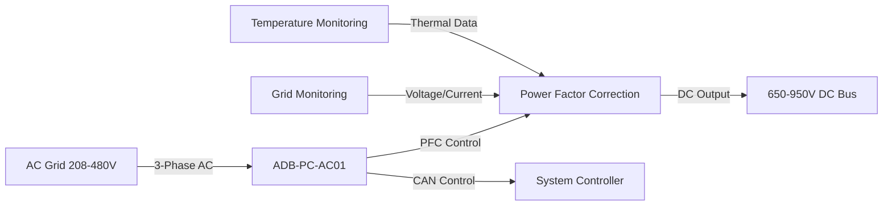
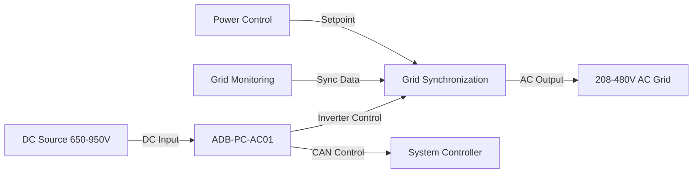
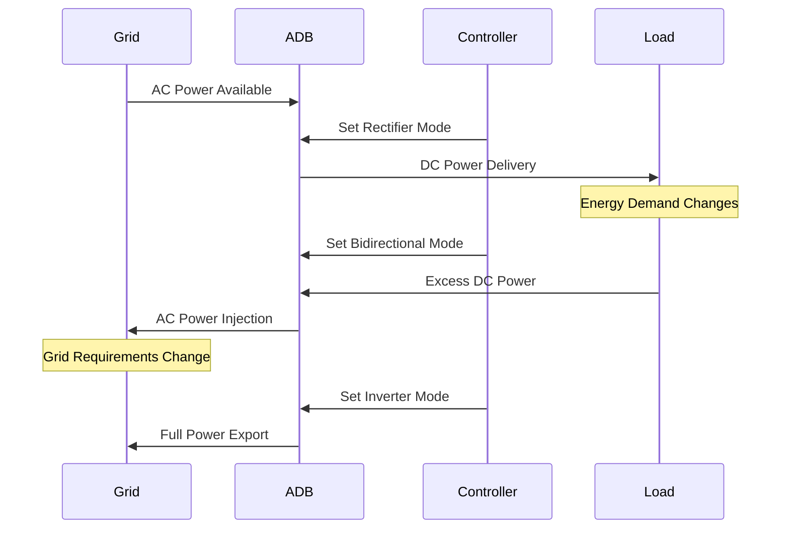

# Theory of Operation

The ADB-PC-AC01 supports multiple operating modes to accommodate various application requirements. The module employs a bidirectional topology that operates as a bidirectional active-front-end (AFE), converting single or three-phase AC from the grid into a DC link with high efficiency and almost unity power factor. It performs real-time power factor correction and reactive-power control, while precisely regulating current and voltage on the DC side. Similarly, the converter can invert DC power back to the AC side, enabling grid support functionalities such as V2G or microgrid operations. Additionaly, this converter can be used as a DC to DC converter that can perform boost or buck operation up to 99% efficiency, thanks to the SiC switching technology. Its internal gateway controller facilitates the coordination with multiple modules to increase the power rating to meet megawatt levels.

## Rectifier Mode (AC to DC)

In rectifier mode, the module converts AC input power to regulated DC output power:

**Key Features:**
- Active Power Factor Correction (PFC) maintains PF ≥0.99
- Low Total Harmonic Distortion (THDi ≤5%)
- Programmable DC output voltage (650-950V)
- Current limiting and overcurrent protection

## Inverter Mode (DC to AC)

In inverter mode, the module converts DC input power to AC output power:

**Key Features:**
- Grid-tied or standalone operation
- Reactive power control (±0.9 inductive-capacitive)
- Grid forming and following capabilities
- Anti-islanding protection

## Bidirectional Mode

In bidirectional mode, the module seamlessly transitions between rectifier and inverter operation:

