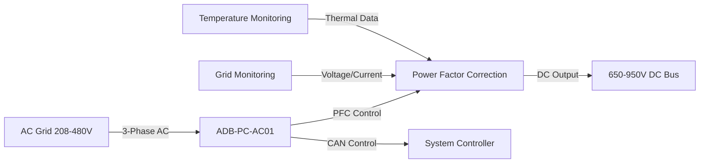
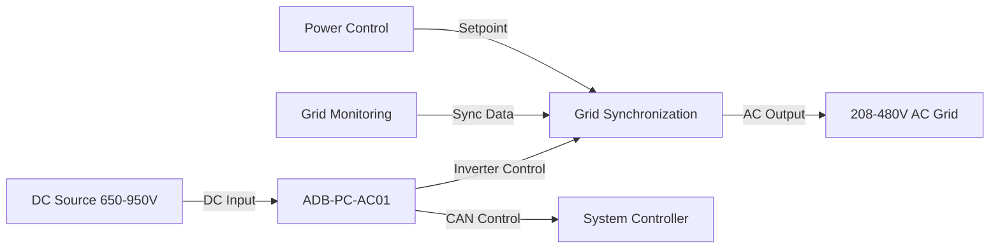
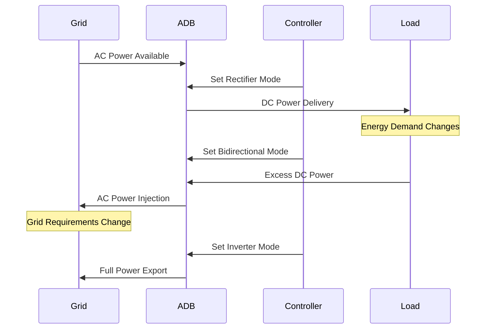

# Theory of Operation

The ADB-PC-AC01 supports multiple operating modes to accommodate various application requirements. The module employs a bidirectional topology that operates as a bidirectional active-front-end (AFE), converting single or three-phase AC from the grid into a DC link with high efficiency and almost unity power factor. It performs real-time power factor correction and reactive-power control, while precisely regulating current and voltage on the DC side. Similarly, the converter can invert DC power back to the AC side, enabling grid support functionalities such as V2G or microgrid operations. Additionaly, this converter can be used as a DC to DC converter that can perform boost or buck operation up to 99% efficiency, thanks to the SiC switching technology. Its internal gateway controller facilitates the coordination with multiple modules to increase the power rating to meet megawatt levels.

## Rectifier Mode (AC to DC)

In AC to DC mode, the module receives three-phase AC (208-480V, 50/60Hz) from the grid and performs power factor correction to minimize reactive power and harmonic distortion, achieving a power factor above 0.99 and THD of less than 5%. The SiC switching devices modulate the input current to shape it while actively controlling both amplitude and phase to draw near sinusoidal current from the grid. The module can perform precharge thanks to the built-in circuit that eliminates inrush currents to avoid damage to the converter. An internal soft start algorithm limits the inrush current and avoids grid disturbances. 

The DC link voltage is controlled by the user setpoints within the range of 650V to 950V. Current is regulated bidirectionally within the power envelope of 100kW, allowing for both charging and discharging of the DC link. 

The module includes protection features to eliminate overvoltage, undervoltage, overcurrent, and overtemperature. Hardware interlock and CAN bus control ensure safe operation and coordination with other modules connected in parallel.

**Key Features:**
- Active Power Factor Correction (PFC) maintains PF ≥0.99
- Low Total Harmonic Distortion (THDi ≤5%)
- Programmable DC output voltage (650-950V)
- Current limiting and overcurrent protection

## Inverter Mode (DC to AC)

In DC-to-AC mode, the module inverts energy from the DC link back to the AC side, generating a controlled three-phase output synchronized with the grid or microgrid. The modulation stage adjusts amplitude, phase, and frequency to support active and reactive power flow, enabling functions such as grid support, export, and microgrid stabilization. Grid-code protections and mains-side relays manage safe interconnection and disconnection, while real-time current regulation maintains a clean sinusoidal output. Parallel units operate cooperatively through intelligent droop control, allowing coordinated AC injection and stable multi-module behavior.

The converter supports paralleling up to 120 units, scaling up to megawatt-level power stations. An intelligent ‘droop control’ algorithm manages the sharing of DC link voltage among the parallel modules, which eliminates the circulating currents and stabilizes the common DC bus without requiring overly complex communication.

**Key Features:**
- Grid-tied or standalone operation
- Reactive power control (±0.9 inductive-capacitive)
- Grid forming and following capabilities
- Anti-islanding protection

## Bidirectional Mode

In bidirectional mode, the module seamlessly transitions between rectifier and inverter operation:

## DC to DC Mode 

In DC-to-DC mode, the converter regulates power flow between a high-voltage DC source and a downstream DC bus, maintaining a controlled DC link while managing current in both directions. The internal SiC switching stage modulates the DC input to stabilize the output voltage within the supported operating window, allowing the unit to act as a tightly regulated DC supply or as a sink that absorbs energy from the DC side. Current is controlled with the same bidirectional precision used in AC-coupled modes, enabling charging, discharging, or buffering functions depending on system requirements.

Because the converter already operates on a high-frequency, fully regulated DC link, the DC-to-DC function uses its existing modulation and protection framework: soft-start prevents inrush, active current regulation prevents overload, and all overvoltage, undervoltage, and thermal protections remain active. When multiple modules operate in parallel, the droop-control mechanism balances DC voltage and current sharing automatically, ensuring stable multi-module DC-bus operation.

## Application Examples

### 100kW 3-Phase Bidirectional Charger 

An ADB-PC-AC01 can be a building block of a bidirectional battery charging system (e.g., G2V, V2G). The diagram below illustrates the connection diagram of such a system, where a 3-phase grid is connected to ADB-PC-DC01 through ADB-PC-AC01.

3-phase bidirectional charger diagram that employs ADB-PC-DC01 and ADB-PC-AC01

In this system, ADB-PC-AC01 is used in AC to DC mode to regulate the DC voltage at the input of ADB-PC-DC01. The user can set the target DC voltage, along with the current limits, to regulate power delivery either to the grid or to the DC link.

