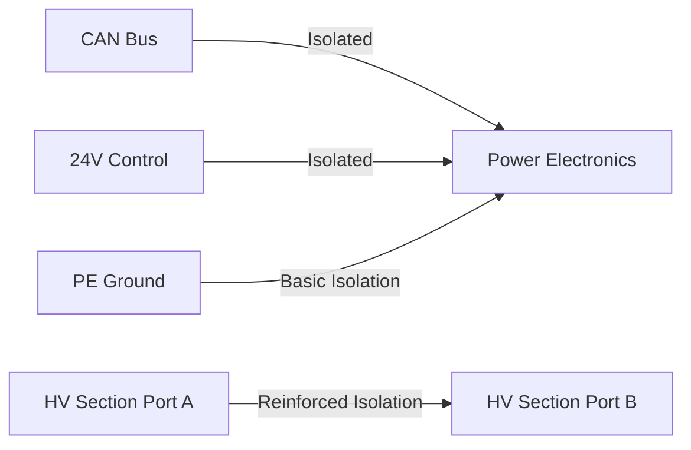

# Electrical Specifications

## DC Bus Side (Port A) Specifications

### Input Characteristics

| **Parameter** | **Value** | **Conditions** |
|---------------|-----------|----------------|
| **Voltage Range** | 750 - 950 V DC | Nominal input from source |
| **Current Range** | ±120 A | Bidirectional, power envelope limited |
| **Maximum Power** | 100 kW | Continuous operation |
| **Current Measurement Accuracy** | ±1% of full-scale | Over temperature range |
| **Voltage Measurement Accuracy** | ±1% of full-scale | Over temperature range |

### DC Configuration

!!! info "DC Bus to PE Separation"
    The DC bus side (Port A) features basic isolation to Protective Earth (PE). Ensure proper system grounding and safety measures are implemented.

### Protection Features

| **Protection Type** | **Description** | **Response** |
|-------------------|----------------|--------------|
| **Overvoltage Protection** | Monitors input voltage levels | Automatic shutdown |
| **Undervoltage Protection** | Prevents operation below minimum voltage | Automatic shutdown |
| **Overcurrent Protection** | Current limiting and protection | Automatic current limit |
| **Overtemperature Protection** | Thermal monitoring | Graceful power reduction |

### Startup Characteristics

- **DC Link Capacitance**: 160 uF
- **DC Link Precharge**: No, must be precharged externally
- **Overvoltage Category**: OVC2 (Overvoltage Category 2)

## DC Output Side (Port B) Specifications

### Output Characteristics

| **Parameter** | **Value** | **Conditions** |
|---------------|-----------|----------------|
| **Voltage Range** | 200 - 1500 V DC | Wide output range, MCS compliant |
| **Current Range** | ±220 A | Bidirectional, limited by power envelope |
| **Maximum Power** | 100 kW | Continuous operation |
| **Current Measurement Accuracy** | ±1% of full-scale | Over temperature range |
| **Voltage Measurement Accuracy** | ±1% of full-scale | Over temperature range |

### DC Configuration

!!! warning "Reinforced Isolation"
    The ADB-PC-DC01 features reinforced galvanic isolation between Port A (input) and Port B (output). This ensures high safety and prevents ground loops.

### DC Protection

- **Overvoltage Protection**: Active monitoring and shutdown
- **Undervoltage Protection**: Prevents deep discharge
- **Overcurrent Protection**: Current limiting and fusing
- **Overtemperature Protection**: Thermal management system

### Fusing and Contactors

- **DC Fusing**: Integrated on the positive line, UL/IEC rated
- **Output Contactors**: Not integrated (external contactors required)
- **Protection Coordination**: Designed for selective protection
- **Ripple Voltage/Current**: Fulfills IEC 61851-23-3

## Control and Communication Specifications

### Communication Interface

| **Parameter** | **Value** | **Notes** |
|---------------|-----------|-----------|
| **Protocol** | CAN 2.0B | Industry standard |
| **Baud Rate** | Configurable | Up to 1 Mbps |
| **Isolation** | Isolated from PE and 24V | Safety isolation |

### Control Power Supply

| **Parameter** | **Value** | **Tolerance** |
|---------------|-----------|---------------|
| **Nominal Voltage** | 24 V DC | 20 - 28 V |
| **Control Power Consumption** | 50 W | During operation |
| **Standby Power Consumption** | 5 W | Idle state |

### Isolation Concept

- **CAN Bus Isolation**: Isolated from power electronics and 24V supply
- **Control Power Isolation**: 24V control isolated from power section
- **Primary-Secondary Isolation**: Reinforced isolation between Port A and Port B
- **Safety Isolation**: Basic isolation towards PE

## Paralleling Specifications

### Parallel Operation Capability

- **Maximum Units**: Up to 120 modules in parallel
- **Load Sharing**: Intelligent droop technology for automatic load sharing
- **Communication**: Isolated CAN bus for inter-module communication
- **Scalability**: Linear power scaling with additional modules, up to 6MW

### Parallel Configuration

!!! info "Parallel Operation Benefits"
    - **Redundancy**: System continues operation with failed modules
    - **Scalability**: Power can be increased by adding modules
    - **Efficiency**: Optimized operation across wide load ranges
    - **Maintenance**: Hot-swappable capability for service

## Efficiency Characteristics

### Efficiency Performance

- **Peak Efficiency**: 98% at optimal operating point
- **Full Load Efficiency**: >97% across wide operating range
- **Partial Load Efficiency**: Maintained high efficiency down to 20% load

### Loss Distribution

| **Component** | **Loss Contribution** | **Optimization** |
|---------------|---------------------|------------------|
| **Power Semiconductors** | ~60% | SiC technology minimizes losses |
| **Magnetics** | ~25% | Optimized core materials |
| **Control Electronics** | ~10% | Efficient power management |
| **Auxiliary Systems** | ~5% | Minimal auxiliary power draw |

## Environmental Electrical Specifications

### Operating Conditions

| **Parameter** | **Range** | **Derating** |
|---------------|-----------|--------------|
| **Operating Temperature** | -40°C to +70°C | Power derating applies above 50°C |
| **Storage Temperature** | -50°C to +85°C | No operation |
| **Altitude** | Up to 3000m | Derating above 2000m |
| **Pollution Degree** | 3 (external) | Sealed design protects internals |

### Electromagnetic Compatibility

- **EMC Class**: Class B with external filter
- **Emissions**: Compliant with CISPR 11/22
- **Immunity**: Compliant with IEC 61000-4 series

## Measurement and Monitoring

### Integrated Measurements

- **DC Voltage (Port A)**: High voltage DC bus measurement
- **DC Current (Port A)**: Bidirectional current measurement
- **DC Voltage (Port B)**: High voltage DC bus measurement
- **DC Current (Port B)**: Bidirectional current measurement
- **Temperature**: Multiple temperature monitoring points

### Real-time Monitoring

All electrical parameters are continuously monitored and available through the CAN bus interface:

- Instantaneous voltage, current, and power readings for both DC ports
- Temperature monitoring across critical components
- Fault and status information
- Historical data logging capability
