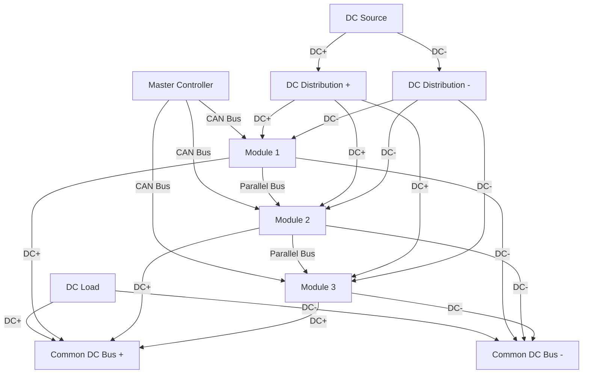

# Connectors and Interfaces

## DC Connectors (Port A - Input)

### DC Input Connectors

The ADB-PC-DC01 features high-current DC connectors for the input side (Port A), designed for reliable operation with various DC sources:

| **Specification** | **Value** | **Notes** |
|-------------------|-----------|-----------|
| **Connector Type** | RADSOK Size 8mm | High-current contact technology |
| **Manufacturer** | Amphenol | Industry-leading reliability |
| **Series** | SurLock Plus (SLP-HIR-B) | Locking mechanism for safety |
| **Quantity** | 2x Port A | Positive and negative connections |
| **Current Rating** | ±120 A | Bidirectional operation |
| **Voltage Rating** | 1000 V | Suitable for 950V DC operation |

### DC Connector Features

!!! info "SurLock Plus Benefits"
    - **Positive Locking**: Prevents accidental disconnection
    - **High Current Capacity**: RADSOK technology for low contact resistance
    - **Environmental Sealing**: IP67 rating when mated
    - **Touch Safe**: Finger-safe design per UL standards
    - **Keying**: Polarized to prevent incorrect connection

### DC Wiring Configuration (Port A)

```mermaid
graph TD
    A[DC Source +] -->|DC+| B[DC Connector 1 (Port A+)]
    C[DC Source -] -->|DC-| D[DC Connector 2 (Port A-)]
    G[PE Ground] -->|Safety Ground| H[PE Terminal]
    
    B --> I[DC/DC Converter Port A]
    D --> I
    H --> I
```

## DC Connectors (Port B - Output)

### DC Output Connectors

The DC output side (Port B) features robust bidirectional connectors for the high-voltage DC link:

| **Specification** | **Value** | **Notes** |
|-------------------|-----------|-----------|
| **Connector Type** | RADSOK Size 10.3mm | Larger size for higher current/voltage |
| **Manufacturer** | Amphenol | SurLock Plus series |
| **Series** | SLP-HIR-C | High-current locking design |
| **Quantity** | 2x Port B | Positive and negative connections |
| **Current Rating** | ±220 A | Bidirectional operation |
| **Voltage Rating** | 1500 V | Suitable for 1500V DC operation |

### DC Connector Configuration (Port B)

!!! warning "DC Polarity"
    Proper polarity must be observed when connecting DC cables. Reverse polarity connection will result in fault conditions and potential equipment damage.

```mermaid
graph LR
    A[DC Load +] -->|Port B+| B[DC Connector 1 (Port B+)]
    C[DC Load -] -->|Port B-| D[DC Connector 2 (Port B-)]
    
    B --> E[DC/DC Converter Port B+]
    D --> F[DC/DC Converter Port B-]
    
    G[Integrated Fuse] -->|Positive Line| B
```

## Control and Communication Connectors

### CAN Bus Connectors

The module includes redundant CAN bus connections for robust communication:

| **Specification** | **Value** | **Notes** |
|-------------------|-----------|-----------|
| **Connector Type** | Automotive-grade | Locking connector |
| **Quantity** | 2x CAN connectors | Redundant connections |
| **Protocol** | CAN 2.0B | 29-bit identifier support |
| **Isolation** | Isolated interface | Safety isolation |

### Control Power Connector

| **Specification** | **Value** | **Notes** |
|-------------------|-----------|-----------|
| **Function** | 24V Control Power | Module control supply |
| **Connector Type** | Automotive-grade | Reliable connection |
| **Voltage Range** | 20-28 V DC | Nominal 24V |
| **Current Draw** | Up to 3A | Peak during startup |

### Connector Layout

```mermaid
graph TB
    A[Module Front Panel] --> B[DC Connectors Port A (+,-)]
    A --> C[DC Connectors Port B (+,-)]
    A --> D[CAN Bus 1]
    A --> E[CAN Bus 2]
    A --> F[24V Control Power]
    A --> G[Hardware Interlock]
    
    H[Connection Diagram] --> I[DC Input: 2x SurLock SLP-HIR-B]
    H --> J[DC Output: 2x SurLock SLP-HIR-C]
    H --> K[Control: 2x CAN + 1x Power]
```

## Hardware Interlock Interface

### Safety Interlock System

The ADB-PC-DC01 incorporates a hardware interlock system for safety-critical applications:

- **Function**: Emergency shutdown and safety monitoring
- **Interface**: Dedicated safety-rated connector
- **Response Time**: <10ms for emergency shutdown
- **Compliance**: SIL2/PLd safety rating

### Interlock Applications

- Emergency stop circuits
- Door interlocks on enclosures
- Temperature monitoring interlocks
- Pressure monitoring for liquid cooling

## Parallel Operation Connections

### Paralleling Interface

When operating multiple modules in parallel, additional connections are required:

| **Connection Type** | **Purpose** | **Interface** |
|-------------------|-------------|---------------|
| **Current Sharing** | Load balancing | Internal CAN bus |
| **Synchronization** | Phase locking | Distributed control |
| **Fault Sharing** | System protection | Inter-module communication |
| **Status Sharing** | System monitoring | Redundant communication |

### Parallel Configuration Example



## Connector Installation Guidelines

### DC Connector Installation (Port A and Port B)

1. **Polarity Verification**
   - Double-check polarity before connection for both input and output.
   - Use multimeter to verify voltage polarity.
   - Connect positive and negative conductors correctly.

2. **Cable Requirements**
   - Use cables rated for 1500V DC operation for Port B and 1000V DC for Port A.
   - Appropriate current rating for ±120A (Port A) and ±220A (Port B) operation.
   - Consider voltage drop in long cable runs.
   - Use appropriate cable gauge for continuous current.
   - Strip insulation to manufacturer specifications.
   - Use proper crimping tools for contact termination.

3. **Connection Procedure**
   - Ensure power is disconnected before installation.
   - Connect PE ground conductor first.
   - Mate connectors until positive lock is engaged.
   - Verify proper torque on all connections.

### Control Connector Installation

1. **CAN Bus Wiring**
   - Use twisted pair cables for CAN_H and CAN_L.
   - Maintain proper impedance (120Ω characteristic).
   - Install termination resistors at bus ends.

2. **Control Power Wiring**
   - Use adequate wire gauge for 3A current.
   - Include overcurrent protection in 24V supply.
   - Consider voltage drop in long cable runs.

## Connector Maintenance

### Regular Inspection

- **Visual Inspection**: Check for corrosion, damage, or loose connections.
- **Torque Verification**: Re-torque connections per maintenance schedule.
- **Contact Resistance**: Measure contact resistance during maintenance.
- **Insulation Testing**: Verify insulation integrity.

### Replacement Guidelines

- **Contact Replacement**: Replace contacts showing signs of wear or damage.
- **Seal Replacement**: Replace environmental seals during maintenance.
- **Locking Mechanism**: Verify proper operation of locking features.

## Connector Environmental Ratings

### Environmental Protection

| **Connector Type** | **IP Rating** | **Operating Temperature** | **Corrosion Resistance** |
|-------------------|---------------|-------------------------|------------------------|
| **DC Connectors (Port A)** | IP67 (mated) | -40°C to +125°C | Salt spray resistant |
| **DC Connectors (Port B)** | IP67 (mated) | -40°C to +125°C | Salt spray resistant |
| **Control Connectors** | IP65 (mated) | -40°C to +105°C | Industrial grade |

### Chemical Resistance

All connectors are designed to resist:
- Industrial chemicals and solvents
- UV radiation exposure
- Ozone and atmospheric contaminants
- Hydraulic fluids and lubricants
