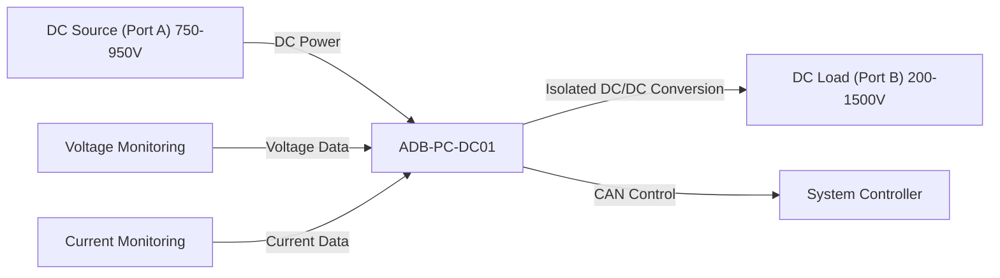
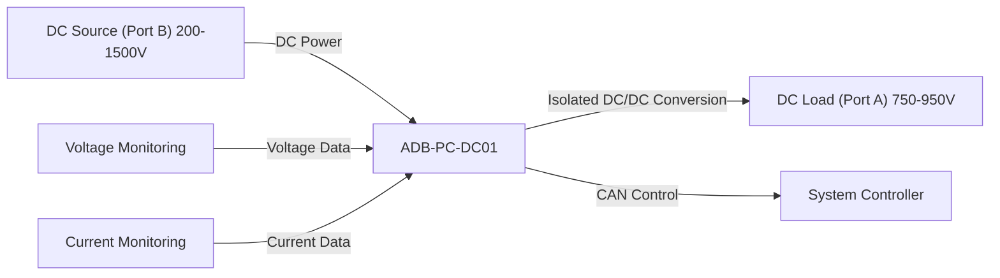
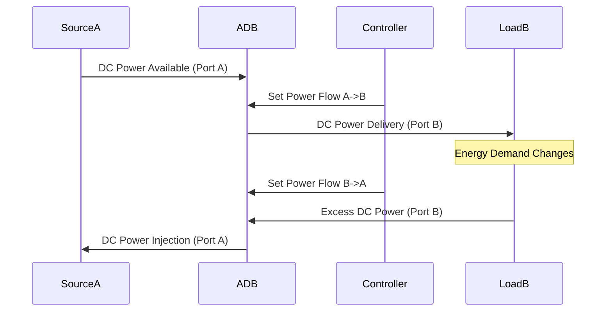
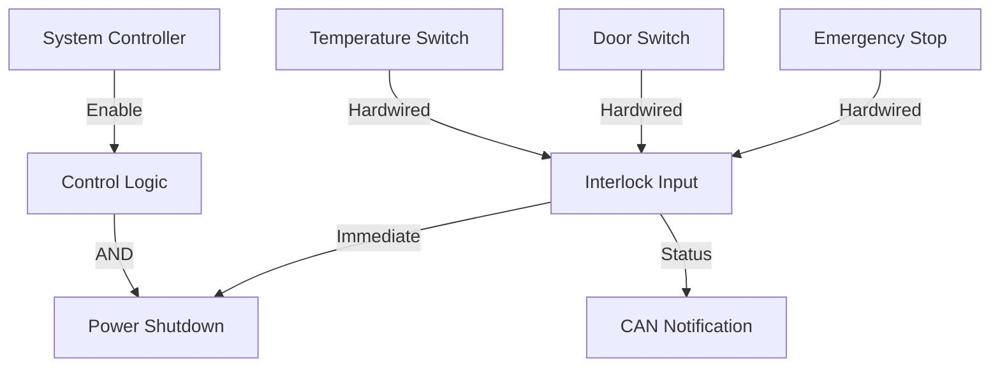
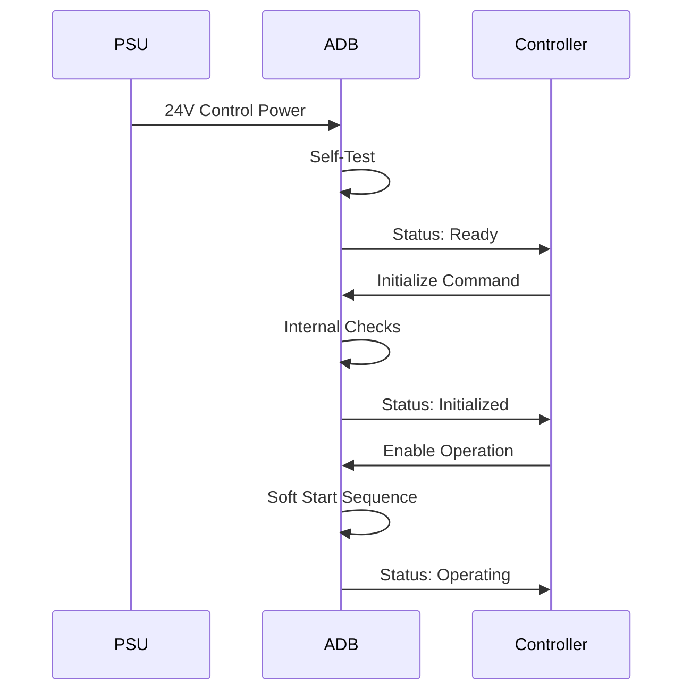
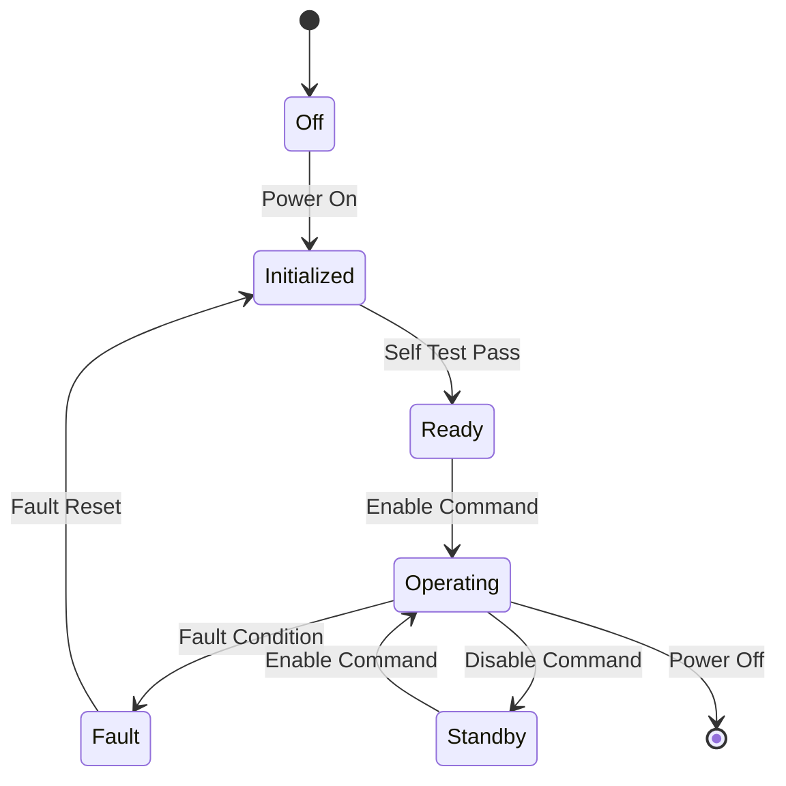

# Operation

## Operating Modes

The ADB-PC-DC01 supports bidirectional power flow between two isolated DC buses, accommodating various application requirements:

### DC/DC Conversion Mode (Port A to Port B)

In this mode, the module converts DC power from Port A (input) to a regulated DC output power on Port B:



**Key Features:**
- Programmable DC output voltage (200-1500V).
- Current limiting and overcurrent protection.
- High efficiency (98% peak).
- Reinforced galvanic isolation.

### DC/DC Conversion Mode (Port B to Port A)

In this mode, the module converts DC power from Port B (input) to a regulated DC output power on Port A:



**Key Features:**
- Bidirectional power flow for applications like V2G or energy storage.
- Seamless transition between power flow directions.
- Active power management.

### Bidirectional Mode

In bidirectional mode, the module seamlessly transitions between power flow directions based on system demand:



## Control Interface

### CAN Bus Communication

The primary control interface is through CAN 2.0B protocol:

#### Message Structure

```
CAN Frame Structure:
- Identifier: 29-bit extended format
- Data Length: 0-8 bytes
- Bit Rate: Configurable (125 kbps to 1 Mbps)
- Frame Type: Data and Remote frames
```

#### Control Commands

| **Command Type** | **CAN ID** | **Data Bytes** | **Description** |
|------------------|------------|----------------|-----------------|
| **Power Setpoint** | 0x100 | 4 bytes | Active power reference |
| **Mode Control** | 0x101 | 1 byte | Operating mode selection |
| **Voltage Reference** | 0x102 | 2 bytes | DC voltage setpoint for Port B |
| **Status Request** | 0x103 | 0 bytes | Module status query |
| **Fault Reset** | 0x104 | 1 byte | Fault condition reset |

#### Status Messages

| **Message Type** | **CAN ID** | **Update Rate** | **Content** |
|------------------|------------|-----------------|-------------|
| **Operational Status** | 0x200 | 100ms | Mode, state, alarms |
| **Electrical Data** | 0x201 | 50ms | Voltages, currents, power (both ports) |
| **Temperature Data** | 0x202 | 1s | Module temperatures |
| **Fault Status** | 0x203 | Event-driven | Fault codes and details |

### Hardware Interlock

The hardware interlock provides safety-critical control functions:



## Startup Sequence

### Power-On Sequence



### Operating State Machine



## Protection and Fault Handling

### Protection Levels

| **Protection Level** | **Response Time** | **Action** | **Recovery** |
|---------------------|-------------------|------------|--------------|
| **Level 1** | <1ms | Immediate shutdown | Manual reset required |
| **Level 2** | <10ms | Graceful shutdown | Automatic retry after delay |
| **Level 3** | <100ms | Power limiting | Automatic recovery |
| **Level 4** | <1s | Warning/alarm | No action required |

### Fault Categories

#### Critical Faults (Level 1)
- Ground fault detection
- Overcurrent protection activation (Port A or B)
- Overtemperature shutdown
- Hardware interlock activation
- Isolation fault

#### Serious Faults (Level 2)
- DC overvoltage/undervoltage (Port A or B)
- Communication loss timeout
- Internal component failure

#### Minor Faults (Level 3)
- Power derating due to temperature
- Current limiting activation
- Efficiency below expected

#### Informational (Level 4)
- Maintenance reminders
- Performance warnings
- Configuration mismatches
- Environmental alerts

### Fault Recovery Procedures

- **Fault Detection** *(Level 2)* → **Graceful Shutdown**
- **Fault Detection** *(Level 3)* → **Power Limiting**
- **Fault Detection** *(Level 4)* → **Alarm Only**
- **Immediate Shutdown** → **Fault Latch**
- **Graceful Shutdown** → **Auto Retry Timer**
- **Power Limiting** → **Monitor Recovery**
- **Alarm Only** → **Log Event**
- **Fault Latch** *(Manual Reset)* → **Restart Sequence**
- **Auto Retry Timer** *(Timer Expired)* → **Automatic Restart**
- **Monitor Recovery** *(Condition Cleared)* → **Normal Operation**
- **Log Event** → **Continue Operation**

## Performance Monitoring

### Real-time Monitoring

The module continuously monitors and reports:

#### Electrical Parameters
- DC voltage (Port A and Port B)
- DC current (Port A and Port B)
- DC power (Port A and Port B)
- Efficiency

#### Thermal Parameters
- Heat sink temperature
- Ambient temperature
- Cooling system temperature
- Power semiconductor temperature

#### Operational Parameters
- Operating mode and state
- Fault status and history
- Maintenance counters
- Runtime statistics

### Data Logging

Historical data is maintained for:
- Energy production/consumption
- Operating hours and cycles
- Fault events and timestamps
- Performance trends and analysis

## Maintenance Operations

### Routine Maintenance

!!! info "Maintenance Schedule"
    - **Daily**: Visual inspection of indicators and displays
    - **Weekly**: Check for fault codes and alarms
    - **Monthly**: Verify electrical connections and torque
    - **Quarterly**: Comprehensive performance check
    - **Annually**: Complete system inspection and testing

### Diagnostic Functions

The module provides built-in diagnostic capabilities:
- Self-test routines
- Component health monitoring
- Performance degradation analysis
- Predictive maintenance alerts

### Firmware Updates

Firmware updates can be performed through the integrated gateway:
- Secure update process with verification
- Rollback capability in case of issues
- Update scheduling to minimize downtime
- Compatibility checking before installation
