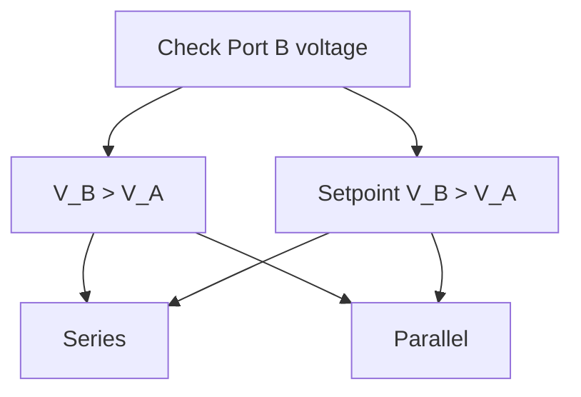
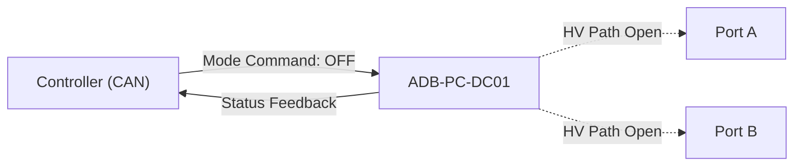
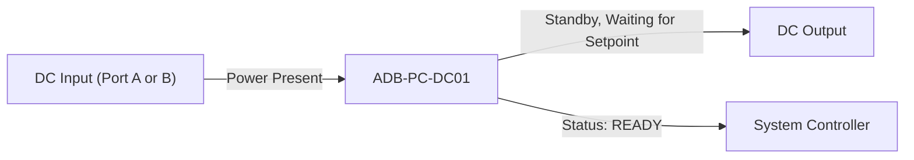

# Theory of Operation

The ADB-PC-DC01 is a DC/DC converter that provides reinforced isolation.
It can be used together with other DC power supplies to drive Loads in the
megawatt range by providing user configurable drooping capability.

The module is able to operate over a very wide range of output voltages, reaching up to double the input voltage.
this is acheived using a novel interconnection strategy that utilizes the isolation to boost the output voltage
above the intput voltage, thus reaching the voltages required for MCS charging applications.

## Applications
The ADB-PC-DC01 has many use cases, as both Isolation and fully bidirectional capability make it very versatile.
One of the main applications for which it was designed is as a component of an MCS charging system.
This application requires a very wide voltage range on the vehicle side to allow all kind of vehicle types to be connected,
while expecting a relatively constant source on the other side.
Thus even though the module is fully bidirectional, port A and port B are not symmetrical. Port B can be reconfigured internally to
expand the voltage range of that port, while port A cannot be reconfigured. When used in an MCS charging system, port A would thus be
connected toward the grid, while port B may be directly connected to the chaging pistol. When deploying the DC01, this asymmetry
should be kept in mind.

## Module architecture
To reach the wide output voltage range required by MCS, the ADB-PC-DC01 utilizes two power conversion subsystems that reconfigure
depending on the voltage present at port A and port B. These subsystems are then connected either in a 'quasi parallel' or in a
'quasi series' connection. The particular configuration has an impact on the voltages and currents at port B. In the 'quasi parallel'
connection, port B is able to provide double the current as in the 'quasi series' connection. Furthermore the two connection types have
separate voltage regimes, the 'quasi parallel' connection is used from 0V up to the voltage present on port A (Va), while the
'quasi series' connection is used when 2Va > Vb > Va. To prevent the system switching back and forth between 'quasi-parallel'
and 'quasi-series' connections when Va = Vb, the switchover algorithm implements Hysteresis. This reconfiguration is done automatically
and without requiring any external intervention.

## Operational Modes
The ADB-PC-DC01 has a single operational mode (other than 'Idle') which is 'Port B control'. This means that when the converter is
operating the output of Port B is actively controlled depending on the setpoints of the converter and the characteristics of the load
connected to port B. Port A is left uncontrolled, meaning that Va * Ia + Pl = Vb * Ib, where Pl being the losses in the converter
itself. Thus an external system is needed to control the voltage on port A while being able to provide the current needed to satisfy
the previous equation at all times.

Port B itself is controlled using a CV/CC algothim.
This means that the main regulation target for the converter is the voltage at Port B, while the current is within
the limits specified by the user. While within the current limits, the converter will maintain the voltage at port B.
If the output current limit is reached, the current of port B is controlled, with the voltage then dependent on the load.

### Port B reconfiguration
During operation the DC01 may configure its output from 'quasi-series' to 'quasi-parallel' or vice-versa.
The switchover from 'quasi-parallel' to 'quasi-series' is done when the port B voltage approaches the top of the voltage range of the converter in this configuration.
In the parallel configuration, the maximum voltage is the Input voltage + 5%, while the minimum voltage in series configuration is V_in - 5%.
Hysteresis prevents the converter from switching between the output configurations.
During startup, an initial port b configuration is chosen based on either the voltage present at port B, or if no voltage can be measured at port B, or on the voltage setpoint.



## Booting procedure

## OFF Mode

In this state, the power stage is disabled and all high-voltage paths are open.
Only the control circuitry and communication interface are active.



**Characteristics**

| Parameter            | Description                              |
| -------------------- | ---------------------------------------- |
| Power Stage          | Disabled                                 |
| HV Contactors        | Open                                     |
| Isolation Monitoring | Active                                   |
| CAN Communication    | Active                                   |
| Fault Handling       | Reports active faults only               |
| Typical Use          | Safe idle, maintenance, or standby state |

**Transition From:** Any mode → OFF (command or fault)
**Transition To:** ON (command and safety checks passed)


## ON Mode

The converter is powered, initialized, and ready to regulate power according to the selected control mode (CV or CC).
No energy transfer occurs until a valid setpoint is received.



**Characteristics**

| Parameter    | Description                               |
| ------------ | ----------------------------------------- |
| Power Stage  | Energized, zero current until commanded   |
| Control Loop | Active and waiting for CV or CC setpoint  |
| Protection   | All protections armed (OV, OC, OT)        |
| Typical Use  | Pre-operational standby before regulation |

## Constant Voltage (CV) Mode

The module regulates the output voltage to a programmed **setpoint** while allowing current to vary within rated limits.

```mermaid
graph LR
    A("DC Source (Input Port)") --> B("ADB-PC-DC01")
    B -->|Regulated Vout| C("Load (Output Port)")
    D("Controller") -->|Set Vout command| B
    B -->|Feedback (V/I)| D
```

**Characteristics**

| Parameter           | Description                                            |
| ------------------- | ------------------------------------------------------ |
| Control Objective   | Maintain Vout = setpoint                               |
| Current Limit       | Limited by rated current or active limit value         |
| Typical Application | Battery charging, DC bus regulation                    |
| Protection          | Over-current → transition to CC limit or shutdown      |
| Control via CAN     | `Power Mode = CV`, `Voltage Setpoint`, `Current Limit` |

**Behavior**

* When load current ≤ limit → stays in CV regulation.
* If current demand exceeds limit → transitions automatically into **CC mode** to protect the converter.


## Constant Current (CC) Mode

The module regulates the output current to the commanded setpoint while allowing voltage to vary as needed within safe limits.

```mermaid
graph LR
    A["DC Source (Input Port)"] --> B["ADB-PC-DC01"]
    B -->|Regulated Iout| C["Load (Output Port)"]
    D["Controller"] -->|Set Iout command| B
    B -->|Feedback (V/I)| D
```

**Characteristics**

| Parameter           | Description                                            |
| ------------------- | ------------------------------------------------------ |
| Control Objective   | Maintain Iout = setpoint                               |
| Voltage Limit       | Limited by maximum rated output voltage                |
| Typical Application | Battery discharging, current-limited load              |
| Protection          | Over-voltage → transition to CV limit or shutdown      |
| Control via CAN     | `Power Mode = CC`, `Current Setpoint`, `Voltage Limit` |

**Behavior**

* When load voltage ≤ limit → remains in CC regulation.
* If voltage rises to the limit → transitions automatically into **CV mode**.
