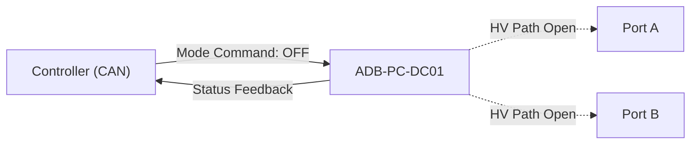
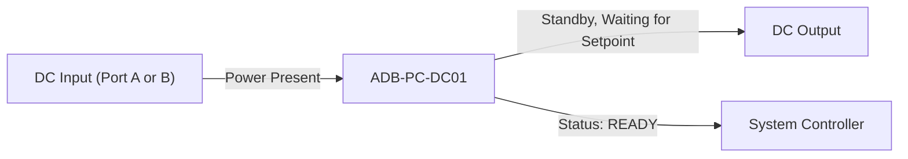

# Operating Modes

The ADB-PC-DC01 module operates in **four primary modes** controlled through CAN bus commands or digital control inputs.
Each mode defines the internal power-conversion state and external power-flow behavior.

## OFF Mode

In this state, the power stage is disabled and all high-voltage paths are open.
Only the control circuitry and communication interface are active.



**Characteristics**

| Parameter            | Description                              |
| -------------------- | ---------------------------------------- |
| Power Stage          | Disabled                                 |
| HV Contactors        | Open                                     |
| Isolation Monitoring | Active                                   |
| CAN Communication    | Active                                   |
| Fault Handling       | Reports active faults only               |
| Typical Use          | Safe idle, maintenance, or standby state |

**Transition From:** Any mode → OFF (command or fault)
**Transition To:** ON (command and safety checks passed)


## ON Mode

The converter is powered, initialized, and ready to regulate power according to the selected control mode (CV or CC).
No energy transfer occurs until a valid setpoint is received.



**Characteristics**

| Parameter    | Description                               |
| ------------ | ----------------------------------------- |
| Power Stage  | Energized, zero current until commanded   |
| Control Loop | Active and waiting for CV or CC setpoint  |
| Protection   | All protections armed (OV, OC, OT)        |
| Typical Use  | Pre-operational standby before regulation |

## Constant Voltage (CV) Mode

The module regulates the output voltage to a programmed **setpoint** while allowing current to vary within rated limits.

```mermaid
graph LR
    A("DC Source (Input Port)") --> B("ADB-PC-DC01")
    B -->|Regulated Vout| C("Load (Output Port)")
    D("Controller") -->|Set Vout command| B
    B -->|Feedback (V/I)| D
```

**Characteristics**

| Parameter           | Description                                            |
| ------------------- | ------------------------------------------------------ |
| Control Objective   | Maintain Vout = setpoint                               |
| Current Limit       | Limited by rated current or active limit value         |
| Typical Application | Battery charging, DC bus regulation                    |
| Protection          | Over-current → transition to CC limit or shutdown      |
| Control via CAN     | `Power Mode = CV`, `Voltage Setpoint`, `Current Limit` |

**Behavior**

* When load current ≤ limit → stays in CV regulation.
* If current demand exceeds limit → transitions automatically into **CC mode** to protect the converter.


## Constant Current (CC) Mode

The module regulates the output current to the commanded setpoint while allowing voltage to vary as needed within safe limits.

```mermaid
graph LR
    A["DC Source (Input Port)"] --> B["ADB-PC-DC01"]
    B -->|Regulated Iout| C["Load (Output Port)"]
    D["Controller"] -->|Set Iout command| B
    B -->|Feedback (V/I)| D
```

**Characteristics**

| Parameter           | Description                                            |
| ------------------- | ------------------------------------------------------ |
| Control Objective   | Maintain Iout = setpoint                               |
| Voltage Limit       | Limited by maximum rated output voltage                |
| Typical Application | Battery discharging, current-limited load              |
| Protection          | Over-voltage → transition to CV limit or shutdown      |
| Control via CAN     | `Power Mode = CC`, `Current Setpoint`, `Voltage Limit` |

**Behavior**

* When load voltage ≤ limit → remains in CC regulation.
* If voltage rises to the limit → transitions automatically into **CV mode**.
