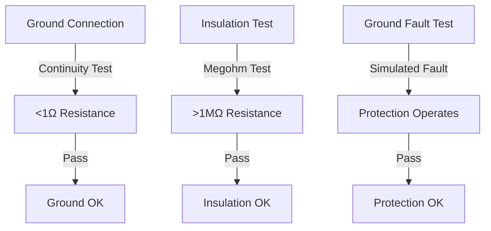

# Safety Considerations

!!! danger "Critical Safety Notice"
    This equipment operates with dangerous voltages and currents. Improper installation, operation, or maintenance can result in serious injury or death. Only qualified personnel should install, operate, or service this equipment. ADVANTICS assumes no liability for any injury, damage, or loss resulting from the installation, operation, or misuse of this equipment.

## Qualified Personnel

Installation, operation, and maintenance of the ADB-PC-DC01 must be performed by personnel who:

- Are trained and authorized to work on high voltage electrical equipment.
- Understand the risks associated with power electronics, especially high voltage DC systems.
- Are familiar with applicable safety standards and regulations.
- Have appropriate personal protective equipment (PPE).
- Understand lockout/tagout procedures.

## Electrical Safety

#### High Voltage Hazards

!!! warning "High Voltage Danger"
    The ADB-PC-AC01 operates with DC voltages up to 1500 VDC. These voltages can cause severe electrical shock, burns, or death.

#### Voltage Levels Present

| **Circuit Type** | **Voltage Range** | **Hazard Level** |
|------------------|-------------------|------------------|
| **DC Input (Port A)** | 750-950V DC | High |
| **DC Output (Port B)** | 200-1500V DC | High |
| **Control Power** | 24V DC | Low |

#### Electrical Safety Requirements

1. **Lockout/Tagout (LOTO)**
      - Always use proper lockout/tagout procedures.
      - Verify zero energy state before work.
      - Use appropriate locks and tags.
      - Follow company safety procedures.

2. **Personal Protective Equipment (PPE)**
      - Insulated gloves.
      - Safety glasses.
      - Hard hat.
      - Safety boots.

3. **Tools and Equipment**
      - Use insulated tools rated for voltage level.
      - Verify tool condition before use.
      - Use proper test equipment.
      - Maintain safe working distances.

#### Arc Flash Hazards

!!! danger "Arc Flash Risk"
    High fault currents can create arc flash hazards. Proper arc flash analysis and PPE are required.

**Arc Flash Prevention**

- Never work on energized equipment.
- Use proper switching procedures.
- Maintain equipment in good condition.
- Follow all safety procedures.

#### Grounding and Bonding

Proper grounding is essential for safety:

**Grounding Requirements**

- Equipment grounding conductor required.
- System grounding per local codes.
- Bonding of all metallic parts.
- Ground fault protection.

**Grounding Verification**

## Thermal Safety

#### Hot Surfaces

!!! warning "Burn Hazard"
    Surfaces may become hot during operation. Allow adequate cooling time before handling.

#### Thermal Hazards

- Heat sink temperatures up to 80°C.
- Cooling system components.
- Electrical connection points.

#### Cooling System Safety

The liquid cooling system operates under pressure and with hot fluids:

**Cooling System Hazards**

- Pressurized fluid.
- Hot coolant.
- Chemical exposure (ethylene glycol).
- Slip hazards from leaks.

**Cooling System Safety Procedures**

1. **Pressure Safety**
      - Depressurize before service (turn off pumps).

2. **Chemical Safety**
      - Use appropriate PPE for coolant.
      - Avoid skin and eye contact.
      - Provide adequate ventilation.
      - Follow MSDS requirements of your coolant.

## Mechanical Safety

#### Heavy Equipment

!!! warning "Lifting Hazard"
    The ADB-PC-DC01 weighs around 40kg. Use proper lifting techniques and equipment.

**Lifting Safety**

- Use mechanical lifting equipment.
- Follow proper lifting procedures.
- Ensure adequate personnel.
- Check equipment condition.

**Remember: Safety is everyone's responsibility. When in doubt, stop the work and seek guidance from qualified personnel.**

