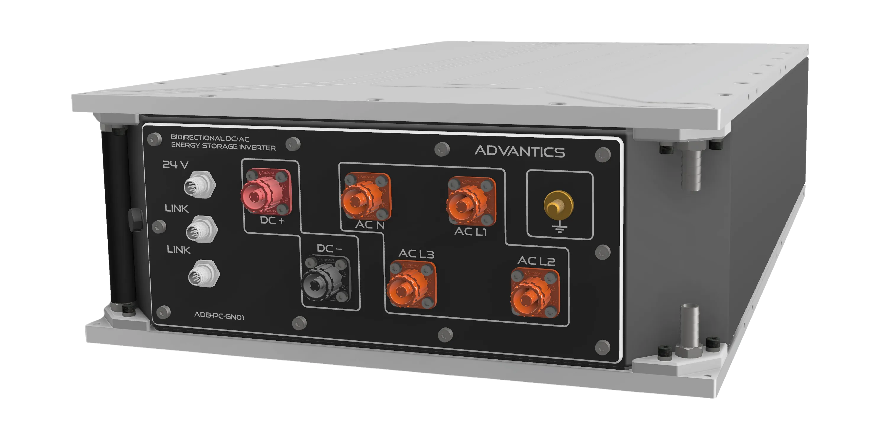

  

    

      ADB-PC-GN01
    

    

      90kVA Bidirectional Four-Wire DC/AC Converter
    

    
User Manual

    

      
    

  

  

    
  

  

  

    
<strong>Document Version:</strong> 1.0

    
<strong>Release Date:</strong> October 2025

    
<strong>Document Classification:</strong> Public

  

---

<!-- Force a new PDF page -->

## Document Information

| **Property** | **Value** |
|--------------|-----------|
| **Product** | ADB-PC-GN01 |
| **Description** | 90kVA Bidirectional Four-Wire DC/AC Converter |
| **Document Type** | User Manual |
| **Version** | 1.0 |
| **Last Updated** | June 2026 |

---

## Trademarks and Copyright

© 2025 ADVANTICS SAS. All rights reserved.

---

## Get in Touch

- ADVANTICS website: [advantics.fr](https://advantics.fr/)  
- Product page: [ADB-PC-GN01](https://advantics.fr/products/ADB-PC-GN01/)
- Discover our portfolio: [ADVANTICS Products](https://advantics.fr/products/)
- Sales: [sales@advantics.fr](mailto:sales@advantics.fr)
- Marketing: [marketing@advantics.fr](mailto:marketing@advantics.fr) 
- Technical Support: [Support Desk](https://advantics.atlassian.net/servicedesk/customer/portal/1)

---

  

    This document contains proprietary information of ADVANTICS SAS. 
    No part of this document may be reproduced in any form without written permission.
  

---
