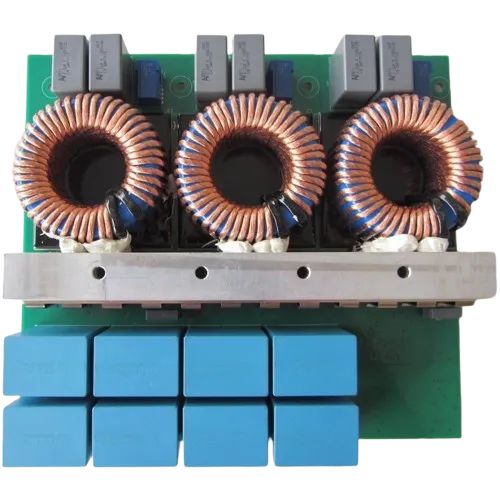

  

    

      ADM-PC-BP25
    

    

      3-phase Active Front-End (AFE)
    

    
User Manual

    

      
    

  

  

    
  

  

  

    
<strong>Document Version:</strong> 1.0

    
<strong>Release Date:</strong> July 2026

    
<strong>Document Classification:</strong> Public

  

---

<!-- Force a new PDF page -->

## Document Information

| **Property** | **Value** |
|--------------|-----------|
| **Product** | ADM-PC-BP25 |
| **Description** | 3-phase Active Front-End (AFE) |
| **Document Type** | User Manual |
| **Version** | 1.0 |
| **Last Updated** | July 2026 |

---

## Scope of this Document

This document is a user manual for ADM-PC-BP25, produced by ADVANTICS
([advantics.fr](https://advantics.fr/)).

---

## Trademark and Copyright

© 2025 ADVANTICS SAS. All rights reserved.

All trademarks within this guide belong to their legitimate owners.

---

## Disclaimer

!!! info "FCC"
    ADM-PC-BP25 is an OEM subassembly intended for incorporation into equipment manufactured by the
    system integrator. Whether FCC equipment-authorization and technical requirements apply, and which
    ones, depends on the configuration and intended use of the finished equipment. The integrator is
    responsible for determining and demonstrating compliance of the finished product with applicable
    FCC requirements, for following the installation instructions provided by Advantics, and for
    ceasing operation of the equipment on finding that it causes harmful interference.

---

## Get in Touch

- ADVANTICS website: [advantics.fr](https://advantics.fr/)  
- Product page: [ADM-PC-BP25](https://advantics.fr/products/ADM-PC-BP25/)  
- Discover our portfolio: [ADVANTICS Products](https://advantics.fr/products/)  
- Sales: [sales@advantics.fr](mailto:sales@advantics.fr)
- Technical Support: [Support Desk](https://advantics.atlassian.net/servicedesk/customer/portal/1)

Please direct any comments or suggestions about this document to
[info@advantics.fr](mailto:info@advantics.fr).

---

  

    This document contains proprietary information of Advantics SAS. 
    No part of this document may be reproduced in any form without written permission.
  

---
