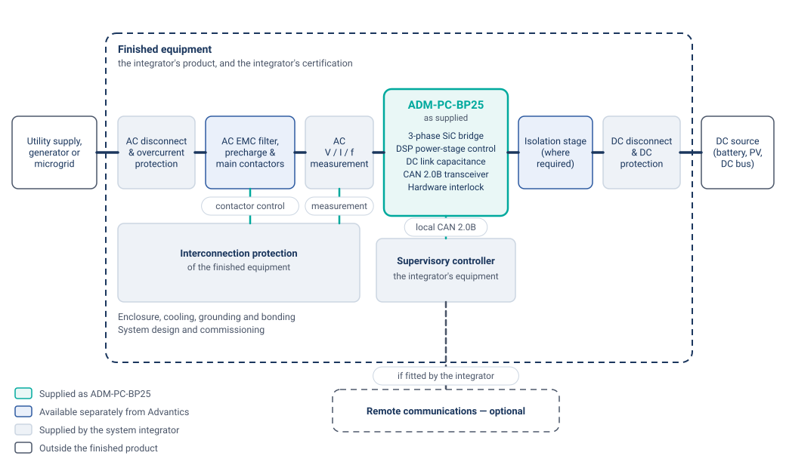

# ADM-PC-BP25 Module Overview

The ADM-PC-BP25 is a power converter with integrated controller and CAN bus interface. The main features are:

- 3-phase Silicon Carbide bridge
- Hard-switched, non-isolated topology
- Fully bidirectional power flow
- High frequency switching
- Advanced DSP control
- Flat mounting surface – compatible with extruded heatsinks and watercooling

## Product scope and system context

ADM-PC-BP25 is an OEM power-conversion subassembly supplied to equipment manufacturers for
integration into a larger electrical system. It is not a finished product and is not supplied ready
for connection to a public electric utility.

As supplied, the module comprises the 3-phase Silicon Carbide bridge, the DSP power-stage control,
the DC link capacitance, a CAN 2.0B transceiver and a hardware interlock. All control modes,
including those that operate the bridge in parallel with an AC supply, are power-stage control
functions and are documented in [Theory of operation](theory_of_operation.md).

{ width="100%" }
<figcaption style="text-align: center">ADM-PC-BP25 as supplied, within an example finished AC/DC power conversion system</figcaption>

The interconnection, protection, measurement and supervisory functions shown outside the module must
be provided by the integrator. Certification and listing of the finished equipment are determined at
system level and cannot be established from the module alone.

A per-function breakdown is given in
[Integration requirements](specifications.md#integration-requirements), and the interface boundary is
described in [Local control interface](comm_interface.md#local-control-interface).

### Related Advantics modules

Advantics supplies some of the surrounding functions as separate subassemblies: ADM-PC-LF46 provides
AC-side EMC filtering, precharge and main contactors, and ADM-PC-BI25 or ADM-PC-LL25 provide an
isolation stage. Each is supplied individually for further fabrication by the integrator; Advantics
does not supply them as a pre-integrated assembly. None of them implements interconnection
protection.

## Who is this product for?

ADM-PC-BP25 is supplied to manufacturers of power electronics equipment and to system integration
companies, as a power-conversion stage inside equipment that they design, build and certify.

Equipment built around the module includes high-power DC and AC charging systems, rescue vehicles
for electric cars, test and laboratory equipment, battery-powered systems, energy storage
converters, solar and other renewable-energy converters, and hydrogen fuel cell systems. In each
case the finished equipment, its connection to any external electrical network, and the regulatory
approvals applicable to it are determined by the manufacturer of that equipment.

## Electrical and mechanical specifications

Please see the [Specifications](specifications.md) section for ADM-PC-BP25 for electrical and mechanical details.

{ width="300px" }
<figcaption style="text-align: center">Drawing of the power module</figcaption>

## Communication protocol

The module is controlled over wired CAN 2.0B by a host controller in the same enclosure or cabinet;
see [Communication interface](comm_interface.md#local-control-interface). Where a finished product
requires remote monitoring or control, those interfaces are implemented by the integrator on the
supervisory controller.

Please see the [CAN protocol in Advantics products](can_bus_interface.md) section for details on the communication interface of the module.
