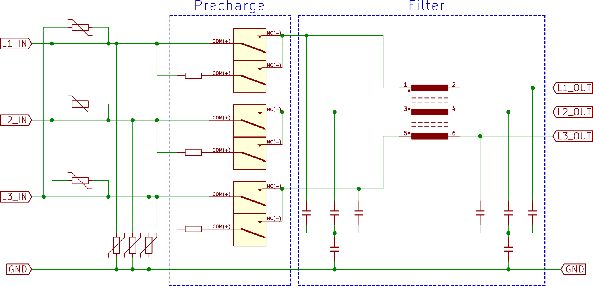
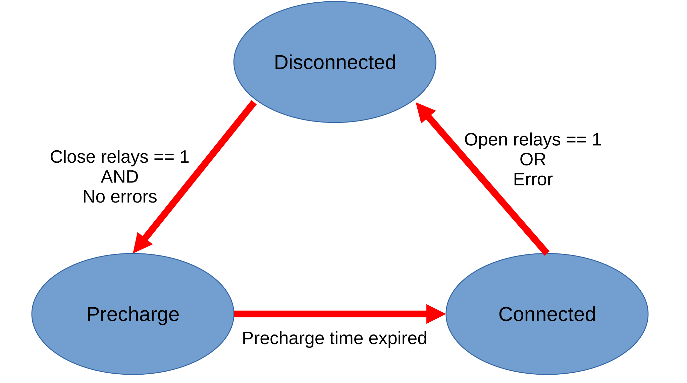

# **4.2. Control System Overview**

## Topology

The ADM-PC-LF45 is a 3-phase line filter and precharge with:

- 3-phase filter
- Smart precharge
- Phase loss detection

For more details on the specifications, please check the [ADM-PC-LF45 specifications](5_Mechanical_and_Electrical_Technical_Overview.md).

{ width="70%" }
<figcaption style="text-align: center">ADM-PC-LF45 simplified topology</figcaption>

## Enabling sequence

The ADM-PC-LF45 module has a smart precharge and filter connection sequence, which follows this state diagram:

{ width="50%" }
<figcaption style="text-align: center">ADM-PC-LF45 simplified topology</figcaption>

To connect the module, the user just needs to set the **Close relays** bit in the **Filter_relays** message. For more information, please refer to the [ADM-PC-LF45 CAN database](can_bus_overview.md) and also to the [Quick Start](6_Setting_up_ADM_PC_LF45.md#quick-start) section.
