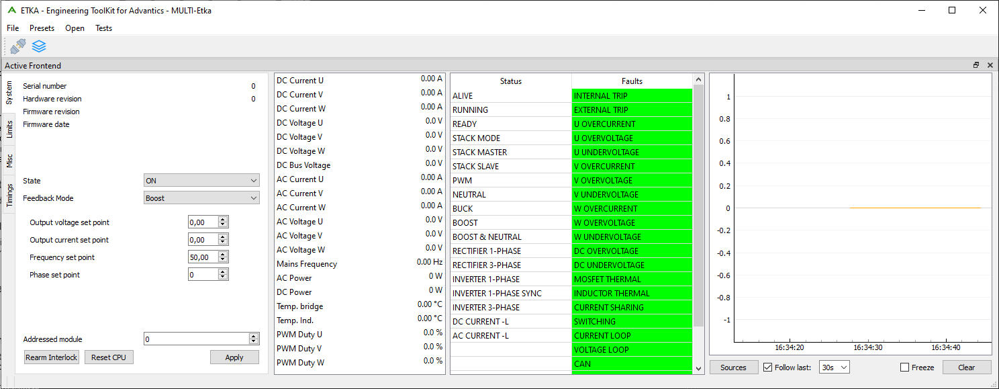

# Quick Start

This chapter only deals with high-level control. Please consult the  [ADM-PC-LF45 CAN database](can_bus_interface.md) section for the CAN bus addresses and format. The CAN database is distributed in both KCD and DBC formats.

## Multi-ETKA

Multi Engineering Toolkit for Advantics (ETKA for short), available for both Windows and Linux, consists of stand-alone application to work with ADVANTICS modules during the development stage. Its user friendly GUI together with a PeakCAN USB adapter allows customers to rapidly test and verify modules without writing any code.

{ width="80%" }
<figcaption style="text-align: center">ETKA GUI application</figcaption>

The user only needs to:

1. Connect to an available CAN bus channel.
2. Click the tab **open**, and select all the desired modules to be controlled.
3. Select the slave address of each of the modules to be connected to. 
4. (Optional) The slave address of a module can be modified by opening the **Stack Manager**, next to the **connection** button.

Once the communcation is well stablished and module information is read back, follow the [Quick Start procedure](#quick-start-procedure) to start operating the module.
## Quick start procedure

### Step 1 – Clear interlock

Modules have two types of interlock signals: **internal** which is latched in a locked state until cleared, and **external** formed from combined internal interlock signals from all other modules on the bus. Internal signal is locked when the module goes outside of its operating range (e.g., over-current, over-voltage etc.). If any of the internal and external interlock signals is locked, the module will immediately stop and will not be able to operate.
When the module is power-cycled its internal signal is locked by default for safety reasons. This will also block all other modules on the bus as their external signal will be locked. Interlock state must be cleared for all modules that have their internal signal locked by sending the **Clear_Interlock** in **Fault_Control** message **exactly once**.
Some older modules cannot separate internal and external interlock signals. When any of these two is locked, they will report both of them locked. This **does not affect** the interlock clear logic.

### Step 2 – Connect

To connect the filter, simply send the **Filter_Relays** message with the **Close_Relays** bit set, and the **Open_Relays** bit unset.

!!! note
    **Messages should be sent only when they need to be updated**, i.e., they do not need to be sent periodically.

### Step 3 – Disconnect

The filter is disconnected by one of the following two events:

- **Open_Relays** bit inside **Filter_Relays** message is set.
- Internal or external interlock signal is locked. In case of locked interlock signal, the fault must be cleared by setting **Clear_Interlock** in **Filter_Fault_Control** in order to able to continue operation.
