# **5. Installing the ADM-PC-LL25**

## Unpacking

#### Visual check of parts <!-- {docsify-ignore} -->
Check if all parts look unbroken (intact). In case of doubt, contact the sales department by the e-mail: info@advantics.fr

#### Content of package <!-- {docsify-ignore} -->
Please check the content of the package and compareit against the list attached in the transport box. 

#### Storage conditions outside of the transport box <!-- {docsify-ignore} -->
Temperature: 0 to 45 °C
Relative humidity: 20 – 80 % without condensation

<!--#### Safety and electrical insulation
The module live parts including output/input terminals are of IPXX protected.-->

## Form factor

All the ADVANTICS power modules from the MCP-25 series share a similar mechanical and electrical form factor. For example every module fits on a 300 mm wide heatsink, the height is chosen such that a space from the module base to the top of the module is always maximum 70 mm – allowing the customer to reuse the same cooling and housing concept for every MCP-25 series power converter.
Some of the common features are:
    - The narrowest X-Y dimension is less than 300 mm
    - The height of the module is less than 70 mm
    - The power inputs and outputs use M5 threaded screw terminals
    - The communication interface uses 8-pin JST CPT connector
    - Each power module have at least one (optimally two) communication interface connectors
    - All mounting screws holes for mounting to the heatsink are designed for 5 mm screws
    - 24V powered

## Cooling considerations

For a correct operation, sufficient cooling is needed. **Never run the module without a heatsink attached!** The thermal protection might not react fast enough, if the transistor bar is not cooled.
The power modules are designed to be installed on a flat metallic cooling surface. The module can output up to 750 W of heat through the aluminium bar and inductors. This heat needs to be evacuated through the user-supplied metallic plate. It is possible to use either forced aircooled heatsink or a watercooled plate. Consult the details of your implementation with ADVANTICS for cooling design verification. Pre-drilled heatsinks for module verification are also offered for rapid prototyping.
There are three cooling surfaces on this module – a transistor bar, a diode rectifier bar and a transformer block. Check the [Mounting and assembly procedure](#mounting-and-assembly-procedure) section for more information on the recommended mounting material and process.

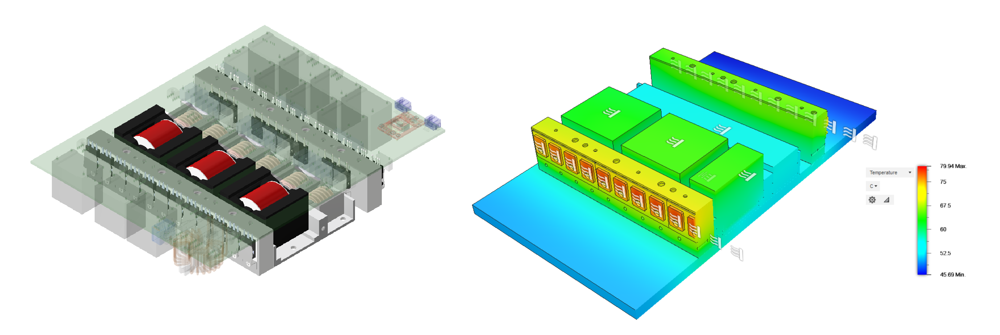{ width="80%" }
<figcaption style="text-align: center">3D view and heat distribution on LLC</figcaption>

## Drawings

The following figures show the main mechanical dimensions for mounting of the module:

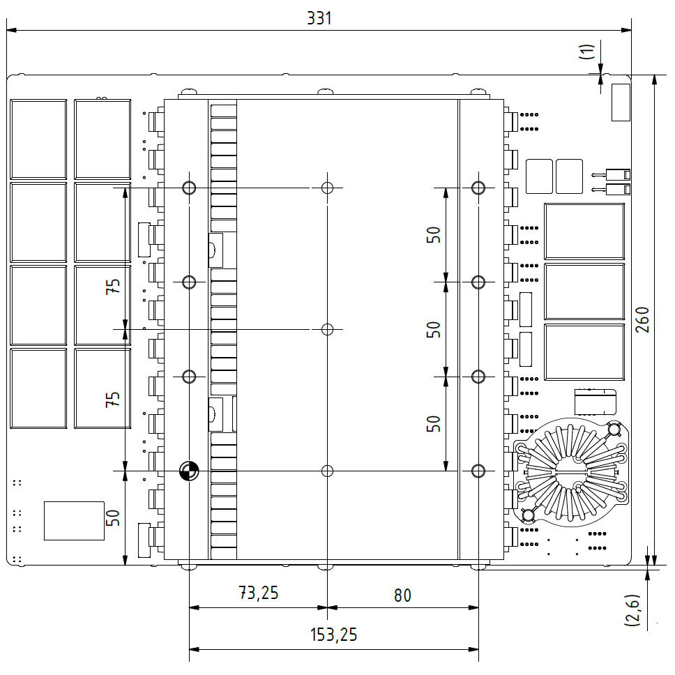{ width="30%" }
<figcaption style="text-align: center">Bottom view</figcaption>

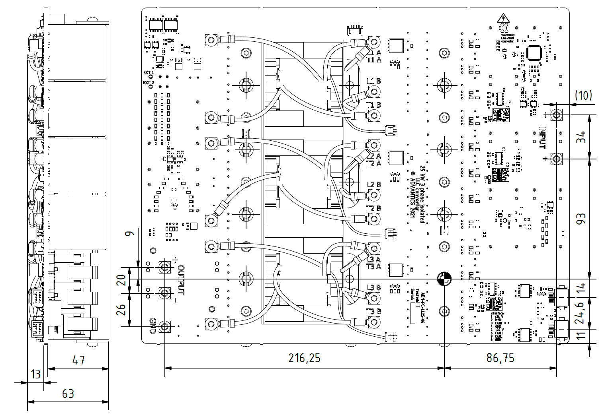{ width="40%" }
<figcaption style="text-align: center">Top and side view</figcaption>

## Mounting and assembly procedure

### Recommended accessories <!-- {docsify-ignore} -->

- ACC Silicone AS1803
- Thermal paste
- Screw ISO 14579 M5 x 55			8 pcs
- Screw ISO 14579 M5 x 30			3 pcs
- Washer spring DIN 7980 5 mm		8 pcs	
- Washer plate DIN 433 5.3 mm		11 pcs (19 pcs)
- Tool: Screwdriver bits ¼”, Torx, Size X25
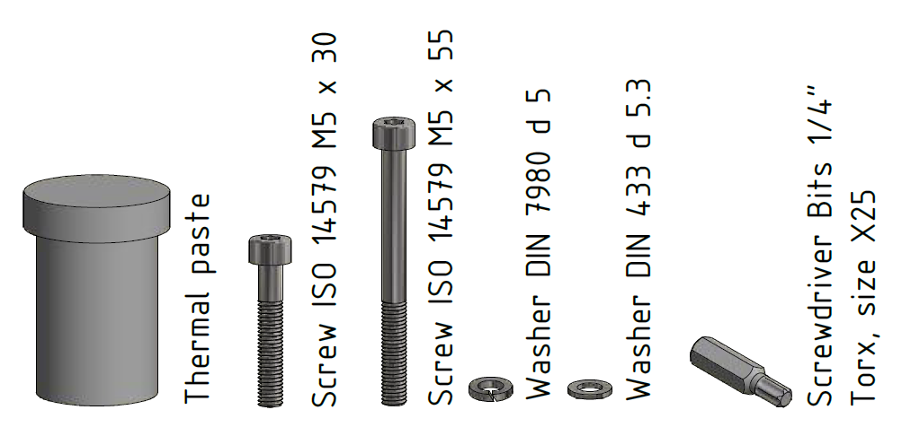{ width="40%" }
<figcaption style="text-align: center">Recommended accessories</figcaption>

### Process <!-- {docsify-ignore} -->

1. Clean the surface of the cooler (degrease).
2. Place plastic stud (spacer) Thora AB-IA-M5-SW10, AR.N: 100 32 47 in to holes in the cooler.
3. Place thermal paste on the cooling bars and cover of magnetic part on the module.

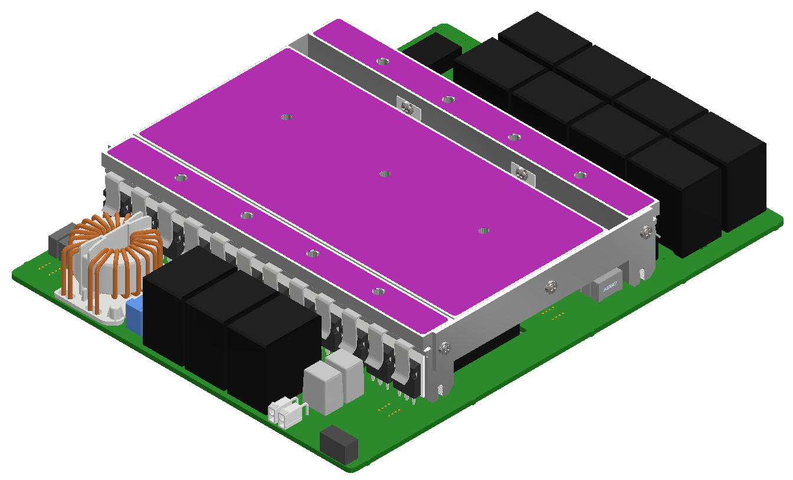{ width="40%" }
<figcaption style="text-align: center">Areas to apply thermal paste</figcaption>

4. Place the module on the cooler.
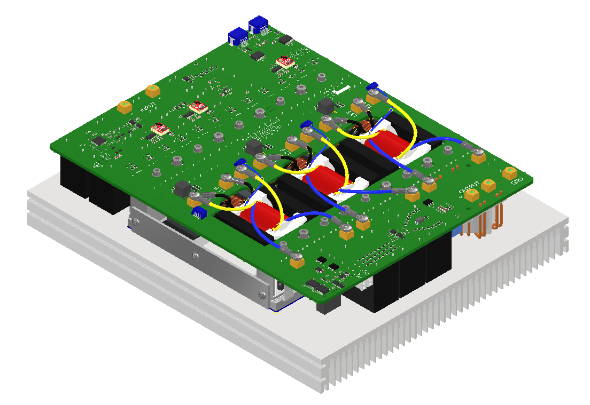{ width="40%" }
<figcaption style="text-align: center">Module on cooler</figcaption>

5. Place screws with washers into the holes. The module is designed for screws M5, but M4 are possible to use as well, if the design of the cooler request it. Apply initial tightening torque on screws of 2.5 Nm. After a thermal cycle, retight all screws to the nominal torque. 

!!! warning
    After applying power and having performed a thermal cycle, make sure the module is turned off, cooled down and free of any remaining current or charge in the capacitors before reapplying the torque.

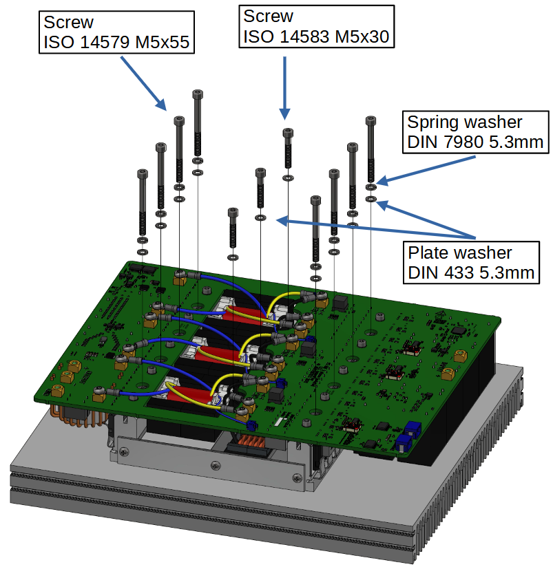{ width="40%" }
<figcaption style="text-align: center">Screws insertion</figcaption>

## Cabling

### Power terminals<!-- {docsify-ignore} -->
The power modules use press-fit PCB terminals for connecting the power cables or bus bars. The thread is M5, and the maximum length of a screw can be 6 mm, measured from the top of the terminal. It is possible to use a longer screw, for example when a bus bar or lug terminal are made from a very thick metal. But always make sure the length of a screw protruding in the PCB terminal is less than 6 mm. Whether a wire or bus bar is used, it is absolutely essential that no constant force sideways is applied on the terminal. Design bus bars with stress reliefs and secure the cables to prevent excessive force or vibrations on the terminals.

!!! tip
    **Recommended screws:** Screw ISO 14583-2011 M5 x 6 mm.

    **Recommended tightening:** 1 Nm, maximum nominal torque 2.2 Nm.

!!! warning
    If a longer screw is used, it will push against the PCB as it is screwed in, pulling the terminal out of the PCB.
    If this happens, the converter will be destroyed, will be a safety hazard, and warranty voided. Press-fit terminals cannot be re-fitted (or soldered) after they’ve been pulled!
In applications with heavy vibrations, consider using wedge locking washers such as the ones provided by NordLock (https://www.nord-lock.com/nord-lock/products/washers/).

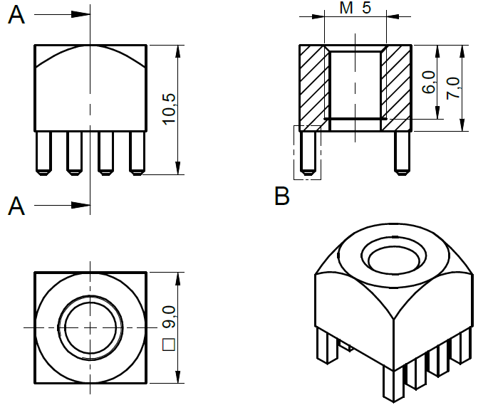{ width="300px" }
<figcaption style="text-align: center">The press-fit power terminal drawing</figcaption>
### Power wiring <!-- {docsify-ignore} -->
It is recommended to lead the wires by the shortest way out from PCB and avoid crossing and touching the PCB of the source module or any other module.

Advantics recommends RADOX® cables from the company HUBER+SUHNER. Guidelines on which cable can be used are possible to see in document “Current carrying capacity of RADOX® 125 single core and multi core cables”.

Assembly engineer needs to take into account the final number, position, cover of cables and ambient temperature to choose the correct cross-section. These rules are recommended for cables longer than 5 cm. Shorter cables can be be used with smaller cross section due to cooling effect of the M5 press-fit power terminals.

### Communication terminal and wiring<!-- {docsify-ignore} -->
All ADVANTICS modules have a common interface for control and readout. The interface consists of a CAN bus for control and status reporting, and an interlock line (INTLK) for safety. Additionally, the interface connectors also include power distribution for the control section of the modules. Each module is provided with two interface connectors that are completely identical in pinout, allowing chaining of the modules without using branched cables or a distribution hub.

The interface connector mounted on every power converter is an 8-pin CPT series automotive connector with a latch, manufactured by JST.

The modules use the SM08B-CPTK male connector, and the mating female connector is model number 08CPT-B-2A. The pins used for the female connector are part number SCPT-A021GF-0.5, which can be crimped using the WC-CPT021 crimping tool. These terminals are made for use with 22 AWG (0.3 mm2) wire with an outer diameter of 1.4 mm. The wires for each connector should be bundled tightly together, to reduce the amount of electrical noise picked up from the environment. Unshielded communications cables should not be near the power wiring. CAN bus High and Low should be twisted (form a twisted pair).
JST CPT product page: https://www.jst-mfg.com/product/detail_e.php?series=477

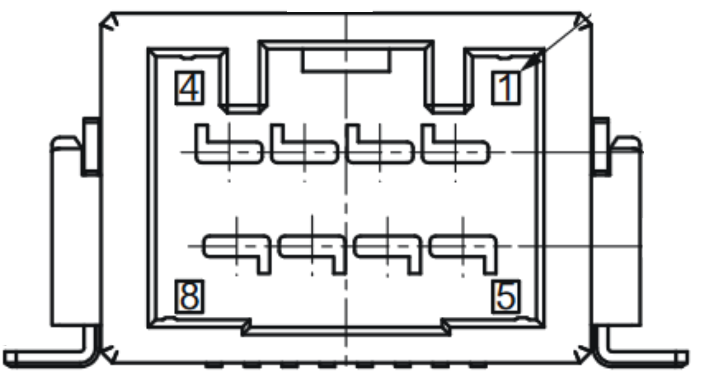{ width="300px" }
<figcaption style="text-align: center">Pintout of the CPT-connector pins 1-8</figcaption>
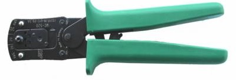{ width="300px" }
<figcaption style="text-align: center">JST CPT crimping tool WC-CPT021</figcaption>
| JST CPT pin | Name | Description |
| ----------- | ----------- | -----------|
|1 | +24V power | Interface and control power |
|2 | Interlock | Open collector, 24V pullup |
|3 | Termination | See CAN bus termination|
|4 | Signal ground | Interface ground |
|5 | +24V power | Interface and control power |
|6 | CAN HIGH | Twisted pair between 6,7 |
|7 | CAN LOW | Twisted pair between 6,7 |
|8 | Signal ground | Interface ground |

### Module Chaining <!-- {docsify-ignore} -->

The total end-to-end wire length of the network should not exceed 10 m with multiple power modules installed. The CAN standard specifies up to 100m  end-to-end cable length, but in an environment with high noise and multiple connection stubs, this figure is too high. In larger systems it can be beneficial (or even necessary) to split up the modules into several separate CAN networks. Consult with ADVANTICS, if you’re planning to deploy large network (more than 24 nodes).

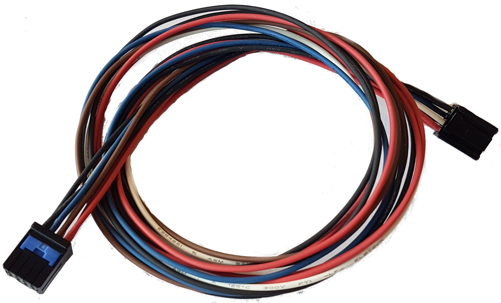{ width="300px" }
<figcaption style="text-align: center">An example of a 1:1 chaining cable</figcaption>
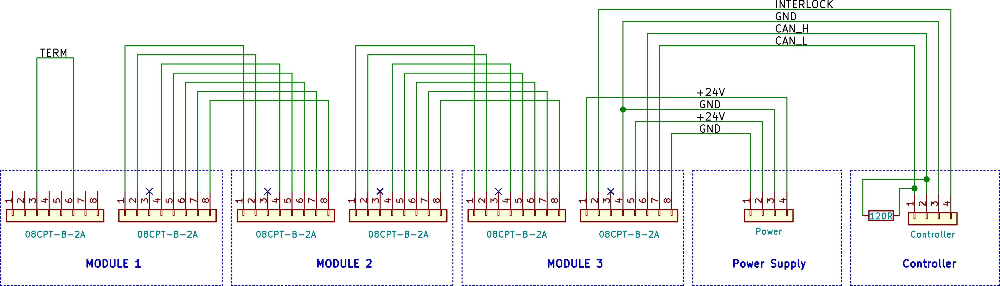{ width="70%" }
<figcaption style="text-align: center">Chaining and termination diagram</figcaption>

### Functional accessories<!-- {docsify-ignore} -->

- Power supply 24V/3A DC
- CAN to USB converter and suitable software is available here:
(https://store.advantics.fr/adapters/37-can-cable-set-with-24v-power-supply.html)

## Quick start

This chapter only deals with high-level control. Please consult the  [ADM-PC-LL25 CAN database](can_bus_overview.md) section for the CAN bus addresses and format. The CAN database is distributed in both KCD and DBC formats.

## Quick start procedure

### Step 1 – Clear interlock

Modules have two types of interlock signals: **internal** which is latched in a locked state until cleared, and **external** formed from combined internal interlock signals from all other modules on the bus. Internal signal is locked when the module goes outside of its operating range (e.g., over-current, over-voltage etc.). If any of the internal and external interlock signals is locked, the module will immediately stop and will not be able to operate.
When the module is power-cycled its internal signal is locked by default for safety reasons. This will also block all other modules on the bus as their external signal will be locked. Interlock state must be cleared for all modules that have their internal signal locked by sending the **Clear_Interlock** in **AFE_Fault_Control** message **exactly once**.
Some older modules cannot separate internal and external interlock signals. When any of these two is locked, they will report both of them locked. This **does not affect** the interlock clear logic.

### Step 2 – Configure setpoints

Each control mode comes with a list of setpoints required for proper operation. This is explained in more details in the **Control modes** section. Here we give a list of messages for setpoint control:

- LLC_PWM_Frequency_Control
- LLC_Current_Setpoint_Control
- LLC_Voltage_Setpoint_Control

!!! note
    **Setpoints should be sent only when they need to be updated**, i.e., they do not need to be sent periodically.

### Step 3 – Configure control mode

Configure control mode in **LLC_Mode_Control** message. Refer to the [Control modes](7_Firmware_Overview.md#control-modes) section for mode details on how each control mode works.
The module does not check if more than one control mode has been selected. It will start the first selected control mode from the following list:

- PWM,
- CURRENT CONTROL,
- VOLTAGE CONTROL,
- PRECHARGE,
- PFC CURRENT CONTROL,
- PFC VOLTAGE CONTROL,

### Step 4 – Start converter

Once setpoints and control mode have been configured, the converter can be started by setting **Converter_ON** in **LLC_Mode_Control**. The selected control mode must also be kept active in this message. Alternately, you can combine Step 3 and Step 4 in a single step by sending only one message with **Converter_ON** and selected control mode.

Each voltage and current setpoint has an associated rate limiter to provide smooth transitions, which is activated once the converter has been started.

### Step 5 – Stop converter

The converter is stopped by one of the following two events:

- **Converter_ON** in **LLC_Mode_Control** is cleared
- Internal or external interlock signal is locked. In case of locked interlock signal, the fault must be cleared by setting **Clear_Interlock** in **LLC_Fault_Control** in order to able to continue operation.
