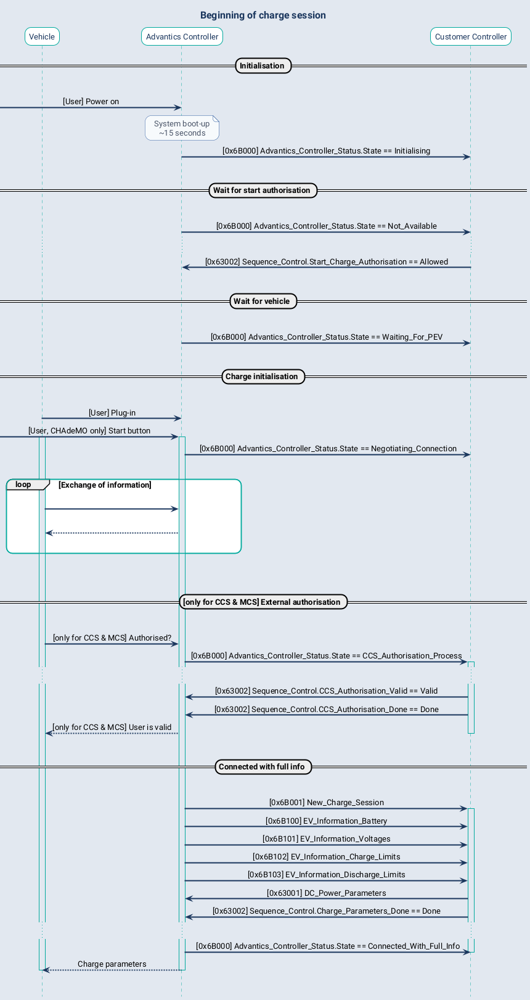
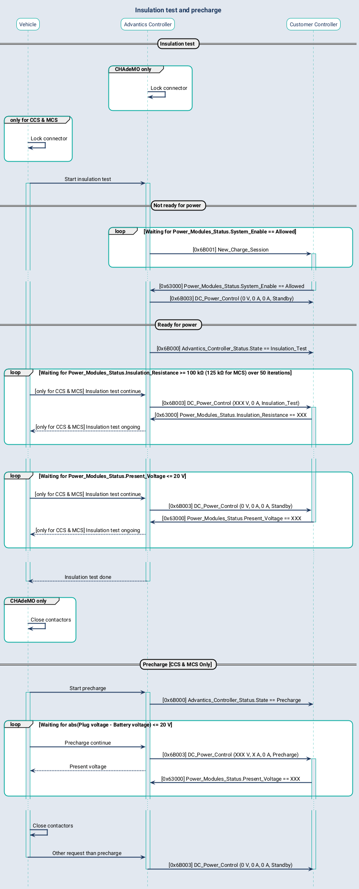
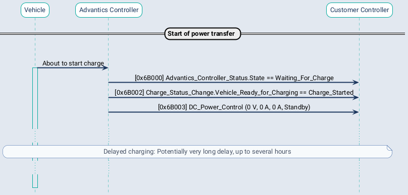
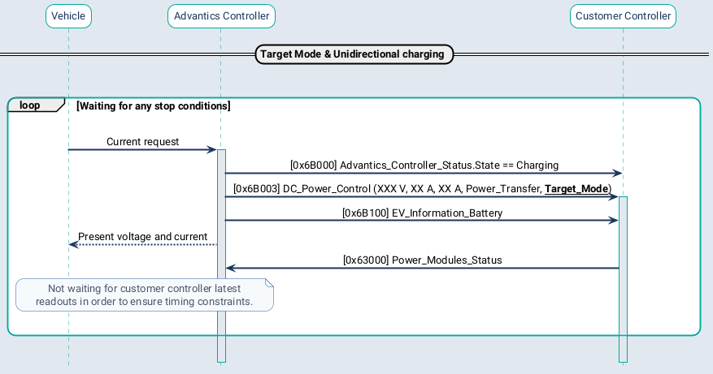
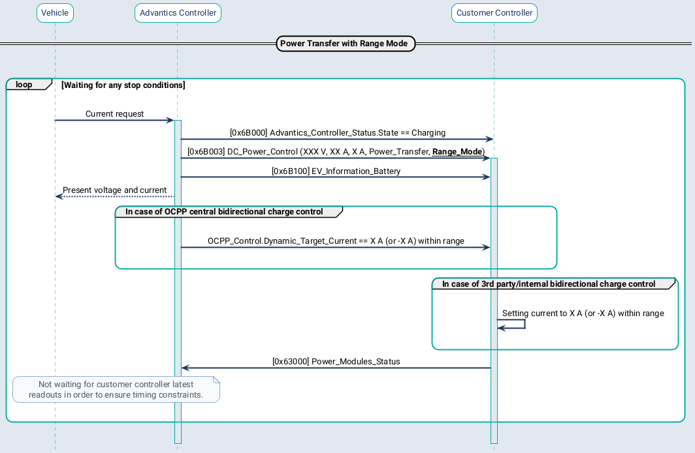
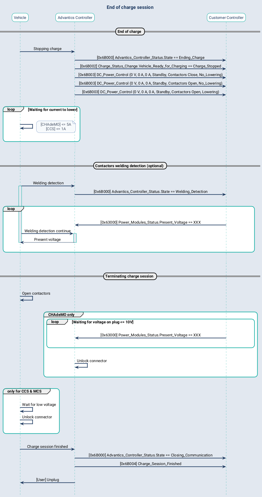

# Power Transfer Sequence Diagram

```puml
@startuml
!define ADVANTICS_GREEN #00A99D
!define ADVANTICS_DARK_BLUE #1a365d
!define ADVANTICS_LIGHT_BLUE #2d5aa0
!define ADVANTICS_GRAY #4a5568
!define ADVANTICS_LIGHT_GRAY #e2e8f0

' General diagram style
skinparam backgroundColor ADVANTICS_LIGHT_GRAY
skinparam shadowing false

' Fonts
skinparam defaultFontName Roboto
skinparam defaultFontSize 13
skinparam defaultTextAlignment center

' Lines and borders
skinparam ArrowColor ADVANTICS_DARK_BLUE
skinparam ArrowThickness 2

' Participants, classes, and boxes
skinparam participant {
  BackgroundColor #ffffff
  BorderColor ADVANTICS_GREEN
  FontColor ADVANTICS_DARK_BLUE
}

skinparam sequence {
  LifeLineBorderColor ADVANTICS_GREEN
  LifeLineBackgroundColor ADVANTICS_LIGHT_GRAY
  ParticipantBorderThickness 1
  BoxLineColor ADVANTICS_GREEN
}

' Notes
skinparam note {
  BackgroundColor #f7fafc
  BorderColor ADVANTICS_LIGHT_BLUE
  FontColor ADVANTICS_GRAY
}

' Titles and headers
skinparam title {
  FontColor ADVANTICS_DARK_BLUE
  FontSize 16
  FontStyle bold
}

' Groups and frames
skinparam package {
  BackgroundColor #ffffff
  BorderColor ADVANTICS_GREEN
  FontColor ADVANTICS_DARK_BLUE
}

' Legends and text
skinparam legend {
  BackgroundColor #ffffff
  BorderColor ADVANTICS_GREEN
  FontColor ADVANTICS_GRAY
}

hide footbox
title Beginning of charge session
skinparam ParticipantPadding 20
skinparam sequenceArrowThickness 2
skinparam roundcorner 20

participant "Vehicle" as PEV
participant "Advantics Controller" as EVSE
participant "Customer Controller" as Charger

== Initialisation ==
|||

-> EVSE: [User] Power on
note over EVSE
  System boot-up
  ~15 seconds
end note

EVSE->Charger: [0x6B000] Advantics_Controller_Status.State == Initialising

|||
== Wait for start authorisation ==
|||

EVSE -> Charger: [0x6B000] Advantics_Controller_Status.State == Not_Available
...
Charger -> EVSE: [0x63002] Sequence_Control.Start_Charge_Authorisation == Allowed

|||
== Wait for vehicle ==
|||

EVSE -> Charger: [0x6B000] Advantics_Controller_Status.State == Waiting_For_PEV

|||

== Charge initialisation ==
|||

PEV -> EVSE: [User] Plug-in
-> EVSE: [User, CHAdeMO only] Start button
activate PEV
activate EVSE
EVSE -> Charger: [0x6B000] Advantics_Controller_Status.State == Negotiating_Connection
|||
loop Exchange of information
  |||
  PEV -> EVSE
  |||
  EVSE --> PEV
  |||
end loop
|||

|||
== [only for CCS & MCS] External authorisation ==
|||

PEV -> EVSE: [only for CCS & MCS] Authorised?
EVSE -> Charger: [0x6B000] Advantics_Controller_Status.State == CCS_Authorisation_Process
activate Charger
...
Charger -> EVSE: [0x63002] Sequence_Control.CCS_Authorisation_Valid == Valid
Charger -> EVSE: [0x63002] Sequence_Control.CCS_Authorisation_Done == Done
EVSE --> PEV: [only for CCS & MCS] User is valid
deactivate Charger

|||
== Connected with full info ==
|||

EVSE -> Charger: [0x6B001] New_Charge_Session
activate Charger
EVSE -> Charger: [0x6B100] EV_Information_Battery
EVSE -> Charger: [0x6B101] EV_Information_Voltages
EVSE -> Charger: [0x6B102] EV_Information_Charge_Limits
EVSE -> Charger: [0x6B103] EV_Information_Discharge_Limits
Charger -> EVSE: [0x63001] DC_Power_Parameters
Charger -> EVSE: [0x63002] Sequence_Control.Charge_Parameters_Done == Done
...
EVSE -> Charger: [0x6B000] Advantics_Controller_Status.State == Connected_With_Full_Info
deactivate Charger
EVSE --> PEV: Charge parameters
deactivate PEV
deactivate EVSE
|||
@enduml
```

```puml
@startuml
!define ADVANTICS_GREEN #00A99D
!define ADVANTICS_DARK_BLUE #1a365d
!define ADVANTICS_LIGHT_BLUE #2d5aa0
!define ADVANTICS_GRAY #4a5568
!define ADVANTICS_LIGHT_GRAY #e2e8f0

' General diagram style
skinparam backgroundColor ADVANTICS_LIGHT_GRAY
skinparam shadowing false

' Fonts
skinparam defaultFontName Roboto
skinparam defaultFontSize 13
skinparam defaultTextAlignment center

' Lines and borders
skinparam ArrowColor ADVANTICS_DARK_BLUE
skinparam ArrowThickness 2

' Participants, classes, and boxes
skinparam participant {
  BackgroundColor #ffffff
  BorderColor ADVANTICS_GREEN
  FontColor ADVANTICS_DARK_BLUE
}

skinparam sequence {
  LifeLineBorderColor ADVANTICS_GREEN
  LifeLineBackgroundColor ADVANTICS_LIGHT_GRAY
  ParticipantBorderThickness 1
  BoxLineColor ADVANTICS_GREEN
}

' Notes
skinparam note {
  BackgroundColor #f7fafc
  BorderColor ADVANTICS_LIGHT_BLUE
  FontColor ADVANTICS_GRAY
}

' Titles and headers
skinparam title {
  FontColor ADVANTICS_DARK_BLUE
  FontSize 16
  FontStyle bold
}

' Groups and frames
skinparam package {
  BackgroundColor #ffffff
  BorderColor ADVANTICS_GREEN
  FontColor ADVANTICS_DARK_BLUE
}

' Legends and text
skinparam legend {
  BackgroundColor #ffffff
  BorderColor ADVANTICS_GREEN
  FontColor ADVANTICS_GRAY
}

hide footbox
title Insulation test and precharge
skinparam ParticipantPadding 20
skinparam sequenceArrowThickness 2
skinparam roundcorner 20

participant "Vehicle" as PEV
participant "Advantics Controller" as EVSE
participant "Customer Controller" as Charger

== Insulation test ==
|||

group CHAdeMO only
  |||
  EVSE -> EVSE: Lock connector
  |||
end group

group only for CCS & MCS
  |||
  PEV -> PEV: Lock connector
  |||
end group
|||

PEV -> EVSE: Start insulation test
activate PEV
activate EVSE

|||
== Not ready for power ==
|||

loop Waiting for Power_Modules_Status.System_Enable == Allowed
  |||
  EVSE -> Charger: [0x6B001] New_Charge_Session
  activate Charger
  |||
end loop
...
Charger -> EVSE: [0x63000] Power_Modules_Status.System_Enable == Allowed
deactivate Charger
EVSE -> Charger: [0x6B003] DC_Power_Control (0 V, 0 A, 0 A, Standby)

|||
== Ready for power ==
|||

EVSE->Charger: [0x6B000] Advantics_Controller_Status.State == Insulation_Test
|||
loop Waiting for Power_Modules_Status.Insulation_Resistance >= 100 kΩ (125 kΩ for MCS) over 50 iterations
  |||
  PEV -> EVSE: [only for CCS & MCS] Insulation test continue
  EVSE -> Charger: [0x6B003] DC_Power_Control (XXX V, 0 A, Insulation_Test)
  activate Charger
  Charger -> EVSE: [0x63000] Power_Modules_Status.Insulation_Resistance == XXX
  EVSE --> PEV: [only for CCS & MCS] Insulation test ongoing
  |||
end loop
...
|||

loop Waiting for Power_Modules_Status.Present_Voltage <= 20 V
  |||
  PEV -> EVSE: [only for CCS & MCS] Insulation test continue
  EVSE -> Charger: [0x6B003] DC_Power_Control (0 V, 0 A, 0 A, Standby)
  Charger -> EVSE: [0x63000] Power_Modules_Status.Present_Voltage == XXX
  deactivate Charger
  EVSE --> PEV: [only for CCS & MCS] Insulation test ongoing
  |||
end loop
...
|||

EVSE --> PEV: Insulation test done
deactivate EVSE
deactivate PEV

|||
group CHAdeMO only
  |||
  PEV -> PEV: Close contactors
  |||
end group
|||

== Precharge [CCS & MCS Only] ==
|||

PEV -> EVSE: Start precharge
activate PEV
activate EVSE
EVSE -> Charger: [0x6B000] Advantics_Controller_Status.State == Precharge
|||
loop Waiting for abs(Plug voltage - Battery voltage) <= 20 V
  |||
  PEV -> EVSE: Precharge continue
  EVSE -> Charger: [0x6B003] DC_Power_Control (XXX V, X A, 0 A, Precharge)
  activate Charger
  EVSE --> PEV: Present voltage
  Charger -> EVSE: [0x63000] Power_Modules_Status.Present_Voltage == XXX
  |||
end loop
...
|||

PEV -> PEV: Close contactors
|||

PEV -> EVSE: Other request than precharge
deactivate PEV
EVSE -> Charger: [0x6B003] DC_Power_Control (0 V, 0 A, 0 A, Standby)
deactivate Charger
deactivate EVSE
|||
@enduml
```

```puml
@startuml
!define ADVANTICS_GREEN #00A99D
!define ADVANTICS_DARK_BLUE #1a365d
!define ADVANTICS_LIGHT_BLUE #2d5aa0
!define ADVANTICS_GRAY #4a5568
!define ADVANTICS_LIGHT_GRAY #e2e8f0

' General diagram style
skinparam backgroundColor ADVANTICS_LIGHT_GRAY
skinparam shadowing false

' Fonts
skinparam defaultFontName Roboto
skinparam defaultFontSize 13
skinparam defaultTextAlignment center

' Lines and borders
skinparam ArrowColor ADVANTICS_DARK_BLUE
skinparam ArrowThickness 2

' Participants, classes, and boxes
skinparam participant {
  BackgroundColor #ffffff
  BorderColor ADVANTICS_GREEN
  FontColor ADVANTICS_DARK_BLUE
}

skinparam sequence {
  LifeLineBorderColor ADVANTICS_GREEN
  LifeLineBackgroundColor ADVANTICS_LIGHT_GRAY
  ParticipantBorderThickness 1
  BoxLineColor ADVANTICS_GREEN
}

' Notes
skinparam note {
  BackgroundColor #f7fafc
  BorderColor ADVANTICS_LIGHT_BLUE
  FontColor ADVANTICS_GRAY
}

' Titles and headers
skinparam title {
  FontColor ADVANTICS_DARK_BLUE
  FontSize 16
  FontStyle bold
}

' Groups and frames
skinparam package {
  BackgroundColor #ffffff
  BorderColor ADVANTICS_GREEN
  FontColor ADVANTICS_DARK_BLUE
}

' Legends and text
skinparam legend {
  BackgroundColor #ffffff
  BorderColor ADVANTICS_GREEN
  FontColor ADVANTICS_GRAY
}

hide footbox
skinparam ParticipantPadding 20
skinparam sequenceArrowThickness 2
skinparam roundcorner 20

participant "Vehicle" as PEV
participant "Advantics Controller" as EVSE
participant "Customer Controller" as Charger

== Start of power transfer ==
|||

PEV -> EVSE: About to start charge
activate PEV
EVSE -> Charger: [0x6B000] Advantics_Controller_Status.State == Waiting_For_Charge
EVSE -> Charger: [0x6B002] Charge_Status_Change.Vehicle_Ready_for_Charging == Charge_Started
EVSE -> Charger: [0x6B003] DC_Power_Control (0 V, 0 A, 0 A, Standby)

|||
...
note over PEV, Charger
  Delayed charging: Potentially very long delay, up to several hours
end note
...
|||
@enduml
```

```puml
@startuml
!define ADVANTICS_GREEN #00A99D
!define ADVANTICS_DARK_BLUE #1a365d
!define ADVANTICS_LIGHT_BLUE #2d5aa0
!define ADVANTICS_GRAY #4a5568
!define ADVANTICS_LIGHT_GRAY #e2e8f0

' General diagram style
skinparam backgroundColor ADVANTICS_LIGHT_GRAY
skinparam shadowing false

' Fonts
skinparam defaultFontName Roboto
skinparam defaultFontSize 13
skinparam defaultTextAlignment center

' Lines and borders
skinparam ArrowColor ADVANTICS_DARK_BLUE
skinparam ArrowThickness 2

' Participants, classes, and boxes
skinparam participant {
  BackgroundColor #ffffff
  BorderColor ADVANTICS_GREEN
  FontColor ADVANTICS_DARK_BLUE
}

skinparam sequence {
  LifeLineBorderColor ADVANTICS_GREEN
  LifeLineBackgroundColor ADVANTICS_LIGHT_GRAY
  ParticipantBorderThickness 1
  BoxLineColor ADVANTICS_GREEN
}

' Notes
skinparam note {
  BackgroundColor #f7fafc
  BorderColor ADVANTICS_LIGHT_BLUE
  FontColor ADVANTICS_GRAY
}

' Titles and headers
skinparam title {
  FontColor ADVANTICS_DARK_BLUE
  FontSize 16
  FontStyle bold
}

' Groups and frames
skinparam package {
  BackgroundColor #ffffff
  BorderColor ADVANTICS_GREEN
  FontColor ADVANTICS_DARK_BLUE
}

' Legends and text
skinparam legend {
  BackgroundColor #ffffff
  BorderColor ADVANTICS_GREEN
  FontColor ADVANTICS_GRAY
}

hide footbox
skinparam ParticipantPadding 20
skinparam sequenceArrowThickness 2
skinparam roundcorner 20

participant "Vehicle" as PEV
participant "Advantics Controller" as EVSE
participant "Customer Controller" as Charger

== Target Mode & Unidirectional charging ==

|||
loop Waiting for any stop conditions
  |||
  PEV -> EVSE: Current request
  activate EVSE
  EVSE -> Charger: [0x6B000] Advantics_Controller_Status.State == Charging
  EVSE -> Charger: [0x6B003] DC_Power_Control (XXX V, XX A, XX A, Power_Transfer, __**Target_Mode**__)
  activate Charger
  EVSE -> Charger: [0x6B100] EV_Information_Battery
  EVSE --> PEV: Present voltage and current
  Charger -> EVSE: [0x63000] Power_Modules_Status
  note over PEV,EVSE
    Not waiting for customer controller latest
    readouts in order to ensure timing constraints.
  end note
  |||
end loop
|||
@enduml
```

```puml
@startuml
!define ADVANTICS_GREEN #00A99D
!define ADVANTICS_DARK_BLUE #1a365d
!define ADVANTICS_LIGHT_BLUE #2d5aa0
!define ADVANTICS_GRAY #4a5568
!define ADVANTICS_LIGHT_GRAY #e2e8f0

' General diagram style
skinparam backgroundColor ADVANTICS_LIGHT_GRAY
skinparam shadowing false

' Fonts
skinparam defaultFontName Roboto
skinparam defaultFontSize 13
skinparam defaultTextAlignment center

' Lines and borders
skinparam ArrowColor ADVANTICS_DARK_BLUE
skinparam ArrowThickness 2

' Participants, classes, and boxes
skinparam participant {
  BackgroundColor #ffffff
  BorderColor ADVANTICS_GREEN
  FontColor ADVANTICS_DARK_BLUE
}

skinparam sequence {
  LifeLineBorderColor ADVANTICS_GREEN
  LifeLineBackgroundColor ADVANTICS_LIGHT_GRAY
  ParticipantBorderThickness 1
  BoxLineColor ADVANTICS_GREEN
}

' Notes
skinparam note {
  BackgroundColor #f7fafc
  BorderColor ADVANTICS_LIGHT_BLUE
  FontColor ADVANTICS_GRAY
}

' Titles and headers
skinparam title {
  FontColor ADVANTICS_DARK_BLUE
  FontSize 16
  FontStyle bold
}

' Groups and frames
skinparam package {
  BackgroundColor #ffffff
  BorderColor ADVANTICS_GREEN
  FontColor ADVANTICS_DARK_BLUE
}

' Legends and text
skinparam legend {
  BackgroundColor #ffffff
  BorderColor ADVANTICS_GREEN
  FontColor ADVANTICS_GRAY
}

hide footbox
skinparam ParticipantPadding 20
skinparam sequenceArrowThickness 2
skinparam roundcorner 20

participant "Vehicle" as PEV
participant "Advantics Controller" as EVSE
participant "Customer Controller" as Charger

== Power Transfer with Range Mode ==

|||
loop Waiting for any stop conditions
  |||
  PEV -> EVSE: Current request
  activate EVSE
  EVSE -> Charger: [0x6B000] Advantics_Controller_Status.State == Charging
  EVSE -> Charger: [0x6B003] DC_Power_Control (XXX V, XX A, X A, Power_Transfer, __**Range_Mode**__)
  activate Charger
  EVSE -> Charger: [0x6B100] EV_Information_Battery
  EVSE --> PEV: Present voltage and current
  group In case of OCPP central bidirectional charge control
    |||
    EVSE -> Charger: OCPP_Control.Dynamic_Target_Current == X A (or -X A) within range
    |||
  end group
  group In case of 3rd party/internal bidirectional charge control
    |||
    Charger -> Charger: Setting current to X A (or -X A) within range
    |||
  end group
  Charger -> EVSE: [0x63000] Power_Modules_Status
  note over PEV,EVSE
    Not waiting for customer controller latest
    readouts in order to ensure timing constraints.
  end note
  |||
end loop
|||
@enduml
```

```puml
@startuml
!define ADVANTICS_GREEN #00A99D
!define ADVANTICS_DARK_BLUE #1a365d
!define ADVANTICS_LIGHT_BLUE #2d5aa0
!define ADVANTICS_GRAY #4a5568
!define ADVANTICS_LIGHT_GRAY #e2e8f0

' General diagram style
skinparam backgroundColor ADVANTICS_LIGHT_GRAY
skinparam shadowing false

' Fonts
skinparam defaultFontName Roboto
skinparam defaultFontSize 13
skinparam defaultTextAlignment center

' Lines and borders
skinparam ArrowColor ADVANTICS_DARK_BLUE
skinparam ArrowThickness 2

' Participants, classes, and boxes
skinparam participant {
  BackgroundColor #ffffff
  BorderColor ADVANTICS_GREEN
  FontColor ADVANTICS_DARK_BLUE
}

skinparam sequence {
  LifeLineBorderColor ADVANTICS_GREEN
  LifeLineBackgroundColor ADVANTICS_LIGHT_GRAY
  ParticipantBorderThickness 1
  BoxLineColor ADVANTICS_GREEN
}

' Notes
skinparam note {
  BackgroundColor #f7fafc
  BorderColor ADVANTICS_LIGHT_BLUE
  FontColor ADVANTICS_GRAY
}

' Titles and headers
skinparam title {
  FontColor ADVANTICS_DARK_BLUE
  FontSize 16
  FontStyle bold
}

' Groups and frames
skinparam package {
  BackgroundColor #ffffff
  BorderColor ADVANTICS_GREEN
  FontColor ADVANTICS_DARK_BLUE
}

' Legends and text
skinparam legend {
  BackgroundColor #ffffff
  BorderColor ADVANTICS_GREEN
  FontColor ADVANTICS_GRAY
}

hide footbox
title End of charge session
skinparam ParticipantPadding 20
skinparam sequenceArrowThickness 2
skinparam roundcorner 20

participant "Vehicle" as PEV
participant "Advantics Controller" as EVSE
participant "Customer Controller" as Charger

== End of charge ==
|||

PEV -> EVSE: Stopping charge
deactivate PEV
EVSE -> Charger: [0x6B000] Advantics_Controller_Status.State == Ending_Charge
EVSE -> Charger: [0x6B002] Charge_Status_Change.Vehicle_Ready_for_Charging == Charge_Stopped
EVSE -> Charger: [0x6B003] DC_Power_Control (0 V, 0 A, 0 A, Standby, Contactors Close, No_Lowering)
EVSE -> Charger: [0x6B003] DC_Power_Control (0 V, 0 A, 0 A, Standby, Contactors Open, No_Lowering)
EVSE -> Charger: [0x6B003] DC_Power_Control (0 V, 0 A, 0 A, Standby, Contactors Open, Lowering)
deactivate EVSE
deactivate Charger
|||
loop Waiting for current to lower
  |||
  PEV -> PEV
  note right: [CHAdeMO] <= 5A\n[CCS] <= 1A
  |||
end loop
...
|||

== Contactors welding detection (optional) ==
|||

PEV -> EVSE: Welding detection
activate PEV
EVSE -> Charger: [0x6B000] Advantics_Controller_Status.State == Welding_Detection

|||
loop
  |||
  Charger -> EVSE: [0x63000] Power_Modules_Status.Present_Voltage == XXX
  PEV -> EVSE: Welding detection continue
  activate EVSE
  EVSE --> PEV: Present voltage
  deactivate EVSE
  deactivate PEV
  |||
end loop
...
|||

== Terminating charge session ==

|||
PEV -> PEV: Open contactors

|||
group CHAdeMO only
  loop Waiting for voltage on plug <= 10V
    |||
    Charger -> EVSE: [0x63000] Power_Modules_Status.Present_Voltage == XXX
    |||
  end loop
  |||
  EVSE -> EVSE: Unlock connector
  |||
end group
|||
group only for CCS & MCS
  |||
  PEV -> PEV: Wait for low voltage
  PEV -> PEV: Unlock connector
  |||
end group
|||

PEV -> EVSE: Charge session finished
EVSE -> Charger: [0x6B000] Advantics_Controller_Status.State == Closing_Communication
EVSE -> Charger: [0x6B004] Charge_Session_Finished

|||

EVSE -> PEV: [User] Unplug
|||
@enduml
```