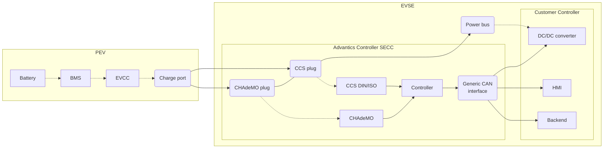
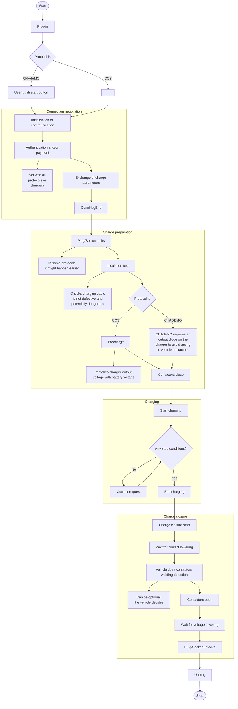

# Introduction

The Advantics EVSE controllers (DIN rail mount version and generic development platform version)
use a standard ISO-11898 CAN bus for control and status communications with power modules. While
controllers can communicate directly with Advantics own power converters, it is also possible to
have controllers operate with power converters from other companies.

One way to allow this interoperability is to use the generic EVSE CAN interface presented here.
Sequencing through the charging steps are explained in this manual. As well as the specific details
about the different CAN messages and their payload that are part of the communication protocol
between controllers and power modules.

Since version 2 of this interface, some of its messages are also used when using Advantics own power
modules. This allow customer implementations to be aware of and act on the charging sequence. This
particular usage will also be described in this manual.

## Scope

This manual focuses mainly on the protocol of the generic EVSE CAN interface. It is of interest to
people implementing the power modules side, or the client or backend interaction side.

As it takes place within the whole EV charging topic, important details about other part of the
charging chain will come along side. The vehicle side of thing as well as the charging communication
protocol themselves are out-of-scope. Nevertheless, details about them are given such that the
reader can contextualise actions happening on the side of the generic EVSE CAN interface.

Each message is described together with its payload data. The payload data description, includes the
units of the different variables, the scaling factor and offset, as well as maximum and minimum
limits, where applicable. Some messages require certain periodicity while others can be sent in an
on-demand basis.

# General operation

One way to look at the Advantics controllers is to consider them as mere translators between the
communication protocol a vehicle uses and a protocol power modules of the charger uses.
It abstracts away the various types of charge communication standards (eg. CHAdeMO, CCS DIN, CCS
ISO, etc.) as well as their versions.

But it has to also abstract away the complexity of correctly sequencing power modules. Hence,
the generic EVSE CAN interface is a middle ground between two abstraction layers.

The process of charging a battery is fundamentally driven by what the battery can take at
any given moment. In electric vehicle charging it translates to the BMS requesting voltage and
current setpoints to power electronics capable of deliverying power levels in the order of ten's
to hundreds of kilo Watts.

Communication protocols like CCS and CHAdeMO are here to forward these requests between two
independent entities, a vehicle and a charger, addressing all the challenging aspects it can have
(interoperability, reliability, etc.). They carry other side tasks such as sharing the voltage,
current and power limits of both sides, charge scheduling, authorisation by external payment,
plug'n'charge, etc.

!!! warning
    It should always be considered that in this process, the vehicle is a master giving its
    requests to the charger. Actually, CCS took this even further by considering the vehicle is always
    the one initiating every step of the process, much beyond what the main charging loop requires.

The generic EVSE CAN interface reflects this almost one-to-one. Controllers will be requesting
specifc modes and setpoints at the right moments, and the power modules should reports regularly
their status and readouts of voltage and current. But behind, it is the vehicle who is requesting
these. In some ways, you might also consider it is the communication protocol itself which
constrains some aspects of the charging process (eg. isolation tests and precharge steps).

Some steps in the process are long-lasting. Communication protocols adopted different ways for
making these steps cyclic. They generally take the form of loops where the vehicle requests
something, the requests is forwarded to the power modules. Then the readouts of the power modules
are forwarded to the vehicle, and the vehicle decide to continue the loop or not.

In such cyclic steps, with CCS, requests messages are coming regularly to the charger. But the
interval time is up-to the vehicle, and can be as long as 60 seconds. In CHAdeMO, not all steps are
following this cyclic requests model. But controllers will emulate it (possibly following CHAdeMO
CAN frames periodicity of 100 ms).

!!! note
    Unlike with other typical CAN communications, cyclicity of requests here is not meant to run
    as control loops. The vehicle should have its own, safe, control loop for what the battery can take
    (usually in the BMS directly). The charger should have its own, safe, control loops for the various
    power modes. The cyclicity of these requests is mostly for slowly moving the setpoints, and for
    relatively long time outs in case of problem (unexpected disconnection, failure of some modules,
    power trip on the grid, noise, etc.).

Controllers are hiding all details of the charge process that are not relevant to power modules
(eg. scheduling, authentication, etc.). It will also try its best to capture every possible failure
in the communication with the vehicle in order to properly shut off any active power function
running at that time.

## Workflow of a charge

