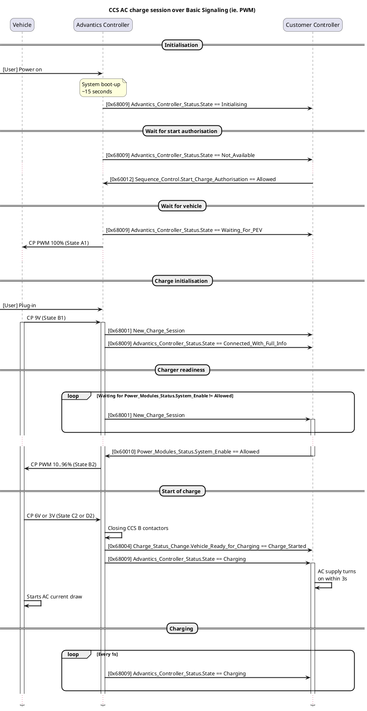
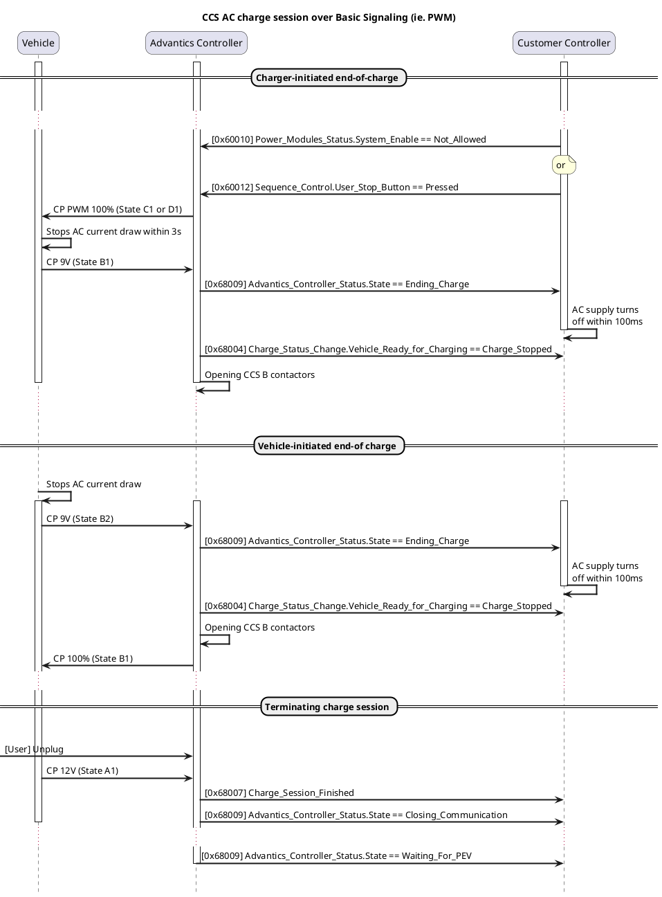

# AC Charging

!!! note
    Only available from version 4.x of the controller system

!!! note
    AC charging is only working on `ADM-CS-SECC` (DIN rail variant) controller, as it has a dedicated CCS AC port.

## CAN interface

The CAN interface to control AC charging is currently based on the generic v2 interface originally meant for DC. It is only re-using some messages:

- `New_Charge_Session` (irrelevant signals will be left at 0)
- `Charge_Status_Change`, when vehicle change between CP state B and C/D
- `Charge_Session_Finished`
- `Emergency_Stop`
- `Advantics_Controller_Status` (only valid states are `Initialising`, `Waiting_For_PEV`, `Negotiating_Connection`, `Connected_With_Full_Info`, `Charging`, `Ending_Charge` and `Closing_Communication`.
- `Power_Modules_Status`, notably for `System_Enable` flag that will pretty much control CP PWM being on or off. Other signals will be ignored (except the ones related to temperature).
- `Power_Modules_Limits`, for changing CP PWM duty cycle with `Maximum_Current` signal (other signal ignored)
- `Sequence_Control`, for `Start_Charge_Authorisation` and `User_Stop_Button`signals

!!! warning
    We expect to control the 3 phases relays with the relay 2 output of the controller

## Flowcharts

### Start of charge

### End of charge

