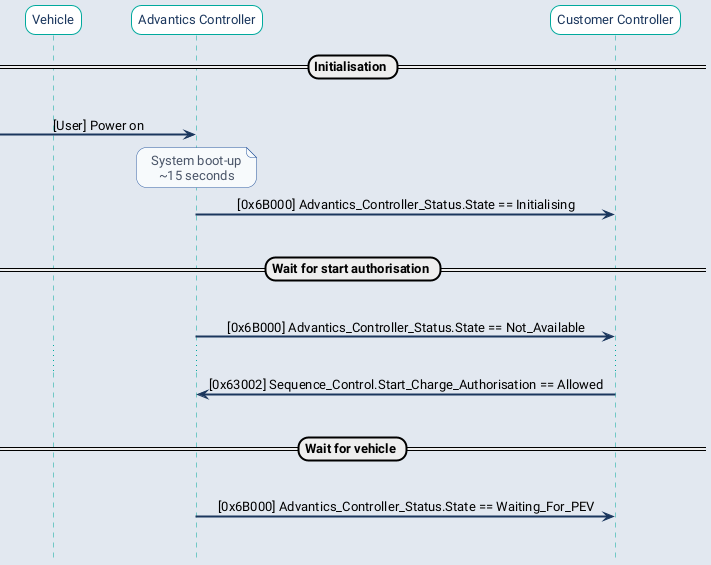
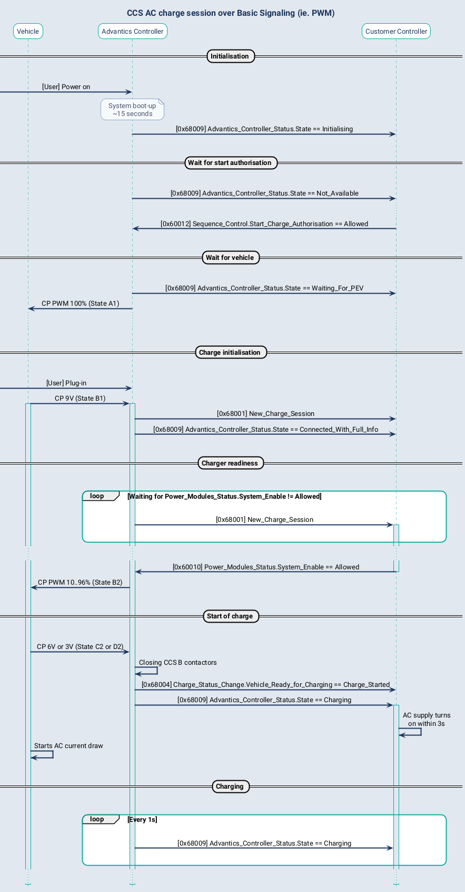
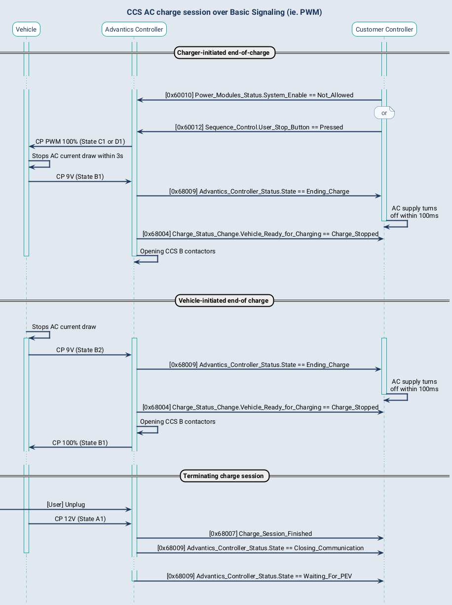

# AC Charging

!!! note
    Only available from version 4.x of the controller system

## CAN interface

The CAN interface to control AC charging is currently based on the generic v2 interface originally meant for DC. It is only re-using some messages:

- `New_Charge_Session` (irrelevant signals will be left at 0)
- `Charge_Status_Change`, when vehicle change between CP state B and C/D
- `Charge_Session_Finished`
- `Emergency_Stop`
- `Advantics_Controller_Status` (only valid states are `Initialising`, `Waiting_For_PEV`, `Negotiating_Connection`, `Connected_With_Full_Info`, `Charging`, `Ending_Charge` and `Closing_Communication`.
- `Power_Modules_Status`, notably for `System_Enable` flag that will pretty much control CP PWM being on or off. Other signals will be ignored (except the ones related to temperature).
- `Power_Modules_Limits`, for changing CP PWM duty cycle with `Maximum_Current` signal (other signal ignored)
- `Sequence_Control`, for `Start_Charge_Authorisation` and `User_Stop_Button`signals

!!! warning
    We expect to control the 3 phases relays with the relay 2 output of the controller

## Flowcharts

### Start of charge

## Charge initialisation

Once a vehicle plugs-in, a so-called charge session is initialised. It allows for exchange of
important parameters between the vehicle and the charger. Such as voltage, current and power limits.

The content of this initialisation behaves differently from communication protocols. In CHAdeMO it is
rather quick, but requires the user to push a start button on the charger. In CCS it can be a few
tens of seconds, especially if payment authorisation is carried on.

[Advantics_Controller_Status](charge-controllers/secc_generic/can_v3.md#Advantics_Controller_Status) message reports a
state of *Negotiating_Connection* at first.
Once done with the negotiation, it reports *Connected_With_Full_Info*.

However, in CCS, if the charger is configured to use external authorisation, and configured to use
the sequence flags, you will have an intermediate state *CCS_Authorisation_Process*.
The controller, and the CCS communication itself, will stay in this state as long as the customer
controller does not set the
flag [CCS_Authorisation_Done](charge-controllers/secc_generic/can_v3.md#Sequence_Control-CCS_Authorisation_Done) to
`Done` (value 1).
Once `Done` is set, the controller
checks [CCS_Authorisation_Valid](charge-controllers/secc_generic/can_v3.md#Sequence_Control-CCS_Authorisation_Valid)
flag. If set
to `Valid` (value 1), the communication continue. If set to `Invalid` (value 0), the controller
request a stop of communication to the vehicle (and it won't allow the vehicle to "force-through"
the sequence). If not using CCS external authorisation and sequence flags, the controller just
consider user is always authorised and continues directly.

When *Connected_With_Full_Info*, it also sends
a [New_Charge_Session](charge-controllers/secc_generic/can_v3.md#New_Charge_Sessions) message alongside the other
messages carrying
relevant information provided by the vehicle. If the controller is configured to use the sequence
flags, it will wait
that [Charge_Parameters_Done](charge-controllers/secc_generic/can_v3.md#Sequence_Control-Charge_Parameters_Done) is set
to `Done` (value 1) to
continue to the next step (insulation test). Before that, as long as it is `Not_Done` (value 0), the
customer controller can modify the content of
the [DC_Power_Parameters](charge-controllers/secc_generic/can_v3.md#DC_Power_Parameters) message. If not using the
sequence flags then it continues directly with either the static limit values set in the config file,
or whatever has been sent in [DC_Power_Parameters](charge-controllers/secc_generic/can_v3.md#DC_Power_Parameters) before
that.

!!! tip
    This allows the customer controller to adapt the advertised max current and voltage in relation
    to the vehicle capabilities. For instance, this is useful for chargers using an internal battery as
    power source.

### End of charge

