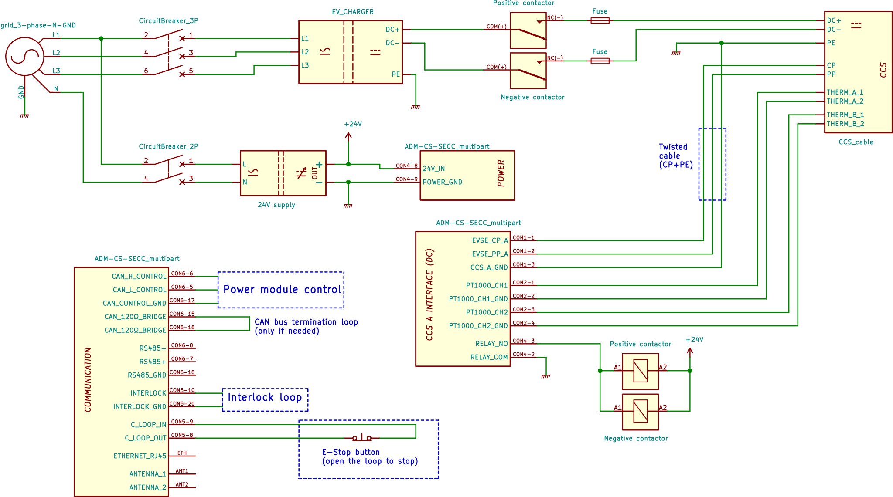

# NACS Support

The SECC is compatible with the North American Charging Standard (NACS) protocol. NACS standard J3400, which utilizes the underlying CCS communication protocol, is evolving and the SECC will be supporting all new upcoming functionalities to be introduced in newer versions of the standard. The SECC's NACS support future-proofs the charge station as this standard allows not only Tesla vehicles but also a growing number of electric vehicles to connect and charge efficiently at the charging stations.

## Wiring

The Wiring of the NACS cable is the same as CCS. The following is a wiring example:

