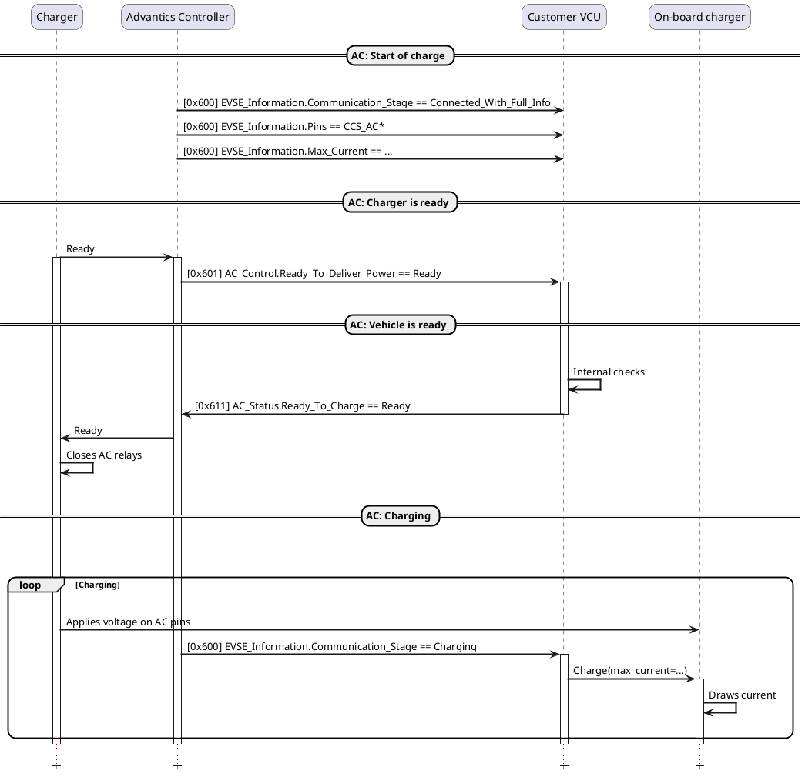
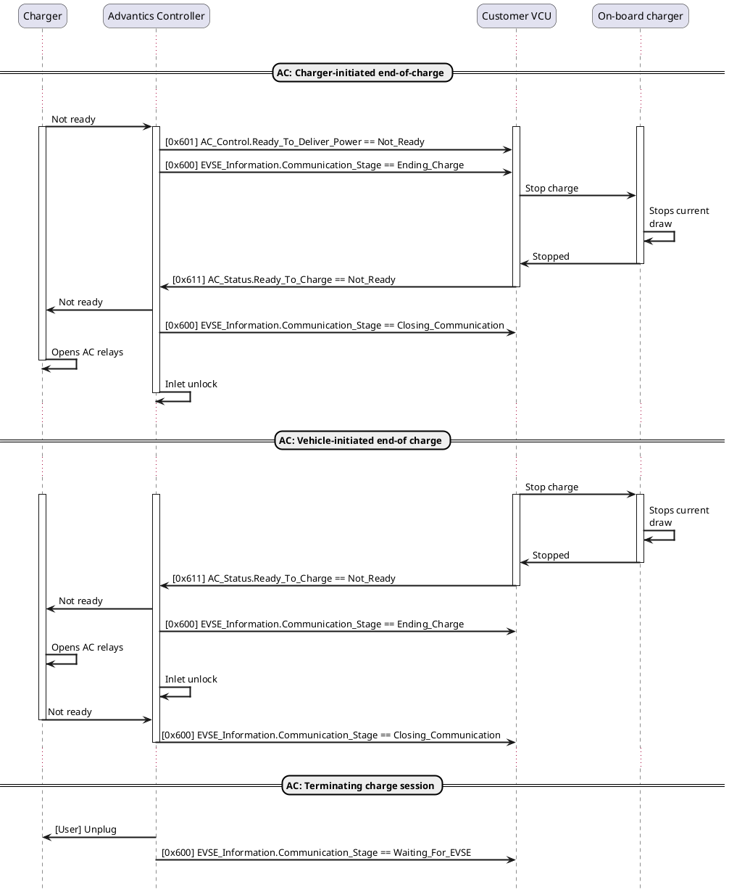
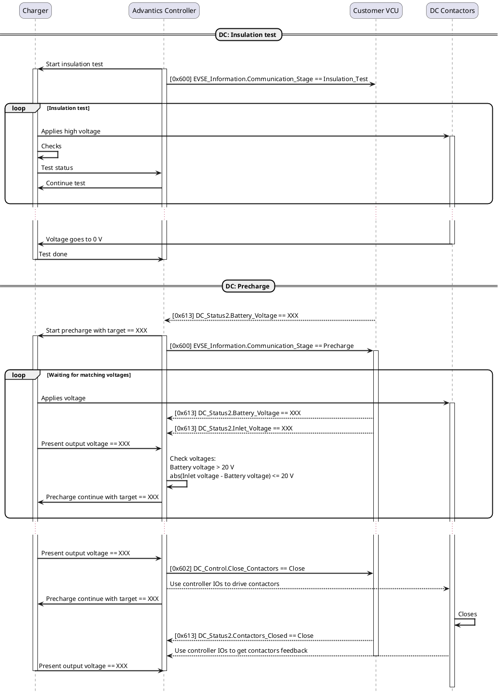
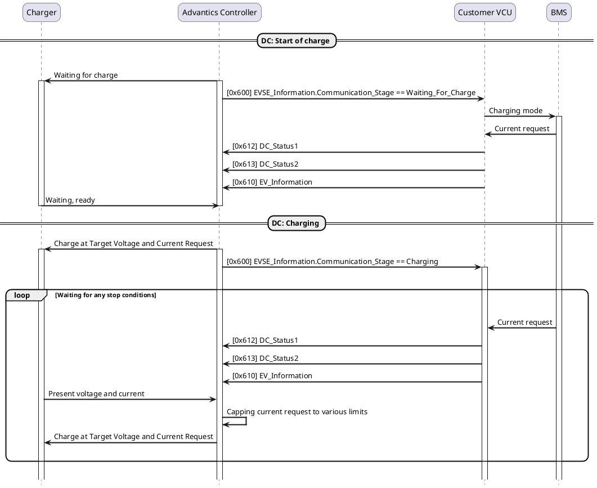
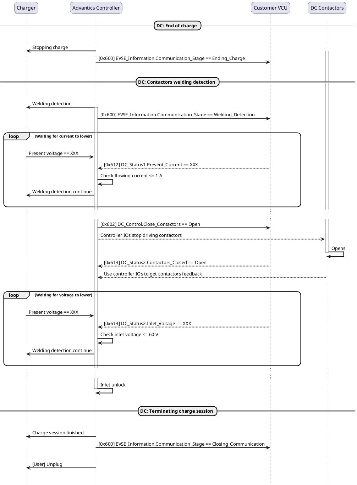

# Appendix A

```plantuml
hide footbox
skinparam ParticipantPadding 20
skinparam sequenceArrowThickness 2
skinparam roundcorner 20

participant "Charger" as EVSE
participant "Advantics Controller" as EVCC
participant "Customer VCU" as VCU

== Initialisation ==
|||

-> EVCC: [User] Power on
note over EVCC
  System boot-up
  ~15 seconds
end note

EVCC -> VCU: [0x600] EVSE_Information.Communication_Stage == Initialising

|||
== Wait for charger ==
|||

EVCC -> VCU: [0x600] EVSE_Information.Communication_Stage == Waiting_For_EVSE

|||
== Charge initialisation ==
|||

EVSE -> EVCC: [User] Plug-in
activate EVSE
activate EVCC
EVCC -> VCU: Plugged_In IO goes to HIGH state
EVCC -> VCU: [0x600] EVSE_Information.Communication_Stage == Negotiating_Connection
|||
loop Exchange of information
  |||
  EVCC -> EVSE
  EVCC -> VCU: [0x600] EVSE_Information.Protocol == ...
  EVCC -> VCU: [0x600] EVSE_Information.Pins == ...
  EVCC -> VCU: [0x600] EVSE_Information.Max_Current == ...
  VCU -> EVCC: [0x610] EV_Information.State_of_Charge == ...
  EVSE --> EVCC
  |||
end loop
...
|||

|||
== Connected with full info ==
|||

EVCC -> VCU: [0x600] EVSE_Information.Communication_Stage == Connected_With_Full_Info
deactivate EVSE
|||
group Check
  EVCC -> EVCC: Inlet lock
  |||
end group
|||
deactivate EVCC
|||
@enduml
```










